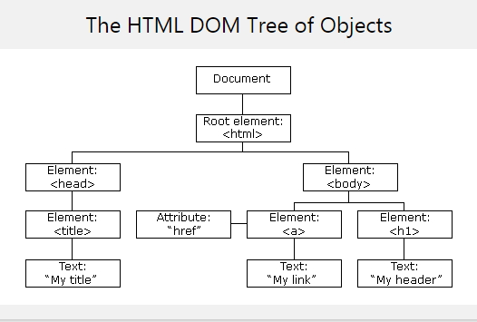
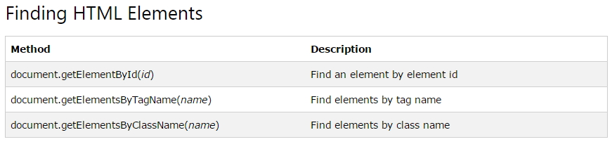
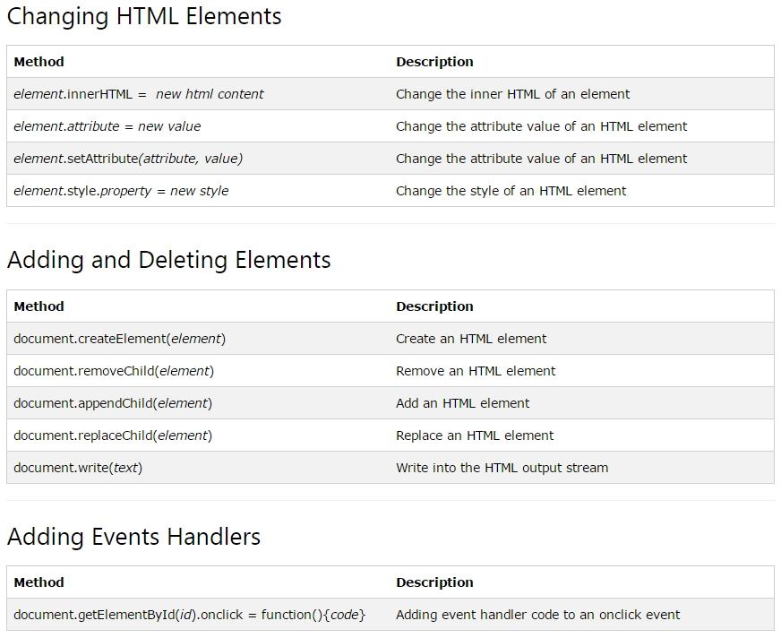

# HTML DOM(Document Object Model)

## DOM(Document Object Model)

- W3C에서 표준을 제작하고 있다.
- DOM은 구조화된 nodes와 property와 method를 갖고 있는 objects로 문서를 표현한다.
- `웹 페이지를 스크립트 또는 프로그래밍 언어들에서 사용될 수 있게 연결`시켜주는 역할을 담당한다.
- DOM은 `동일한 문서를 표현하고, 저장하고, 조작하는 방법`을 제공한다.
- DOM은 웹 페이지의 `객체 지향 표현`이며, `자바스크립트`와 같은 스크립팅 `언어를 이용해 DOM을 수정`할 수 있다.
- 웹 페이지는 일종의 문서(document)다. 이 `문서는 웹 브라우저를 통해 그 내용이 해석되어 웹 브라우저 화면에 나타나거나 HTML 소스 자체로 나타나`기도 한다.
- Ajax를 사용하여 `서버로부터의 응답 결과를 전송받아 브러우저의 HTML상에 출력할 때에 DOM 모델을 이용`한다.
- DOM은 `Object들을 Tree처럼 생성`합니다.
- DOM은 동적으로 HTML 태그를 생성할때 필요하다.

- 참조사이트 : [MDN Web Docs](https://developer.mozilla.org/ko/docs/Web/API/Document_Object_Model/Introduction)

<br />

1. DOM은 내부적으로 HTML 태그를 Tree 형태로 표현합니다.



<br />

## HTML DOM 활용



> WebContent/dom/idFind.html

```javascript
<!DOCTYPE html>
<html>
<body>
    <p id="intro">Hello World!</p>
    <p>This example demonstrates the <b>getElementById</b> method!</p>
    <p id="demo"></p>

    <script>
        let myElement = document.getElementById("intro");
        document.getElementById("demo").innerHTML =
        'The text from the intro paragraph is ' + myElement.innerHTML;
    </script>
</body>
</html>
```

<br />

> WebContent/dom/tagnameFind.html

```javascript
<!DOCTYPE html>
<html>
<body>
    <p>Hello World!</p>
    <p>The DOM is very useful.</p>
    <p>This example demonstrates the <b>getElementsByTagName</b> method</p>
    <p id="demo"></p>

    <script>
        let x = document.getElementsByTagName("p");
        console.log(x.length);
        document.getElementById("demo").innerHTML =
        'The first paragraph (index 0) is: ' + x[0].innerHTML;
    </script>
</body>
</html>
```

<br />

> WebContent/dom/idTagnameFind.html

```javascript
<!DOCTYPE html>
<html>
<body>
    <p>Hello World!</p>
    <div id="main">
    <p>The DOM is very useful.</p>
    <p>This example demonstrates the <b>getElementsByTagName</b> method</p>
    </div>
    <p id="demo"></p>

    <script>
        let x = document.getElementById("main");
        let y = x.getElementsByTagName("p");
        document.getElementById("demo").innerHTML =
        'The first paragraph (index 0) inside "main" is: ' + y[0].innerHTML;
    </script>
</body>
</html>
```

<br />

> WebContent/dom/classnameFind.html

```javascript
<!DOCTYPE html>
<html>
<body>
    <p>Hello World!</p>
    <p class="intro">The DOM is very useful.</p>
    <p class="intro">This example demonstrates the <b>getElementsByClassName</b> method.</p>
    <p id="demo"></p>

    <script>
        let x = document.getElementsByClassName("intro");
        console.log(x.length);
        document.getElementById("demo").innerHTML =
        'The first paragraph (index 0) with class="intro": ' + x[0].innerHTML;
    </script>
</body>
</html>
```

<br />

> WebContent/dom/cssSelectorFind.html

```javascript
<!DOCTYPE html>
<html>
<body>
    <p>Hello World!</p>
    <p class="intro">The DOM is very useful.</p>
    <p class="intro">This example demonstrates the <b>querySelectorAll</b> method.</p>
    <p id="demo"></p>

    <script>
        let x = document.querySelectorAll("p.intro");
        console.log(x.length);
        document.getElementById("demo").innerHTML =
        'The first paragraph (index 0) with class="intro": ' + x[0].innerHTML;
    </script>
</body>
</html>
```

<br />

> WebContent/dom/htmlobjectFind.html

```javascript
<!DOCTYPE html>
<html>
<body>
    <form id="frm1" action="form_action.asp">
        First name: <input type="text" name="fname" value="Donald"><br />
        Last name: <input type="text" name="lname" value="Duck"><br />
        <button>submit</button>
    </form>
    <p>Click "Try it" to display the value of each element in the form.</p>
    <button onclick="myFunction()">Try it</button>
    <p id="demo"></p>

    <script>
        function myFunction() {
            let x = document.forms["frm1"];
            console.log(x.length);
            let text = "";
            let i;
            for (i = 0; i < x.length ;i++) {
                text += x.elements[i].value + "<br />";
            }
            document.getElementById("demo").innerHTML = text;
        }
    </script>
</body>
</html>
```


