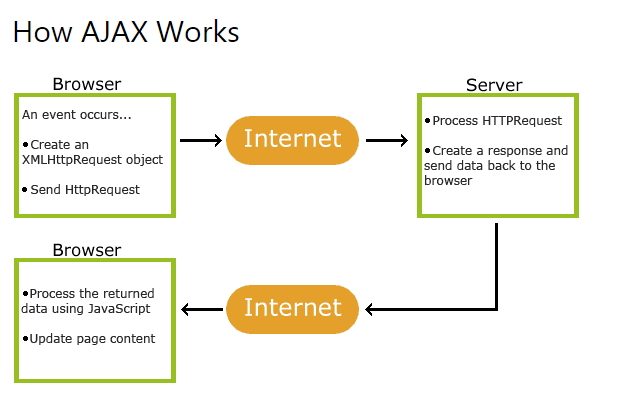
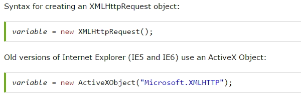
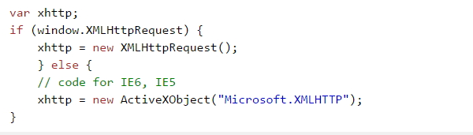

# Ajax(Asynchronous JavaScript and XML), Ajax 구성요소

## 1. Ajax(Asynchronous JavaScript and XML)의 이해

- `비동기 자바스크립트`와 `XML기반 스크립트`를 말합니다.
- 기존의 요청에 대한 전체페이지가 응답되었다면, Ajax를 쓰면 `서버는 오로지 페이지에서 필요한 데이터만 보내`줍니다.
- Ajax는 2005년 Google이 제한하고 만들었습니다.
- Ajax 사용 예 : Google Maps, Google Search, Gmail, YouTube, and Facebook
- Ajax 이름에 포함된 XML은 꼭 알아야 Ajax를 사용하는 것은 아닙니다.
- Ajax는 `동적이고 민첩한 Web page를 생성하기 위한 기술`입니다.

 

## 2. Ajax의 주요 구성 요소

- `XMLHttpRequest` : `웹서버와 통신을 담당`합니다. 사용자의 요청을 `웹서버에 전송`하고 웹서버로 부터 받은 `결과를 웹브라우저에 전달` 합니다.
- XMLHttpRequest 외에도 ES6에 추가된 Promise 객체와 ES8에 추가된 Async, Await등을 이용해서 Ajax 통신을 간편하게 할 수 있다.
- `DOM` : `문서의 구조`를 나타냅니다. 폼 등의 정보나 `화면 구성을 조작`할 때 사용 됩니다.
- `CSS` : 글자색, 배경색, 위치, 투명도 등 `UI와 관련된 부분`을 담당합니다.
- `자바스크립트` : 사용자가 마우스를 드래그하거나 버튼클릭을 하면, XMLHttpRequest, Promise 객체를 사용해서 `웹서버에 요청을 전송`합니다. 또한 XMLHttpRequest 객체로부터 `응답이 오면 DOM, CSS등을 사용해서 화면을 조작`합니다.

 

## 3. Ajax 방식

- 웹 브러우저가 아닌 XMLHttpRequest 객체가 웹 서버와 통신을 합니다.
- 페이지 이동 없이 특정 HTML 컨트롤이 웹 서버와 통신을 하여 결과를 화면에 출력합니다.
- `웹서버의 응답 결과`가 HTML이 아니라 `XML 또는 단순 TEXT`입니다.

1. 웹 페이지에서 **이벤트가 발생**합니다. (페이지가 로드되고 버튼이 클릭 됨)
1. **XMLHttpRequest 객체**는 JavaScript에 의해 **생성**됩니다.
1. XMLHttpRequest 객체는 **웹 서버에 요청**을 보낸다.
1. 서버가 **요청을 처리**합니다.
1. 서버가 **웹 페이지에 응답**을 보냅니다.
1. JavaScript가 **응답을 읽습니다**.
1. 적절한 조치 (예 : 페이지 업데이트)가 JavaScript에 의해 수행됩니다.

 

## 4. XMLHttpRequest 객체

- 대부분의 브러우저가 지원함으로 XMLHttpRequest를 실행하는데 문제가 없습니다.
- XMLHttpRequest 객체는 reload 없이 서버에서 보내는 데이터를 웹페이지의 한부분으로 수정합니다.

### (1) XMLHttpRequest객체의 함수

- `open()` : **요청의 초기화, GET/POST 선택, 접속할 URL입력**합니다.
- `send()` : 웹서버에 **요청을 전송**합니다.

### (2) XMLHttpRequest객체의 속성

- `onreadystatechange` : 응답이 도착하면 **특정 자바스크립트 함수를 호출해서 결과의 알맞은 작업**을 합니다. 그때 `사용할 자바스크립트 함수(callback 함수)를 지정`합니다.
- `readyState` : XMLHttpRequest 객체의 요청에 대한 **상태를 숫자로 표시**합니다. 이 상태의 변화(로딩중, 처리중, 처리완료)가 있을때마다 XMLHttpRequest 객체의 `onreadystatechange속성에 설정된 callback함수가 자동 호출`됩니다.
- `status` : XMLHttpRequest 객체는 웹서버가 전달한 `http 상태 코드를 status속성에 저장`합니다.
- `responseText/responseXml` : **응답의 결과값(텍스트/ XML DOM)을 참조**하기 위해서 사용합니다.

 

## 5. XMLHttpRequest의 객체 생성

- Chrome, IE7+, Firefox, Safari, and Opera 브라우저는 XMLHttpRequest를 내장하고 있습니다.

