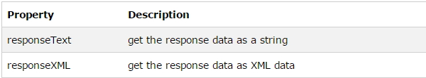

# XMLHttpRequest 객체, Ajax 통신 예제

## XMLHttpRequest 객체

### 1. 서버에 요청을 보내는 메서드

- open(), send()
- open(`GET/POST`, `요청URL`, `true/false`);

<br />

#### (1) open()에 GET/POST 사용

- `GET 방식`은 POST 방식보다 `간단하고 빠른` 방식.
- GET 방식은 `요청 URL뒤에 파라메터`를 보낸다.

```
xhttp.open("GET", "demo_get.jsp?fname=Henry&lname=Ford", true);
xhttp.send();
```

- `POST 방식`은 `서버의 내용을 변경`하고자 할때 사용하며, **서버로 보내는 데이터가 많을때 사용**한다.
- POST방식으로 **데이터를 서버로 보낼때는 setRequestHeader()에 Content-type 명시**한다.

```
xhttp.open("POST", "demo_post2.jsp", true);
xhttp.setRequestHeader("Content-type", "application/x-www-form-urlencoded");
xhttp.send("fname=Henry&lname=Ford");
```

<br />

#### (2) open()에 동기/비동기 사용

- 자바스크립트는 동기화 방식을 사용한다. `동기화`는 **요청 후 서버의 응답이 있을때까지 기다렸다가 응답 이후에 다음 작업을 실행**한다.
- `동기화 방식`은 웹 서버의 접속자 폭주로 인한 지연, 통신 상태의 불안정한 상태일때 응답이 도착하기 까지 `빈(흰)화면`을 보여준다.

- `비동기 방식`은 **요청 후 응답이 도착하는 동안 기다리지 않고 다음작업을 진행**한다.
- 비동기 방식은 **Ajax에서 사용**한다.

<br />

### 2. onreadystatechange Event

- onreadystatechange Event는 비동기 상태의 요청에 대한 응답 시점을 인식시켜준다.
- onreadystatechange Event는 callback함수가 연결되어 readystate값이 변경되면 자동으로 callback함수가 호출된다.

<br />

#### (1) onreadystatechange

- 이 속성에 연결된 함수는 readyState의 값이 변경 될때 마다 `자동 호출`된다.
- 이 속성값을 통해 `웹 서버와의 통신 상태를 확인` 할 수 있다.

<br />

#### (2) readyState

- 5가지의 요청에 대한 상태를 전달받는다. ( 0 ~ 4 )
  - 0 (UNINITIALIZED) : `객체만 생성`되고 초기화 되지 않은 상태
  - 1 (LOADING) : `연결이 시작`되었다는 의미이다, open() 호출되고 send() 호출되지 않은 상태
  - 2 (LOADED) : `요청의 시작`, send()메소드가 불렸지만 status와 헤더는 도착하지 않은 상태
  - 3 (INTERACTIVE) : 서버가 `요청 처리를 거의 끝난` 상태, 데이터의 일부를 받은 상태
  - 4 (COMPLETED) : 서버의 `응답`을 받아 사용 할 준비 `완료`, 데이터를 전부 받은 상태

```
 -----------------------------------------------------------------------------------

                         open()호출                                        send()호출
                      ->   1       ----------   요청   -----------   2     ->
     웹브라우저                                                                           서버
                     <-    4       ----------   응답   -----------   3    <-
                          응답완료                                          응답중...


 ------------------------------------------------------------------------------------
```

<br />

#### (3) status

- 서버로부터 도착한 응답의 상태값을 나타낸다.
- 200(OK): 요청 정상 처리
- 403(Forbidden): 접근 거부
- 404(Not Found): 페이지 없음
- 500(Internal Server Error): 서버 오류 발생

<br />

### 3. 서버에서 응답을 받는다.

- XMLHttpRequest object 의 responseText, responseXML 속성을 사용합니다.



<br />

## Ajax 통신 예제

### 1. Html 파일 비동기 요청

> ajaxtest.html

```javascript
<!DOCTYPE html>
<html lang="en">
<head>
    <meta charset="UTF-8">
    <meta http-equiv="X-UA-Compatible" content="IE=edge">
    <meta name="viewport" content="width=device-width, initial-scale=1.0">
    <title>Document</title>
    <script>
        function loadDoc(){
            let xhttp;
            if(window.XMLHttpRequest){
                xhttp = new XMLHttpRequest();
            } else {
                xhttp = ActiveXObject("Microsoft.XMLHTTP");
            }
            xhttp.onreadystatechange = function(){
                if (xhttp.readyState == 4 && xhttp.status ==200){
                    alert(xhttp.responseText);
                    document.getElementById("demo")innerHTML = xhttp.responseText;
                }
            };
            xhttp.open("GET","info.html",true);
            xhttp.send();
        }
    </script>
</head>
<body>
    <p id='demo'>Let AJAX change this text.</p>
    <button onclick='loadDoc()'>Change Content</button>
</body>
</html>
```

> info.html

```javascript
<!DOCTYPE html>
<html lang="en">
<head>
    <meta charset="UTF-8">
    <meta http-equiv="X-UA-Compatible" content="IE=edge">
    <meta name="viewport" content="width=device-width, initial-scale=1.0">
    <title>Document</title>
</head>
<body>
    <p>Ajax는 비동기 통신을 합니다.</p>
    <p>Ajax는 민첩하고 동적인 웹페이지를 생성하는 기술 입니다.</p>
</body>
</html>
```

<br />

### 2. xml 파일 비동기 요청

> ajaxtest2.html

```javascript
<!DOCTYPE html>
<html lang="en">
<head>
    <meta charset="UTF-8">
    <meta http-equiv="X-UA-Compatible" content="IE=edge">
    <meta name="viewport" content="width=device-width, initial-scale=1.0">
    <title>Document</title>
    <script>
        function loadDoc() {
            let xhttp;
            if (window.XMLHttpRequest) {
                xhttp = new XMLHttpRequest();
            } else {
                xhttp = ActiveXObject("Microsoft.XMLHTTP");
            }

            xhttp.onreadystatechange = function () {
                console.log(`xhttp.readyState:${xhttp.readyState}, xhttp.status:${xhttp.status}`);
                if (xhttp.readyState == 4 && xhttp.status == 200) {
                    let xmlDoc = xhttp.responseXML;
                    let txt = '';
                    let x = xmlDoc.getElementsByTagName("ARTIST");
                    console.log(`x:${x.length}`);
                    for (let i = 0; i < x.length; i++) {
                        txt = txt + x[i].childNodes[0].nodeValue + '<br />';
                        document.getElementById("demo").innerHTML = txt;
                    }
                } else {
                    if (xhttp.readyState != 4 && xhttp.status != 200) {
                        console.log(`xhttp.readyState:${xhttp.readyState}, xhttp.status:${xhttp.status}`);
                    }
                }
            };
            xhttp.open("GET", "catalog.xml", true);
            xhttp.send();
        }
    </script>
</head>

<body>
    <p id='demo'>Let AJAX change this text.</p>
    <button onclick='loadDoc()'>Change Content</button>
</body>
</html>
```

> catalog.xml

```
<?xml version='1.0' encoding="utf-8" ?>
<CATALOG>
<CD>
<TITLE>Empire Burlesque</TITLE>
<ARTIST>Bob Dylan</ARTIST>
<COUNTRY>USA</COUNTRY>
<COMPANY>Columbia</COMPANY>
<PRICE>10.90</PRICE>
<YEAR>1985</YEAR>
</CD>
<CD>
<TITLE>Hide your heart</TITLE>
<ARTIST>Bonnie Tyler</ARTIST>
<COUNTRY>UK</COUNTRY>
<COMPANY>CBS Records</COMPANY>
<PRICE>9.90</PRICE>
<YEAR>1988</YEAR>
</CD>
<CD>
<TITLE>Greatest Hits</TITLE>
<ARTIST>Dolly Parton</ARTIST>
<COUNTRY>USA</COUNTRY>
<COMPANY>RCA</COMPANY>
<PRICE>9.90</PRICE>
<YEAR>1982</YEAR>
</CD>
<CD>
<TITLE>Still got the blues</TITLE>
<ARTIST>Gary Moore</ARTIST>
<COUNTRY>UK</COUNTRY>
<COMPANY>Virgin records</COMPANY>
<PRICE>10.20</PRICE>
<YEAR>1990</YEAR>
</CD>
<CD>
<TITLE>Eros</TITLE>
<ARTIST>Eros Ramazzotti</ARTIST>
<COUNTRY>EU</COUNTRY>
<COMPANY>BMG</COMPANY>
<PRICE>9.90</PRICE>
<YEAR>1997</YEAR>
</CD>
<CD>
<TITLE>One night only</TITLE>
<ARTIST>Bee Gees</ARTIST>
<COUNTRY>UK</COUNTRY>
<COMPANY>Polydor</COMPANY>
<PRICE>10.90</PRICE>
<YEAR>1998</YEAR>
</CD>
<CD>
<TITLE>Sylvias Mother</TITLE>
<ARTIST>Dr.Hook</ARTIST>
<COUNTRY>UK</COUNTRY>
<COMPANY>CBS</COMPANY>
<PRICE>8.10</PRICE>
<YEAR>1973</YEAR>
</CD>
<CD>
<TITLE>Maggie May</TITLE>
<ARTIST>Rod Stewart</ARTIST>
<COUNTRY>UK</COUNTRY>
<COMPANY>Pickwick</COMPANY>
<PRICE>8.50</PRICE>
<YEAR>1990</YEAR>
</CD>
<CD>
<TITLE>Romanza</TITLE>
<ARTIST>Andrea Bocelli</ARTIST>
<COUNTRY>EU</COUNTRY>
<COMPANY>Polydor</COMPANY>
<PRICE>10.80</PRICE>
<YEAR>1996</YEAR>
</CD>
<CD>
<TITLE>When a man loves a woman</TITLE>
<ARTIST>Percy Sledge</ARTIST>
<COUNTRY>USA</COUNTRY>
<COMPANY>Atlantic</COMPANY>
<PRICE>8.70</PRICE>
<YEAR>1987</YEAR>
</CD>
<CD>
<TITLE>Black angel</TITLE>
<ARTIST>Savage Rose</ARTIST>
<COUNTRY>EU</COUNTRY>
<COMPANY>Mega</COMPANY>
<PRICE>10.90</PRICE>
<YEAR>1995</YEAR>
</CD>
<CD>
<TITLE>1999 Grammy Nominees</TITLE>
<ARTIST>Many</ARTIST>
<COUNTRY>USA</COUNTRY>
<COMPANY>Grammy</COMPANY>
<PRICE>10.20</PRICE>
<YEAR>1999</YEAR>
</CD>
<CD>
<TITLE>For the good times</TITLE>
<ARTIST>Kenny Rogers</ARTIST>
<COUNTRY>UK</COUNTRY>
<COMPANY>Mucik Master</COMPANY>
<PRICE>8.70</PRICE>
<YEAR>1995</YEAR>
</CD>
<CD>
<TITLE>Big Willie style</TITLE>
<ARTIST>Will Smith</ARTIST>
<COUNTRY>USA</COUNTRY>
<COMPANY>Columbia</COMPANY>
<PRICE>9.90</PRICE>
<YEAR>1997</YEAR>
</CD>
<CD>
<TITLE>Tupelo Honey</TITLE>
<ARTIST>Van Morrison</ARTIST>
<COUNTRY>UK</COUNTRY>
<COMPANY>Polydor</COMPANY>
<PRICE>8.20</PRICE>
<YEAR>1971</YEAR>
</CD>
<CD>
<TITLE>Soulsville</TITLE>
<ARTIST>Jorn Hoel</ARTIST>
<COUNTRY>Norway</COUNTRY>
<COMPANY>WEA</COMPANY>
<PRICE>7.90</PRICE>
<YEAR>1996</YEAR>
</CD>
<CD>
<TITLE>The very best of</TITLE>
<ARTIST>Cat Stevens</ARTIST>
<COUNTRY>UK</COUNTRY>
<COMPANY>Island</COMPANY>
<PRICE>8.90</PRICE>
<YEAR>1990</YEAR>
</CD>
<CD>
<TITLE>Stop</TITLE>
<ARTIST>Sam Brown</ARTIST>
<COUNTRY>UK</COUNTRY>
<COMPANY>A and M</COMPANY>
<PRICE>8.90</PRICE>
<YEAR>1988</YEAR>
</CD>
<CD>
<TITLE>Bridge of Spies</TITLE>
<ARTIST>T'Pau</ARTIST>
<COUNTRY>UK</COUNTRY>
<COMPANY>Siren</COMPANY>
<PRICE>7.90</PRICE>
<YEAR>1987</YEAR>
</CD>
<CD>
<TITLE>Private Dancer</TITLE>
<ARTIST>Tina Turner</ARTIST>
<COUNTRY>UK</COUNTRY>
<COMPANY>Capitol</COMPANY>
<PRICE>8.90</PRICE>
<YEAR>1983</YEAR>
</CD>
<CD>
<TITLE>Midt om natten</TITLE>
<ARTIST>Kim Larsen</ARTIST>
<COUNTRY>EU</COUNTRY>
<COMPANY>Medley</COMPANY>
<PRICE>7.80</PRICE>
<YEAR>1983</YEAR>
</CD>
<CD>
<TITLE>Pavarotti Gala Concert</TITLE>
<ARTIST>Luciano Pavarotti</ARTIST>
<COUNTRY>UK</COUNTRY>
<COMPANY>DECCA</COMPANY>
<PRICE>9.90</PRICE>
<YEAR>1991</YEAR>
</CD>
<CD>
<TITLE>The dock of the bay</TITLE>
<ARTIST>Otis Redding</ARTIST>
<COUNTRY>USA</COUNTRY>
<COMPANY>Atlantic</COMPANY>
<PRICE>7.90</PRICE>
<YEAR>1987</YEAR>
</CD>
<CD>
<TITLE>Picture book</TITLE>
<ARTIST>Simply Red</ARTIST>
<COUNTRY>EU</COUNTRY>
<COMPANY>Elektra</COMPANY>
<PRICE>7.20</PRICE>
<YEAR>1985</YEAR>
</CD>
<CD>
<TITLE>Red</TITLE>
<ARTIST>The Communards</ARTIST>
<COUNTRY>UK</COUNTRY>
<COMPANY>London</COMPANY>
<PRICE>7.80</PRICE>
<YEAR>1987</YEAR>
</CD>
<CD>
<TITLE>Unchain my heart</TITLE>
<ARTIST>Joe Cocker</ARTIST>
<COUNTRY>USA</COUNTRY>
<COMPANY>EMI</COMPANY>
<PRICE>8.20</PRICE>
<YEAR>1987</YEAR>
</CD>
</CATALOG>
```
