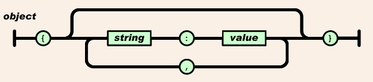
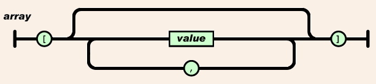
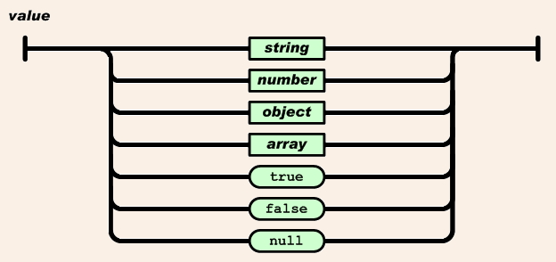
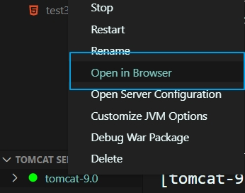

# JSON(JavaScript Object Notation)

## JSON(JavaScript Object Notation)

- 자바 스크립트 객체 표기법
- JSON은 `데이터 저장과 교환에서 사용`한다.
- XML에 비해서 매우 적은 네트워크 트래픽을 동반하며, `XML을 대체할 수 있는 데이터 표현 기술`이다.
- `서버와 데이터를 주고 받을 때` 및 `데이터를 직렬화` 할때 사용된다.
- `key-value` 한쌍으로 표현된다.
- 가벼운 텍스트 기반 구조이다.
- 프로그램 언어와 플랫폼에 `독립적`이다.

<br />

- JSON 참조 사이트
  - [MDN](https://developer.mozilla.org/en-US/docs/Learn/JavaScript/Objects/JSON)
  - [JavaScript.info](https://javascript.info/json)
  - [JavaScript.info 한국어](https://ko.javascript.info/json)

<br />

- 유용한 사이트:
  - [JSON Diff checker](http://www.jsondiff.com/) : 서버에서 받아온 1번째 데이터와 두번째 데이터를 비교할때, 디버깅시 유용
  - [JSON Beautifier/editor](https://jsonbeautifier.org/) : 서버에서 받아온 json이 포맷이 잘못되었을 때 알맞은 포맷을 만들어 준다.
  - [JSON Parser](https://jsonparser.org/) : json -> object 확인
  - [JSON Validator](https://tools.learningcontainer.com/json-validator/) : JSON의 잘못된 형식을 살펴볼때 유용하다.

<br />

### 1. JSON과 XML 표현

> JSON Example

```javascript
{"employees":[
    {"firstName":"John", "lastName":"Doe"},
    {"firstName":"Anna", "lastName":"Smith"},
    {"firstName":"Peter", "lastName":"Jones"}
]}
```

> XML Example

```javascript
<employees>
  <employee>
    <firstName>John</firstName> <lastName>Doe</lastName>
  </employee>
  <employee>
    <firstName>Anna</firstName> <lastName>Smith</lastName>
  </employee>
  <employee>
    <firstName>Peter</firstName> <lastName>Jones</lastName>
  </employee>
</employees>
```

<br />

### 2. JSON Object와 Array 구조





#### (1) JSON Object와 Array 구문

- JSON DATA는 name/value 한쌍으로 표현한다. <br />`"firstName":"John"`
- JSON `DATA`는 `,`로 구분해서 표현한다.
- JSON `Object`는 `{,}` 를 사용한다. <br />`{"firstName":"John", "lastName":"Doe"}`

- JSON `Array`는 `[, ]`를 사용한다.

```javascript
"employees":[
    {"firstName":"John", "lastName":"Doe"},
    {"firstName":"Anna", "lastName":"Smith"},
    {"firstName":"Peter","lastName":"Jones"}
]
```

<br />

### 3. 직렬화 및 역직렬화

- 서버와 클라이언트(브라우저)가 연결하여 데이터를 주고 받을 때 사용한다.
- `parse(text:string, reviver?:(this:any, key:string, value:any) => any) : any;` <br /> json 문자열을 어떤 타입의 객체로 변환해준다.
- parse함수의 reviver? 는 callback함수로 사용은 옵션으로 좀더 세밀한 객체로 조정하고 싶을 때 쓴다.

- `stringify(value:any, replacer?:(this:any, key:string,value:any) => any, space?: .... ) : string;` <br /> 어떤 타입이든 string 타입으로 변환 해준다.
- stringify함수의 replacer? 는 callback함수로 사용은 옵션으로 좀더 세밀한 문자열로 통제하고 싶을때 쓴다.

<br />

#### (1) 직렬화 Object -> JSON

- `클라이언트에서 서버로` 객체를 전송할때는 `JSON의 문자열로 변환`해서 보낸다.
- `stringify(obj)`
- 객체안의 메소드는 JSON 문자열로 만들어지지 않는다.

> ajax/index.html

```javascript
<head>
    <meta charset="UTF-8">
    <meta http-equiv="X-UA-Compatible" content="IE=edge">
    <meta name="viewport" content="width=device-width, initial-scale=1.0">
    <title>Document</title>
    <script src="./json_stringify.js" defer></script>
</head>
```

> ajax/json_stringify.js

```javascript
//JSON(JavaScript Object Notation)
//1. Object -> JSON
//stringify(obj) : 직렬화

let json = JSON.stringify(true);
console.log(`json:${json}, type${typeof json}`);
console.log(`true:${true}, type${typeof true}`);

json = JSON.stringify(['apple', 'banana']);
console.log(`json:${json}, type${typeof json}`);
console.log(`array:${['apple', 'banana']}, type${typeof ['apple', 'banana']}`);

const rabbit = {
  name: 'tori',
  color: 'white',
  size: null,
  birthdate: new Date(),
  jump: () => {
    console.log(`${name} can jump!`);
  },
};

json = JSON.stringify(rabbit);
console.log(`json:${json}, type${typeof json}`);
console.log(`object:${rabbit}, type${typeof rabbit}`);

json = JSON.stringify(rabbit, ['name', 'color']);
console.log(json);

json = JSON.stringify(rabbit, (key, value) => {
  console.log(`key: ${key}, value: ${value}`);
  return key === 'name' ? 'rab' : value;
});
console.log(json);
```

<br />

#### (2) 역직렬화 JSON -> Object , parse(json)

- 클라이언트가 서버로부터 JSON의 문자열 데이터를 받아서 객체로 변환해서 사용한다.

> ajax/index.html

```javascript
<head>
    <meta charset="UTF-8">
    <meta http-equiv="X-UA-Compatible" content="IE=edge">
    <meta name="viewport" content="width=device-width, initial-scale=1.0">
    <title>Document</title>
    <script src="./json_stringify.js" defer></script>
    <script src="./json_parse.js" defer></script>
</head>
```

> ajax/json_parse.js

```javascript
//JSON(JavaScript Object Notation)
//2. JSON -> Object
//parse(json) : 역직렬화

console.clear();
console.log(rabbit);

json = JSON.stringify(rabbit);
console.log(json);

const obj = JSON.parse(json);
console.log(obj);
rabbit.jump();
//obj.jump(); // 오류남. JSON 변환에서는 jump()가 없기때문에 object로 변환해도 object에 jump()가 없다.

console.log(rabbit.birthdate.getDate());
// console.log(obj.birthdate.getDate());

const obj2 = JSON.parse(json, (key, value) => {
  console.log(`key: ${key}, value: ${value}`);
  return key === 'birthdate' ? new Date(value) : value;
});
console.log(obj2.birthdate.getDate());
```

<br />

### 4. 비동기 통신 예제 JSON 사용

#### (1) parse(), stringify() 확인, typeof(); 타입확인

> ajax/json1.html

```javascript
<!DOCTYPE html>
<html lang="en">
<head>
    <meta charset="UTF-8">
    <meta http-equiv="X-UA-Compatible" content="IE=edge">
    <meta name="viewport" content="width=device-width, initial-scale=1.0">
    <title>Document</title>
</head>

<body>
    <H2>JSON Object Creation in JavaScript</H2>
    <p id='demo'></p>

    <script>
        let text = '{"name":"John","street":"Oslo West","phone":"111 11111"}';
        console.log(typeof (text));
        let obj = JSON.parse(text);
        console.log(typeof (obj));
        document.getElementById('demo').innerHTML =
            obj.name + '<br />' +
            obj.street + '<br />' +
            obj.phone;

        let text2 = JSON.stringify(obj);
        console.log(text2);
    </script>
</body>
</html>
```

> ajax/json2.html

```javascript
<!DOCTYPE html>
<html lang="en">
<head>
    <meta charset="UTF-8">
    <meta http-equiv="X-UA-Compatible" content="IE=edge">
    <meta name="viewport" content="width=device-width, initial-scale=1.0">
    <title>Document</title>
</head>

<body>
    <p>How to create a JavaScript object array</p>
    <p id='demo'></p>

    <script>
        let emp = [
            {
                "firstName": "John",
                "lastName": "Doe"
            },
            {
                "firstName": "Anna",
                "lastName": "Smith"
            },
            {
                "firstName": "peter",
                "lastName": "Jones"
            }
        ];
        console.log(typeof emp);

        document.getElementById('demo').innerHTML =
            emp[0].firstName + " " + emp[0].lastName + "<br />" +
            emp[1]["firstName"] + " " + emp[1]["lastName"];
    </script>
</body>
</html>
```

<br />

#### (2) 비동기 통신으로 JSON 응답 받기.

- 서버를 구현한 jsp는 톰캣이 있어야한다.
- [톰캣 서버 설정](http://lectureblue.pe.kr/reqtiles/read.jsp?bbsno=954&nowPage=1&col=&word=&code=55)
- VSCode 확장하기

```javascript
Debugger for java (Microsoft)
Tomcat for java (Wei Shen)
```

- Explorer 하단에 추가된 TOMCAT SERVERS에서 '+' 클릭 후 톰캣폴더를 추가 한다.
- 우클릭으로 Open server configration 선택한다.

```javascript
<Host name="localhost" 찾아서 아래부분에 다음소스 추가 (d:/aistudy/javascirpt/ajax)
<Context path="" docBase="jsp작업경로"></Context>
```

<br />

> ajax/member.jsp

```javascript
{
    "code":"success",
    "data":{
        "member":[
            {
            "name":"홍길동",
            "id":"coder",
            "sno":"a01"
            }
            ,
            {
            "name": "아로미",
            "id": "dev",
            "sno": "a02"
            }
        ]
    }
}
```

> ajax/ajaxtest3.html

```javascript
<!DOCTYPE html>
<html lang="en">
<head>
    <meta charset="UTF-8">
    <meta http-equiv="X-UA-Compatible" content="IE=edge">
    <meta name="viewport" content="width=device-width, initial-scale=1.0">
    <title>Document</title>
    <script>
        function loadDoc() {
            let xhttp;
            if (window.XMLHttpRequest) {
                xhttp = new XMLHttpRequest();
            } else {
                // code for IE6, IE5
                xhttp = ActiveXObject("Microsoft.XMLHTTP");
            }

            xhttp.onreadystatechange = function () {
                if (xhttp.readyState == 4 && xhttp.status == 200) {
                    console.log(`responseText: ${xhttp.responseText}, type: ${typeof xhttp.responseText}`);
                    let result = JSON.parse(xhttp.responseText); // 역직렬화
                    if (result.code === 'success') {
                        let marr = result.data.member;
                        console.log(marr.length);

                        document.getElementById('demo').innerHTML = "";
                        for (let i = 0; i < marr.length; i++) {
                            let idx = marr[i]["id"];
                            let name = marr[i].name;
                            let sno = marr[i].sno;
                            let txt = idx + " [" + name + "] " + sno + ", ";

                            document.getElementById("demo").append(txt);
                        }
                    } else {
                        // alert(xhttp.status)
                    }
                }
            }
            xhttp.open("GET", "member.jsp", true);
            xhttp.send();
        }
    </script>
</head>

<body>
    <p id='demo'>Let AJAX change this text.</p>
    <button onclick='loadDoc()'>Change Content</button>
</body>
</html>
```

<br />

#### (3) 실행하기

- tomcat-9.0 -> Open in Browser
  

- 요청페이지 확인 : http://localhost:8000/member.jsp

`{ "code":"success" , "data":{ "member": [ { "name":"홍길동", "id":"coder", "sno":"a01" } , { "name": "아로미", "id": "dev", "sno": "a02" } ] } }`

- Ajax 비동기 요청 : http://localhost:8000/ajaxtest3.html
  
