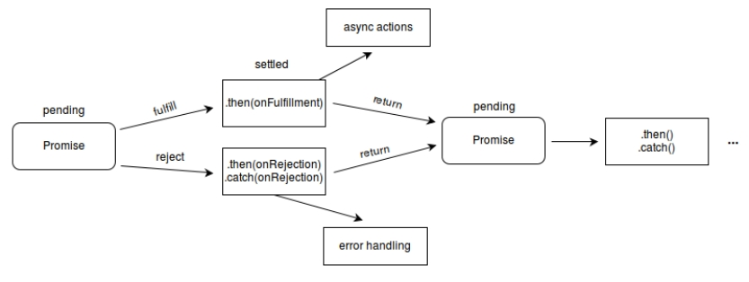

# callback 함수사용, callback 함수의 개선 Promise, async, await

## 동기와 비동기에서 callback

### 1. 동기와 비동기 처리

- **자바스크립트는 동기 처리**를 한다. **정해진 코드 순서대로 처리**한다.
- 자바스크립트는 hoisting 처리를 하여 var, function 선언부분을 맨 앞으로 이동 시킨다.
- Ajax에서는 비동기 처리를 하며 비동기는 언제 코드가 실행될지 예측할 수 없다.
- `setTimeout()`는 **브라우저 API**이며 **callback 함수를 정의**하여 `얼마의 시간이 지난후에 콜백함수가 자동으로 호출`된다.
- `callback함수`는 메소드의 **매개변수로 전달**되어 **메소드 내부**에서 `이름없는 함수 또는 에로 함수('()=>{}')로 표현`된다. 메소드 내부에서 기능 처리 중에 자동호출된다.

<br />

- javascript is synchronous.:정해진 순서대로 코드가 실행
- Execute the code block by orger (in order) after hoisting
- hoisting : var, function declaration이 맨 위로 올라간다.

> index.html

```javascript
<head>
    <meta charset="UTF-8">
    <meta http-equiv="X-UA-Compatible" content="IE=edge">
    <meta name="viewport" content="width=device-width, initial-scale=1.0">
    <title>Document</title>
    <script src="async/callback.js" defer></script>
</head>
```

> callback.js

```javascript
// console.log('1');
// console.log('2');
// console.log('3');
console.log('1');
setTimeout(() => {
  console.log('2');
}, 1000);
console.log('3');

function printImmediately(print) {
  print();
}

printImmediately(() => {
  console.log('hello');
});

function printWithDelay(print, timeout) {
  setTimeout(print, timeout);
}

printImmediately(() => console.log('async callback'), 2000);
```

<br />

### 2. callback함수 example

- UserStorage 클래스에서 로그인 처리 메서드와 로그인이 성공이면 역할을 얻어오는 메서드를 선언한다.
- 메소드 loginUser, getRoles는 콜백함수를 정의하여 기능처리를 한다.
- loginUser와 getRoles의 onSuccess, onError는 콜백함수이다.
- **콜백함수 안에서 또 다른 콜백함수를 연속적으로 호출하게 되면 가독성이 떨어져서 유지보수성과 확장성이 낮아진다.**

- Callback Hell example (나쁜예시)
- 가독성이 떨어진다.
- 체인이 길어지면 디버깅이 어렵다.

> index.html

```javascript
<head>
    <meta charset="UTF-8">
    <meta http-equiv="X-UA-Compatible" content="IE=edge">
    <meta name="viewport" content="width=device-width, initial-scale=1.0">
    <title>Document</title>
    <script src="async/callback-hell.js" defer></script>
</head>
```

> callback-hell.js

```javascript
class UserStorage {
  loginUser(id, password, onSuccess, onError) {
    setTimeout(() => {
      if (
        (id === 'study' && password === 'aistudy') ||
        (id === 'coder' && password === 'academy')
      ) {
        onSuccess(id);
      } else {
        onError(new Error('not found'));
      }
    }, 2000);
  }

  getRoles(user, onSuccess, onError) {
    setTimeout(() => {
      if (user === 'study') {
        onSuccess({ name: 'study', role: 'admin' });
      } else {
        onError(new Error('no access'));
      }
    }, 1000);
  }
}

const UseStorage = new UserStorage();
const id = prompt('enter your id');
const password = prompt('enter your password');
UseStorage.loginUser(
  id,
  password,
  user => {
    UseStorage.getRoles(
      user,
      userWithRole => {
        alert(
          `hello ${userWithRole.name}, you have a ${userWithRole.role} role`,
        );
      },
      error => {
        console.log(error);
      },
    );
  },
  error => {
    console.log(error);
  },
); // loginUser()호출
```

<br />

## callback 함수의 개선

- Promise, async, await 사용으로 callback 문제점을 해결할 수 있다.

### 1. Promise 사용

- 참조사이트 : [MDN Web Docs](https://developer.mozilla.org/ko/docs/Web/JavaScript/Reference/Global_Objects/Promise)
- Promise 객체는 **자바스크립트에서 제공**하며, **비동기를 간편하게 처리**할 수 있도록 도와준다.
- 정해진 장시간의 기능을 수행 후 **정상적인 수행 완료 또는 실패와 그 결과 값을 전달**한다.
- javascrit의 클래스로 생성자를 통해서 객체를 만든다.

- 비동기 연산이 종료 후의 결과 값이나 **실패 이유를 처리하기 위한 처리기를 연결**할 수 있다.
- 프로미스를 사용하면 비동기 메서드에서 마치 동기 메서드처럼 **값을 반환**할 수 있다.
- 최종 결과를 반환하지는 않고, **대신 프로미스를 반환해서 미래의 어떤 시점에 결과를 제공**한다.

- Promise는 다음 중 하나의 상태를 가집니다.

  - 대기(pending) : 이행하거나 거부되지 않은 초기 상태.
  - 이행(fulfilled) : 연산이 성공적으로 완료됨.
  - 거부(rejected) : 연산이 실패함.

- 대기 중인 프로미스는 값과 함께 이행할 수도, 어떤 이유(오류)로 인해 거부될 수 있다.
- 이행이나 거부될 때, 프로미스에 연결한 처리기는 그 프로미스의 `then` 메서드로 대기열에 오른다.



<br />

#### (1) Promise 생성, 사용

```javascript
const promise = new Promise((resolve, reject) => {});
```

- Promise 생성자에서 **excutor 콜백함수는 또다른 `resolve`(정상수행 후 결과전달), `reject`(문제가 생기면 호출) 콜백함수를 받는다.**
- Promise는 **시간이 걸리는 비동기 처리를 구현**할 수 있다.
- **`Promise를 생성하면 executor 콜백함수가 자동으로 실행된다.`** ✨
- Promise를 생성하여 비동기 처리를 구현 후 **resolve(), reject() 콜백 함수를 호출하여 그 결과를 전달**한다.
- Promise 사용하는 곳에서 **결과를 `then`, `catch`, `finally` 등으로 받을 수 있다.**

> index.html

```javascript
<script src='async/promise.js' defer></script>
```

> promise.js

```javascript
// 1. Producer : 제공자
const promise = new Promise((resolve, reject) => {
  console.log('doing something...');
  setTimeout(() => {
    resolve('study');
    reject(new Error('no network'));
  }, 2000);
});

// 2. Consumers : 사용자 (then, catch, finally)
promise
  .then(value => {
    console.log(value);
  })
  .catch(error => {
    console.log(error);
  })
  .finally(() => {
    console.log('finally');
  });
```

<br />

#### (2) Promise chaning, error 처리

- Promise chaning, Promise error 예제 확인
- then은 값 또는 Promise 객체가 전달된다.

> index.html

```javascript
<script src='async/promise2.js' defer></script>
```

> promise2.js

```javascript
//3. Promise chaining
const fetchNumber = new Promise((resolve, reject) => {
  setTimeout(() => resolve(1), 1000);
});

fetchNumber
  .then(num => num * 2)
  .then(num => num * 3)
  .then(num => {
    return new Promise((resolve, reject) => {
      setTimeout(() => resolve(num - 1), 1000);
    });
  })
  .then(num => console.log(num));

// 4. Error Handling
const getHen = () =>
  new Promise((resolve, reject) => {
    setTimeout(() => resolve('hen'), 1000);
  });

const getEgg = hen =>
  new Promise((resolve, reject) => {
    setTimeout(() => resolve(`${hen} => egg`), 1000);
    //setTimeout(()=> reject(new Error(`error! ${hen} => egg`)),1000);
  });

const cook = egg =>
  new Promise((resolve, reject) => {
    setTimeout(() => resolve(`${egg} => brunch`), 1000);
  });

getHen()
  .then(getEgg)
  .catch(error => {
    return 'bread';
  })
  .then(cook)
  .then(console.log)
  .catch(console.log);
```

<br />

#### (3) Promis 예제 확인

- callback-hell 예제를 Promise를 사용한 예제로 변경하여 개선할 수 있다.

> index.html

```javascript
<script src='async/callback-promise.js' defer></script>
```

> callback-promise.js

```javascript
class UserStorage {
  loginUser(id, password) {
    return new Promise((resolve, reject) => {
      setTimeout(() => {
        if (
          (id === 'study' && password === 'aistudy') ||
          (id === 'coder' && password === 'academy')
        ) {
          resolve(id);
        } else {
          reject(new Error('not found'));
        }
      }, 2000);
    });
  }
  getRoles(user) {
    return new Promise((resolve, reject) => {
      setTimeout(() => {
        if (user === 'study') {
          resolve({ name: 'study', role: 'admin' });
        } else {
          reject(new Error('no access'));
        }
      }, 1000);
    });
  }
}

const userStorage = new UserStorage();
const id = prompt('enter your id');
const password = prompt('enter your password');
userStorage
  .loginUser(id, password) // LoginUser() 호출
  .then(userStorage.getRoles)
  .then(user => alert(`Hello ${user.name}, you have a ${user.role} role`))
  .catch(console.log);
```

<br />

### 2. async, await 사용

- 참조 사이트 : [MDN Web Docs](https://developer.mozilla.org/ko/docs/Web/JavaScript/Reference/Statements/async_function)
- 기존 Promise위에 좀더 간편하게 사용할 수 있는 방법이다.
- `async` function 선언은 AsyncFunction 객체를 반환하는 하나의 비동기 함수를 정의한다.
- **암시적으로 Promise를 사용하여 결과를 반환**한다.
- 비동기 함수를 사용하는 코드의 구문과 구조는, 동기 함수를 사용하는것 처럼 보인다.
- async 함수에는 await식이 포함될 수 있다.
- `await`은 async 함수의 실행을 일시 중지하고 전달 된 Promise의 해결을 기다린 다음 async 함수의 실행을 다시 시작하고 완료후 값을 반환한다.
- await 키워드는 async 함수에서만 유효하다.
- 너무 많은 체인을 사용하면 callback함수를 겹겹히 사용하는 것처럼 가독성이 떨어지는데 **async, await는 좀더 간결한 코드를 만들기 위해서 사용**한다.

> async.js

```javascript
// 1. async : 코드블럭이 자동으로 promise를 반환
async function fetchUser() {
  return 'study';
}

const user = fetchUser();
user.then(`user.then: ${console.log}`);
console.log(`user: ${user}`);

// 2. await
function delay(ms) {
  return new Promise(resolve => setTimeout(resolve, ms));
}

async function getApple() {
  await delay(2000);
  //throw 'error';
  return 'apple';
}

async function getBanana() {
  await delay(1000);
  return 'banana';
}

// function pickFruits() {
//     return getApple().then((apple) => {
//         return getBanana().then((banana) => `${apple} + ${banana}`);
//     });
// }

// 좀 더 개선된 코드
async function pickFruits() {
  try {
    const apple = await getApple();
    const banana = await getBanana();
    return `${apple} + ${banana}`;
  } catch {
    console.log(new Error('error'));
  }
}

// 병렬처리로 좀더 개선된 코드
async function pickFruits() {
  try {
    const applePromise = await getApple();
    const bananaPromise = await getBanana();
    const apple = await applePromise;
    const banana = await bananaPromise;
    return `${apple} + ${banana}`;
  } catch {
    console.log(new Error('error'));
  }
}

// Promise APIs all() 병렬처리 코드를 좀더 개선
function pickFruits() {
  return Promise.all([getApple(), getBanana()]).then(fruits =>
    fruits.join('+'),
  );
}

pickFruits().then(console.log);

// Promise APIs race() 먼저 수행되는 것 하나만 처리결과를 가져온다
function pickOnlyOne() {
  return Promise.race([getApple(), getBanana()]);
}

pickOnlyOne().then(console.log);
```

- callback-async.js 에 async, await 추가해서 수정한 소스

> callback-async.js

```javascript
class UserStorage {
  loginUser(id, password) {
    return new Promise((resolve, reject) => {
      setTimeout(() => {
        if (
          (id === 'study' && password === 'aistudy') ||
          (id === 'coder' && password === 'academy')
        ) {
          resolve(id);
        } else {
          reject(new Error('not found'));
        }
      }, 2000);
    });
  }
  getRoles(user) {
    return new Promise((resolve, reject) => {
      setTimeout(() => {
        if (user === 'study') {
          resolve({ name: 'study', role: 'admin' });
        } else {
          reject(new Error('no access'));
        }
      }, 1000);
    });
  }

  async getUserWithRole(user, password) {
    const id = await this.loginUser(user, password);
    const role = await this.getRoles(id);
    return role;
  }
}

const userStorage = new UserStorage();
const id = prompt('enter your id');
const password = prompt('enter your password');
userStorage
  .getUserWithRole(id, password)
  .then(user => alert(`Hello ${user.name}, you have a ${user.role} role`))
  .catch(console.log);
```
