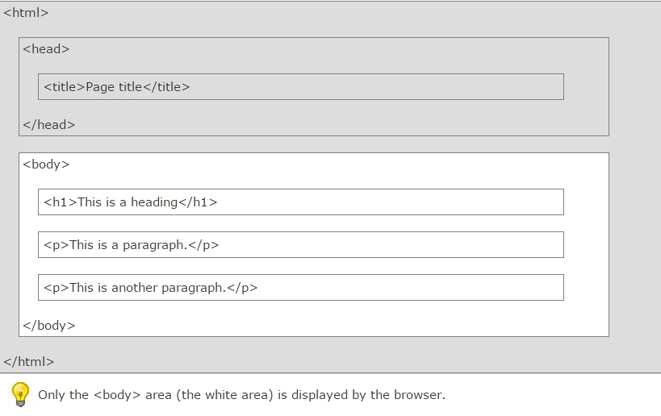
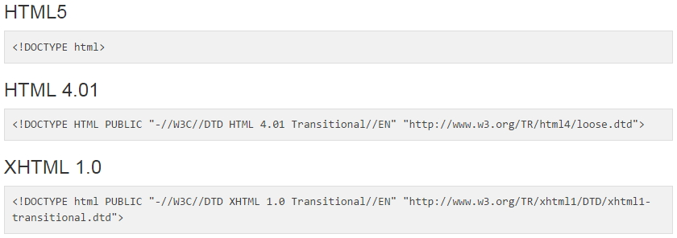
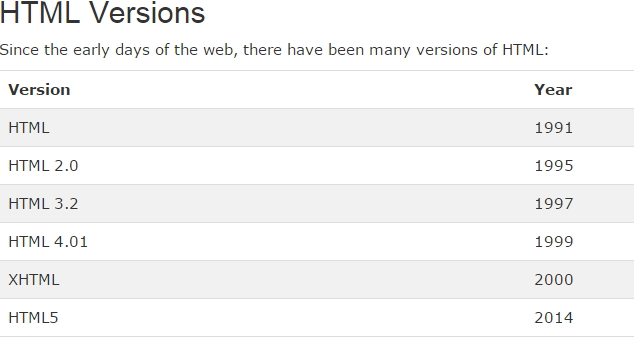

# HTML(Hyper Text Markup Language) Introduction

## HTML

- 공식사이트 : https://developer.mozilla.org/ko/docs/Web/HTML/Element <br />
  https://developer.mozilla.org/en-US/docs/Web/HTML/Element

- `Hypertext Markup Language(HTML)` : `웹브라우저 상에서 보여지도록 설계된 문서`이며, 표준화된 markup 언어를 사용한다. (위키피디아)

- `Markup Language` : 일반적인 텍스트와 `문법적으로 구분하기 위해서 문서에 annotating`된 것이다.(위키피디아)

<br />

### 1. HTML 구조



<br />

### 2. HTML 버전에 따른 Declaration



<br />

### 3. HTML Version



<br />

### 4. 코딩하기

- `head` tag : `html페이지의 정보나 메타데이터`(검색어 등 정의)
- `body` tag : `사용자에게 보여지는 최상의 컨테이너`
- body tag 안에 이미 정해진 tag를 사용하여 표현한다.
- W3C( World Wide Web Consortium ) : `웹의 표준화를 추진하는 단체` W3C에서 정의한 태그는 여러 브라우저에서 같은 결과를 나타낸다.

<br />

> Test.html

```javascript
<!DOCTYPE html>
<html>
    <head>
        <meta charset="utf-8">
        <meta name="viewport"   content="width=device-width">
        <title>JS Bin</title>
    </head>
    <body>
        <h1>My First Heading</h1>
        <p>My first paragraph.</p>
        <button> Click Me! </button>
    </body>
</html>
```

<br />

#### (1) Tag & Element

```
<p> My cat is very grumpy </p>
```

- Tag : `<p></p>`
- Content : My cat is very grumpy
- Element(요소, 노드) : `<p> My cat is very grumpy </p>`

<br />

#### (2) Attribute(속성)

```
<p class='editor-note'> My cat is very grumpy</p>
```

- tag 내 class, id 등 추가적인 내용을 정의하여 style를 적용하거나 js로 요소를 찾을때 등에서 사용된다.
