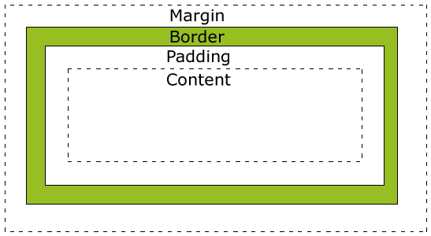
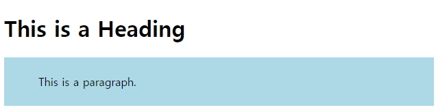

# CSS Margin, Padding, Border, Outline

## CSS Margin, Padding, Border, Outline



```javascript
<!DOCTYPE html>
<html>
    <head>
    <style>
        div {
            background-color: lightgrey;
            width: 300px;
            padding: 25px;
            border: 25px solid navy;
            margin: 25px;
        }
    </style>
    </head>

    <body>
        <div>Lorem ipsum dolor sit amet, consectetur adipiscing elit, sed do eiusmod tempor incididunt ut labore et dolore magna aliqua. Ut enim ad minim veniam, quis nostrud exercitation ullamco laboris nisi ut aliquip ex ea commodo consequat. Duis aute irure dolor in reprehenderit in voluptate velit esse cillum dolore eu fugiat nulla pariatur. Excepteur sint occaecat cupidatat non proident, sunt in culpa qui officia deserunt mollit anim id est laborum.</div>
    </body>
</html>
```

<br />

### 1. Margin Style

```javascript
<!DOCTYPE html>
<html>
    <head>
    <style>
        p {
            background-color: yellow;
        }

        p.ex {
            margin-top: 100px;
            margin-bottom: 100px;
            margin-right: 150px;
            margin-left: 50px;
        }
    </style>
    </head>

    <body>
        <p>This is a paragraph with no specified margins.</p>
        <p class="ex">This is a paragraph with  specified margins.</p>
    </body>
</html>
```


<br />

```javascript
<!DOCTYPE html>
<html>
    <head>
    <style>
        h1 {
            background-color: lightblue;
            margin: 50px 25px;
        }
    </style>
    </head>

    <body>
        <h1>This is a Heading</h1>
        <p>This is a paragraph.</p>
    </body>
</html>
```

### 2. Padding Style


```javascript
<!DOCTYPE html>
<html>
    <head>
    <style>
        p {
            background-color: yellow;
        }

        p.padding {
            padding-top: 25px;
            padding-right: 50px;
            padding-bottom: 25px;
            padding-left: 50px;
        }
    </style>
    </head>

    <body>
        <p>This is a paragraph with no specified padding.</p>
        <p class="padding">This is a paragraph with specified paddings.</p>
    </body>
</html>
```



```javascript
<!DOCTYPE html>
<html>
    <head>
    <style>
        p {
            background-color: lightblue;
            padding: 25px 50px;
        }
    </style>
    </head>

    <body>
        <h1>This is a Heading</h1>
        <p>This is a paragraph.</p>
    </body>
</html>
```

<br />

### 3. Border Style


<br />

```javascript
<!DOCTYPE html>
<html>
    <head>
    <style>
        p {
            border-top-style: dotted;
            border-right-style: solid;
            border-bottom-style: dotted;
            border-left-style: solid;
        }
    </style>
    </head>

    <body>
        <p>2 different border styles.</p>
    </body>
</html>
```

<br />

### 4.Outline Style


```javascript
<!DOCTYPE html>
<html>
    <head>
    <style>
        p {
            border: 1px solid red;
            outline: green dotted thick;
        }
    </style>
    </head>

    <body>
        <p><b>Note:</b> IE8 supports the outline properties only if a !DOCTYPE is
    specified.</p>
    </body>
</html>
```
