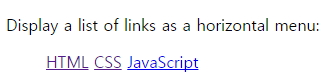
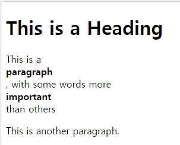

# CSS Hiding, Display, Position

## 1.Hiding an Element - `display:none` or `visibility:hidden`

```javascript
<!DOCTYPE html>
<html>
    <head>
    <style>
        h1.hidden {
            visibility: hidden;
        }
    </style>
    </head>

    <body>
        <h1>This is a visible heading</h1>
        <h1 class="hidden">This is a hidden heading</h1>
        <p>Notice that the hidden heading still takes up space.</p>
    </body>
</html>
```

<br />

```javascript
<!DOCTYPE html>
<html>
    <head>
    <style>
        h1.hidden {
            display: none;
        }
    </style>
    </head>

    <body>
        <h1>This is a visible heading</h1>
        <h1 class="hidden">This is a hidden heading</h1>
        <p>Notice that the hidden heading does not take up space.</p>
    </body>
</html>
```

<br />

## 2.CSS Display - `Block` and `Inline` Elements


```javascript
<!DOCTYPE html>
<html>
    <head>
    <style>
        li {
            display: inline;
        }
    </style>
    </head>

    <body>
        <p>Display a list of links as a horizontal menu:</p>
        <ul>
            <li><a href="/html/default.asp" target="_blank">HTML</a></li>
            <li><a href="/css/default.asp" target="_blank">CSS</a></li>
            <li><a href="/js/default.asp" target="_blank">JavaScript</a></li>
        </ul>
    </body>
</html>
```



<br />

- strong : inline element

```javascript
<!DOCTYPE html>
<html>
    <head>
    <style>
        strong {
            display:block;
        }
    </style>
    </head>

    <body>
        <h1>This is a Heading</h1>
        <p>This is a <strong>paragraph</strong>, with some words more <strong>important</strong> than others </p>
        <p>This is another paragraph.</p>
    </body>
</html>
```



<br />

- html

```javascript
<!DOCTYPE html>
<html>
    <head>
        <meta charset="utf-8">
        <meta name="viewport" content="width=device-width">
        <title>JS Bin</title>
    </head>

    <body>
    <!-- Block-level -->
        <div></div>
        <div></div>
        <div></div>
    <!-- Inline-level -->
        <span>1</span>
        <span>3</span>
        <span>3</span>
    </body>
</html>
```

<br />

- css

```javascript
div, span {
    width:80px;
    height:80px;
    margin:20px

}

div {
    background:red;
}

span {
    background: blue;
}
```

<br />

- output


<br />

- display : `inline` ;
  - contents가 있어야 보여진다.
  - 콘텐츠 크기로 보여진다.
  - `한줄에 여러개`가 보여진다.
- display : `block` ;
  - 콘텐츠 크기와 상관없어 css의 width, height 사이즈로 보여준다.
  - `한줄에 하나만` 보여진다.
- display : `inline-block` ;
  - 콘텐츠 크기와 상관없어 css의 width, height 사이즈로 보여준다.
  - `한줄에 여러개`가 보여진다.

<br />

- css 변경

```javascript
div, span {
    width:80px;
    height:80px;
    margin:20px

}

div {
    background:red;
    display : inline-block
}

span {
    background: blue;
    display:block;
}
```

<br />

- output


<br />

## 3. CSS Position

- position : `static (default)` - html에 정의된 **순서대로 브라우저에 자연스럽게 보여줌**
- position : `relative` - 나의 **원래자리에서 상대적으로 이동**
- position : `absolute` - **내 아이템이 담겨있는 상자에서 이동**
- position : `fixed` - 내 아이템이 담겨있는 상자에서 벗어나 **원도우 즉 page 상에서 이동**
- position : `sticky` - 원래자리에 고정되어, **스크롤바를 이동해도 그자리에 그대로** 있다.


