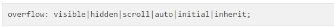

# CSS overflow

## 1. CSS overflow property

- overflow, overflow-x, overflow-y
- contents가 Box 영역을 벗어났을때 처리되는 방법을 나타냄.



<br />

> overflow1.html

```javascript
<!DOCTYPE html>
<html>
    <head>
    <style>
        div.scroll {
            background-color: #00FFFF;
            width: 100px;
            height: 100px;
            overflow: scroll;
        }

        div.hidden {
            background-color: #00FF00;
            width: 100px;
            height: 100px;
            overflow: hidden;
        }
    </style>
    </head>

    <body>
        <p>The overflow property specifies what to do if the content of an element exceeds the size of the element's box.</p>

        <p>overflow:scroll</p>
        <div class="scroll">You can use the overflow property when you want to have better control of the layout. The default value is visible.</div>

        <p>overflow:hidden</p>
        <div class="hidden">You can use the overflow property when you want to have better control of the layout. The default value is visible.</div>
    </body>
</html>
```


<br />

```javascript
<!DOCTYPE html>
<html>
    <head>
    <style>
        div {
            color: red;
        }
        h1  {
            color: initial;
        }
    </style>
    </head>

    <body>
        <div>
          <h1>Initial</h1>
          <p>
            The header and this text is inside a DIV element, which has the color property set to "red". The header element has its color property set to "initial", which in this case is "black".
          </p>
        </div>

        <p>
            <b>Note:</b> The initial keyword is not supported as a property value in Internet Explorer, or in Opera before version 15.
        </p>
    </body>
</html>
```


<br />

```javascript
<!DOCTYPE html>
<html>
    <head>
    <style>
        span {
            color: blue;
            border: 1px solid black;
        }
        .extra span {
            color: inherit;
        }
    </style>
    </head>

    <body>
        <div>
            Here is <span>a span element</span> which is blue, as span elements are set to be.
        </div>
        <div class="extra" style="color:green">
            Here is <span>a span element</span> which is green, because it inherits from its parent.
        </div>
        <div style="color:red">
            Here is <span>a span element</span> which is blue, as span elements are set to be.
        </div>
    </body>
</html>
```


<br />


<br />

- white-space


```javascript
<!DOCTYPE html>
<html>
    <head>
    <style>
        #myDIV {
            border: 1px solid black;
            background-color: lightblue;
            width: 200px;
            height: 210px;
            white-space: nowrap;
        }
    </style>
    </head>

    <body>
        <p>Click the "Try it" button to change the overflow-x property of the DIV element:</p>
        <button onclick="myFunction()">Try it</button>
        <div id="myDIV">
    Lorem ipsum dolor sit amet, consectetuer adipiscing elit,<br> sed diam nonummy nibh euismod tincidunt ut laoreet dolore magna aliquam erat volutpat.<br> Ut wisi enim ad minim veniam,<br> quis nostrud exercitation ullamcorper suscipit lobortis nisl ut aliquip ex ea commodo consequat.
        </div>

        <script>
            function myFunction() {
                document.getElementById("myDIV").style.overflowX = "scroll";
            }
        </script>
    </body>
</html>
```
