# CSS Float, FlexBox

## CSS Float

- `문서에 사진이나 글그림을 왼쪽이나 오른쪽에 띄어서 정렬`하거나 각 객체를 오른쪽이나 왼쪽으로 정렬하여 `문서를 배치`한다.
- float는 `left right none`으로 설정할 수 있다.
- `block형 요소에만 사용`된다. 예) div, p, ol, ul, table, img ...
- https://developer.mozilla.org/en-US/docs/Web/CSS/float

<br />

```javascript
<!DOCTYPE html>
<html>
    <head>
        <meta charset="utf-8">
        <meta name="viewport" content="width=device-width">
        <title>JS Bin</title>
    <style>
        body {
            width: 90%;
            max-width: 900px;
            margin: 0 auto;
            font: .9em/1.2 Arial, Helvetica, sans-serif
        }
        .box {
            float: none ; /* left, right */
            margin-right: 15px;
            width: 150px;
            height: 100px;
            border-radius: 5px;
            background-color: rgb(207,232,220);
            padding: 1em;
        }
    </style>
    </head>

    <body>
        <h1>간단한 float 예제</h1>
        <div class="box">float</div>
        <p>
            Lorem ipsum dolor sit amet, consectetur adipiscing elit. Nulla luctus aliquam dolor, eu lacinia lorem placerat vulputate. Duis felis orci, pulvinar id metus ut, rutrum luctus orci. Cras porttitor imperdiet nunc, at ultricies tellus laoreet sit amet.
        </p>
        <p>
            Sed auctor cursus massa at porta. Integer ligula ipsum, tristique sit amet orci vel, viverra egestas ligula. Curabitur vehicula tellus neque, ac ornare ex malesuada et. In vitae convallis lacus. Aliquam erat volutpat. Suspendisse ac imperdiet turpis. Aenean finibus sollicitudin eros pharetra congue. Duis ornare egestas augue ut luctus. Proin blandit quam nec lacus varius commodo et a urna. Ut id ornare felis, eget fermentum sapien.
        </p>
        <p>
            Nam vulputate diam nec tempor bibendum. Donec luctus augue eget malesuada ultrices. Phasellus turpis est, posuere sit amet dapibus ut, facilisis sed est. Nam id risus quis ante semper consectetur eget aliquam lorem. Vivamus tristique elit dolor, sed pretium metus suscipit vel. Mauris ultricies lectus sed lobortis finibus. Vivamus eu urna eget velit cursus viverra quis vestibulum sem. Aliquam tincidunt eget purus in interdum. Cum sociis natoque penatibus et magnis dis parturient montes, nascetur ridiculus mus.
        </p>
    </body>
</html>
```

<br />

```javascript
<!DOCTYPE html>
<html>
    <head>
    <style>
        .thumbnail {
            float: left;
            width: 110px;
            height: 90px;
            margin: 5px;
        }
    </style>
    </head>

    <body>
        <h3>Image Gallery</h3>
        <p>Try to resize the browser-window to see what happens when the images do not have enough room.</p>
        
        
        
        
        
        
        
        
    </body>
</html>
```

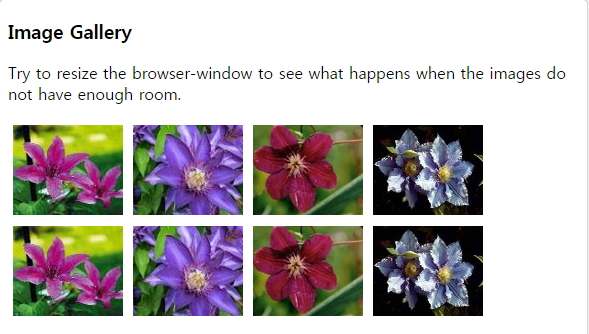

<br />

```javascript
<!DOCTYPE html>
<html>
    <head>
    <style>
        .thumbnail {
            float: left;
            width: 110px;
            height: 90px;
            margin: 5px;
        }
        .text_line {
            clear: both;
            margin-bottom: 2px;
        }
    </style>
    </head>

    <body>
        <h3>Image Gallery</h3>
        <p>Try to resize the browser-window to see what happens when the images does not have enough room.</p>
        
        
        
        

        <h3 class="text_line">Second row</h3>
        
        
        
        
    </body>
</html>
```

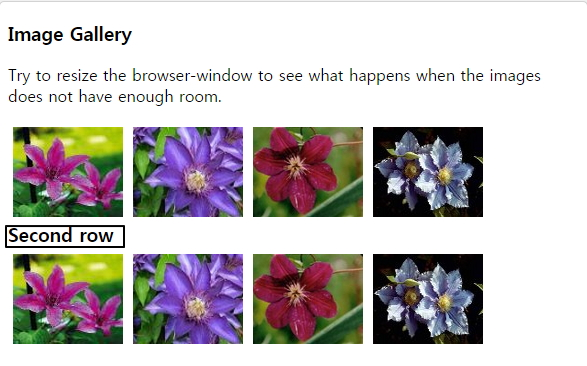

<br />

## FlexBox

- https://developer.mozilla.org/en-US/docs/Web/CSS/CSS_Flexible_Box_Layout/Basic_Concepts_of_Flexbox
- https://css-tricks.com/snippets/css/a-guide-to-flexbox/#flexbox-properties
- https://material.io/resources/color/#!/?view.left=0&view.right=0
- Flexbox는 `box와 아이템들을 행 또는 열로 자유자재로 배치`시켜주는 방법이다.
- 박스가 커지면 박스의 공간을 어떻게 매꿔야 될지 , 박스가 작아지면 아이템이 어떻게 작아져서 유연하게 박스안에서 배치되는지 자유롭게 정의할 수 있다.
- 웹 사이트의 layout을 쉽게 구성할 수있다.
- FlexBox는 container에 적용되는 속성과 그안 item들에 적용되는 속성이 있다.
- Container 안 항목들이 가로(left -> right)로 정렬되면 main axis(메인축,중심축)은 수평축이 되고, cross axis(교차축,반대축)은 수직축이 된다.
- Container 안 항목들이 세로(top -> bottom)로 정렬되면 main axis(메인축,중심축)은 수직축이 되고, cross axis(교차축, 반대축)은 수평축이 된다.

<br />

### 1. flex container

- 부모(컨테이너)에 적용되는 속성이다.

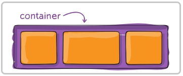

<br />

#### (1) display

- 플렉스 컨테이너를 정의하면서 컨테이너의 모든 아이템에 대해 플렉스 컨테이너를 활성화 한다.

```
.container { display: flex; }
```

<br />

#### (2) flex-direction

- 플렉스 항목이 플렉스 컨테이너에 배치되는 방향을 정의한다.
- 플렉스 항목은 주로 가로 행이나 세로 열에 배치된다.

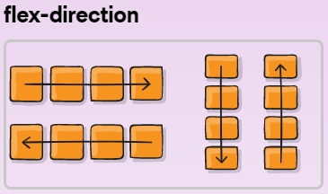

```
.container { flex-direction: row | row-reverse | column | column-reverse; }
```

<br />

#### (3) flex-wrap

- 기본적으로 플렉스 항목은 한 줄에 맞추어진다.
- wrap을 사용하면 여러줄에 보여지도록 할 수 있다.

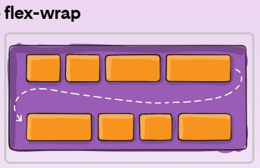

```
.container { flex-wrap: nowrap | wrap | wrap-reverse; }
```

<br />

#### (4) flex-flow

- flex-direction 및 flex-wrap를 함께 플렉스 컨테이너의 기본 축과 교차 축을 정의한다.
- 기본값은 row nowrap 이다.

```
.container { flex-flow: column wrap; }
```

<br />

#### (5) justify-content

- main 축에 따라 정렬한다.
- 남은 여유공간을 분산할 수 있다.

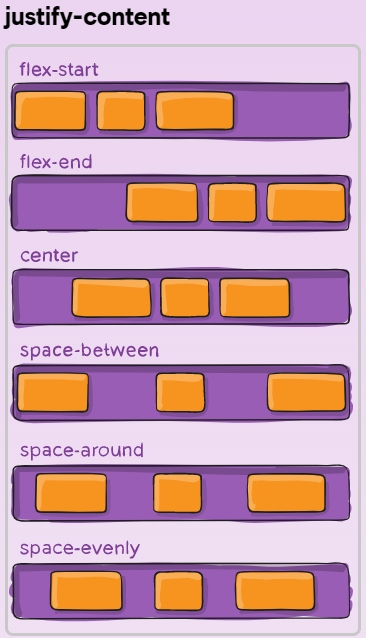

```
.container {
justify-content: flex-start | flex-end | center | space-between | space-around | space-evenly ; }
```

<br />

#### (6) align-items

- 현재 라인의 교차 축을 따라 플렉스 항목이 배치되는 방식을 선언한다.

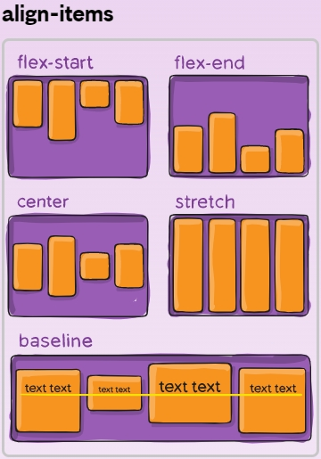

```
.container {
align-items: stretch | flex-start | flex-end | center | baseline ;
}
```

<br />

#### (7) align-content

- justify-content가 기본 축 내에서 개별 항목을 정렬하는 방법과 비슷하게 교차 축에 추가 공간이 있을 때 플렉스 컨테이너의 라인을 정렬한다.

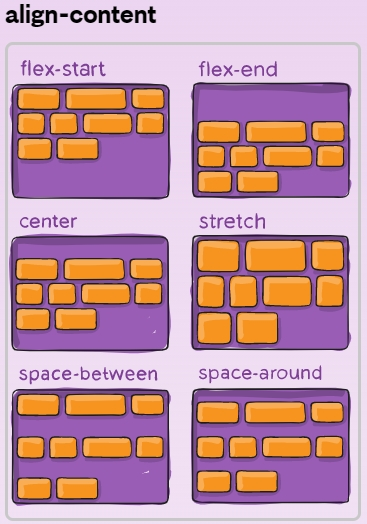

```
.container {
align-content: flex-start | flex-end | center | space-between | space-around | space-evenly | stretch ;
}
```

<br />

### 2. 실습 - container 속성

#### (1) html

```javascript
<!DOCTYPE html>
<html>
    <head>
        <meta charset="utf-8">
        <meta name="viewport" content="width=device-width">
        <title>JS Bin</title>
    </head>
    <body>
        <!--div.container>div.item.item${$}*10 -->
        <div class="container">
            <div class="item item1">1</div>
            <div class="item item2">2</div>
            <div class="item item3">3</div>
            <div class="item item4">4</div>
            <div class="item item5">5</div>
            <div class="item item6">6</div>
            <div class="item item7">7</div>
            <div class="item item8">8</div>
            <div class="item item9">9</div>
            <div class="item item10">10</div>
        !-- <div class="item item1">1</div>
            <div class="item item2">2</div>
            <div class="item item3">3</div>
            <div class="item item4">4</div>
            <div class="item item5">5</div>
            <div class="item item6">6</div>
            <div class="item item7">7</div>
            <div class="item item8">8</div>
            <div class="item item9">9</div>
            <div class="item item10">10</div> -->
        /div>
    </body>
</html>
```

<br />

#### (2) css

```javascript
//.container의 부모
body,html {
    height:100%;
}

.container {
    background: beige;
    height:100%; // 부모 높이의 100% 채운다는 의미
}

// 100vh : 부모(body,html)와 상관없이 뷰의 100% height를 다쓴다는 의미
.container {
    background: beige;
    height:100vh;
    display : flex; // flexbox 시작을 나타냄 아이템 가로 출력(flex-direction:row :기본값)
    flex-direction: row;
    // flex-direction: column;
    // flex-direction: row-reverse;
    // flex-direction: column-reverse;
    // 실습시 item 추가한다.
    // 한줄에 다보여줌 , 화면 넓이줄이도 한줄에 보임
    // 기본값
    // flex-wrap:nowrap;
    // 여러줄로 보임
    flex-wrap:wrap;

    // flex-flow:column nowrap;
    // 아이템 배치- item 줄이고 실습 몇몇 브라우저에서 실행안됨
    // justify-content : flex-start ;
    // justify-content : space-around;
    // 균등하게 간격을 만듬
    // justify-content : space-evenly;
    // justify-content : space-between;
}

.item {
    width:40px;
    height:40px;
    border: 1px solid black;
}

.item1 {
    background:#ef9a9a;
}
.item2 {
    background:#f48fb1;
}
.item3 {
    background:#ce93d8;
}
.item4 {
    background:#b39ddb;
}
.item5 {
    background:#90caf9;
}
.item6 {
    background:#a5d6a7;
}
.item7 {
    background:#e6ee9c;
}
.item8 {
    background:#fff59d;
}
.item9 {
    background:#ffcc80;
}
.item10 {
    background:#ffab91;
}
```

<br />

#### (3) output

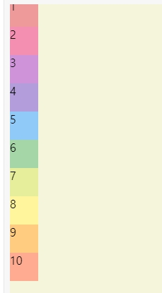

<br />

## 3. flex items

- `자식(항목)에 적용`되는 속성이다.
- 실습시 item은 3개만 남겨놓는다. container display:flex,padding-top:100px로 설정한다.

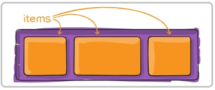

#### (1) order

- 기본적으로 플렉스 항목은 소스 순서로 배치된다. 그러나 order 속성은 플렉스 컨테이너에 나타나는 순서를 변경한다. (많이 사용되지 않음)

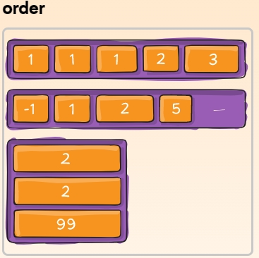

```javascript
.item1{
    order: 3; // default is 0
}

.item2{
    order: 1; // default is 0
}

.item3{
    order: 2; // default is 0
}
```

<br />

#### (2) flex-grow

- 플렉스 컨테이너가 커질때 항목의 설정값에 따라 늘어나는 크기를 설정한다.

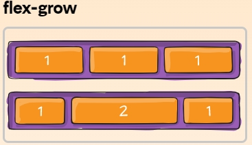

```javascript
.item1 {
    flex-grow: 1; // default 0
}
.item2 {
    flex-grow: 2; // default 0, 컨테이너가 커질때 다른 항목에 비해 2배로 커진다.
}
.item3 {
    flex-grow: 1; // default 0
}
```

<br />

#### (3) flex-shrink

- 플렉스 컨테이너가 줄어들때 항목의 설정값에 따라 축소되는 크기를 설정한다.

```javascript
.item1 {
    flex-shrink: 2; // default 1, 컨테이너가 줄어들때 항목2,3에 비해 2배로 줄어든다.
}
.item2 {
    flex-shrink: 1; // default 1
}
.item3 {
    flex-shrink: 1; // default 1
}
```

<br />

#### (4) flex-basis

- 아이템들이 공간을 얼마나 차지해야 되는지 조금 더 세부적으로 명시할 수있게한다.
- auto으로 설정하면 flex-grow,flex-shirnk값에 따라 공간이 분배된다.

```javascript
.item1 {
    flex-basis: 60%;
}

.item2 {
    flex-basis: 30%; // default auto
}

.item1 {
    flex-basis: 10%; // default auto
}
```

<br />

#### (5) flex

- lex-grow, flex-shrink 및 flex-basis가 결합된 설정이다.
- 두 번째 및 세 번째 매개변수(flex-shrink 및 flex-basis)는 선택 사항이며, 기본값은 0 1 auto 이다.

```javascript
.item1 {
    flex: 2 2 auto;
}
```

<br />

#### (6) align-self

- container 설정과 무관하게 개별 플렉스 항목에 대해 기본 정렬(또는 align-items로 지정된 정렬)을 재정의할 수 있다.

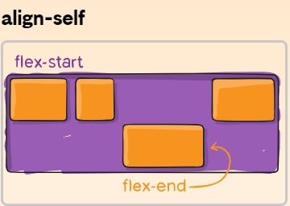

```javascript
.item1 {
    align-self: center;
}
```

<br />

### 4. 실습 - item 속성

#### (1) html

```javascript
<!DOCTYPE html>
<html>
    <head>
        <meta charset="utf-8">
        <meta name="viewport" content="width=device-width">
        <title>JS Bin</title>
    </head>

    <body>
        <div class="container">
            <div class="item item1">1</div>
            <div class="item item2">2</div>
            <div class="item item3">3</div>
        </div>
    </body>
</html>
```

<br />

#### (2) css

```javascript
.container {
    padding-top:100px;
    background: beige;
    height:100vh;
    display : flex;
}

.item {
    width:40px;
    height:40px;
    border: 1px solid black;
}

.item1 {
    background:#ef9a9a;

    flex-grow: 2;
    flex-shrink: 2;

    // flex-basis: 30%; // default auto
    // flex: 2 2 auto;
    align-self: center; // 개별 정렬됨
}
.item2 {
    background:#f48fb1;
    flex-grow: 1;
    flex-shrink: 1;
    // flex-basis: 60%;
}
.item3 {
    background:#ce93d8;
    flex-grow: 1;
    flex-shrink: 1;
    // flex-basis: 10%;
}
```

<br />

#### (3) output

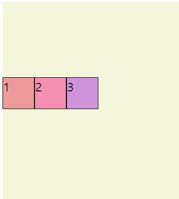

<br />

> ※ FlexBox Froggy (연습사이트)

- https://flexboxfroggy.com/#ko
