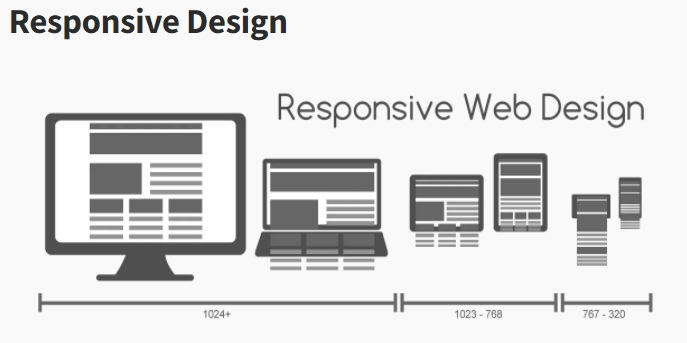
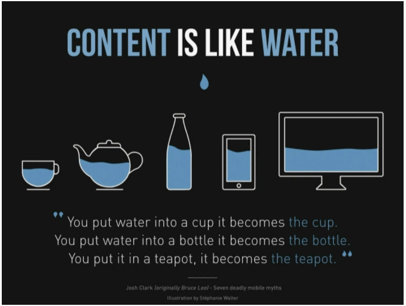

# 반응형 웹디자인, 반응형 CSS Units, em, rem

## 반응형 웹( Responsive Web)

- https://developer.mozilla.org/en-US/docs/Learn/CSS/CSS_layout/Responsive_Design
- https://developer.mozilla.org/ko/docs/Learn/CSS/CSS_layout/Responsive_Design

- 사용자의 웹사이트 이용이 데스크답, 태블릿, 모바일등으로 다양해지면서 `웹페이지가 여러 크기의 스크린에서 내용이 보여지기 위해서 반응형 웹 디자인이 중요`하다.



- 콘텐츠를 물과 같이 만들어야 `유동적`으로 만들어진 콘텐츠가 `어떤 모양의 컨테이너든 상관없이 잘 맞게 보여`질 수 있다 (Content is like water)



- 유동적 layout을 위해서 `flex grid, flex box, %, vw, vh등을 사용`한다.
- CSS `Media Queries`를 이용하면 모바일, 태블릿, 데스크탑 등에서 자유롭게 layout을 바꿀수 있다.

```javascript
//적어도 스크린이 800px이상이면 container의 width를 50%로 해줘라
@media screen and (min-width: 800px){
    .container {
        width : 50%;
    }
}
```

- https://developer.mozilla.org/en-US/docs/Learn/CSS/CSS_layout/Media_queries
- https://developer.mozilla.org/en-US/docs/Web/CSS/Media_Queries/Using_media_queries

- 반응형 웹 페이지: GitHub, https://klientboost.com/

<br />

## 반응형 CSS Units

- size를 결정하는 유닛은 절대적인(absolute) 과 상대적인(relative) 값으로 나눌 수 있다.
- 절대적인 값을 나타내는 유닉은 px이다. px은 컨텐츠의 크기가 변경되더라도 콘텐츠는 고정된다.
- 유동적인 콘텐츠를 나타내기 위해선 % 로 사이즈를 표현해야 한다.
- px은 모니터 위에서 화면에 나타낼 수 있는 가장 작은 단위이다.
- 브라우저는 기본적으로 16px로 지정된다.

`※ px -> em/ em -> px 변환계산 참조 사이트 :` http://pxtoem.com/

<br />

### 1. 상대적인 값을 가타내는 Units

#### (1) em

- `폰트사이즈 단위`이다.
- 폰트 패밀리에 상관없이 `고정된 폰트 사이즈`를 가진다.
- `1em == 16px`
- em은 부모의 폰트 사이즈의 상대적으로 크기가 계산된다.
- parent 안에 child가 있을 경우 이다.

```javascript
.parent {
    font-size : 8em; // 16px _ 8 = 128 px/ == 800%,
}

.child {
    font-size : 0.5em; // 128px(부모) _ 0.5 = 64px/ == 50%
}
```

<br />

#### (2) rem

- `root에 지정된 폰트 사이즈`에 따라 크기가 결정된다.
- parent 안에 child가 있을 경우 이다.
- parent는 root html 기본 폰트 사이즈 16px과 8배가 곱해진다.
- child도 root html 기본 폰트 사이즈 16px에 0.5배 곱해진다.

```javascript
.parent {
    font-size : 8rem; // 16px _ 8 = 128 px
}

.child {
    font-size : 0.5rem; // 16px(root) _ 0.5 = 8px
}
```

<br />

#### (3) vw

- `viewport width(브라우저 너비)의 크기`를 나타낸다.
- `100vw`는 viewport width 크기를 `다` 사용
- `50vw`는 viewport width 크기의 `반`을 사용

<br />

#### (4) vh

- `viewport heigtt(브라우저의 높이)의 크기`를 나타낸다.
- 100vh 는 viewport height 크기를 다 사용
- 50vh는 viewport height 크기를 반을 사용

<br />

#### (5) vmin

- viewport의 withd와 height의 작은 값을 사용
- 50vmin은 브라우저의 높이보다 너비가 작기 때문에 너비의 50 % 크기 값이 지정된다.

<br />

#### (6) vmax

- viewport의 width와 height의 큰값을 사용
- 50vmax는 브라우저의 높이가 너비보다 크기 때문에 높의 50% 크기 값이 지정된다.

<br />

#### (7) %

- 부모 요소에 상대적으로 크기가 계산되어진다.
- em대신에 %로 대신 지정할 수 있다.

<br />

## em/rem

### 1. em과 rem 나누어 사용하는 기준

- 부모 요소의 사이즈에 따라서 사이즈가 변경이 되면 `%나 em을 사용`한다.
- 부모와 상관없이 브라우저 사이즈에 반응해야 한다면 `뷰포트(v*)와 rem을 사용`한다.

- 요소의 너비와 높이에 따라서 사이즈가 변경되야 한다면 `%나 뷰포트(v*)을 사용`한다.
- font 사이즈에 따라서 사이즈가 변경되야 한다면 `em과 rem을 사용`한다.

<br />

#### (1) rem/em 차이

- rem : 좋아요 버튼은 root요소에서나 header(부모) 요소나 `크기가 동일`하게 보여진다.
- em : 좋아여 버튼은 root요소에서와 header(부모) 요소에서 `다르게 보여`진다. em은 부모 크기에 상대적으로 계산되기 때문이다.

> em_tree.html

```javascript
<!DOCTYPE html>
<html lang="en">
    <head>
        <meta charset="UTF-8" />
        <meta name="viewport" content="width=device-width, initial-scale=1.0" />
        <title>em tree</title>
        <link rel="stylesheet" href="em_tree.css" />
    </head>

    <body>
        <div class="level1">
            <h1>level 1</h1>
            <div class="level2">
                <h1>level 2</h1>
                <div class="level3">
                    <h1>level 3</h1>
                    <div class="level4">
                        <h1>level 4</h1>
                    </div>
                </div>
            </div>
        </div>
    </body>
</html>
```

<br />

```javascript
.level1 {
    font-size: 2em;
}

.level2 {
    font-size: 2em;
}

.level3 {
    font-size: 2em;
}

.level4 {
    font-size: 2em;
}
```

<br />

> rem_tree.html

- em_tree.html에서 <link> 요소만 수정한다.

```
<link rel="stylesheet" href="rem_tree.css" />
```

<br />

```javascript
.level1 {
    font-size: 2rem;
}

.level2 {
    font-size: 2rem;
}

.level3 {
    font-size: 2rem;
}

.level4 {
    font-size: 2rem;
}
```

<br />

#### (2) em을 이용한 반응형 콘텐츠

```javascript
<!DOCTYPE html>
<html lang="en">
    <head>
        <meta charset="UTF-8" />
        <meta name="viewport" content="width=device-width, initial-scale=1.0" />
        <title>em vs rem</title>
        <link rel="stylesheet" href="em_demo.css" />
    </head>

    <body>
        <h1>Hello, Responsive coders ?</h1>
    </body>
</html>
```

<br />

```javascript
h1 {
    display: inline-block;
    font-size: 5em;
    background-color: mediumaquamarine;
    padding: 1em;
}

@media screen and (max-width: 780px) {
    h1 {
        font-size: 3em;
    }
}

@media screen and (max-width: 680px) {
    h1 {
        font-size: 1.5em;
    }
}
```

<br />

#### (3) em/rem을 이용한 반응형 콘텐츠

```javascript
<!DOCTYPE html>
<html lang="en">
    <head>
        <meta charset="UTF-8" />
        <meta name="viewport"   content="width=device-width, initial-scale=1.0" / >
        <title>em vs rem</title>
        <link rel="stylesheet" href="rem_demo.css" />
    </head>

    <body>
        <section class="component">
            <header class="title">Master Front-end ?</header>
            <p class="contents">
                Lorem ipsum dolor sit amet consectetur, adipisicing elit. Sapiente veniam, nulla porro distinctio aliquid, quos quidem odio consectetur aperiam, delectus cum. Deserunt facilis excepturi similique natus minus deleniti rem sit?
            </p>
        </section>
    </body>
</html>
```

<br />

```javascript
.component {
    width: 50%;
    border: 1px solid burlywood;
    font-size: 2rem;
}

.title {
    padding: 0.5em 0.5rem;
    background-color: burlywood;
}

.contents {
    font-size: 1rem;
    padding: 0.5em 0.5rem;
}

@media screen and (max-width: 780px) {
    .component {
        font-size: 1.5rem;
    }
}
```

<br />

#### (4) em/rem을 이용한 반응형 콘텐츠 2

```javascript
<!DOCTYPE html>
<html lang="en">
    <head>
    <meta charset="UTF-8" />
    <meta name="viewport" content="width=device-width, initial-scale=1.0" />
    <title>Responsive ??</title>
    <link rel="stylesheet" href="responsive.css" />
    </head>

    <body>
        <h1 class="logo">Responsive Coding</h1>
        <div class="container">
            <section class="component">
                <header class="title">Master Front-end ?</header>
                <p class="contents">
                    Lorem ipsum dolor sit amet consectetur, adipisicing elit. Sapiente veniam, nulla porro distinctio aliquid, quos quidem odio consectetur aperiam, delectus cum. Deserunt facilis excepturi similique natus minus deleniti rem sit?
                </p>
            </section>
            <section class="component">
                <header class="title">Career Growth ?</header>
                <p class="contents">
                    Lorem ipsum dolor sit amet consectetur, adipisicing elit. Sapiente veniam, nulla porro distinctio aliquid, quos quidem odio consectetur aperiam, delectus cum. Deserunt facilis excepturi similique natus minus deleniti rem sit?
                </p>
            </section>
        </div>
    </body>
</html>
```

<br />

```javascript
h1 {
    font-size: 1.75rem;
    color: burlywood;
    margin: auto;
    text-align: center;
}

.container {
    display: flex;
    padding: 2em;
}

.component {
    border: 1px solid burlywood;
    margin: 1em;
}

.title {
    font-size: 1.5rem; // 제목의 크기가 동일
    padding: 1em;
    background-color: burlywood;
}

.contents {
    font-size: 1.125rem;
    padding: 1em;
}

// 폰트크기에 따라 변경되는 스크린 너비를 반응형으로 작성
@media screen and (max-width: 48rem) {
    .container {
        flex-direction: column;
    }
}
```
