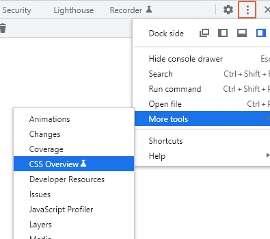

# 반응형 헤더 실습, 크롬브라우저 개발툴

## 반응형 헤더 실습


- 웹페이지 `해더의 메뉴바 부분`을 `반응형으로 만들기`
- Font Awesome의 아이콘 사용
- google Font의 폰트 사용
- `스크린의 크기가 변경`될때 `헤더의 메뉴바 모양이 변경`된다.

<br />

### 1. Font Awesome의 아이콘 사용

- https://fontawesome.com/
- Start for Free -> 이메일 입력 후 -> Send Kit Code 클릭
- 메일 확인하여 연결 링크 클릭하여 스크립트 복사하여 사용한다.
-

```javascript
<script
  src='https://kit.fontawesome.com/*******.js'
  crossorigin='anonymous'
></script>
```

- Free 및 Open Source Icons 선택한다.


- 원하는 아이콘을 찾아 선택 후 코드를 복사하여 사용한다.


<br />

### 2. 구글 폰트 사용

- https://fonts.google.com/ 에서 원하는 폰트 검색한다. (예: Source Sans Pro)
- 검색된 폰트 클릭한다. 다양한 Style을 선택한다.
- 파업창으로 Selected families 나오면 <link href='.....' rel='stylesheet'> 를 복사하여 사용한다.

```javascript
<link href="https://fonts.googleapis.com/css2?family=Roboto:wght@100&family=Source+Sans+Pro:wght@300&display=swap" rel="stylesheet">
```

<br />

### 3. 코딩 하기

- flex box 사용
- css 변수사용
- javascript에서 이벤트 사용

> index.html

```javascript
<!DOCTYPE html>
<html lang="en">
<head>
    <meta charset="UTF-8">
    <meta http-equiv="X-UA-Compatible" content="IE=edge">
    <meta name="viewport" content="width=device-width, initial-scale=1.0">
    <title>Nav bar</title>
    <link rel="stylesheet" href="style.css">
    <link href="https://fonts.googleapis.com/css2?family=Roboto:wght@100&family=Source+Sans+Pro:wght@300&display=swap" rel="stylesheet">
    <script src="https://kit.fontawesome.com/*****.js" crossorigin="anonymous"></script>
    <script src="main.js" defer></script>
</head>

<body>
    <nav class="navbar">
        <div class="navbar__log">
            <i class="fa-solid fa-cat"></i>
            <a href="#">ResponsiveCoding</a>
        </div>
        <ul class="navbar__menu">
            <li><a href="">Home</a></li>
            <li><a href="">Gallery</a></li>
            <li><a href="">Weddings</a></li>
            <li><a href="">FAQ</a></li>
            <li><a href="">Bookings</a></li>
        </ul>
        <ul class="navbar__icons">
            <li><i class="fa-brands fa-twitter"></i></li>
            <li><i class="fa-brands fa-facebook-f"></i></li>
        </ul>

        <a href="#" class="navbar__toggleBtn">
            <i class="fa-solid fa-bars"></i>

        </a>
    </nav>
</body>
</html>
```

> style.css

```javascript
:root {
    --text-color: #f0f4f5;
    --backround-color: #263343;
    --accent-color: #d49466;
}

body {
    margin: 0;
    font-family: 'Source Sans Pro';
}
a {
    text-decoration: none;
    color: var(--text-color);
}
.n  bar {
    splay: flex;
    stify-content: space-between;
    ign-items: center;
    ckground-color: var(--backround-color);
    dding: 8px 12px;
}

.navbar__log {
    font-size: 24px;
    color: var(--text-color);
}

.navbar__log i {
    color: var(--accent-color);
}

.navbar__menu {
    display: flex;
    list-style: none;
    padding-left: 0;
}

.navbar__menu li {
    padding: 8px 12px;
}

.navbar__menu li:hover {
    background-color: var(--accent-color);
    border-radius: 4px;
}
.navbar__icons {
    list-style: none;
    color: var(--text-color);
    display: flex;
    padding-left: 0;
}

.navbar__icons li {
    padding: 8px 12px;
}

.navbar__toggleBtn {
    display: none;
    position: absolute;
    right: 32px;
    font-size: 24px;
    color: var(--accent-color);
}

@media screen and (max-width: 768px) {
    .navbar {
        flex-direction: column;
        align-items: flex-start;
        padding: 8px 24px;
    }
    .navbar__menu {
        display: none;
        flex-direction: column;
        align-items: center;
        width: 100%;
    }
    .navbar__menu li {
        width: 100%;
        xtext-align: center;
    }
    .navbar__icons {
        display: none;
        justify-content: center;
        width: 100%;
    }
    .navbar__toggleBtn {
        display: block;
    }
    .navbar__menu.active,
    .navbar__icons.active {
        display: flex;
    }
}
```

> main.js

```javascript
const toggleBtn = document.querySelector('.navbar__toggleBtn');
const menu = document.querySelector('.navbar__menu');
const icons = document.querySelector('.navbar__icons');

toggleBtn.addEventListener('click', () => {
  menu.classList.toggle('active');
  icons.classList.toggle('active');
});
```

<br />

## 크롬브라우저 웹 개발툴

- responsive.html,responsive.css를 jsbin에서 실행한다.
- output 오른쪽 화살표를 클릭하여 크롬 브라우저로 결과를 출력한다.
- `CTR +SHIFT + i`를 클릭하여 크롬의 개발자 도구를 연다.

### 1. CSS Overview

- 메뉴에서 CSS Overview -> Capture Overview 선택 한다.
- 현재 웹페이지의 CSS 내용을 확인할 수 있다.
- CSS Overview 메뉴가 없을시 아래처러 추가한다.




<br />

### 2. Shadow Editor

- Shadow를 잘 표현 하면 웹사이트를 좀더 입체적으로 멋있게 표현할 수 있다.
- 크롬 개발툴에서 Shadow Editor를 사용할 수 있다.
- Shadow를 사용하기 위한 요소를 Elements tab에서 선택한다.
- element.style 에 box-shadow 를 입력한다.

```javascript
element.style {
    box-shadow : 4px 4px #000000aa
}
```

- box-shadow 의 값 앞에 작은 아이콘을 클릭하여 Shadow를 조절할 수 있다.


<br />

### 3. Font Editor

- 개발자 도구 -> 톱니바뀌(Settings) -> Experiments -> Enable new Font Editor tool ....... 선택한다.


- 개발자 도구 -> Styles 의 font 부분에 AA 선택한다.


<br />

### 4. Flexbox Editor

- jsbin에서 반응형 헤더 index.html, style.css을 실행시킨다.
- output을 크롬으로 실행하고 개발자 모드(ctl+shift+i)를 연다.
- Elements의 소스에서 flex 아이콘을 선택하고 Styles에서 사각형 아이콘을 클릭하여 flex의 내용을 수정한다.


