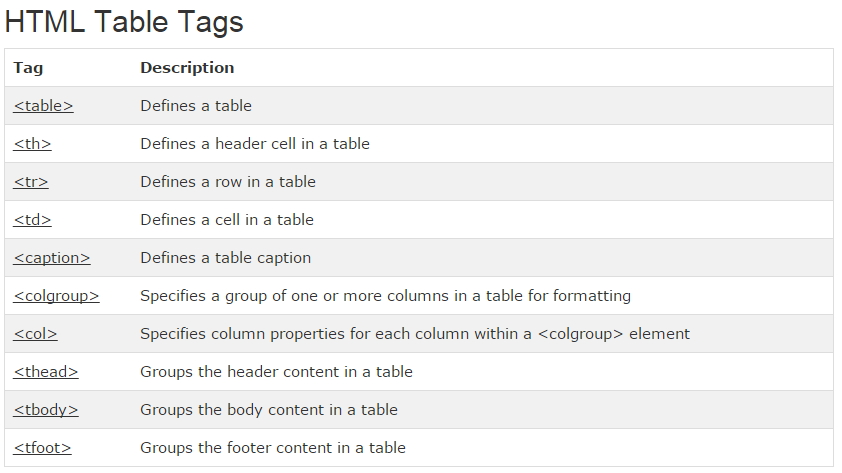

# HTML Tables



## 1. <table> 의 border 속성 적용


<br />

```javascript
<!DOCTYPE html>
<html>
    <body>
        <table border="1" style="width:100%">
            <tr>
                <td>Jill</td>
                <td>Smith</td>
                <td>50</td>
            </tr>
            <tr>
                <td>Eve</td>
                <td>Jackson</td>
                <td>94</td>
            </tr>
            <tr>
                <td>John</td>
                <td>Doe</td>
                <td>80</td>
            </tr>
        </table>
    </body>
</html>
```

```javascript
<!DOCTYPE html>
<html>
    <head>
    <style>
        table, th, td {
            border: 1px solid black;
        }
    </style>
    </head>

    <body>
        <table style="width:100%">
            <tr>
                <td>Jill</td>
                <td>Smith</td>
                <td>50</td>
            </tr>
            <tr>
                <td>Eve</td>
                <td>Jackson</td>
                <td>94</td>
            </tr>
            <tr>
                <td>John</td>
                <td>Doe</td>
                <td>80</td>
            </tr>
        </table>
    </body>
</html>
```

<br />

## 2. border-collapse: collapse;


```javascript
<!DOCTYPE html>
<html>
    <head>
    <style>
        able, th, td {
           border: 1px solid black;
           border-collapse: collapse;
    </style>
    </head>

    <body>
        <table style="width:100%">
            <tr>
                <td>Jill</td>
                <td>Smith</td>
                <td>50</td>
            </tr>
            <tr>
                <td>Eve</td>
                <td>Jackson</td>
                <td>94</td>
            </tr>
            <tr>
                <td>John</td>
                <td>Doe</td>
                <td>80</td>
            </tr>
        </table>
    </body>
</html>
```

<br />

## 3. `<TH>` tag


```javascript
<!DOCTYPE html>
<html>
    <head>
    <style>
        table, th, td {
            border: 1px solid black;
            border-collapse: collapse;
        }
        th, td {
            padding: 5px;
        }
    </style>
    </head>

    <body>
        <table style="width:100%">
            <tr>
                <th>Firstname</th>
                <th>Lastname</th>
                <th>Points</th>
            </tr>
            <tr>
                <td>Jill</td>
                <td>Smith</td>
                <td>50</td>
            </tr>
            <tr>
                <td>Eve</td>
                <td>Jackson</td>
                <td>94</td>
            </tr>
            <tr>
                <td>John</td>
                <td>Doe</td>
                <td>80</td>
            </tr>
        </table>
    </body>
</html>
```

<br />

## 4. colgroup, col


```javascript
<!DOCTYPE html>
<html>
    <head>
    <style>
        table, th, td {
            border: 1px solid black;
        }
    </style>
    </head>

    <body>
        <table>
            <colgroup>
                <col span="2"   style="background-color:red">
                <col style="background-color:yellow">
            </colgroup>
            <tr>
                <th>ISBN</th>
                <th>Title</th>
                <th>Price</th>
            </tr>
            <tr>
                <td>3476896</td>
                <td>My first HTML</td>
                <td>$53</td>
            </tr>
            <tr>
                <td>5869207</td>
                <td>My first CSS</td>
                <td>$49</td>
            </tr>
        </table>
    </body>
</html>
```

<br />

## 5. Cell Padding


```javascript
<!DOCTYPE html>
<html>
    <head>
    <style>
        table, th, td {
            border: 1px solid black;
            border-collapse: collapse;
        }
        th, td {
            padding: 15px;
        }
    </style>
    </head>

    <body>
        <table style="width:100%">
            <tr>
                <td>Jill</td>
                <td>Smith</td>
                <td>50</td>
            </tr>
            <tr>
                <td>Eve</td>
                <td>Jackson</td>
                <td>94</td>
            </tr>
            <tr>
                <td>John</td>
                <td>Doe</td>
                <td>80</td>
            </tr>
        </table>

        <p>Try to change the padding to 5px.</p>
    </body>
</html>
```

<br />

## 6. border-spacing


```javascript
<!DOCTYPE html>
<html>
    <head>
    <style>
        table, th, td {
            border: 1px solid black;
            padding: 5px;
        }
        table {
            border-spacing: 15px;
        }
    </style>
    </head>

    <body>
        <table style="width:100%">
            <tr>
                <td>Jill</td>
                <td>Smith</td>
                <td>50</td>
            </tr>
            <tr>
                <td>Eve</td>
                <td>Jackson</td>
                <td>94</td>
            </tr>
            <tr>
                <td>John</td>
                <td>Doe</td>
                <td>80</td>
            </tr>
        </table>

        <p>Try to change the border-spacing to 5px.</p>
    </body>
</html>
```

<br />

## 7. colspan, rowspan


```javascript
<!DOCTYPE html>
<html>
    <head>
    <style>
        table, th, td {
            border: 1px solid black;
            border-collapse: collapse;
        }
        th, td {
            padding: 5px;
            text-align: left;
        }
    </style>
    </head>

    <body>
        <h2>Cell that spans two columns:</h2>
        <table style="width:100%">
            <tr>
                <th>Name</th>
                <th colspan="2">Telephone</th>
            </tr>
            <tr>
                <td>Bill Gates</td>
                <td>555 77 854</td>
                <td>555 77 855</td>
            </tr>
        </table>
    </body>
</html>
```

<br />


```javascript
<!DOCTYPE html>
<html>
    <head>
    <style>
        table, th, td {
            border: 1px solid black;
            border-collapse: collapse;
        }
        th, td {
            padding: 5px;
            text-align: left;
        }
    </style>
    </head>

    <body>
        <h2>Cell that spans two rows:</h2>
        <table style="width:100%">
            <tr>
                <th>Name:</th>
                <td>Bill Gates</td>
            </tr>
            <tr>
                <th rowspan="2">Telephone:</th>
                <td>555 77 854</td>
            </tr>
            <tr>
                <td>555 77 855</td>
            </tr>
        </table>
    </body>
</html>
```

<br />

## 8. CSS를 적용한 Table


```javascript
<!DOCTYPE html>
<html>
    <head>
    <style>
        table, th, td {
            border: 1px solid black;
            border-collapse: collapse;
        }
        th, td {
            padding: 5px;
            text-align: left;
        }
        table#t01 {
            width: 100%;
            background-color: #f1f1c1;
        }
    </style>
    </head>

    <body>
        <table style="width:100%">
            <tr>
                <th>First Name</th>
                <th>Last Name</th>
                <th>Points</th>
            </tr>
            <tr>
                <td>Jill</td>
                <td>Smith</td>
                <td>50</td>
            </tr>
            <tr>
                <td>Eve</td>
                <td>Jackson</td>
                <td>94</td>
            </tr>
            <tr>
                <td>John</td>
                <td>Doe</td>
                <td>80</td>
            </tr>
        </table>

        <br>

        <table id="t01">
            <tr>
                <th>First Name</th>
                <th>Last Name</th>
                <th>Points</th>
            </tr>
            <tr>
                <td>Jill</td>
                <td>Smith</td>
                <td>50</td>
            </tr>
            <tr>
                <td>Eve</td>
                <td>Jackson</td>
                <td>94</td>
            </tr>
            <tr>
                <td>John</td>
                <td>Doe</td>
                <td>80</td>
            </tr>
        </table>
    </body>
</html>
```

<br />


```javascript
<!DOCTYPE html>
<html>
    <head>
    <style>
        table {
            width:100%;
        }
        table, th, td {
            border: 1px solid black;
            border-collapse: collapse;
        }
        th, td {
            padding: 5px;
            text-align: left;
        }
        table#t01 tr:nth-child(even) {
            background-color: #eee;
        }
        table#t01 tr:nth-child(odd) {
           background-color:#fff;
        }
        table#t01 th {
            background-color: black;
            color: white;
        }
    </style>
    </head>

    <body>
        <table>
            <tr>
                <th>First Name</th>
                <th>Last Name</th>
                <th>Points</th>
            </tr>
            <tr>
                <td>Jill</td>
                <td>Smith</td>
                <td>50</td>
            </tr>
            <tr>
                <td>Eve</td>
                <td>Jackson</td>
                <td>94</td>
            </tr>
            <tr>
                <td>John</td>
                <td>Doe</td>
                <td>80</td>
            </tr>
        </table>

        <br />

        <table id="t01">
            <tr>
                <th>First Name</th>
                <th>Last Name</th>
                <th>Points</th>
            </tr>
            <tr>
                <td>Jill</td>
                <td>Smith</td>
                <td>50</td>
            </tr>
            <tr>
                <td>Eve</td>
                <td>Jackson</td>
                <td>94</td>
            </tr>
            <tr>
                <td>John</td>
                <td>Doe</td>
                <td>80</td>
            </tr>
        </table>
    </body>
</html>
```
