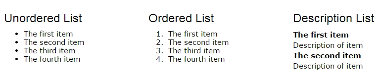
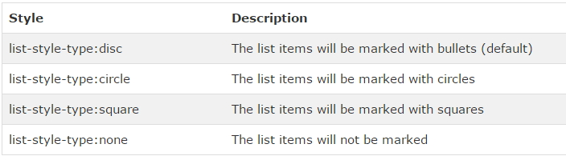
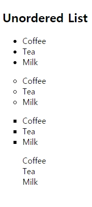
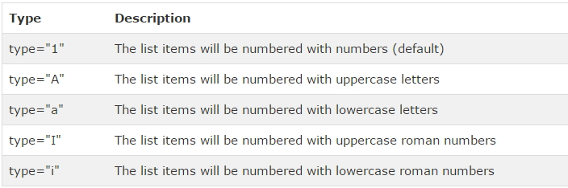
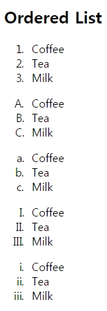
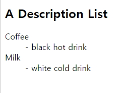
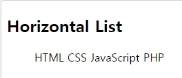
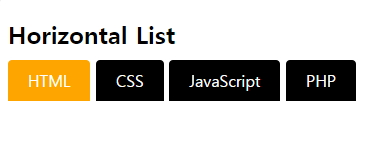

# HTML Lists

## HTML Lists



```javascript
<!DOCTYPE html>
<html>
    <head>
        <meta charset="utf-8">
        <meta name="viewport"   content="width=device-width">
        <title>JS Bin</title>
    </head>
    <body>
        <!-- ol, ul, li  ol>li*3 + tab key -->
        <ol type='i' reversed>
            <li>1</li>
            <li>2</li>
            <li>3</li>
        </ol>
        <ul>
            <li>hello</li>
            <li></li>
            <li></li>
        </ul>
    </body>
</html>
```

<br />

## 1. Unordered HTML Lists - The Style Attribute



- https://developer.mozilla.org/ko/docs/Web/HTML/Element/ul

```javascript
<!DOCTYPE html>
<html>
    <body>
        <h2>Unordered List with Disc Bullets</h2>

        <ul style="list-style-type:disc">
            <li>Coffee</li>
            <li>Tea</li>
            <li>Milk</li>
        </ul>

        <ul style="list-style-type:circle">
            <li>Coffee</li>
            <li>Tea</li>
            <li>Milk</li>
        </ul>

        <ul style="list-style-type:square">
            <li>Coffee</li>
            <li>Tea</li>
            <li>Milk</li>
        </ul>

        <ul style="list-style-type:none">
            <li>Coffee</li>
            <li>Tea</li>
            <li>Milk</li>
        </ul>
    </body>
</html>
```



<br />

## 2. Ordered HTML Lists - The Type Attribute



- https://developer.mozilla.org/ko/docs/Web/HTML/Element/ol

```javascript
<!DOCTYPE html>
<html>
    <body>
        <h2>Ordered List with Numbers</h2>

        <ol type="1">
          <li>Coffee</li>
          <li>Tea</li>
          <li>Milk</li>
        </ol>

        <ol type="A">
          <li>Coffee</li>
          <li>Tea</li>
          <li>Milk</li>
        </ol>

        <ol type="a">
          <li>Coffee</li>
          <li>Tea</li>
          <li>Milk</li>
        </ol>

        <ol type="I">
          <li>Coffee</li>
          <li>Tea</li>
          <li>Milk</li>
        </ol>

        <ol type="i">
          <li>Coffee</li>
          <li>Tea</li>
          <li>Milk</li>
        </ol>
    </body>
</html>
```



<br />

## 3. HTML Description Lists

- `<dl>` tag defines a description list.
- `<dt>` tag defines the term (name)
- `<dd>` tag defines the data (description).

```javascript
<!DOCTYPE html>
<html>
    <body>
    <h2>A Description List</h2>

    <dl>
        <dt>Coffee</dt>
        <dd>- black hot drink</dd>
        <dt>Milk</dt>
        <dd>- white cold drink</dd>
    </dl>
    </body>
</html>
```



<br />

## 4. lists inside lists

```javascript
<!DOCTYPE html>
<html>
    <body>
        <h2>A Nested List</h2>

        <ul>
            <li>Coffee</li>
            <li>Tea
                <ul>
                    <li>Black tea</li>
                    <li>Green tea</li>
                </ul>
            </li>
            <li>Milk</li>
        </ul>
    </body>
</html>
```

<br />

## 5. Horizontal Lists



```javascript
<!DOCTYPE html>
<html>
    <head>
    <style>
        ul#menu li {
            display:inline;
        }
    </style>
    </head>

    <body>
        <h2>Horizontal List</h2>

        <ul id="menu">
            <li>HTML</li>
            <li>CSS</li>
            <li>JavaScript</li>
            <li>PHP</li>
        </ul>
    </body>
</html>
```

<br />



```javascript
<!DOCTYPE html>
<html>
    <head>
    <style>
        ul#menu {
            padding: 0;
        }

        ul#menu li {
            display: inline;
        }

        ul#menu li a {
            background-color: black;
            color: white;
            padding: 10px 20px;
            text-decoration: none;
            border-radius: 4px 4px 0 0;
        }

        ul#menu li a:hover {
            background-color: orange;
        }
    </style>
    </head>

    <body>
        <h2>Horizontal List</h2>

        <ul id="menu">
            <li>
               <a href="/html/default.asp">HTML</a>
            </li>
            <li>
               <a href="/css/default.asp">CSS</a>
            </li>
            <li>
               <a href="/js/default.asp">JavaScript</a>
            </li>
            <li>
               <a href="/php/default.asp">PHP</a>
            </li>
        </ul>
    </body>
</html>
```
