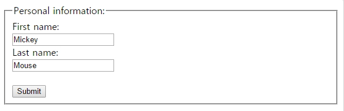

# HTML `Forms`

## HTML `Forms`

- `사용자의 입력 값을 모집`할 수 있다.
- `<form>` 요소로 선언한다.
- 다른 `type`의 `<input>`요소를 가진다. `checkboxes, radio buttons, submit buttons` 등
- https://developer.mozilla.org/ko/docs/Web/HTML/Element

<br />

### 1. `<form>`요소의 중요 속성

- `action` 속성 : 사용자가 입력한 값을 `server-side script`로 보내서 받을 수 있는 `webpage` 요청
- `method` 속성 : 사용자가 입력한 값을 `Server-Side Script`로 보낼때 `HTTP Method`를 설명한다

(GET or POST)

```
   GET  - 민감한 정보를 보내지 않고 페이지 요청시 사용함, 주소에 서브밋되는 정보가
            노출됨, 검색할 때 사용
   POST- 민감한 정보를 보내면서 페이지 요청시 사용함, 주소에 서브밋되는 정보가
            노출되지 않음. 서버에 자원 생성을 위해 사용
```

```
  <form action="action_page.jsp" method="GET">   이 경우 말고도 GET 방식의 페이지 요청은 많음

  <form action="action_page.jsp" method="POST"> 이 경우만 POST 방식의 페이지를 요청함
```

<br />

### 2.` Grouping Form Data with <fieldset>`

- `<fieldset>` 폼안에서 관련있는 data를 분류
- `<legend>` `<fieldset>`의 타이틀

```javascript
<!DOCTYPE html>
<html>
    <body>
        <form action="action_page.jsp">
        <fieldset>
        <legend>Personal information:</legend>
        First name:<br>
        <input type="text" name="firstname" value="Mickey">
        <br />
        Last name:<br>
        <input type="text" name="lastname" value="Mouse">
        <br><br>
        <input type="submit" value="Submit">
        </fieldset>
        </form>
    </body>
</html>
```



<br />

### 3. `<input>` 요소

- `checkbox, radio, button, submit`
- `input` tag는 `label`과 같이 사용되는 경우가 많다.

```javascript
<!DOCTYPE html>
<html>
    <head>
        <meta charset="utf-8">
        <meta name="viewport" content="width=device-width">
        <title>JS Bin</title>
    </head>
    <body>
        <!-- label input : inline-->
        <label for="i_name">name : </label>
        <input id='i_name'type='text'>
        <input id='i_name'type='button' value="확인">
        <button>확인2</button>
        <input id='i_name'type='checkbox'>체크
        <input id='i_name'type='color'>
        <input id='i_name'type='file'>
        <input id='i_name'type='password'>
    </body>
</html>
```

<br />

### 4. `<select>`-drop down, `<textarea>`, `<button>`
