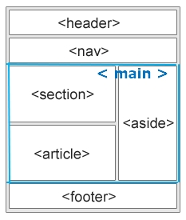

# Semantic tags

## Semantic tags

- `tag에 의미가 부여된 것`을 말한다.
- https://developer.mozilla.org/ko/docs/Glossary/Semantics

<br />

## 1. Semantic Elements

- 시멘틱 태그가 중요한 이유: `SEO` (Search Engine Optimization), `Accessibility`, 유지보수성

- non-semantic elements: `<div>` and `<span>` = 불분명한 내용 정의

- semantic elements: `<form>`, `<table>`, and `` = 분명한 내용 정의

- `<div id="nav">`, `<div class="header">`, or `<div id="footer">` 를 대신 하는 Semantic 요소



<br />

### (1) `<header>`

- 소개 및 탐색에 도움을 주는 콘텐츠를 나타낸다.
- 제목, 로고, 검색 폼, 작성자 이름 등의 요소도 포함할 수 있다.

> header.html

```javascript
<!DOCTYPE html>
<html>
    <head>
        <meta charset="utf-8">
        <meta name="viewport" content="width=device-width">
        <title>JS Bin</title>
        <style>
            header.page-header {
                background: no-repeat left/cover url(/html/beagles.jepg);
                display: flex;
                height: 120px;
                min-width: 120px;
                align-items: center;
                color: #fff;
                text-shadow: #000 0 0 .2em;
                }

            header.page-header > h1 {
                font: bold calc(1em + 2 * (100vw - 120px) / 100) 'Dancing  Script', cursive, fantasy;
                margin: 2%;
            }

            main {
                font: 1rem 'Fira Sans', sans-serif;
            }
        </style>
    </head>
    <body>
        <header class="page-header">
            <h1>Cute Puppies Express!</h1>
        </header>

        <main>
            <p>I love beagles <em>so</em> much! Like, really, a lot. They’re adorable and their ears are so, so snuggly soft!</p>
        </main>
    </body>
</html>
```

<br />

### (2) `<nav>`

- 문서의 부분 중 현재 페이지 내, `또는 다른 페이지로의 링크를 보여주는 구획`을 나타낸다.
- 자주 쓰이는 예제는 `메뉴, 목차, 색인`이다.
- `<header>`안에서 사용될 수 있다.
- https://developer.mozilla.org/ko/docs/Web/CSS/::after
- https://developer.mozilla.org/ko/docs/Web/CSS/::before

> nav.html

```javascript
<!DOCTYPE html>
<html>
<head>
  <meta charset="utf-8">
  <meta name="viewport" content="width=device-width">
  <title>JS Bin</title>
  <style>
  nav {
    border-bottom: 1px solid black;
  }

  .crumbs ol {
      list-style-type: none;
      padding-left: 0;
  }

  .crumb {
      display: inline-block;
  }

  .crumb a::after {
      display: inline-block;
      color: #000;
      content: '>';
      font-size: 80%;
      font-weight: bold;
      padding: 0 3px;
  }
  </style>
</head>
<body>
<nav class="crumbs">
    <ol>
        <li class="crumb"><a href="#">Bikes</a></li>
        <li class="crumb"><a href="#">BMX</a></li>
        <li class="crumb">Jump Bike 3000</li>
    </ol>
</nav>

<h1>Jump Bike 3000</h1>
<p>This BMX bike is a solid step into the pro world. It looks as legit as it rides and is built to polish your skills.</p>
</body>
</html>
```

<br />

### (3) `<footer>`

- 푸터는 일반적으로 웹페이지의 작성자, 저작권 정보, 관련 문서 등의 내용을 담는다.

> footer.html

```javascript
<!DOCTYPE html>
<html>
    <head>
        <meta charset="utf-8">
        <meta name="viewport"         content="width=device-width">
        <title>JS Bin</title>
        <style>
            article {
                min-height: 100%;
                display: grid;
                grid-template-rows: auto 1fr auto;
            }

            footer {
                display: flex;
                justify-content: center;
                padding: 5px;
                background-color: #45a1ff;
                color: #fff;
            }
        </style>
    </head>

    <body>
        <article>
            <h1>How to be a wizard</h1>
            <ol>
                <li>Grow a long, majestic beard.</li>
                <li>Wear a tall, pointed hat.</li>
                <li>Have I mentioned the beard?</li>
            </ol>
            <footer>
                <p>© 2018 Gandalf</p>
            </footer>
        </article>
    </body>
</html>
```

<br />

### (4) `<main>`

- 문서 `<body>`의 `주요 콘텐츠`를 나타낸다.
- 주요 콘텐츠 영역은 `문서의 핵심 주제`나 `앱의 핵심 기능에 직접적으로 연결`됐거나 확장하는 콘텐츠로 이루어진다.
- `<main>`안에 `<article>`, `<section>`, `<aside>`등 이 사용된다.

> main.html

```javascript
<!DOCTYPE html>
<html>
    <head>
        <meta charset="utf-8">
        <meta name="viewport" content="width=device-width">
        <title>JS Bin</title>
        <style>
            header {
                font: bold calc(.025 * (100vw)) 'Arial', sans-serif;
            }
        </style>
    </head>
    <body>
        <header>Gecko facts</header>

        <main>
            <p>Geckos are a group of usually small, usually nocturnal lizards. They are found on every continent except Australia.</p>

            <p>Many species of gecko have adhesive toe pads which   enable them to climb walls and even windows.</p>
        </main>
    </body>
</html>
```

<br />

### (5) `<article>`

- 문서, 페이지, 애플리케이션, 또는 `사이트 안에서 독립적으로 다른 내용과 구분`해서 보여줄 때 사용한다.
- 블로그 포스터에서 `포스터 하나, 매거진이나 뉴스의 기사 하나` 등을 나타낼때 사용한다.
- https://developer.mozilla.org/ko/docs/Web/CSS/background

> article.html

```javascript
<!DOCTYPE html>
<html>
    <head>
        <meta charset="utf-8">
        <meta name="viewport" content="width=device-width">
        <title>JS Bin</title>
        <style>
            .forecast {
                margin: 0;
                padding: .3rem;
                background-color: #eee;
                font: 1rem 'Fira Sans', sans-serif;
            }

            .forecast > h1,
            .day-forecast {
                margin: .5rem;
                padding: .3rem;
                font-size: 1.2rem;
            }

            .day-forecast {
                background: right/contain content-box border-box no-repeat url('/rain.svg') white;
            }

            .day-forecast > h2,
            .day-forecast > p {
                margin: .2rem;
                font-size: 1rem;
            }
      </style>
    </head>

    <body>
        <main>
            <article class="forecast">
                <h1>Weather forecast for Seattle</h1>
                <article class="day-forecast">
                    <h2>03 March 2018</h2>
                    <p>Rain.</p>
                </article>
                <article class="day-forecast">
                    <h2>04 March 2018</h2>
                    <p>Periods of rain.</p>
                </article>
                <article class="day-forecast">
                    <h2>05 March 2018</h2>
                    <p>Heavy rain.</p>
                </article>
            </article>
        </main>
    </body>
</html>
```

<br />

### (6) `<section>`

- `<main>`,`<article>`안에서 `연관있는 내용을 하나로 묶어`줄때 사용한다.
- 보통 `<section>`은 제목을 포함하지만, 항상 그런 것은 아니다.

> section.html

```javascript
<!DOCTYPE html>
<html>
    <body>
        <main>
        <section>
          <h1>WWF</h1>
          <>The World Wide Fund for Nature (WWF) is an international organization working  on issues  regarding the conservation, research and restoration of the environment, formerly named    the World  Wildlife Fund. WWF was founded in 1961.</ p>
        </section>

        <section>
          <h1>WWF's Panda symbol</h1>
          <p>The Panda has become the symbol of WWF. The well-known panda logo of WWF originated from a panda named Chi Chi that was transferred from the Beijing Zoo  to the London Zoo in the same year of the establishment of WWF.</p>
        </section>
        </main>
    </body>
</html>
```

<br />

> section2.html

```javascript
<!DOCTYPE html>
<html>
    <head>
        <meta charset="utf-8">
        <meta name="viewport" content="width=device-width">
        <title>JS Bin</title>
    </head>

    <body>
        <main>
            <h1>Choosing an Apple</h1>
            <section>
                <h2>Introduction</h2>
                <p>This document provides a guide to help with the important task of choosing the correct Apple.</p>
            </section>

            <section>
                <h2>Criteria</h2>
                <p>There are many different criteria to be considered when choosing an Apple — size, color, firmness, sweetness, tartness...</p>
            </section>
        </main>
    </body>
</html>
```

<br />

### (7) `<aside>`

- 문서의 주요 내용 외에 `부가적인 내용`을 주영역 주변에 배치.
- `문서의 주요 내용과 간접적으로만 연관된 부분`을 나타낸다.
- 주로 `사이드바` 혹은 `콜아웃 박스`로 표현한다.
- https://developer.mozilla.org/ko/docs/Web/CSS/box-shadow

> aside.html

```javascript
<!DOCTYPE html>
<html>
    <head>
        <meta charset="utf-8">
        <meta name="viewport"         content="width=device-width">
        <title>JS Bin</title>
        <style>
            aside {
                width: 40%;
                padding-left: .5rem;
                margin-left: .5rem;
                float: right;
                box-shadow: inset 5px 0 5px -5px #29627e;
                font-style: italic;
                color: #29627e;
            }

            aside > p {
                margin: .5rem;
            }

            p {
                font-family: 'Fira Sans', sans-serif;
            }
    </style>
    </head>

    <body>
        <main>
        <p>Salamanders are a group of amphibians with a lizard-like appearance, including short legs and a  tail in both larval and adult forms.</p>

        <aside>
            <p>The Rough-skinned Newt defends itself with a deadly neurotoxin.</p>
        </aside>

        <p>Several species of salamander inhabit the temperate rainforest of the Pacific Northwest,     including the Ensatina, the  Northwestern Salamander and the Rough-skinned Newt. Most salamanders are nocturnal, and hunt for insects, worms and  other small creatures.</p>
        </main>
    </body>
</html>
```

<br />

### (8) `<figure>` `<figcaption>`

- `독립적인 콘텐츠`를 표현한다.
- `<figcaption>` 요소를 사용해 `설명`을 붙일 수 있다.
- 피규어, 설명, 콘텐츠는 하나의 단위로 참조된다.

> figure.html

```javascript
<!DOCTYPE html>
<html>
    <head>
      <meta charset="utf-8">
      <meta name="viewport" content="width=device-width">
      <title>JS Bin</title>
      <style>
        figure {
            border: thin #c0c0c0 solid;
            display: flex;
            flex-flow: column;
            padding: 5px;
            max-width: 220px;
            margin: auto;
        }

        img {
            max-width: 220px;
            max-height: 150px;
        }

        figcaption {
            background-color: #222;
            color: #fff;
            font: italic smaller sans-serif;
            padding: 3px;
            text-align: center;
        }
      </style>
    </head>

    <body>
        <figure>
            
            <figcaption>An elephant at sunset</figcaption>
        </figure>
    </body>
</html>
```

<br />

### (9) `<details>` `<summary>`

- details : 사용자가 `보거나 숨길 수 있는 추가 세부 사항`을 정의
- summary : `<details>` 요소에 대한 `눈에 보이는 제목`을 정의
- `<details>`가 처음부터 열려있는 상태로 나타나게 하려면 open 특성을 지정한다.

> details.html

```javascript
<!DOCTYPE html>
<html>
    <head>
        <meta charset="UTF-8">
        <title>Insert title here</title>
    </head>
    <body>
        <details>
        <summary>Copyright 1999-2014.</summary>
        <p> - Refsnes 데이터로. 모든 권리 보유</p>
        <p>이 웹 사이트의 모든 내용과 그래픽이 회사 Refsnes 데이터의 재산입니다. </p>
    </details>
    </body>
</html>
```

<br />

### (10) `<mark>`

- mark: CSS를 이용해 `강조할 부분의 배경색이나 글자색` 지정.

> mark.html

```javascript
<!DOCTYPE html>
<html>
    <head>
    <meta charset="UTF-8">
    <title>mark 사용 </title>
    <style>
        mark{background-color:#FFFFB3;font-weight:bold;padding:1px}
    </style>
    </head>

    <body>
        <h1>Introduction</h1>
        <p><mark>"HTML5"</mark>has at various times been used to refer to a wide variety of technologies, some of  which originated in this document, and some of which have only ever been tangentially related.</p>

        <p>This specification actually now defines the next generation of HTML after <mark>HTML5</mark>.    <mark>HTML5</mark> reached Last Call at the WHATWG in October 2009, and shortly after we started working on some experimental new features that are not as stable as the rest of the specification. The stability of sections is annotated in the margin.</p>
    </body>
</html>
```

<br />

### (11) `<time>`

- `<time>` 요소는 `시간의 특정 지점 또는 구간`을 나타낸다.
- datetime 특성의 값을 지정해 `보다 적절한 검색 결과나, 알림 같은 특정 기능을 구현할 때 사용`할 수 있다.

> time.html

```javascript
<!DOCTYPE html>
<html>
    <head>
    <meta charset="UTF-8">
    <title>Insert title here</title>
    </head>

    <body>
        <p>We open at <time>10:00</time> every morning.</p>

        <p>I have a date on <time datetime="2020-02-14">Valentines day</time>.</p>

        <p><b>Note:</b><time>요소는 브라우저상에 표시되지 않습니다.</p>
    </body>
</html>
```

<br />

### (12) `<em>` vs `<i>`

- `이탤릭체로 표기`된다.
- `<em>` : `스크린 리더에서 의미가 강조` 된다.
- `<i>` : 스크린 리더에서 아무런 의미가 없다.

<br />

### (13) `<b>` vs `<strong>`

- `볼드체`로 나타낸다.
- `<strong>` : `강조`의 의미가 있다.
- `<b>` : 의미 없다.

<br />

### (14) `<button>` vs `<a>`

- `<button>` : 사용자의 `특정한 액션을 위해서 사용`, `클릭했을때 행동이 발생`한다.
- `<a>` : 어디론가 `이동`할때 (링크) 사용한다.
