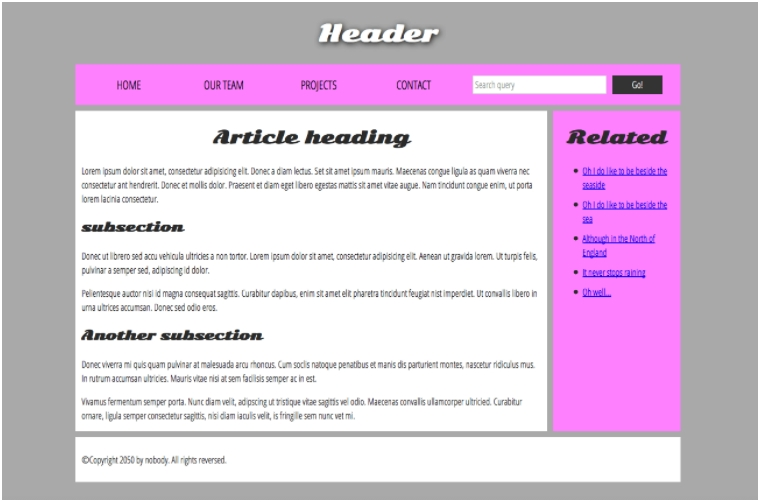

# HTML 분류, HTML 구조

## 1. HTML tag의 분류

### (1) Box vs Item

- `Box` : 사용자에게 `보이지 않고 item을 담을 수 있다`.

  - 구조표현 : header, footer, nav, aside, main
  - main 표현 : section, article, div, span, form

- `Item` : 사용자에게 `보여지고 Box안에 담겨진다`.
  - a, button, input, label, img
  - video, audio, map, canvas, table

<br />

### (2) Block vs Inline

- Block : 두 개의 요소가 `한 줄에 하나씩 두 줄에 배치`된다.
  `<div> ...`
- Inline : 두 개의 요소가 `한 줄에 배치`된다.
  `<p>, <span>, <b> ....`

<br />

> test.html

```javascript
<!DOCTYPE html>
<html>
    <head>
        <meta charset="utf-8">
        <meta name="viewport"     content="width=device-width">
        <title>JS Bin</title>
    </head>
    <body>
        <p>
            This is a sentence1.  <b>That</b> is ...
        </p> <!-- b : inline-->

        <p>
            This is a sentence2.  <span>That</span> is ...
        </p> <!-- span: inline-->

        <p>
            This is a sentence3.  <div>That</div> is ...
        </p> <!-- div : block -->
    </body>
</html>
```

<br />

## 2. HTML 구조

- https://developer.mozilla.org/en-US/docs/Learn/HTML/Introduction_to_HTML/Document_and_website_structure
- body tag를 header, nav, main, aside, footer 등으로 나누어 보여지게 한다.



<br />

> index.html

```javascript
<!DOCTYPE html>
<html>
    <head>
        <meta charset="utf-8">
        <title>My page title</title>
        <link href="https://fonts.googleapis.com/css?family=Open+San+Condensed:300|Sonsie+One"  rel="stylesheet" type="text/css">
        <link rel="stylesheet" href="style.css">

        <!-- the below three lines are a fix to get HTML5 semantic elements working in    old versions of Internet Explorer-->

        <!--[if lt IE 9]>
            <src="https://cdnjs.cloudflare.com/ajax/libs/html5shiv/3.7.3/html5shiv.js"></script>
        <![endif]-->
    </head>

    <body>
    <!-- Here is our main header that is used   across all the pages of our website -->

        <header>
            <h1>Header</h1>
        </header>

        <nav>
            <ul>
                <li><a href="#">Home</a></li>
                <li><a href="#">Our team</a></li>
                <li><a href="#">Projects</a></li>
                <li><a href="#">Contact</a></li>
            </ul>

            <!-- A Search form is another common non-linear way to navigate through a website. -->

            <form>
                <input type="search" name="q"  placeholder="Search query">
                <input type="submit" value="Go!">
            </form>
        </nav>

      <!-- Here is our page's main content -->
      <main>
        <!-- It contains an article -->
        <article>
            <h2>Article heading</h2>

            <p>Lorem ipsum dolor sit amet, consectetur adipisicing elit. Donec a    diam lectus. Set sit amet ipsum mauris. Maecenas congue ligula as quam viverra nec consectetur ant hendrerit. Donec et mollis dolor. Praesent et diam eget libero egestas mattis sit amet vitae augue. Nam tincidunt congue enim, ut porta lorem lacinia consectetur.</p>

            <h3>Subsection</h3>

            <p>Donec ut librero sed accu vehicula ultricies a non tortor. Lorem ipsum dolor sit amet, consectetur adipisicing elit. Aenean ut gravida lorem. Ut turpis felis, pulvinar a semper sed, adipiscing id  dolor.</p>

            <p>Pelientesque auctor nisi id magna consequat sagittis. Curabitur dapibus, enim sit amet elit pharetra tincidunt feugiat nist imperdiet. Ut convallis libero in urna ultrices accumsan. Donec  sed odio eros.</p>

            <h3>Another subsection</h3>

            <p>Donec viverra mi quis quam pulvinar at malesuada arcu rhoncus. Cum soclis natoque penatibus et manis dis parturient  montes, nascetur ridiculus mus. In rutrum accumsan ultricies. Mauris vitae nisi at sem facilisis semper ac in est.</p>

            <p>Vivamus fermentum semper porta. Nunc diam velit, adipscing ut tristique vitae sagittis vel odio. Maecenas convallis ullamcorper ultricied. Curabitur ornare, ligula semper consectetur sagittis, nisi diam iaculis velit, is fringille sem nunc vet mi.</p>
        </article>

        <!-- the aside content can also be nested     within the main content -->
        <aside>
            <h2>Related</h2>

            <ul>
                <li>
                    <a href="#">Oh I do like to   be beside the seaside</a>
                </li>
                <li>
                    <a href="#">Oh I do like to   be beside the sea</a>
                </li>
                <li>
                    <a href="#">Although in the North of England</a>
                </li>
                <li>
                    <a href="#">It never stops raining</a>
                </li>
                <li>
                    <a href="#">Oh well...</a>
                </li>
            </ul>
        </aside>
      </main>

      <!-- And here is our main footer that is used across all the pages of our website -->
        <footer>
            <p>©Copyright 2050 by nobody. All rights  reversed.</p>
        </footer>
    </body>
</html>
```

<br />

> style.css

```javascript
/* || General setup */

html, body {
    margin: 0;
    padding: 0;
}

html {
    font-size: 10px;
    background-color: #a9a9a9;
}

body {
    width: 70%;
    margin: 0 auto;
}

/* || typography */

h1, h2, h3 {
    font-family: 'Sonsie One', cursive;
    color: #2a2a2a;
}

p, input, li {
    font-family: 'Open Sans Condensed', sans-serif;
    color: #2a2a2a;
}

h1 {
    font-size: 4rem;
    text-align: center;
    color: white;
    text-shadow: 2px 2px 10px black;
}

h2 {
    font-size: 3rem;
    text-align: center;
}

h3 {
    font-size: 2.2rem;
}

p, li {
    font-size: 1.6rem;
    line-height: 1.5;
}

/* || header layout */

nav, article, aside, footer {
    background-color: white;
    padding: 1%;
}

nav {
    height: 50px;
    background-color: #ff80ff;
    display: flex;
    margin-bottom: 10px;
}

nav ul {
    padding: 0;
    list-style-type: none;
    flex: 2;
    display: flex;
}

nav li {
    display: inline;
    text-align: center;
    flex: 1;
}

nav a {
    display: inline-block;
    font-size: 2rem;
    text-transform: uppercase;
    text-decoration: none;
    color: black;
}

nav form {
    flex: 1;
    display: flex;
    align-items: center;
    height: 100%;
    padding: 0 2em;
}

input {
    font-size: 1.6rem;
    height: 32px;
}

input[type="search"] {
    flex: 3;
}

input[type="submit"] {
    flex: 1;
    margin-left: 1rem;
    background: #333;
    border: 0;
    color: white;
}

/* || main layout */

main {
    display: flex;
}

article {
    flex: 4;
}

aside {
    flex: 1;
    margin-left: 10px;
    background-color: #ff80ff;
}

aside li {
    padding-bottom: 10px;
}

footer {
    margin-top: 10px;
}
```
