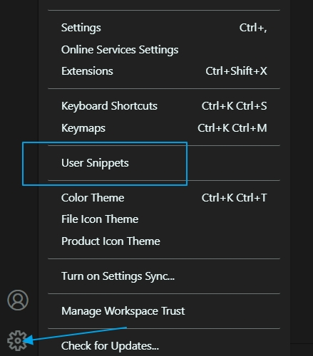
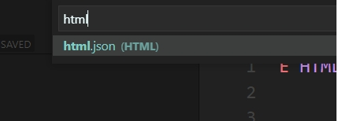

# jQuery 설치, jQuery template 설정 , Selector - CSS, CSS2

## jQuery 설치

### 1. 장점

- `jQuery`는 `JavaScript Library` 입니다.
- jQuery는 상당히 단순한 JavaScript programming 입니다. 또한 간결하게 코딩하고 많은 일을 해주는 JavaScript Library 입니다.
- CSS의 selecter를 사용하고 있어서 습득하기 쉬우며, `브러우저의 다양성을 처리해 줌으로 호환성 처리에 시간을 소비할 필요가 없습니다.`
- 복잡한 Javascript의 구현시 DOM 문법을 매우 간결하게 해주어 개발 속도를 향상 할 수 있습니다.
- jQuery의 기능을 확장할 수 있는 plugin 구조를 지원합니다.
- Ajax를 지원해 줍니다.
- 참고사이트 : https://api.jquery.com/

<br />

### 2. 설치

- jQuery 다운로드 : https://jquery.com/download/

```
<script src="../scripts/jquery-3.6.0.js"></script>
<script src="https://code.jquery.com/jquery-3.5.0.js"></script>
```

### 3. jQuery로 작성된 스크립트

- $(function () {
  <br />의미 : 페이지가 로딩 될 때를 나타낸다.
- $("dd:not(:first)").css("display","none");
  <br />의미 : 첫번째 dd태그를 제외한 나머지 dd태그의 display를 none로 한다.
- $("+dd", this).slideDown("slow");
  <br />의미 : 현재 dd의 뒤에 dd를 천천히 올린다.
- emmet 참조사이트 : https://docs.emmet.io/abbreviations/syntax/

> sample.html

```javascript
<!DOCTYPE html>
<html lang='ko'>
<head>
    <meta charset='UTF-8'>
    <meta name='viewport' content='width=device-width, initial-scale=1.0'>
    <title></title>
        <style>
        * {
            margin: 0;
            padding: 0;
        }

        dl {
            width: 400px;
            margin: 50px auto;
        }

        dl dt {
            background-color: #7cadb6;
            border-bottom: 1px solid #ffffff;
            cursor: pointer;
        }

        dl dd {
            border: 1px solid #7cadb6;
            border-top: none;
            height: 300px;
        }
    </style>
    <script src='https://code.jquery.com/jquery-3.5.0.js'></script>
    <script>
        $(function () {
            $("dd:not(:first").css("display", "none");
            $("dl dt").click(function () {
                if ($("+dd", this).css("display") == "none") {
                    $(this).siblings("dd").slideUp("slow");
                    $("+dd", this).slideDown("slow");
                }
            });
        });
    </script>
</head>

<body>
    <div id="container">
        <dl>
            <dt>텍스트1</dt>
            <dd>
                <p>텍스트 텍스트 텍스트 텍스트 텍스트 텍스트 텍스트 텍스트 텍스트 텍스트 텍스트 텍스트 텍스트 텍스트 텍스트 텍스트 텍스트 텍스트 텍스트</p>
            </dd>
            <dt>텍스트2</dt>
            <dd>
                <p>텍스트 텍스트 텍스트 텍스트 텍스트 텍스트 텍스트 텍스트 텍스트 텍스트 텍스트 텍스트 텍스트 텍스트 텍스트 텍스트 텍스트 텍스트 텍스트</p>
            </dd>
            <dt>텍스트3</dt>
            <dd>
                <p>텍스트 텍스트 텍스트 텍스트 텍스트 텍스트 텍스트 텍스트 텍스트 텍스트 텍스트 텍스트 텍스트 텍스트 텍스트 텍스트 텍스트 텍스트 텍스트</p>
            </dd>
        </dl>
    </div>
</body>
</html>
```

<br />

## jQuery template 설정

- 자주 사용되는 코드를 미리 작성하여 새로운 html파일 생성시 추가한다.
- PC가 바뀌면 다시 설정해줘야 한다.

### 1. Manager -> User Snippets -> html.json (HTML) 검색후 선택, 작성




<br />

### 2. html.json 작성

- j 입력하고 Tab를 눌러 jQuery기본 HTML페이지를 생성한다.
- 마킹 된 곳을 변경한다.
- $1, $2 ....는 Tab를 눌렀을때 커서가 움직이는 순서이다.
- 변경 후에는 반드시 저장한다.

> html.json

```javascript
{
	// Place your snippets for html here. Each snippet is defined under a snippet name and has a prefix, body and
	// description. The prefix is what is used to trigger the snippet and the body will be expanded and inserted. Possible variables are:
	// $1, $2 for tab stops, $0 for the final cursor position, and ${1:label}, ${2:another} for placeholders. Placeholders with the
	// same ids are connected.
	// Example:
	"!!": {
		"prefix": "!!",
		"body": [
			"<!DOCTYPE html>",
			"<html lang='ko'>",
			"<head>",
			"<meta charset='UTF-8'>",
			"<meta name='viewport' content='width=device-width, initial-scale=1.0'>",
			"<title>$1</title>",
			"<style>$2</style>",
			"<script src='https://code.jquery.com/jquery-3.5.0.js'></script>",
			"<script>",
			"$(function () {",
			"$3",
			"});",
			"</script>",
			"</head>",
			"<body>",
			"$4",
			"</body>",
			"</html>",
		],
		"description": "Log output to console"
	}
}
```

<br />

## Selector - CSS, CSS2

- selector를 이용하여 DOM Element를 검색한다.

### 1. Selector 기본 문법

- 사용법: `$("")`
- 용어 : 태그 = Element, 속성 = Attribute

<br />

### 2. CSS Selector

#### (1) tag selector

- `$("태그명")` : HTML tag를 제어

<br />

#### (2) id selector

- `$("#id명")` : id 속성을 가진 tag를 제어

<br />

#### (3) class selector

- `$(".class명")` : class속성을 가진 tag를 제어

<br />

#### (4) 자손 selector

- `$("태그1 태그2")` : 태그안의 자식태그 제어

> selector1.html

```javascript
<!DOCTYPE html>
<html lang='ko'>
<head>
    <meta charset='UTF-8'>
    <meta name='viewport' content='width=device-width, initial-scale=1.0'>
    <title></title>
    <style></style>
    <script src='https://code.jquery.com/jquery-3.5.0.js'></script>
    <script>
        $(function () {
            $(".first strong").css("color", "red");
        });
    </script>
</head>

<body>
    <ul>
        <li class="first"><strong>텍스트</strong> 텍스트 텍스트 텍스트 텍스트 </li>
        <li class="second"><strong>텍스트</strong> 텍스트 텍스트 텍스트 텍스트 </li>
        <li class="third"><strong>텍스트</strong> 텍스트 텍스트 텍스트 텍스트 </li>
        <li class="fourth"><strong>텍스트</strong> 텍스트 텍스트 텍스트 텍스트 </li>
    </ul>
</body>
</html>
```

<br />

#### (5) 유니버셜 selector

- `$("*")` : 전체태그

> selector2.html

```javascript
<!DOCTYPE html>
<html lang='ko'>
<head>
    <meta charset='UTF-8'>
    <meta name='viewport' content='width=device-width, initial-scale=1.0'>
    <title></title>
    <style></style>
    <script src='https://code.jquery.com/jquery-3.5.0.js'></script>
    <script>
        $(function () {
            $('li *').css('color', 'red');
        });
    </script>
</head>

<body>
    <ul>
        <li class="first"><strong>텍스트</strong> 텍스트 텍스트 텍스트 텍스트 </li>
        <li class="second"><em>텍스트</em> 텍스트 텍스트 텍스트 텍스트 </li>
        <li class="third"><span>텍스트</span> 텍스트 텍스트 텍스트 텍스트 </li>
        <li class="fourth">텍스트 텍스트 텍스트 텍스트 </li>
    </ul>
</body>
</html>
```

<br />

#### (6) 그룹 selector

- `$("셀렉터1, 셀렉터2")` :복수의 셀렉터

> selector3.html

```javascript
<!DOCTYPE html>
<html lang='ko'>
<head>
    <meta charset='UTF-8'>
    <meta name='viewport' content='width=device-width, initial-scale=1.0'>
    <title></title>
    <style></style>
    <script src='https://code.jquery.com/jquery-3.5.0.js'></script>
    <script>
        $(function () {
            $("#first, #third").css("color", "red");
        });
    </script>
</head>

<body>
    <ul>
        <li id="first">텍스트 텍스트 텍스트 텍스트 </li>
        <li id="second">텍스트 텍스트 텍스트 텍스트 </li>
        <li id="third">텍스트 텍스트 텍스트 텍스트 </li>
        <li id="fourth">텍스트 텍스트 텍스트 텍스트 </li>
    </ul>
</body>
</html>
```

<br />

### 3. CSS2 Selector

#### (1) 자식 selector

- `$("부모태그명 > 자식태그명")` : 특정 태그의 바로 밑에 자식태그

> selector4.html

```javascript
<!DOCTYPE html>
<html lang='ko'>
<head>
    <meta charset='UTF-8'>
    <meta name='viewport' content='width=device-width, initial-scale=1.0'>
    <title></title>
    <style></style>
    <script src='https://code.jquery.com/jquery-3.5.0.js'></script>
    <script>
        $(function () {
            $("li > strong").css("color", "red");
        });
    </script>
</head>

<body>
    <ul>
        <li id="first"><strong> 텍스트</strong> 텍스트 텍스트 텍스트 텍스트</li>
        <li id="second"> <em>텍스트</em> 텍스트 텍스트 텍스트 텍스트 </li>
        <li id="third"><span><strong> 텍스트 </strong></span> 텍스트 텍스트 텍스트 텍스트</li>
        <li id="fourth"> 텍스트 텍스트 텍스트 </li>
    </ul>
</body>
</html>
```

<br />

#### (2) 다음 인접 selector

- `$("이전+다음")` : 이전의 인접한 다음 태그 선택

> selector5.html

```javascript
<!DOCTYPE html>
<html lang='ko'>
<head>
    <meta charset='UTF-8'>
    <meta name='viewport' content='width=device-width, initial-scale=1.0'>
    <title></title>
    <style></style>
    <script src='https://code.jquery.com/jquery-3.5.0.js'></script>
    <script>
        $(function () {
            $("#second + li").css("color", "red");
        });
    </script>
</head>

<body>
    <ul>
        <li id="first"><strong> 텍스트</strong> 텍스트 텍스트 텍스트 텍스트</li>
        <li id="second"> <em>텍스트</em> 텍스트 텍스트 텍스트 텍스트 </li>
        <li id="third"><span><strong> 텍스트 </strong></span> 텍스트 텍스트 텍스트 텍스트</li>
        <li id="fourth"> 텍스트 텍스트 텍스트 </li>
    </ul>
</body>
</html>
```

<br />

#### (3) :first-child Selector

- `$("태그:first-child")` : 동일 태그 안의 첫 태그

> selector6.html

```javascript
<!DOCTYPE html>
<html lang='ko'>
<head>
    <meta charset='UTF-8'>
    <meta name='viewport' content='width=device-width, initial-scale=1.0'>
    <title></title>
    <style></style>
    <script src='https://code.jquery.com/jquery-3.5.0.js'></script>
    <script>
        $(function () {
            $("li:first-child").css("color", "red");
        });
    </script>
</head>

<body>
    <ul>
        <li id="first"><strong> 텍스트</strong> 텍스트 텍스트 텍스트 텍스트</li>
        <li id="second"> <em>텍스트</em> 텍스트 텍스트 텍스트 텍스트 </li>
        <li id="third"><span><strong> 텍스트 </strong></span> 텍스트 텍스트 텍스트 텍스트</li>
        <li id="fourth"> 텍스트 텍스트 텍스트 </li>
    </ul>
</body>
</html>
```
