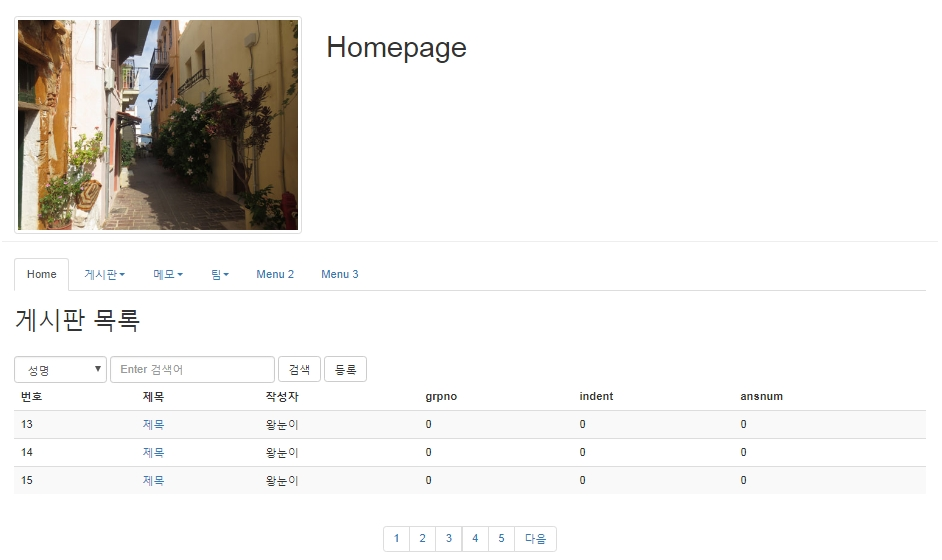

# mysql- PAGING의 원리, 구현, 사용

## PAGING의 원리, 구현, 사용

- page는 1부터 시작
- 레코드가 많은 경우 레코드를 분할하여 가져오는 기술, 보통 10~20개가 하나의 페이지로 구성되어 있음.
- mysql 은 limit으로 지정



### 1. 테스트용 SQL

- 10개 정도 추가한다.

> webapp/WEB-INF/bbs.sql

```sql
INSERT INTO bbs(wname, title, content, passwd, wdate)
VALUES('왕눈이', '제목', '내용', '123', sysdate());

select * from bbs;
```

<br />

### 2. 페이징이 되는 소스

```sql
-- list
SELECT bbsno, wname, title, viewcnt, wdate, grpno, indent, ansnum
FROM bbs
 ORDER BY grpno DESC, ansnum ASC
limit 0, 5; -- 0행 부터 10개 가져온다.
```

<br />

### 3. DAO 및 DAOTest

- total(), list()

> BbsDAO.java

```java
public int total(String col, String word) {
int total = 0;
Connection con = DBOpen.open();
PreparedStatement pstmt = null;
ResultSet rs = null;
StringBuffer sql = new StringBuffer();
sql.append(" select count(\*) ");
sql.append(" from bbs ");

    if (word.trim().length() > 0 && col.equals("title_content")) {
      sql.append(" where title concat('%',?,'%') ");
      sql.append(" or content like concat('%',?,'%') ");
    } else if (word.trim().length() > 0) {
      sql.append(" where " + col + " like concat('%',?,'%') ");
    }
    try {
      pstmt = con.prepareStatement(sql.toString());
      if (word.trim().length() > 0 && col.equals("title_content")) {
        pstmt.setString(1, word);
        pstmt.setString(2, word);
      } else if (word.trim().length() > 0) {
        pstmt.setString(1, word);
      }
      rs = pstmt.executeQuery();
      if (rs.next()) {
        total = rs.getInt(1);
      }

    } catch (SQLException e) {
      // TODO Auto-generated catch block
      e.printStackTrace();
    } finally {
      DBClose.close(con, pstmt, rs);
    }

    return total;

}

public List<BbsDTO> list(Map map) {
List<BbsDTO> list = new ArrayList<BbsDTO>();
Connection con = DBOpen.open();
PreparedStatement pstmt = null;
ResultSet rs = null;

    String col = (String) map.get("col");
    String word = (String) map.get("word");
    int sno = (Integer) map.get("sno");
    int eno = (Integer) map.get("eno");
    StringBuffer sql = new StringBuffer();
    sql.append(" SELECT bbsno, wname, title, viewcnt, wdate ");
    sql.append(" ,grpno,indent,ansnum ");
    sql.append("  FROM bbs   ");
    if (word.trim().length() > 0 && col.equals("title_content")) {
      sql.append(" where title like concat('%',?,'%') ");
      sql.append(" or content like concat('%',?,'%')");
    } else if (word.trim().length() > 0) {
      sql.append(" where " + col + " like concat('%',?,'%') ");
    }
    sql.append("     order by grpno desc, ansnum ASC ");
    sql.append(" limit ?, ?  ");

    try {
      pstmt = con.prepareStatement(sql.toString());
      int i = 0;
      if (word.trim().length() > 0 && col.equals("title_content")) {
        pstmt.setString(++i, word);
        pstmt.setString(++i, word);
      } else if (word.trim().length() > 0) {
        pstmt.setString(++i, word);
      }
      pstmt.setInt(++i, sno);
      pstmt.setInt(++i, eno);
      rs = pstmt.executeQuery();

      while (rs.next()) {
        BbsDTO dto = new BbsDTO();
        dto.setBbsno(rs.getInt("bbsno"));
        dto.setWname(rs.getString("wname"));
        dto.setTitle(rs.getString("title"));
             dto.setWdate(rs.getString("wdate"));
        dto.setGrpno(rs.getInt("grpno"));
        dto.setIndent(rs.getInt("indent"));
        dto.setAnsnum(rs.getInt("ansnum"));

        list.add(dto);
      }

    } catch (SQLException e) {
      // TODO Auto-generated catch block
      e.printStackTrace();
    } finally {
      DBClose.close(con, pstmt, rs);
    }

    return list;
}
```

<br />

### 4. 페이징 콤포넌트 -Utility.java

> utility/Utility.java

```java
    /**
    * @param totalRecord 전체 레코드수
    * @param nowPage 현재 페이지
    * @param recordPerPage 페이지당 레코드 수
    * @param col 검색 컬럼
    * @param word 검색어
    * @return 페이징 생성 문자열
    */
      public static String paging(int totalRecord, int nowPage, int recordPerPage, String col, String word){
      int pagePerBlock = 5; // 블럭당 페이지 수
      int totalPage = (int)(Math.ceil((double)totalRecord/recordPerPage)); // 전체 페이지
       int totalGrp = (int)(Math.ceil((double)totalPage/pagePerBlock));// 전체 그룹
      int nowGrp = (int)(Math.ceil((double)nowPage/pagePerBlock)); // 현재 그룹
      int startPage = ((nowGrp - 1) _ pagePerBlock) + 1; // 특정 그룹의 페이지 목록 시작
       int endPage = (nowGrp \* pagePerBlock); // 특정 그룹의 페이지 목록 종료

           StringBuffer str = new StringBuffer();
           str.append("<div style='text-align:center'>");
           str.append("<ul class='pagination'> ");
           int _nowPage = (nowGrp-1) * pagePerBlock; // 10개 이전 페이지로 이동
           if (nowGrp >= 2){
             str.append("<li><a href='./list.jsp?col="+col+"&word="+word+"&nowPage="+_nowPage+"'>이전</A></li>");
           }

           for(int i=startPage; i<=endPage; i++){
             if (i > totalPage){
               break;
             }

             if (nowPage == i){
               str.append("<li class='active'><a href=#>"+i+"</a></li>");
             }else{
               str.append("<li><a href='./list.jsp?col="+col+"&word="+word+"&nowPage="+i+"'>"+i+"</A></li>");
             }
           }

           _nowPage = (nowGrp * pagePerBlock)+1; // 10개 다음 페이지로 이동
           if (nowGrp < totalGrp){
             str.append("<li><A href='./list.jsp?col="+col+"&word="+word+"&nowPage="+_nowPage+"'>다음</A></li>");
           }
           str.append("</ul>");
           str.append("</div>");

           return str.toString();
      }
```

<br />

### 5. 페이징 콤포넌트의 사용

> webapp/bbs/list.jsp

```jsp
<%@ page contentType="text/html; charset=UTF-8" %>
<%@ include file="/ssi/ssi_bbs.jsp" %>
<jsp:useBean id="dao" class="bbs.BbsDAO" />
<%
String col = Utility.checkNull(request.getParameter("col"));
String word = Utility.checkNull(request.getParameter("word"));

if(col.equals("total")) word = "";

//페이지관련-----------------------
int nowPage = 1;//현재 보고있는 페이지
if(request.getParameter("nowPage")!=null){
nowPage = Integer.parseInt(request.getParameter("nowPage"));
}
iint recordPerPage = 5;//한페이지당 보여줄 레코드갯수

int sno = ((nowPage-1) * recordPerPage); //디비에서 가져올 시작위치
int eno = 5;//디비에서 가져올 레코드 갯수

Map map = new HashMap();
map.put("col",col);
map.put("word",word);
map.put("sno", sno);
map.put("eno", eno);

List<BbsDTO> list = dao.list(map);

int total = dao.total(col, word);

String paging = Utility.paging(total, nowPage, recordPerPage, col, word);

%>

<!DOCTYPE html>
<html>
<head>
  <title>게시판 글 목록</title>
  <meta charset="utf-8">
   <script type="text/javascript">
     function read(bbsno){
       var url = "read.jsp";
       url += "?bbsno="+bbsno;

       location.href=url;

     }

  </script>

</head>
<body>
<jsp:include page="/menu/top.jsp"/>
<div class="container">

  <h2>게시판 목록</h2>
  <br>
  <form class="form-inline" action="./list.jsp">
    <div class="form-group">
      <select class="form-control" name="col">
        <option value="wname"
        <% if(col.equals("wname")) out.print("selected");%>
        >성명</option>
        <option value="title"
        <% if(col.equals("title")) out.print("selected");%>
        >제목</option>
        <option value="content"
        <% if(col.equals("content")) out.print("selected");%>
        >내용</option>
        <option value="title_content"
         <% if(col.equals("title_content")) out.print("selected");%>
        >제목+내용</option>
        <option value="total"
        <% if(col.equals("total")) out.print("selected");%>
        >전체출력</option>
     </select>
    </div>
    <div class="form-group">
      <input type="text" class="form-control" placeholder="Enter 검색어"
      name="word" value="<%=word%>">
    </div>
    <button type="submit" class="btn btn-default">검색</button>
    <button type="button" class="btn btn-default">등록</button>
  </form>
  <table class="table table-striped">
   <thead>
    <tr>
    <th>번호</th>
    <th>제목</th>
    <th>작성자</th>
    <th>grpno</th>
    <th>indent</th>
    <th>ansnum</th>
    </tr>
   </thead>
   <tbody>


<%if(list.size() ==0){ %>
   <tr><td colspan="6">등록된 글이 없습니다.</td>

<%}else{

   for(int i=0; i<list.size();i++){
      BbsDTO dto = list.get(i);

%>
   <tr>
    <td><%=dto.getBbsno() %></td>
    <td>
    <a href="javascript:read('<%=dto.getBbsno() %>')"><%=dto.getTitle() %></a></td>
    <td><%=dto.getWname() %></td>
    <td><%=dto.getGrpno() %></td>
    <td><%=dto.getIndent() %></td>
    <td><%=dto.getAnsnum() %></td>
   </tr>
<%
   } //for_end

  } //if_end
%>
   </tbody>
  </table>
  <div>
   <%=paging%>
  </div>
</div>
</body>
</html>
```
