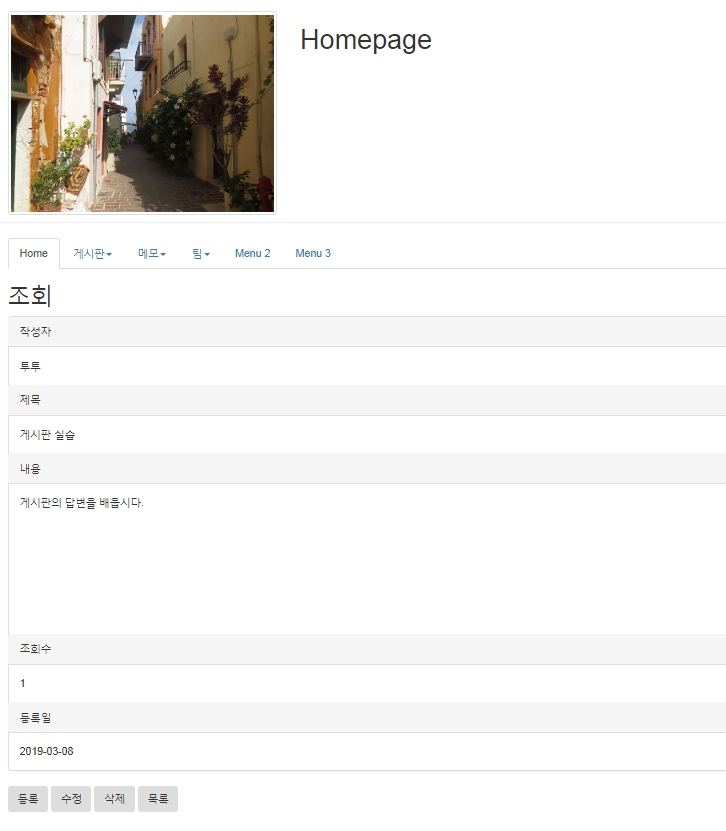

# mysql- 조회(read.jsp) 및 조회수 증가

## 조회(read.jsp) 및 조회수 증가



### 1. SQL

```sql
UPDATE bbs
SET viewcnt = viewcnt + 1
WHERE bbsno=1;

SELECT bbsno, wname, title, content, viewcnt, wdate
FROM bbs
WHERE bbsno = 1;
```

<br />

### 2. DAO 및 DAOTest

> BbsDAO.java -목록을 참조하여 조회를 작성합니다.

```java
public BbsDTO read(int bbsno) {
    BbsDTO dto = null;
    Connection con = DBOpen.getConnection();
    PreparedStatement pstmt = null;
    ResultSet rs = null;

    StringBuffer sql = new StringBuffer();
    sql.append(" SELECT bbsno, wname, title, content,  viewcnt, wdate ");
    sql.append(" FROM bbs   ");
    sql.append(" WHERE bbsno = ?  ");

    try {
      pstmt = con.prepareStatement(sql.toString());
      pstmt.setInt(1, bbsno);

      rs = pstmt.executeQuery();

      if (rs.next()) {
        dto = new BbsDTO();
        dto.setBbsno(rs.getInt("bbsno"));
        dto.setWname(rs.getString("wname"));
        dto.setTitle(rs.getString("title"));
        dto.setContent(rs.getString("content"));
        dto.setViewcnt(rs.getInt("viewcnt"));
        dto.setWdate(rs.getString("wdate"));
      }

    } catch (SQLException e) {
      // TODO Auto-generated catch block
      e.printStackTrace();
    } finally {
      DBClose.close(rs, pstmt, con);
    }

    return dto;
  }

  public void upViewcnt(int bbsno) {
    Connection con = DBOpen.open();
    PreparedStatement pstmt = null;
    StringBuffer sql = new StringBuffer();
    sql.append(" update bbs ");
    sql.append(" set viewcnt = viewcnt + 1 ");
    sql.append(" where bbsno = ? ");

    try {
      pstmt = con.prepareStatement(sql.toString());
      pstmt.setInt(1, bbsno);

      pstmt.executeUpdate();

    } catch (SQLException e) {
      // TODO Auto-generated catch block
      e.printStackTrace();
    } finally {
      DBClose.close(con, pstmt);
    }
  }
```

<br />

### 3. 조회: 글 등록을 참조하여 작성

> webapp/bbs/read.jsp

```jsp
<%@ page contentType="text/html; charset=UTF-8" %>
<%@ include file="/ssi/ssi_bbs.jsp" %>
<jsp:useBean id="dao" class="bbs.BbsDAO" />
<%
    int bbsno = Integer.parseInt(request.getParameter("bbsno"));
    dao.upViewcnt(bbsno);
    BbsDTO dto = dao.read(bbsno);
    String content = dto.getContent().replaceAll("\r\n", "<br>");
%>

<!DOCTYPE html>
<html>
<head>
  <title>Bootstrap Example</title>
  <meta charset="utf-8">

  <script type="text/javascript">
    function updateM(){
      var url = "updateForm.jsp";
      url += "?bbsno=<%=dto.getBbsno()%>";

      location.href=url;
    }
    function deleteM(){
      var url = "deleteForm.jsp";
      url += "?bbsno=<%=dto.getBbsno()%>";

      location.href=url;
    }
  </script>

</head>
<body>
<jsp:include page="/menu/top.jsp"/>
<div class="container">

<h2>조회</h2>
<div class="panel panel-default">
<div class="panel-heading">작성자</div>
<div class="panel-body"><%=dto.getWname() %></div>

<div class="panel-heading">제목</div>
<div class="panel-body"><%=dto.getTitle() %></div>

<div class="panel-heading">내용</div>
<div class="panel-body" style="height: 200px"><%=content %></div>

<div class="panel-heading">조회수</div>
<div class="panel-body"><%=dto.getViewcnt() %></div>

<div class="panel-heading">등록일</div>
<div class="panel-body"><%=dto.getWdate() %></div>
</div>

<div>
<button type="button" class="btn" onclick="location.href='./createForm.jsp'">등록</button>
<button type="button" class="btn" onclick="updateM()">수정</button>
<button type="button" class="btn" onclick="deleteM()">삭제</button>
<button type="button" class="btn" onclick="location.href='./list.jsp'">목록</button>
</div>

</div>
</body>
</html>
```
