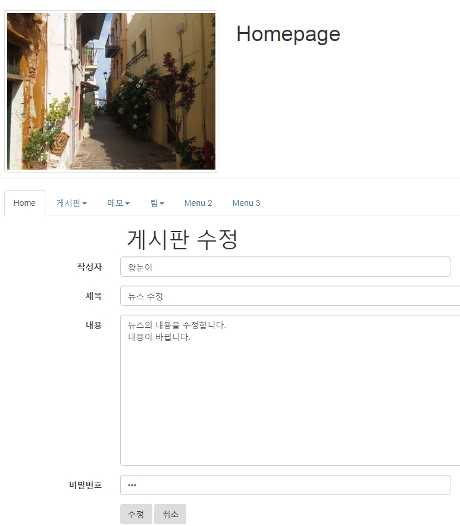
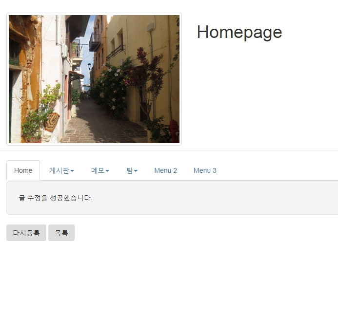
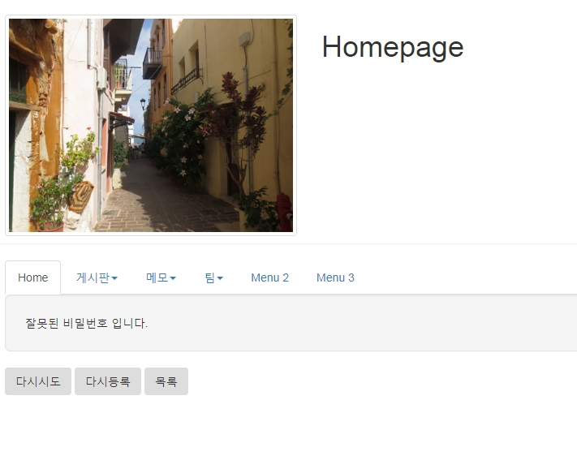
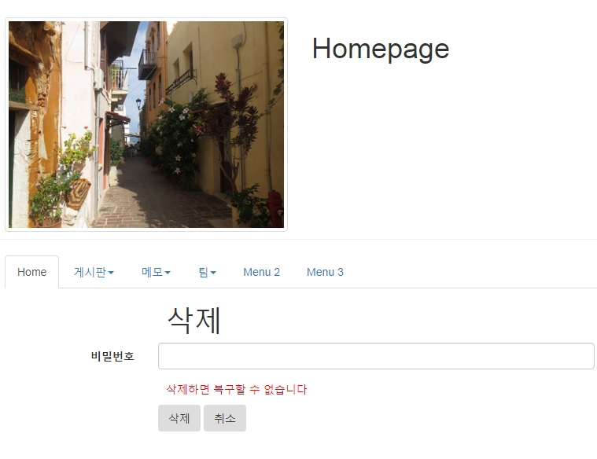
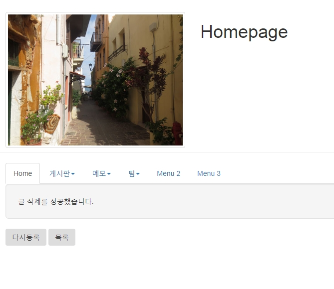
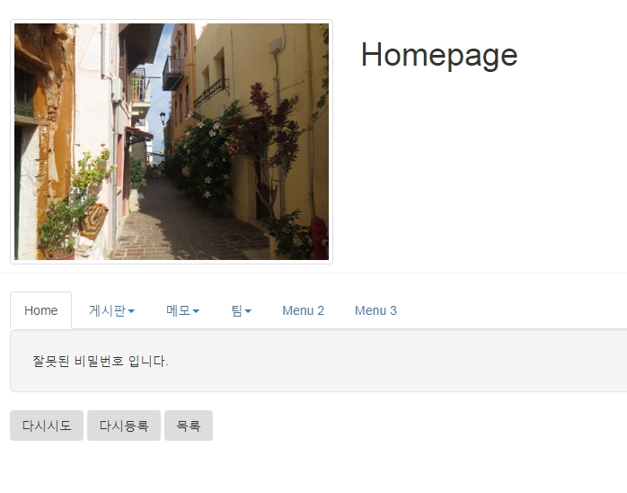

# mysql- 패스워드 검사, 수정, 삭제

## 게시판 수정

### 1. 수정폼 생성



> webapp/bbs/updateForm.jsp

```jsp
<%@ page contentType="text/html; charset=UTF-8" %>
<%@ include file="/ssi/ssi_bbs.jsp" %>
<jsp:useBean id="dao" class="bbs.BbsDAO" />
<%
    int bbsno = Integer.parseInt(request.getParameter("bbsno"));
    BbsDTO dto = dao.read(bbsno);
 %>

<!DOCTYPE html>
<html>
<head>
  <title>bbs 수정</title>
  <meta charset="utf-8">
</head>
<body>
<jsp:include page="/menu/top.jsp"/>
<div class="container">
<h1 class="col-sm-offset-2 col-sm-10">게시판 수정</h1>
<form class="form-horizontal"
      action="updateProc.jsp"
      method="post"
      >
<input type="hidden" name="bbsno" value="<%=dto.getBbsno() %>">
  <div class="form-group">
    <label class="control-label col-sm-2" for="wname">작성자</label>
    <div class="col-sm-6">
      <input type="text" name="wname" id="wname"
      class="form-control" value="<%=dto.getWname()%>">
    </div>
  </div>
  <div class="form-group">
    <label class="control-label col-sm-2" for="title">제목</label>
    <div class="col-sm-8">
      <input type="text" name="title" id="title"
      class="form-control" value="<%=dto.getTitle()%>">
    </div>
  </div>

  <div class="form-group">
    <label class="control-label col-sm-2" for="content">내용</label>
    <div class="col-sm-8">
    <textarea rows="12" cols="7" id="content" name="content"
    class="form-control"><%=dto.getContent() %></textarea>
    </div>
  </div>

  <div class="form-group">
    <label class="control-label col-sm-2" for="passwd">비밀번호</label>
    <div class="col-sm-6">
      <input type="password" name="passwd" id="passwd" class="form-control">
    </div>
  </div>

   <div class="form-group">
   <div class="col-sm-offset-2 col-sm-5">
    <button class="btn">수정</button>
    <button type="reset" class="btn">취소</button>
   </div>
 </div>
</form>
</div>
</body>
</html>
```

### 2. 수정 처리 페이지 작성





> webapp/bbs/updateProc.jsp

```jsp
<%@ page contentType="text/html; charset=UTF-8" %>
<%@ include file="/ssi/ssi_bbs.jsp" %>
<jsp:useBean id="dao" class="bbs.BbsDAO" />
<jsp:useBean id="dto" class="bbs.BbsDTO" />
<jsp:setProperty name="dto" property="*"/>
<%
   Map map = new HashMap();
   map.put("bbsno", dto.getBbsno());
   map.put("passwd", dto.getPasswd());

   boolean flag = false;
   boolean pflag = dao.passCheck(map);
   if(pflag){
       flag = dao.update(dto);
   }
%>
<!DOCTYPE html>
<html>
<head>
  <title>게시판생성</title>
  <meta charset="utf-8">
</head>
<body>
<jsp:include page="/menu/top.jsp"/>
<div class="container">
<div class="well well-lg">
<%
   if(!pflag){
     out.print("잘못된 비밀번호 입니다.");
   }else if(flag){
     out.print("글 수정을 성공했습니다.");
   }else{
   out.print("글 수정을 실패했습니다.");
   }
%>

</div>
<% if(!pflag){ %>
    <button class="btn"
    onclick="history.back()"
    >다시시도</button>
<% } %>
    <button class="btn"
    onclick="location.href='createForm.jsp'"
    >다시등록</button>
    <button type="button" class="btn"
    onclick="location.href='list.jsp'"
    >목록</button>
 </div>
</body>
</html>
```

<br />

### 3. DAO 및 DAOTest

> BbsDAO.java

```java
  public boolean update(BbsDTO dto) {
    boolean flag = false;
    Connection con = DBOpen.getConnection();
    PreparedStatement pstmt = null;
    StringBuffer sql = new StringBuffer();
    sql.append(" UPDATE bbs  ");
    sql.append(" SET         ");
    sql.append("    wname   = ?,  ");
    sql.append("    title   = ?,  ");
    sql.append("    content = ?  ");
    sql.append(" WHERE bbsno  = ?  ");

    try {
      pstmt = con.prepareStatement(sql.toString());
      pstmt.setString(1, dto.getWname());
      pstmt.setString(2, dto.getTitle());
      pstmt.setString(3, dto.getContent());
      pstmt.setInt(4, dto.getBbsno());

      int cnt = pstmt.executeUpdate();
      if (cnt > 0)
        flag = true;

    } catch (SQLException e) {
      // TODO Auto-generated catch block
      e.printStackTrace();
    } finally {
      DBClose.close(pstmt, con);
    }

    return flag;
  }
```

> BbsTest.java

```java
  private static void update(BbsDAO dao) {
    BbsDTO dto = dao.read(1);
    dto.setWname("아로미");
    dto.setTitle("제목변경");
    dto.setContent("내용변경");
    if (dao.update(dto)) {
      p("성공");
      dto = dao.read(1);
      p(dto);
    } else {
      p("실패");
    }
  }
```

<br />

## 패스워드 검사

### 1. SQL

```sql
SELECT COUNT(bbsno)
FROM bbs
WHERE bbsno=1 AND passwd='1234';

 COUNT(BBSNO)
 ------------
            1

SELECT COUNT(bbsno) as cnt
FROM bbs
WHERE bbsno=1 AND passwd='1234';

 CNT
 ---
   1
```

<br />

### 2. DAO

> BbsDAO.java

```java
public boolean passCheck(Map map) {
    boolean flag = false;
    Connection con = DBOpen.getConnection();
    PreparedStatement pstmt = null;
    ResultSet rs = null;
    int bbsno = (Integer) map.get("bbsno");
    String passwd = (String) map.get("passwd");

    StringBuffer sql = new StringBuffer();
    sql.append(" SELECT COUNT(bbsno) as cnt  ");
    sql.append(" FROM bbs  ");
    sql.append(" WHERE bbsno=? AND passwd=? ");

    try {
      pstmt = con.prepareStatement(sql.toString());
      pstmt.setInt(1, bbsno);
      pstmt.setString(2, passwd);

      rs = pstmt.executeQuery();
      rs.next();
      int cnt = rs.getInt("cnt");

      if (cnt > 0)
        flag = true; // 올바른 패스워드

    } catch (SQLException e) {
      // TODO Auto-generated catch block
      e.printStackTrace();
    } finally {
      DBClose.close(rs, pstmt, con);
    }

    return flag;
  }
```

<br />

## 게시판 삭제

### 1. 삭제처리 위해 패스워드 입력 페이지 제작



> webapp/bbs/deleteForm.jsp

```jsp
<%@ page contentType="text/html; charset=UTF-8" %>
<%@ include file="/ssi/ssi_bbs.jsp" %>

<!DOCTYPE html>
<html>
<head>
  <title>homepage</title>
  <meta charset="utf-8">
  <style type="text/css">
  #red{
    color:red;
  }
  </style>
</head>
<body>
<jsp:include page="/menu/top.jsp"/>
<div class="container">
<h1 class="col-sm-offset-2 col-sm-10">삭제</h1>
<form class="form-horizontal"
      action="deleteProc.jsp"
      method="post"
      >
  <input type="hidden" name="bbsno" value="<%=request.getParameter("bbsno") %>">
  <div class="form-group">
    <label class="control-label col-sm-2" for="passwd">비밀번호</label>
    <div class="col-sm-6">
      <input type="password" name="passwd" id="passwd" class="form-control">
    </div>
  </div>

  <p id="red" class="col-sm-offset-2 col-sm-6">삭제하면 복구할 수 없습니다</p>

   <div class="form-group">
   <div class="col-sm-offset-2 col-sm-5">
    <button class="btn">삭제</button>
    <button type="reset" class="btn">취소</button>
   </div>
 </div>
</form>
</div>
</body>
</html>
```

<br />

### 2. 삭제 처리 DAO

> BbsDAO.java

```java
  public boolean delete(int bbsno) {
    boolean flag = false;
    Connection con = DBOpen.getConnection();
    PreparedStatement pstmt = null;
    StringBuffer sql = new StringBuffer();
    sql.append(" delete from bbs ");
    sql.append(" where bbsno = ? ");

    try {
      pstmt = con.prepareStatement(sql.toString());
      pstmt.setInt(1, bbsno);

      int cnt = pstmt.executeUpdate();
      if (cnt > 0)
        flag = true;

    } catch (SQLException e) {
      // TODO Auto-generated catch block
      e.printStackTrace();
    } finally {
      DBClose.close(pstmt, con);
    }

    return flag;
  }
```





<br />

### 3. 삭제 처리

> webapp/bbs/deleteProc.jsp

```jsp
<%@ page contentType="text/html; charset=UTF-8" %>
<%@ include file="/ssi/ssi_bbs.jsp" %>
<jsp:useBean id="dao" class="bbs.BbsDAO" />
<%
   int bbsno = Integer.parseInt(request.getParameter("bbsno"));
   String passwd = request.getParameter("passwd");
   Map map = new HashMap();
   map.put("bbsno", bbsno);
   map.put("passwd", passwd);

   boolean flag = false;
   boolean pflag = dao.passCheck(map);
   if(pflag){
   flag = dao.delete(bbsno);
   }
%>
<!DOCTYPE html>
<html>
<head>
  <title>게시판 삭제</title>
  <meta charset="utf-8">
</head>
<body>
<jsp:include page="/menu/top.jsp"/>
<div class="container">
<div class="well well-lg">
<%
   if(!pflag){
     out.print("잘못된 비밀번호 입니다.");
   }else if(flag){
     out.print("글 삭제를 성공했습니다.");
   }else{
   out.print("글 삭제를 실패했습니다.");
   }

%>
</div>
<% if(!pflag){ %>
    <button class="btn"
    onclick="history.back()"
    >다시시도</button>
<% } %>
    <button class="btn"
    onclick="location.href='createForm.jsp'"
    >다시등록</button>
    <button type="button" class="btn"
    onclick="location.href='list.jsp'"
    >목록</button>

 </div>
</body>
</html>
```
