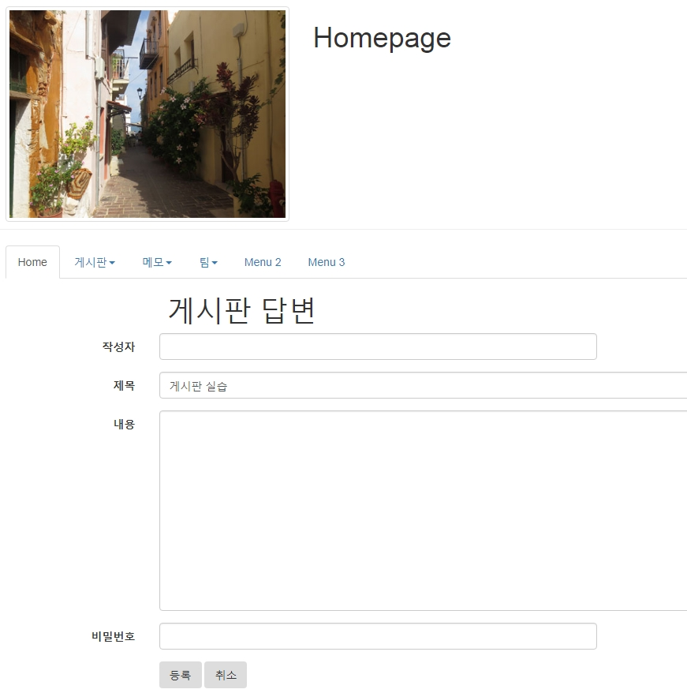
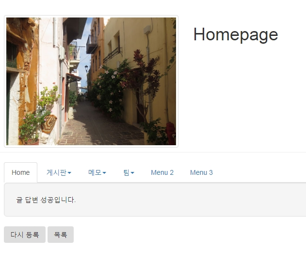
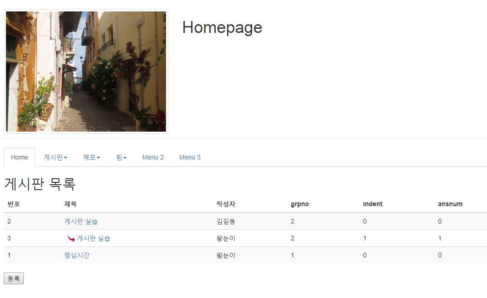

# mysql- 게시판 답변처리

## 게시판 답변 처리

### 1. 게시판 글쓰기 내용 쿼리문 변경

- 글쓰기를 할때에 grpno의 부모글 번호를 증가 한다.

> memo.sqml

```sql
    use webtest;
    delete from bbs;
    select ifnull(max(grpno),0) + 1 from bbs;

    -- create
    insert into bbs(wname, title, content, passwd, wdate, grpno)
    values('왕눈이','제목','내용','1234',sysdate(),
   (select ifnull(max(grpno),0) + 1 from bbs b));
   insert into bbs(wname, title, content, passwd, wdate, grpno)
   values('홍길동','제목2','내용2','1234',sysdate(),
   (select ifnull(max(grpno),0) + 1 from bbs b)
    );
   insert into bbs(wname, title, content, passwd, wdate, grpno)
   values('아로미','제목3','내용3','1234',sysdate(),
   (select ifnull(max(grpno),0) + 1 from bbs b)
   );
```

> BbsDAO.java

```java
public boolean create(BbsDTO dto) {
    boolean flag = false;
    Connection con = DBOpen.getConnection();
    PreparedStatement pstmt = null;
    StringBuffer sql = new StringBuffer();
    sql.append(" insert into bbs(wname, title, content, passwd, wdate, grpno) ");
    sql.append(" values(?,?,?,?,sysdate(),")
    sql.append(" (SELECT ifnull(MAX(grpno),0) + 1 FROM bbs b) ");

    try {
        pstmt = con.prepareStatement(sql.toString());
        pstmt.setString(1, dto.getWname());
        pstmt.setString(2, dto.getTitle());
        pstmt.setString(3, dto.getContent());
        pstmt.setString(4, dto.getPasswd());

        int cnt = pstmt.executeUpdate();

        if (cnt > 0)
            flag = true;

    } catch (SQLException e) {
        // TODO Auto-generated catch block
        e.printStackTrace();
    } finally {
        DBClose.close(pstmt, con);
    }

    return flag;
}
```

- 답변쓰기 페이지에서 부모의 bbsno, title, grpno, indent,ansnum 값을 가져온다.
- readReply(int bbsno) 메소드 생성

> BbsDAO.java

```java
public BbsDTO readReply(int bbsno) {
    BbsDTO dto = null;
    Connection con = DBOpen.getConnection();
    PreparedStatement pstmt = null;
    ResultSet rs = null;
    StringBuffer sql = new StringBuffer();
    sql.append(" select bbsno, grpno, indent, ansnum, title ");
    sql.append(" from bbs ");
    sql.append(" where bbsno = ? ");
    try {
            pstmt = con.prepareStatement(sql.toString());
            pstmt.setInt(1, bbsno);
            rs = pstmt.executeQuery();
            if(rs.next()) {
                    dto = new BbsDTO();
                    dto.setBbsno(rs.getInt("bbsno"));
                    dto.setGrpno(rs.getInt("grpno"));
                    dto.setIndent(rs.getInt("indent"));
                    dto.setAnsnum(rs.getInt("ansnum"));
                    dto.setTitle(rs.getString("title"));
            }
    } catch (SQLException e) {
            // TODO Auto-generated catch block
            e.printStackTrace();
    } finally {
            DBClose.close(rs, pstmt, con);
    }
    return dto;
}
```

<br />

## 2. 답변 폼 페이지



> replyForm.jsp

```jsp
<%@ page contentType="text/html; charset=UTF-8" %>
<%@ page import="bbs.*" %>
<jsp:useBean id="dao" class="bbs.BbsDAO" />
<%
    int bbsno = Integer.parseInt(request.getParameter("bbsno"));
	BbsDTO dto = dao.readReply(bbsno);
%>

<!DOCTYPE html>
<html>
<head>
  <title>homepage</title>
  <meta charset="utf-8">
</head>
<body>
<jsp:include page="/menu/top.jsp"/>
<div class="container">
<h1 class="col-sm-offset-2 col-sm-10">게시판 답변</h1>
<form class="form-horizontal"
      action="replyProc.jsp"
      method="post"
      >
  <input type="hidden" name='bbsno' value="<%=bbsno %>"/>
  <input type="hidden" name='grpno' value="<%=dto.getGrpno() %>"/>
  <input type="hidden" name='indent' value="<%=dto.getIndent() %>"/>
  <input type="hidden" name='ansnum' value="<%=dto.getAnsnum() %>"/>
  <div class="form-group">
    <label class="control-label col-sm-2" for="wname">작성자</label>
    <div class="col-sm-6">
      <input type="text" name="wname" id="wname" class="form-control">
    </div>
  </div>

  <div class="form-group">
    <label class="control-label col-sm-2" for="title">제목</label>
    <div class="col-sm-6">
      <input type="text" name="title" id="title" class="form-control" value="<%=dto.getTitle()%>">
    </div>
  </div>

  <div class="form-group">
    <label class="control-label col-sm-2" for="content">내용</label>
    <div class="col-sm-6">
    <textarea rows="5" cols="5" id="content" name="content" class="form-control"></textarea>
    </div>
  </div>

  <div class="form-group">
    <label class="control-label col-sm-2" for="passwd">비밀번호</label>
    <div class="col-sm-6">
      <input type="text" name="passwd" id="passwd" class="form-control">
    </div>
  </div>

   <div class="form-group">
   <div class="col-sm-offset-2 col-sm-5">
    <button class="btn">등록</button>
    <button type="reset" class="btn">취소</button>
   </div>
 </div>
</form>
</div>
</body>
</html>
```

<br />

### 3. 답변처리 페이지 제작

- 기존 답변의 순서인 ansnum 값을 변경
- 답변 생성시 부모의 grpno, indent+1, ansnum+1 로 생성

#### (1) DAO- 답변순서변경, 답변등록 메소드

> BbsDAO.java

```java
public void upAnsnum(Map map) {
    Connection con = DBOpen.getConnection();
    PreparedStatement pstmt = null;
    StringBuffer sql = new StringBuffer();
    int grpno = (Integer) map.get("grpno");
    int ansnum = (Integer) map.get("ansnum");
    sql.append(" update bbs ");
    sql.append(" set ansnum = ansnum + 1 ");
    sql.append(" where grpno = ? ");
    sql.append(" and ansnum > ? ");

    try {
      pstmt = con.prepareStatement(sql.toString());
      pstmt.setInt(1, grpno);
      pstmt.setInt(2, ansnum);

      pstmt.executeUpdate();

    } catch (SQLException e) {
      // TODO Auto-generated catch block
      e.printStackTrace();
    } finally {
      DBClose.close(pstmt,con);
    }
}

public boolean createReply(BbsDTO dto) {
    boolean flag = false;
    Connection con = DBOpen.getConnection();
    PreparedStatement pstmt = null;
    StringBuffer sql = new StringBuffer();
    sql.append(" INSERT INTO bbs(wname, title, ");
    sql.append(" content, passwd, wdate, grpno, indent, ansnum) ");
    sql.append(" VALUES( ?, ?, ?, ?, sysdate(), ?, ?, ? ) ");

    try {
      pstmt = con.prepareStatement(sql.toString());
      pstmt.setString(1, dto.getWname());
      pstmt.setString(2, dto.getTitle());
      pstmt.setString(3, dto.getContent());
      pstmt.setString(4, dto.getPasswd());
      pstmt.setInt(5, dto.getGrpno()); // ★부모의 grpno
      pstmt.setInt(6, dto.getIndent() + 1); // ★부모의 indent+1
      pstmt.setInt(7, dto.getAnsnum() + 1); // ★부모의 ansnum+1

      int cnt = pstmt.executeUpdate();

      if (cnt > 0)
        flag = true;

    } catch (SQLException e) {
      // TODO Auto-generated catch block
      e.printStackTrace();
    } finally {
      DBClose.close(pstmt,con);
    }

    return flag;
}
```

<br />

#### (2) 답변처리 페이지 제작



> replyProc.jsp

```jsp
<%@ page language="java" contentType="text/html; charset=UTF-8"
    import="bbs.*, java.util.* "%>

<% request.setCharacterEncoding("utf-8"); %>
<jsp:useBean id="dao" class="bbs.BbsDAO" />
<jsp:useBean id="dto" class="bbs.BbsDTO" />
<jsp:setProperty name="dto" property="*" />

<%
	Map map = new HashMap();
	map.put("grpno", dto.getGrpno());
	map.put("ansnum", dto.getAnsnum());
	dao.upAnsnum(map);
	boolean flag = dao.createReply(dto); //답변
%>
<!DOCTYPE html>
<html>
<head>
<meta charset="UTF-8">
<title>Insert title here</title>
</head>
<body>
<jsp:include page="/menu/top.jsp"></jsp:include>
<div class="container">
	<div class="well well-lg">
	<%
		if(flag){
			out.print("글 답변 성공입니다.");
		} else {
			out.print("글 답변 실패입니다.");
		}
	%>
	</div>
	<button class='btn' onclick="location.href='createForm.jsp'">다시등록</button>
	<button class='btn' onclick="location.href='list.jsp'">목록으로</button>
</div>

</body>
</html>
```

<br />

#### (3) 목록 출력시 들여쓰기의 효과 지정



> list.jsp

```jsp
<td>
    <%
     for(int r=0; r<dto.getIndent(); r++){
            out.println("&nbsp;&nbsp;");
     }
     if(dto.getIndent()>0)
         // out.print("[답변]");
             out.print("");
     %>
    <a href='./read.jsp?bbsno=<%=dto.getBbsno() %>'>
    <%=dto.getTitle() %></a>
 </td>
```
