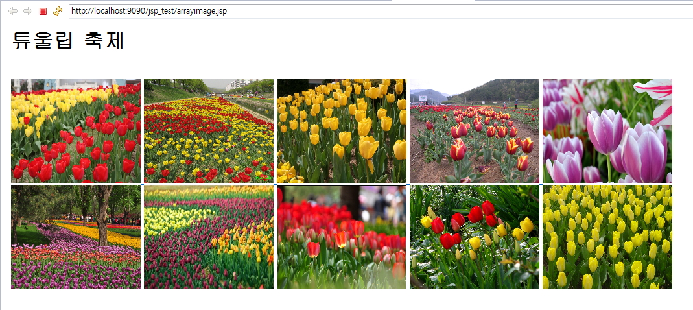

# JSP 기초문법(스크립트릿,선언문,표현식,주석)

## JSP 기초문법

- WEB 환경에서 JAVA를 이용한 DBMS 접근을 처리
- Java Logic 처리를 구현
- JAVA를 기반으로하는 문법
- JSP 고유의 태그가 존재
- JSP의 출력 결과를 HTML과 CSS로 편집하여 출력

### 1. 스크립틀릿의 이해

- 일반적인 java 코드가 쓰임: `<% ... JAVA 코드 명시 ... %>`

> ex1.jsp

```jsp
<%@ page language="java" contentType="text/html; charset=UTF-8"
    pageEncoding="UTF-8"%>
<%
	String name = "왕눈이";
	int kuk = 90;
	int eng = 95;
	int tot = kuk + eng;
	int avg = tot / 2;
%>
<!DOCTYPE html>
<html>
<head>
<meta charset="UTF-8">
<title>Insert title here</title>
</head>
<body>
	<h1>성적표</h1>
	<div style='font-size:24px'>
		-----------------------------<br>
		성명 : <% out.println(name); %><br>
		국어 : <% out.println(kuk); %><br>
		영어 : <% out.println(eng); %><br>
		총점 : <%= tot %><br>
		평균 : <%= avg %><br>
	</div>
<%
	System.out.println(">>>>> name:"+name);
%>
</body>
</html>
```

### 2. 선언문(특별한 경우만 사용, 빈즈로 대체하여 사용함으로 권장하지 않음)

- 메소드(함수) 선언: `<%! ...JAVA 메소드... %>`

> ex2.jsp

```jsp
<%@ page language="java" contentType="text/html; charset=UTF-8"
    pageEncoding="UTF-8"%>
<%!
	public int tot(int kuk, int eng, int mat){
	return kuk+eng+mat;
	}

	public int avg(int tot){
		return tot/3;
	}
%>
<%
	String name = "아로미";
	int kuk = 90;
	int eng = 85;
	int mat = 100;
	int tot = tot(kuk, eng, mat);
	int avg = avg(tot);
%>
<!DOCTYPE html>
<html>
<head>
<meta charset="UTF-8">
<title>Insert title here</title>
</head>
<body>
	<h1>성적표</h1>
	<ul style='font-size:24px'>
		<li> 성명 : <%= name %></li>
		<li> 국어 : <%= kuk %></li>
		<li> 영어 : <%= eng %></li>
		<li> 수학 : <%= mat %></li>
		<li> 총점 : <%= tot %></li>
		<li> 평균 : <%= avg %></li>
	</ul>
</body>
</html>
```

### 3. 표현식(Expression)

- 단순 출력 기능
- `<% System.out.print(hap(10, 20)); %>` 콘솔에 출력
- `<% out.print(hap(10, 20)); %>` JSP 출력
- `<%=hap(10, 20)%>` JSP 출력, 문장 종결자(';')을 사용할 수 없고, 오로지 하나의 값만 출력

### 4. 주석

```
<%
//
/*...~~~...*/
%>
```

> ex3.jsp

```jsp
<%@ page language="java" contentType="text/html; charset=UTF-8"
    pageEncoding="UTF-8"%>
<%!
	String declaration = "Declaration";
	public String decMethod() {
		return 	declaration;
	}
%>
<!DOCTYPE html>
<html>
<head>
<meta charset="UTF-8">
<title>Insert title here</title>
</head>
<body>
	<h1>Script Example</h1>
<%
	String scriptlet = "Scriptlet";
	String comment = "Comment";

	out.print("내장객체를 이용한 출력: "+declaration+"<p/>");
%>
	선언문의 출력1:<%=declaration %><p/>
	선언문의 출력2:<%=decMethod() %><p/>
	스크립트의 출력:<%=scriptlet %><p/>
	<!-- JSP주석부분 -->
	<!-- JSP 주석1 : <%=comment%> -->
	<p/>
        <%-- JSP 주석2 : <%=comment%> --%>
	<%
	/*주석(여러줄 주석)*/
	// 한줄 주석
	%>
</body>
</html>
```

### 5. [실습] 이미지 목록을 배열에 저장한 후 출력하는 스크립트를 작성

- for문을 이용할 것.
- 다운받은 tulip 압축파일을 tulip폴더에 압축을 풀어 WebContent로 저장후 실행



> ex4.jsp

```jsp
<%@ page language="java" contentType="text/html; charset=UTF-8"
    pageEncoding="UTF-8"%>
<%
	String root = request.getContextPath();
	String[] images = {"tu01.jpg", "tu02.jpg", "tu03.jpg", "tu04.jpg", "tu05.jpg", "tu06.jpg", "tu07.jpg", "tu08.jpg","tu09.jpg", "tu10.jpg"};
%>
<!DOCTYPE html>
<html>
<style>
	img {
		width:200px;
		height:160px;
		border:0;
	}
</style>
<head>
<meta charset="UTF-8">
<title>Insert title here</title>
</head>
<body>
	<h1>튤립 축제</h1><br>
	<% for(int i=0; i<images.length; i++) { %>
		<a href='<%=root%>/tulip/<%=images[i]%>'>
			/tulip/<%=images[i]%>'>
		</a>
	<% } %>
</body>
</html>
```
