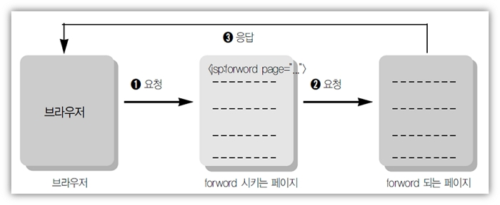

# JSP 지시자(Directive), 액션태그

## 1. JSP 지시자(Directive)

- `지시자`는 클라이언트의 요청에 JSP 페이지가 실행이 될 때 필요한 정보를 JSP 컨테이너에게 알리는 역할한다.
- 지시자는 태그 안에서 `@`으로 시작하며, 3가지 종류가 있다.
- `page`, `include`, `taglib`

### (1) page 지시자

- jsp페이지에서 `지원되는 속성들을 정의`하는 것들이다.
- jsp페이지에서 JSP컨테이너에게 해당 페이지를 어떻게 처리할 것인가에 대한 페이지 정보를 알려준다.

- `info` : `페이지 설명`, jsp 페이지 `제목`을 붙이는 것과 같다.
- `language` : Jsp페이지의 스크립트 언어지정 기본값은 Java
- `contentType` : jsp의 `출력 형식 지정`, `문자 셋을 지정`합니다.

  - 형식: contentType="text/html; charset=UTF-8"
    - `<%@ page contentType="text/html; charset=UTF-8" %> `
  - JSP처리 결과가 HTML임으로 MIME Type을 'text/html'과 문자 코드(UTF-8) 선언.
  - MIME Type: 브러우저가 출력하는 데이터의 종류를 나타낸 코드값,
    - image/jpg는 이미지가 출력됨
  - HTML 태그의 META태그도 일치시켜야함(브러우저용).

```
<meta http-equiv="Content-Type" content="text/html; charset=UTF-8">
<meta http-equiv="Content-Type" content="text/html; charset=EUC-KR">
```

- `import` : 패키지의 import, `중복 사용가능`
  - 자바에서 `패키지를 사용하겠다고 선언`하는 것과 같다.
  - `<%@ page import="java.util.\*" %>`

> import.jsp

```jsp
<%@ page language="java" contentType="text/html; charset=UTF-8"
    pageEncoding="UTF-8"%>
<%@ page import="java.util.Date" %>
<!DOCTYPE html>
<html>
<head>
<meta charset="UTF-8">
<style>
	div {
		font-size:36px;
		color:#ffffff;
		background-color:#ff3399;
	}
</style>
<title>Insert title here</title>
</head>
<body>
	<div>
		<%
			Date date = new Date();
		out.print(date.toLocaleString());
		%>
	</div>
</body>
</html>
```

- 천단위마다 ','출력

> comma.jsp

```jsp
<%@ page language="java" contentType="text/html; charset=UTF-8"
    pageEncoding="UTF-8"%>
<%@ page import="java.text.DecimalFormat" %>
<%!
	public String comma(long val){
		DecimalFormat df = new DecimalFormat("￦ ###,###,### 원");
		String str = df.format(val);
		return str;
	}
%>
<!DOCTYPE html>
<html>
<head>
<style type="text/css">
	div {
		font-size:24px;
		color:#ffffff;
		background-color:#000055;
	}
</style>
<meta charset="UTF-8">
<title>Insert title here</title>
</head>
<body>
	<h1>6월 급여 명세서</h1>
	<div>
		본봉:<%=comma(1800000) %><br>
		수당:<%=comma(200000) %><br>
		<span style='color:#ff0000'>
			세금:<%=comma(100000) %>
		</span><br>
		실수령액:<%=comma(1900000) %><br>
		<span style='color:#00ff00'>수고하셨습니다.</span>
	</div>
</body>
</html>
```

- `pageEncoding` : jsp1.2에 추가된 규약으로 jsp페이지의 문자셋 형식을 지정
  `<%@ page pageEncoding="UTF-8" contentType="text/html" %>`

### (2) include 지시자

- 여러 jsp페이지에서 공통적으로 포함하는 내용이 있을 때 이러한 내용을 매번 입력하지 않고 파일에 저장한 후 JSP파일에 포함해서 실행한다.
- 처리 결과가 합쳐지는 것이 아니라 파일의 소스가 하나의 파일에 합쳐진 다음 실행된다.

```
list.jsp 소스 + ssi.jsp 소스 = jsp 통합 큰 소스 ==> 실행

```

- 사용 방법

```
<%@ include file="Local URL" %>
<%@ include file="./ssi.jsp" %>
```

> top.jsp

```

```

> bottom.jsp

```

```

> directive.jsp

```

```

## 2. 액션태그

- `JSP 문법`이다.
- 액션 태그의 종류는 include, forward, useBean, setProperty, getProperty 등이 있다.
- `useBean`, `setProperty`, `getProperty`

  - 자바빈즈(JavaBeans)와 통신을 위해서 구현한 액션태그이다.

- `forward`
  - `다른 페이지로 이동`할 때 사용하는 태그이다.



- forward 액션태그 예제(3파일)

> forwardTag1.html

```jsp
<%@ page language="java" contentType="text/html; charset=UTF-8"
    pageEncoding="UTF-8"%>
<!DOCTYPE html>
<html>
<head>
<meta charset="UTF-8">
<title>Insert title here</title>
</head>
<body>
	<h1>Forward Tag Example1</h1>
	<form method=post action="forwardTag1_1.jsp">
		아이디 : <input name="id"><p/>
		패스워드 : <input type="password" name="pwd"><p/>
		<input type="submit" value="보내기">
	</form>
</body>
</html>
```

> forwardTag1_1.jsp

```jsp
<%@ page language="java" contentType="text/html; charset=UTF-8"
    pageEncoding="UTF-8"%>
<!DOCTYPE html>
<html>
<head>
<meta charset="UTF-8">
<title>Insert title here</title>
</head>
<body>
	<h1>Forward Tag Example1</h1>
	Forward Tag의 포워딩 되기 전의 페이지입니다.
	<jsp:forward page="forwardTag1_2.jsp"></jsp:forward>
</body>
</html>
```

> forwardTag1_2.jsp

```jsp
<%@ page language="java" contentType="text/html; charset=UTF-8"
    pageEncoding="UTF-8"%>
<%
	String id = request.getParameter("id");
	String pwd = request.getParameter("pwd");
%>
<!DOCTYPE html>
<html>
<head>
<meta charset="UTF-8">
<title>Insert title here</title>
</head>
<body>
	<h1>Forward Tag Example1</h1>
	당신의 아이디는<b><%=id%></b>이고<p/>
	패스워드는 <b><%=pwd%></b> 입니다.
</body>
</html>
```

- <jsp:param/> forward되는 페이지에서 값을 전달 받을 수 있다.
- (3파일) 다운로드 받아서 Webcontent폴더에 넣어둔다.
