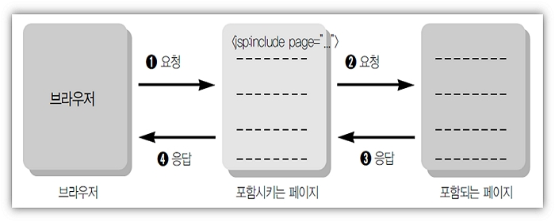
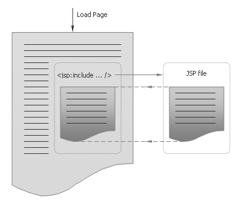
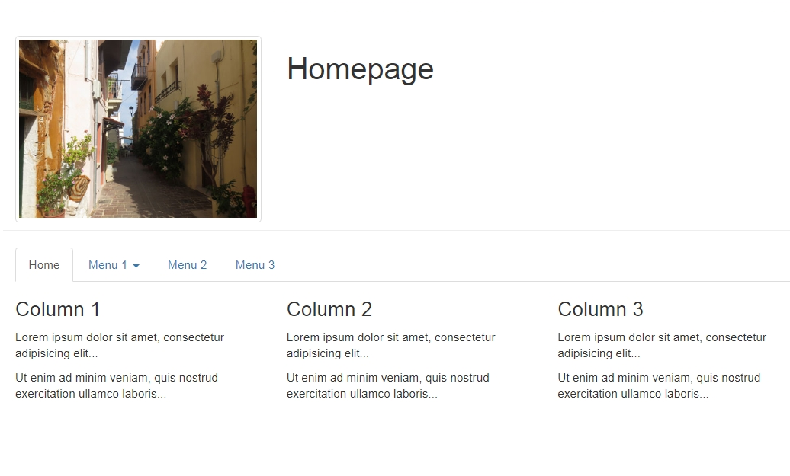

# Include 액션태그, Menu페이지 제작, JSP Template 생성

## Include 액션태그

- `<%@ include file="./ssi.jsp" %>`
  : ssi.jsp의 JSP 소스가 그대로 복사되어 원본 파일에 추가됨.

- `<jsp:include page="/menu/top.jsp" flush="false"/>`
  : top.jsp가 처리가 되고 나서 HTML로 변경된 결과가 포함.



- include 액션태그는 include 지시자 처럼 다른페이지를 현재 페이지에 포함시킬 수 있는 기능을 가진다.
- include 액션태그는 include 지시자와 다르게 포함시킬 페이지의 처리결과를 포함한다.
- include 액션태그의 flush 속성은 포함될 페이지로 이동할 때 현재 페이지가 지금까지 출력버퍼에 저장한 결과를 어떻게 처리할 것인가를 결정한다.
- flush = 'true' 이면 포함할 페이지의 내용을 삽입하기 이전에 현재 페이지가 지금까지 버퍼에 저장한 내용을 출력한다.



<br />

## Menu 페이지 제작

- menu는 jsp : include Action 태그를 사용해야 페이지간 간섭을 피할 수 있다.
- include 지시자를 사용하면 같은 변수가 2번이상 선언될 경우 소스 충돌로 에러 발생.

- menu Layout

```
──────────────────────
      상단 주메뉴
        top.jsp
──────────────────────

        내  용


─────────────────────
      하단 메뉴
      bottom.jsp
─────────────────────
```



<br />

### 1. 페이지를 분할하지 않은 통합 소스

> /webapp/menu/index.html

```html
<!DOCTYPE html>
<html lang="en">
  <head>
    <title>Bootstrap Example</title>
    <meta charset="utf-8" />
    <meta name="viewport" content="width=device-width, initial-scale=1" />
    <link
      rel="stylesheet"
      href="https://maxcdn.bootstrapcdn.com/bootstrap/3.4.0/css/bootstrap.min.css"
    />
    <script src="https://ajax.googleapis.com/ajax/libs/jquery/3.3.1/jquery.min.js"></script>
    <script src="https://maxcdn.bootstrapcdn.com/bootstrap/3.4.0/js/bootstrap.min.js"></script>
  </head>

  <body>
    <!--상단메뉴-->
    <div class="container">
      <div class="page-header row">
        <div class="col-sm-4">
          
        </div>
        <div class="col-sm-8"><h1>Homepage</h1></div>
      </div>
      <ul class="nav nav-tabs">
        <li class="active"><a href="#">Home</a></li>
        <li class="dropdown">
          <a class="dropdown-toggle" data-toggle="dropdown" href="#"
            >Menu 1 <span class="caret"></span
          ></a>
          <ul class="dropdown-menu">
            <li><a href="#">Submenu 1-1</a></li>
            <li><a href="#">Submenu 1-2</a></li>
            <li><a href="#">Submenu 1-3</a></li>
          </ul>
        </li>
        <li><a href="#">Menu 2</a></li>
        <li><a href="#">Menu 3</a></li>
      </ul>
    </div>

    <!--내용-->
    <div class="container">
      <div class="row">
        <div class="col-sm-4">
          <h3>Column 1</h3>
          <p>Lorem ipsum dolor sit amet, consectetur adipisicing elit...</p>
          <p>
            Ut enim ad minim veniam, quis nostrud exercitation ullamco
            laboris...
          </p>
        </div>
        <div class="col-sm-4">
          <h3>Column 2</h3>
          <p>Lorem ipsum dolor sit amet, consectetur adipisicing elit...</p>
          <p>
            Ut enim ad minim veniam, quis nostrud exercitation ullamco
            laboris...
          </p>
        </div>
        <div class="col-sm-4">
          <h3>Column 3</h3>
          <p>Lorem ipsum dolor sit amet, consectetur adipisicing elit...</p>
          <p>
            Ut enim ad minim veniam, quis nostrud exercitation ullamco
            laboris...
          </p>
        </div>
      </div>
    </div>
  </body>
</html>
```

<br />

### 2. 상단 메뉴의 구성

> /webapp/menu/top.jsp

```jsp
<%@ page language="java" contentType="text/html; charset=UTF-8"
    pageEncoding="UTF-8"%>
<%  String root = request.getContextPath(); %>
<!DOCTYPE html>
<html>
<head>
<meta charset="UTF-8">
<title>Insert title here</title>
<link rel="stylesheet" href="https://maxcdn.bootstrapcdn.com/bootstrap/3.4.0/css/bootstrap.min.css">
<script src="https://ajax.googleapis.com/ajax/libs/jquery/3.3.1/jquery.min.js"></script>
<script src="https://maxcdn.bootstrapcdn.com/bootstrap/3.4.0/js/bootstrap.min.js"></script>
</head>

<body>
<div class="container">
  <div class="page-header row">
   <div class="col-sm-4">
    /images/img_chania.jpg" class="img-responsive img-thumbnail" alt="Cinque Terre" >
   </div>
   <div class="col-sm-8"><h1>Homepage</h1></div>
  </div>
  <ul class="nav nav-tabs">
    <li class="active"><a href="<%=root%>/index.jsp">Home</a></li>
    <li class="dropdown">
      <a class="dropdown-toggle" data-toggle="dropdown" href="#">게시판<span class="caret"></span></a>
      <ul class="dropdown-menu">
        <li><a href="<%=root%>/bbs/createForm.jsp">생성</a></li>
        <li><a href="<%=root%>/bbs/list.jsp">목록</a></li>
      </ul>
    </li>
    <li class="dropdown">
      <a class="dropdown-toggle" data-toggle="dropdown" href="#">메모<span class="caret"></span></a>
      <ul class="dropdown-menu">
        <li><a href="<%=root%>/memo/createForm.jsp">생성</a></li>
        <li><a href="<%=root%>/memo/list.jsp">목록</a></li>
      </ul>
    </li>
    <li><a href="#">Menu 2</a></li>
    <li><a href="#">Menu 3</a></li>
  </ul>
</div>
</body>
</html>
```

<br />

### 3. 하단 메뉴의 구성

> /webapp/menu/bottom.jsp

<br />

### 4. jsp 사용예

> /webapp/index.jsp

```jsp
<%@ page language="java" contentType="text/html; charset=UTF-8"
    pageEncoding="UTF-8"%>
<!DOCTYPE html>
<html>
<head>
<meta charset="UTF-8">
<title>Insert title here</title>
</head>

<body>
<jsp:include page="/menu/top.jsp"></jsp:include>
<div class="container">
  <div class="row">
    <div class="col-sm-4">
      <h3>Column 1</h3>
      <p>Lorem ipsum dolor sit amet, consectetur adipisicing elit...</p>
      <p>Ut enim ad minim veniam, quis nostrud exercitation ullamco laboris...</p>
    </div>
    <div class="col-sm-4">
      <h3>Column 2</h3>
      <p>Lorem ipsum dolor sit amet, consectetur adipisicing elit...</p>
      <p>Ut enim ad minim veniam, quis nostrud exercitation ullamco laboris...</p>
    </div>
    <div class="col-sm-4">
      <h3>Column 3</h3>
      <p>Lorem ipsum dolor sit amet, consectetur adipisicing elit...</p>
      <p>Ut enim ad minim veniam, quis nostrud exercitation ullamco laboris...</p>
    </div>
  </div>
</div>
</body>
</html>
```

<br />

## JSP Template 변경

[Window --> Preferences --> Web --> JSP Files --> Editor --> Templates]

- Name : JSP_HTML5
- Context : New JSP
- Description: 새로운 HTML5 기반 JSP 생성시 기초 소스

<br />

### 1. New JSP_HTML5

```jsp
<%@ page contentType="text/html; charset=UTF-8" %>

<!DOCTYPE html>
<html>
<head>
  <title>homepage</title>
  <meta charset="utf-8">
</head>
<body>
<jsp:include page="/menu/top.jsp"/>
<div class="container">
<h1 class="col-sm-offset-2 col-sm-10">제목</h1>
<form class="form-horizontal"
      action="Proc.jsp"
      method="post"
      >

  <div class="form-group">
    <label class="control-label col-sm-2" for="title">제목</label>
    <div class="col-sm-6">
      <input type="text" name="title" id="title" class="form-control">
    </div>
  </div>

  <div class="form-group">
    <label class="control-label col-sm-2" for="content">내용</label>
    <div class="col-sm-6">
    <textarea rows="5" cols="5" id="content" name="content" class="form-control"></textarea>
    </div>
  </div>

   <div class="form-group">
   <div class="col-sm-offset-2 col-sm-5">
    <button class="btn">등록</button>
    <button type="reset" class="btn">취소</button>
   </div>
 </div>
</form>
</div>
</body>
</html>
```
