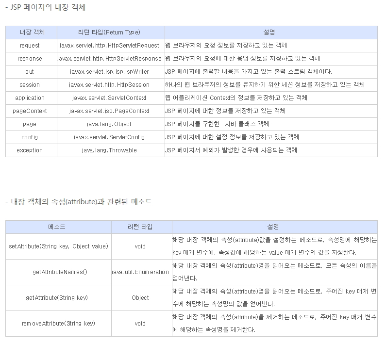
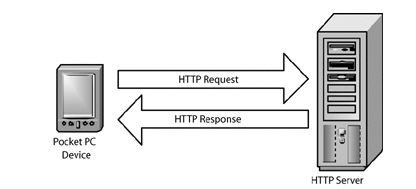
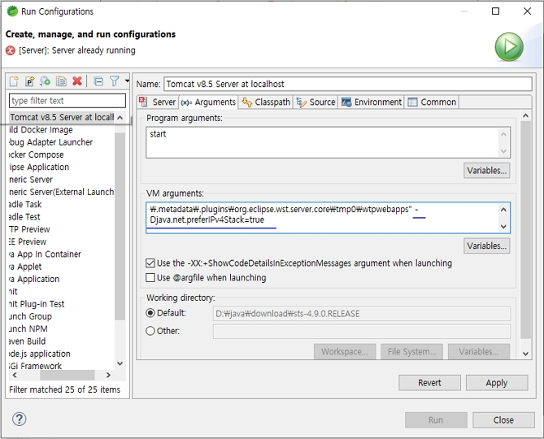
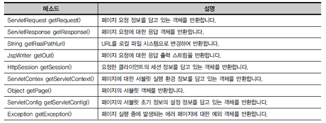
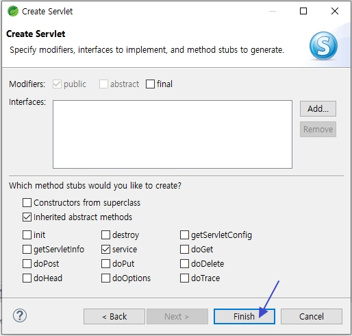

# JSP 내부객체, 서블릿 기초 문법

## JSP 내부객체



### 1. JSP 내부객체의 이해

- 개발자가 객체를 생성하지 않아도 jsp페이지가 서블릿 컨테이너(Tomcat)로 로딩되면 Tomcat등 서버가 자동으로 생성하는 객체이다.
- 개발자는 반복적인 작업을 줄이고 필요한 작업만 할수 있다.
- jsp페이지는 Web서버 및 Servlet Container라고 하는 복잡한 환경에서 실행이 되기 때문에, 실행중에 여러가지 상태정보를 가지고 있어야 하는데, 이런 경우에 사용되는 객체들이 내부 객체들이다.
- 내부 객체로 인해 개발자는 좀더 쉽게 JSP 프로그래밍이 가능함.

<br />

#### (1) request, response, out

- 클라이언트로 부터 jsp 페이지의 호출에 의해서 전달되는 데이터 요청과 응답, 출력의 역할을 한다.
  - request 내부 객체



- javax.servlet.http.HttpServletRequest Interface를 Tomcat등 서버가 구현한 객체, 자동화된 객체, 개발자는 사용만함.
- `<FORM>`에서 입력되어 브러우저가 전송한 데이터를 Tomcat 서버의 JSP에서 처리할수 있도록 객체로 가져오는 역할을 한다
- `?` : 파라메터를 보낸다는 뜻
- `&` : 접속자가 보내는 값이 2개 이상인 경우

[실행결과]
http://localhost:8000/jsptest/request.jsp?pay=3000000&name=홍길동&java=100&jsp=90&spring=90

1. http://localhost:8000/jsptest/request.jsp
2. /jsptest/request.jsp
3. 사용자로부터 입력을 받을 경우

```
급여: 3000000
```

4. 사용자로부터 입력값이 여러 개인 경우

```
급여: 3000000
성명: 홍길동
JAVA: 100
JSP: 90
Spring: 90
총점: 280
평균: 93
```

<br />

> request.jsp

```jsp
<%@ page contentType="text/html; charset=UTF-8" %>

<!DOCTYPE html>
<html>
<head>
  <title>homepage</title>
  <meta charset="utf-8">
</head>
<body>
<div class="container">
1. <%=request.getRequestURL() %><br>
2. <%=request.getRequestURI() %><br>
3. 사용자로부터 입력을 받는 경우<br>
	급여 : <%=request.getParameter("pay") %><br>
	성명 : <%=request.getParameter("name") %><br>
<%
	int java = Integer.parseInt(request.getParameter("java"));
	int jsp = Integer.parseInt(request.getParameter("jsp"));
	int spring = Integer.parseInt(request.getParameter("spring"));
	int tot = java+jsp+spring;
	int avg = tot / 3;
%>
	JAVA : <%=java %> <br>
	JSP : <%=jsp %> <br>
	Spring : <%=spring %> <br>
	총점 : <%=tot %> <br>
	평균 : <%=avg %> <br>
</div>
</body>
</html>
```

<br />

- 접속한 클라이언트에 대한 정보도 알 수 있다.
- 웹브라우저와 웹 서버의 정보 반환

> request2.jsp

```jsp
<%@ page contentType="text/html;charset=UTF-8"%>
<%
String protocol = request.getProtocol();
String serverName = request.getServerName();
int serverPort = request.getServerPort();
String remoteAddr = request.getRemoteAddr();
String remoteHost = request.getRemoteHost();
String method = request.getMethod();
StringBuffer requestURL = request.getRequestURL();
String requestURI = request.getRequestURI();
String useBrowser = request.getHeader("User-Agent");
String fileType = request.getHeader("Accept");
%>
<h1>Request Example2</h1>
프로토콜 :
<%=protocol%><p />
서버의 이름 :
<%=serverName%><p />
서버의 포트 번호 :<%=serverPort%><p />
사용자 컴퓨터의 주소 :
<%=remoteAddr%><p />
사용자 컴퓨터의 이름 :
<%=remoteHost%><p />
사용 method :
<%=method%><p />
요청 경로(URL) :
<%=requestURL%><p />
요청 경로(URI) :
<%=requestURI%><p />
현재 사용하는 브라우저 :
<%=useBrowser%><p />
브라우저가 지원하는 file의 type :
<%=fileType%><p />
```

※ ip가 0:0:0:0:0:0:0:1 일때 해결
메뉴 Run -> Run Configurations -> Arguments 탭 -> -Djava.net.preferIPv4Stack=true 추가



<br />

- response내부 객체

  - javax.servlet.http.HttpServletResponse Interface를 Tomcat등 서버가 구현한 객체, 자동화된 객체, 개발자는 사용만함.
  - 처리 결과를 클라이언트(웹 브러우저)에게 출력할 목적을 가지고 있다.
  - out 객체는 response 객체로부터 생성한다.
  - sendRedirect(): 데이터 처리를 한후 특정 페이지로 자동으로 주소 이동. 요청자체가 새로운 요청으로 바뀐다.
  - 기상청으로 이동: http://www.kma.go.kr

> response.jsp

```jsp
<%@ page contentType="text/html; charset=UTF-8" %>

<!DOCTYPE html>
<html>
<head>
  <title>homepage</title>
  <meta charset="utf-8">
</head>
<body>
<%
	response.sendRedirect("http://www.kma.go.kr");
%>
</body>
</html>
```

<br />

- out 내부 객체

  - jsp페이지 결과를 클라이언트에 전송해 주는 출력 스트림을 나타낸다.
  - javax.servlet.jsp.JspWriter Class의 객체
  - out 객체는 response객체에서 생성된다.
  - `out.print("접속에 성공했습니다.")` HTML이 모두 한줄로 생성됨, 소스 분석 어려움
  - `out.println("접속에 성공했습니다.")` 호출될 때마다 HTML코드를 생성하고 새로운 라인으로 이동함.
  - System.out.print(), System.out.println()은 디버깅 정보를 콘솔창에 출력하는 용도로 사용 (변수의 변화를 추적하기 위한 용도, 관리, 에러 수정목적)

> out.jsp

```jsp
<%@ page contentType="text/html; charset=UTF-8" buffer="5kb" %>
<%
	int totalbuffer = out.getBufferSize();
	int remainbuffer = out.getRemaining();
	int useBuffer = totalbuffer - remainbuffer;
%>
<h1>Out example1</h1>
<b>현재 페이지의 버퍼상태</b><p />
출력 buffer 전체 크기 : <%=totalbuffer %>byte<p />
남은 buffer 크기 : <%=remainbuffer %>byte<p />
현재 buffer의 사용량 : <%=useBuffer %>byte<p />
```

<br />

#### (2) session, application, pageContext

- 실행되는 페이징지의 외부환경정보(context)와 관련된 내부 객체들이다.
- session은 요청에 관한 Context를 제공한다.
- application은 서블릿 Context를 제공한다.
- pageContext는 jsp 페이지 자체의 Context를 제공한다.

- session
  - 세션은 요청을 시도한 특정클라이언트와 다른 클라이언트와 구별하여 각각의 클라이언트에 대한 정보를 지속적으로 관리할 수 있다.

> session.html

```html
<!DOCTYPE html>
<html>
  <head>
    <meta charset="UTF-8" />
    <title>Insert title here</title>
  </head>
  <body>
    <h1>Session Example1</h1>
    <form method="post" action="session.jsp">
      아이디 : <input name="id" />
      <p />
      비밀번호 : <input type="password" name="pwd" />
      <p />
      <button>로그인</button>
    </form>
  </body>
</html>
```

> session.jsp

```jsp
<%@ page contentType="text/html; charset=UTF-8" %>
<%
	String id = request.getParameter("id");
	String pwd = request.getParameter("pwd");
	session.setAttribute("idKey",id);
	session.setMaxInactiveInterval(60*5);
%>

<!DOCTYPE html>
<html>
<head>
  <title>homepage</title>
  <meta charset="utf-8">
</head>
<body>
<jsp:include page="/menu/top.jsp"></jsp:include>
<div class="container">
<h1 class="col-sm-offset-2 col-sm-10">Session Example1</h1>
<form class="form-horizontal"
      action="session_1.jsp"
      method="post"
      >

  <div class="form-group form-dheck-inline">
    <label class="control-label col-sm-2" for="season">좋아하는 계절</label>
    <div class="col-sm-6">
      <input type="radio" name="season" id="season" value="봄" class="form-control">봄
      <input type="radio" name="season" id="season" value="여름" class="form-control">여름
      <input type="radio" name="season" id="season" value="가을" class="form-control">가을
      <input type="radio" name="season" id="season" value="겨울" class="form-control">겨울
    </div>
  </div>

  <div class="form-group">
    <label class="control-label col-sm-2" for="fruit">좋아하는 과일</label>
    <div class="col-sm-6">
      <input type="radio" name="fruit" id="fruit" value="watermelon" class="form-control">수박
      <input type="radio" name="fruit" id="fruit" value="melon" class="form-control">멜론
      <input type="radio" name="fruit" id="fruit" value="apple" class="form-control">사과
      <input type="radio" name="fruit" id="fruit" value="orange" class="form-control">오렌지
    </div>
  </div>

   <div class="form-group">
   <div class="col-sm-offset-2 col-sm-5">
    <button class="btn">결과보기</button>
    <button type="reset" class="btn">취소</button>
   </div>
 </div>
</form>
</div>
</body>
</html>
```

> session_1.jsp

```jsp
<%@ page contentType="text/html; charset=UTF-8"%>

<%
	request.setCharacterEncoding("UTF-8");
    String season = request.getParameter("season");
    String fruit = request.getParameter("fruit");
    String id = (String)session.getAttribute("idKey");
    String sessionId = session.getId();
    int intervalTime = session.getMaxInactiveInterval();
    if(id != null){
%>
<h1>Session Example</h1>
<b><%=id%></b>님이 좋아하시는 계절과 과일은<p/>
<b><%=season%></b>과 <b><%=fruit%></b> 입니다.<p/>
세션 ID : <%=sessionId%><p>
세션 유지 시간 : <%=intervalTime%>초<p/>
<%
	session.invalidate();

    }else{
    	out.println("세션의 시간이 경과를 하였거나 다른 이유로 연결을 할 수가 없습니다.");
    }
%>
```

<br />

- application

  - 서블릿 또는 어플리케이션 외부 환경 정보(contenxt)를 나타낸다
  - 서버의 정보와 서버측 자원에 대한 정보를 얻을 수 있다.
  - javax.servlet.ServletContext 인터페이스의 구현 객체
  - 서블릿이 서블릿 컨테이너(Tomcat)에서 실행 될 때의 환경 정보를 저장
  - 절대 경로 추출시 JSP 형식

  ```
  String upDir = "/pds/storage";
  upDir = application.getRealPath(upDir);
  ```

> application.jsp

```jsp
<%@ page language="java" contentType="text/html; charset=UTF-8"
    pageEncoding="UTF-8"%>
<%
	String serverInfo = application.getServerInfo();
	String mimeType = application.getMimeType("request.jsp");
	String realPath = application.getRealPath("/");
	application.log("application 내부 객체 로그 테스트");
%>
<!DOCTYPE html>
<html>
<head>
<meta charset="UTF-8">
<title>Insert title here</title>
</head>
<body>
<h1>Application Example</h1>
서블릿 컨테이너의 이름과 버전 :<%=serverInfo%><p />
request.jsp의 Mime Type :<%=mimeType%><p />
로컬 파일 시스템 경로 :<%=realPath%>
</body>
</html>
```

<br />

- pageContext

  - Jsp페이지의 Context를 나타낸다.
  - pageContext 내부객체를 통해서 다른 내부객체를 접근할 수 있다.
  - out내부객체 가져오는 방법 : `JspWriter pageOut = pageContext.getOut();`
  - javax.servlet.jsp.PageContext 클래스 타입으로 제공된다.



<br />

#### (3) page, config

- page 내부객체와 config내부객체를 통해서 jsp페이지가 변환된 서블릿관 관련된 내용에 접근할 수 있도록 하는 객체들이다.
- page
  - Jsp페이지 그 자체를 나타내는 객체이다.
  - Jsp페이지에서 page객체는 this 키워드로 자기 자신을 참조한다.

> page.jsp

```
<%@ page info = "study.co.kr"
    contentType="text/html;charset=UTF-8"%>

<%
String pageInfo = this.getServletInfo();
%>

<h1>Page Example1</h1>
현재 페이지의 info값 : <%=pageInfo%>
```

<br />

- config
  - javax.servlet.ServletConfig 클래스 타입의 내부 객체이다.
  - 서블릿이 초기화될 때 참조해야 할 다른 여러 정보를 가지고 있다가 전해준다.


<br />

#### (4) exception 내부객체

- Jsp 페이지에서 발생한 예외를 처리하는 페이지를 지정한 경우 에러페이지에 전달되는 예외 객체이다.
- page지시자 isErrorPage속성을 true로 지정한 Jsp페이지에서만 사용가능하다.

> exception.jsp

```jsp
<%@ page language="java" contentType="text/html; charset=UTF-8"
    pageEncoding="UTF-8" errorPage="exception2.jsp"%>
<%
	int one = 1;
	int zero = 0;
%>
<!DOCTYPE html>
<html>
<head>
<meta charset="UTF-8">
<title>Insert title here</title>
</head>
<body>
	<h1>Exception Example</h1>
	one/zero = <%=one/zero %><p/>
</body>
</html>
```

> exception2.jsp

```jsp
<%@ page language="java" contentType="text/html; charset=UTF-8"
    pageEncoding="UTF-8" isErrorPage="true"%>
<%
   String message = exception.getMessage();
   String objectMessage = exception.toString();
%>
<!DOCTYPE html>
<html>
<head>
<meta charset="UTF-8">
<title>Insert title here</title>
</head>
<body>
에러 메세지 : <b><%=message%></b><p/>
에러 실체의 클래스명과 에러 메세지  : <b><%=objectMessage%></b><p/>
</body>
</html>
```

<br />

## 서블릿 기초 문법

### 1. 서블릿이란

- Jsp가 나오기전에 만들어진 웹페이지 생성 기술
- 서블릿은 java의 많은 장점들을 사용 할 수 있지만 html, css, js 등과 연동하기에 많은 단점이 있다
- 기업에서 사용하는 프레임워크의 기초 기술로 사용된다.
- WAS(tomcat)에서 웹페이지를 동적으로 생성하여 결과를 전송해 주는 서버 측 프로그램이다.

#### (1) 서블릿 생성

- jsptest -> src -> ch07패키기 생성 -> ch07에서 New Servlet -> class name : ExServlet 입력 후 Next -> URL Mapping 더블클릭 -> 새창에서 pattern : /ch07/ExServlet 입력 -> Next ->



> /ch07/ExServlet.java

```java
package ch07;

import java.io.IOException;
import java.io.PrintWriter;

import jakarta.servlet.ServletException;
import jakarta.servlet.annotation.WebServlet;
import jakarta.servlet.http.HttpServlet;
import jakarta.servlet.http.HttpServletRequest;
import jakarta.servlet.http.HttpServletResponse;

/**
 * Servlet implementation class ExServlet
 */
@WebServlet("/ch07/ExServlet")
public class ExServlet extends HttpServlet {
	private static final long serialVersionUID = 1L;

	/**
	 * @see HttpServlet#service(HttpServletRequest request, HttpServletResponse response)
	 */
	protected void service(HttpServletRequest request, HttpServletResponse response) throws ServletException, IOException {
		response.setContentType("text/html;charset=utf-8");
		PrintWriter out = response.getWriter();
		out.print("<html>");
		out.print("<body>");
		out.print("<h1>이클립스로 서블릿 만들기</h1>");
		out.print("</body>");
		out.print("</html>");
	}
}
```

- ch07.ExServlet 선택후 실행하기 <br />
  http://localhost:8000/jsptest/ch07/ExServlet

<br />

#### (2) 서블릿의 주요 클래스

- HttpServlet
  - 서블릿을 만들기 위해서 반드시 상속해야 할 필수 클래스스
  - Servlet 인터페이스 > GenericServlet 추상클래스 > HttpServlet 상속구조
  - 위에서 제공되는 많은 메소드사용 가능


- HttpServletRequest
  - 클라이언트가 데이터를 입력하거나 클라이언트의 정보에 대한 요청 값을 가지고 있다.


- HttpServletResponse
  - 클라이언트가 요청한 정보를 처리하고 응답을 위한 정보를 담고 있다.


- HttpSession
  - 클라이언트가 세션정보를 저장하고, 세션 기능을 유지 하기 위해서 제공된다.


<br />

#### (3) 서블릿의 라이프 사이클


> ch07/ExServlet2.java

```java
package ch07;

import jakarta.servlet.ServletConfig;
import jakarta.servlet.ServletException;
import jakarta.servlet.annotation.WebServlet;
import jakarta.servlet.http.HttpServlet;
import jakarta.servlet.http.HttpServletRequest;
import jakarta.servlet.http.HttpServletResponse;
import java.io.IOException;

/**
 * Servlet implementation class ExServlet2
 */
@WebServlet("/ch07/ExServlet2")
public class ExServlet2 extends HttpServlet {
	private static final long serialVersionUID = 1L;

	/**
	 * @see Servlet#init(ServletConfig)
	 */
	public void init(ServletConfig config) throws ServletException {
		System.out.println("init() 호출");
	}

	/**
	 * @see Servlet#destroy()
	 */
	public void destroy() {
		System.out.println("destroy() 호출");
	}

	/**
	 * @see HttpServlet#service(HttpServletRequest request, HttpServletResponse response)
	 */
	protected void service(HttpServletRequest request, HttpServletResponse response) throws ServletException, IOException {
		System.out.println("service() 호출");
	}
}
```

- 실행하면 브라우저 화면에 아무것도 없이 보여진다. <br />
  http://localhost:8000/jsptest/ch07/ExServlet2

- 새로고침도 해보고 서버 콘솔창을 확인한다.<br />
  init() 호출<br />
  service() 호출<br />
  service() 호출<br />
  service() 호출

- 톰캣서버를 정지하고 서버 콘솔창을 확인한다.<br />
  destroy() 호출

<br />

### 2. 서블릿의 요청 방식

- 브라우저에서 페이지 간에 통신 할 수 있는 대표적인 방법은 form에서 제공되는 get방식과 post방식이 있다.

#### (1) get방식

- 검색이나 조건을 다른 페이지로 전송할 때 사용
- 요청시 url에 노출 되는 특징이 있있다.(보안적인 내용은 사용안함)

> getJsp.jsp

```jsp
<%@ page language="java" contentType="text/html; charset=UTF-8"
	pageEncoding="UTF-8"%>
<!DOCTYPE html>
<html>
<head>
<meta charset="UTF-8">
<title>Insert title here</title>
</head>
<body>
	<h1>Get Servlet 방식</h1>
	<form method="get" action="./ch07/getServlet">
		msg : <input name="msg"> <button>전송</button>
	</form>
</body>
</html>
```

> ch07/GetServlet.java

```java
package ch07;

import java.io.IOException;
import java.io.PrintWriter;

import jakarta.servlet.ServletException;
import jakarta.servlet.http.HttpServlet;
import jakarta.servlet.http.HttpServletRequest;
import jakarta.servlet.http.HttpServletResponse;

/**
 * Servlet implementation class GetServlet
 */
public class GetServlet extends HttpServlet {
	private static final long serialVersionUID = 1L;

	/**
	 * @see HttpServlet#doGet(HttpServletRequest request, HttpServletResponse response)
	 */
	protected void doGet(HttpServletRequest request, HttpServletResponse response) throws ServletException, IOException {
		// TODO Auto-generated method stub
		String msg = request.getParameter("msg");
        response.setContentType("text/html; charset=UTF-8");
        PrintWriter out = response.getWriter();
        out.println("<html>");
        out.println("<body>");
        out.println("<h1> Get Servlet 방식 </h1>");
        out.println("<h2> msg : "+msg+" </h2>");
        out.println("</body>");
        out.println("</html>");
	}
}
```

<br />

#### (2) post방식

- 게시판에 글을 입력하거나 또는 회원가입을 하는 기능으로 다른 페이지로 전송할 때 사용하는 방식이다.
- url에 노출되지 않고 html 헤더 값에 같이 전송된다.
- 일반적으로 DB 연동을 한다면 insert, update, update 이런 쿼리문을 실행할 때 사용되는 방식이다.

> postJsp.jsp

```jsp
<%@ page language="java" contentType="text/html; charset=UTF-8"
	pageEncoding="UTF-8"%>
<!DOCTYPE html>
<html>
<head>
<meta charset="UTF-8">
<title>Insert title here</title>
</head>
<body>
	<h1>Post Servlet 방식</h1>
	<form method="post" action="./ch07/postServlet">
		id : <input name="id"><br />
		pwd : <input type="password" name="pwd"><br />
		email : <input type="email" name="email"><br />
		<button>가입</button>
	</form>
</body>
</html>
```

> /ch07/PostServlet.java

```java
package ch07;

import java.io.IOException;
import java.io.PrintWriter;

import jakarta.servlet.ServletException;
import jakarta.servlet.annotation.WebServlet;
import jakarta.servlet.http.HttpServlet;
import jakarta.servlet.http.HttpServletRequest;
import jakarta.servlet.http.HttpServletResponse;

/**
 * Servlet implementation class PostServlet
 */
@WebServlet("/ch07/postServlet")
public class PostServlet extends HttpServlet {
	private static final long serialVersionUID = 1L;

	/**
	 * @see HttpServlet#doPost(HttpServletRequest request, HttpServletResponse response)
	 */
	protected void doPost(HttpServletRequest request, HttpServletResponse response) throws ServletException, IOException {
		request.setCharacterEncoding("UTF-8");
        String id = request.getParameter("id");
        String pwd = request.getParameter("pwd");
        String email = request.getParameter("email");
        response.setContentType("text/html; charset=UTF-8");
        PrintWriter out = response.getWriter();
        out.println("<html>");
        out.println("<body>");
        out.println("<h1>Post Servlet 방식</h1>");
        out.println("<h3>id : "+ id + "</h3>");
        out.println("<h3>pwd : "+ pwd + "</h3>");
        out.println("<h3>email : "+ email + "</h3>");
        out.println("</body>");
        out.println("</html>");
	}
}
```
