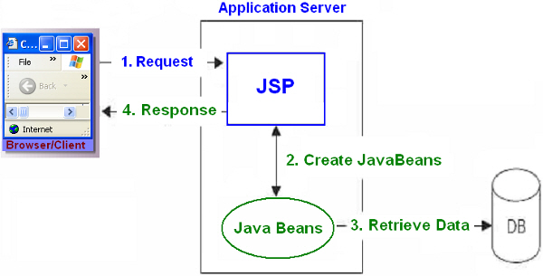
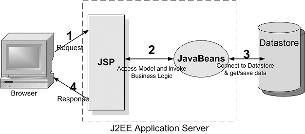

# mysql- Design Pattern, DBOpen.java, DBClose.java, BbsDTO.java

## Design Pattern, DBOpen.java, DBClose.java, BbsDTO.java

### 1. Design Pattern

- list.jsp -> BbsDAO.java -> DBOpen.java, DBClose.java -> Oracle/MySQL DBMS




<br />

### 2. DBMS Connection 관리자 클래스

> Constant.java

```java
package utility;

public class Constant {
  public static final String DRIVER = "com.mysql.cj.jdbc.Driver";
  public static final String URL = "jdbc:mysql://127.0.0.1:3306/webtest?useUnicode=true&characterEncoding=utf8";
  public static final String USER = "javauser";
  public static final String PASSWD = "";
}

```

> DBOpen.java

```java
package utility;

import java.sql.Connection;
import java.sql.DriverManager;

public class DBOpen {
  private static Connection con;

  public static Connection getConnection() {
    try {
      Class.forName(Constant.DRIVER);
      con = DriverManager.getConnection(Constant.URL, Constant.USER, Constant.PASSWD);

    } catch (ClassNotFoundException e) {
      // TODO Auto-generated catch block
      e.printStackTrace();
    } catch (Exception e) {
      // TODO Auto-generated catch block
      e.printStackTrace();
    }

    return con;
  }
}
```

> DBClose.java

```java
package utility;

import java.sql.Connection;
import java.sql.PreparedStatement;
import java.sql.ResultSet;
import java.sql.SQLException;

public class DBClose {
  public static void close(Connection con) {
    try {
      if (con != null)
        con.close();
    } catch (SQLException e) {
      // TODO Auto-generated catch block
      e.printStackTrace();
    }
  }

  public static void close(PreparedStatement pstmt, Connection con) {
    try {
      if (pstmt != null)
        pstmt.close();
    } catch (SQLException e) {
      // TODO Auto-generated catch block
      e.printStackTrace();
    }
    try {
      if (con != null)
        con.close();
    } catch (SQLException e) {
      // TODO Auto-generated catch block
      e.printStackTrace();
    }
  }

  public static void close(ResultSet rs, PreparedStatement pstmt, Connection con) {
    try {
      if (rs != null)
        rs.close();
    } catch (SQLException e) {
      // TODO Auto-generated catch block
      e.printStackTrace();
    }
    try {
      if (pstmt != null)
        pstmt.close();
    } catch (SQLException e) {
      // TODO Auto-generated catch block
      e.printStackTrace();
    }
    try {
      if (con != null)
        con.close();
    } catch (SQLException e) {
      // TODO Auto-generated catch block
      e.printStackTrace();
    }
  }
}
```

<br />

### 3. mysql과 java 연동 테스트

- src/main/webapp/WEB-INF/lib/mysql-connector-java-8.0.27.jar

> JDBC_Test.java

```java
package utility;

import java.sql.Connection;
import java.sql.PreparedStatement;
import java.sql.ResultSet;
import java.sql.SQLException;

public class JDBC_Test {
	public static void main(String[] args) {
		Connection con = DBOpen.getConnection();
		PreparedStatement pstmt = null;
		ResultSet rs = null;

		String sql = "SELECT COUNT(*) cnt FROM information_schema.tables "
				+ "WHERE table_schema = 'webtest'";
		try {
			pstmt = con.prepareStatement(sql);
			rs = pstmt.executeQuery();

			if(rs.next()) {
				System.out.println("현재 webtest DB에 생성된 테이블 갯수:"+rs.getInt("cnt"));
			}
		} catch (SQLException e) {
			// TODO Auto-generated catch block
			e.printStackTrace();
		} finally {
			DBClose.close(rs, pstmt, con);
		}
	}
}
```

<br />

## 4. Utility.java 생성

- 2개 이상의 클래스에서 사용할 가능성이 있는 공통 메소드를 명시합니다.

```
package Utility;

public class Utility {

}
```

<br />

### 5. DTO(Data Transfer Object, VO: Value Object) 생성

- DTO(Data Transfer Object, Value Object, Bean, Domain)
- 하나의 레코드를 객체로 저장, 레코드가 10개이면 DTO(VO)객체도 10개가 생성
- 필드들은 접근 제한자를 전부 private으로 지정
- mysql의 char, varchar, varchar2, date는 String으로 선언
- int는 int로 선언
- float, doublue은 float 또는 double로 선언, float는 소수점아래 7, double은 15 표현
- 멤버 변수(필드)의 접근 메소드는 public으로 선언
- 필드의 주석은 `/** */`의 형태로 DOC 주석을 지정
- SELECT된 레코드가 많은 경우 오라클은 SubQuery, MySQL은 limit등을 이용해서 레코드를 분할해서 가져온다.(Paging)

- DTO 생성 과정
  - 멤버 변수(필드) 선언, 멤버 변수(필드) 주석 처리
  - 생성자, getter, setter, toString 선언

> BbsDTO.java

```java
package bbs;

public class BbsDTO {
	  /** 번호 */
	  private int bbsno;
	  /** 글쓴이 */
	  private String wname;
	  /** 제목 */
	  private String title;
	  /** 내용 */
	  private String content;
	  /** 패스워드 */
	  private String passwd;
	  /** 조회수 */
	  private int viewcnt;
	  /** 등록일 */
	  private String wdate;
	  /** 그룹 번호 */
	  private int grpno;
	  /** 답변 차수 */
	  private int indent;
	  /** 답변 순서 */
	  private int ansnum;

	public BbsDTO() {
		super();
		// TODO Auto-generated constructor stub
	}

	public BbsDTO(int bbsno, String wname, String title, String content, String passwd, int viewcnt, String wdate,
			int grpno, int indent, int ansnum) {
		super();
		this.bbsno = bbsno;
		this.wname = wname;
		this.title = title;
		this.content = content;
		this.passwd = passwd;
		this.viewcnt = viewcnt;
		this.wdate = wdate;
		this.grpno = grpno;
		this.indent = indent;
		this.ansnum = ansnum;
	}

	@Override
	public String toString() {
		return "BbsDTO [bbsno=" + bbsno + ", wname=" + wname + ", title=" + title + ", content=" + content + ", passwd="
				+ passwd + ", viewcnt=" + viewcnt + ", wdate=" + wdate + ", grpno=" + grpno + ", indent=" + indent
				+ ", ansnum=" + ansnum + "]";
	}

	public int getBbsno() {
		return bbsno;
	}

	public void setBbsno(int bbsno) {
		this.bbsno = bbsno;
	}

	public String getWname() {
		return wname;
	}

	public void setWname(String wname) {
		this.wname = wname;
	}

	public String getTitle() {
		return title;
	}

	public void setTitle(String title) {
		this.title = title;
	}

	public String getContent() {
		return content;
	}

	public void setContent(String content) {
		this.content = content;
	}

	public String getPasswd() {
		return passwd;
	}

	public void setPasswd(String passwd) {
		this.passwd = passwd;
	}

	public int getViewcnt() {
		return viewcnt;
	}

	public void setViewcnt(int viewcnt) {
		this.viewcnt = viewcnt;
	}

	public String getWdate() {
		return wdate;
	}

	public void setWdate(String wdate) {
		this.wdate = wdate;
	}

	public int getGrpno() {
		return grpno;
	}

	public void setGrpno(int grpno) {
		this.grpno = grpno;
	}

	public int getIndent() {
		return indent;
	}

	public void setIndent(int indent) {
		this.indent = indent;
	}

	public int getAnsnum() {
		return ansnum;
	}

	public void setAnsnum(int ansnum) {
		this.ansnum = ansnum;
	}
}
```

<br />

### 6. DAO(Data(DBMS) Access Object) 제작

- 데이터베이스에 접속하여 SQL을 실행하는 클래스
- BbsDAO 제작

> BbsDAO.java

```
package bbs;

public class BbsDAO {


}
```
