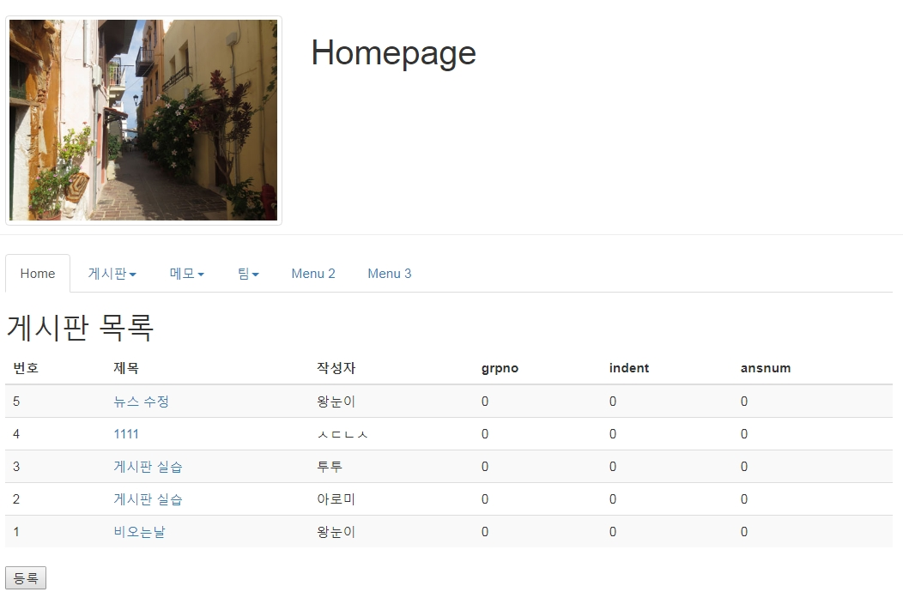
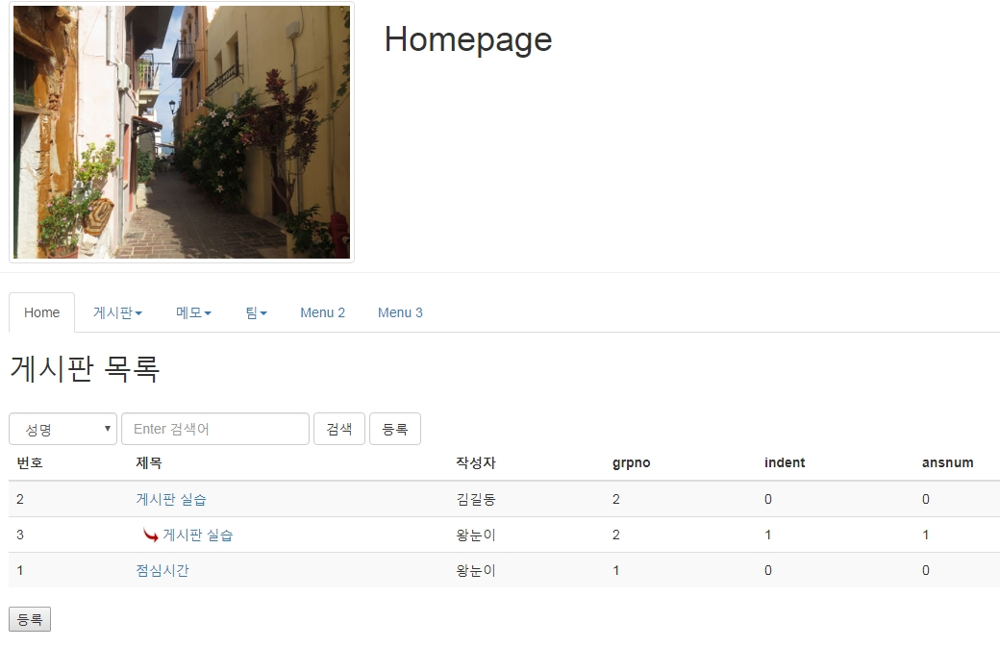

# mysql- 게시판 목록, 검색

## 게시판 목록

### 1. 목록

- ASC: 오름 차순
- DESC: 내림 차순



<br />

### 2. SQL

```sql
SELECT bbsno, wname, title, grpno, indent, ansnum
FROM bbs
ORDER BY bbsno DESC;
```

<br />

### 3. DAO 및 DAOTest

> BbsDAO.java

```java
public List<BbsDTO> list() {
    List<BbsDTO> list = new ArrayList<BbsDTO>();
    Connection con = DBOpen.open();
    PreparedStatement pstmt = null;
    ResultSet rs = null;

    StringBuffer sql = new StringBuffer();
    sql.append(" SELECT bbsno, wname, title,  grpno, indent, ansnum ");
    sql.append(" FROM bbs   ");
    sql.append(" order by bbsno desc ");

    try {
      pstmt = con.prepareStatement(sql.toString());
      rs = pstmt.executeQuery();

      while (rs.next()) {
        BbsDTO dto = new BbsDTO();
        dto.setBbsno(rs.getInt("bbsno"));
        dto.setWname(rs.getString("wname"));
        dto.setTitle(rs.getString("title"));
        dto.setGrpno(rs.getInt("grpno"));
        dto.setIndent(rs.getInt("indent"));
        dto.setAnsnum(rs.getInt("ansnum"));

        list.add(dto);
      }

    } catch (SQLException e) {
      // TODO Auto-generated catch block
      e.printStackTrace();
    } finally {
      DBClose.close(con, pstmt, rs);
    }

    return list;
  }
```

> BbsTest.java

```java
public static void main(String[] args) {
    BbsDAO dao = new BbsDAO();
    // create(dao);
    list(dao);
  }

  private static void list(BbsDAO dao) {
    List<BbsDTO> list = dao.list();
    Iterator<BbsDTO> iter = list.iterator();
    while (iter.hasNext()) {
      BbsDTO dto = iter.next();
      p(dto);
    }
  }

  private static void p(BbsDTO dto) {
    p("목록=====================");
    p("번호:" + dto.getBbsno());
    p("성명:" + dto.getWname());
    p("제목:" + dto.getTitle());
    p("조회수:" + dto.getViewcnt());
    p("날짜:" + dto.getWdate());
    p("전체--------------------");
    p("내용:" + dto.getContent());
    p("grpno:" + dto.getGrpno());
    p("indent:" + dto.getIndent());
    p("ansnum:" + dto.getAnsnum());
  }
```

<br />

### 4. 목록 페이지

> webapp/bbs/list.jsp

```jsp
<%@ page contentType="text/html; charset=UTF-8" %>
<%@ page import="java.util.*, bbs.BbsDTO, utility.*" %>
<jsp:useBean id="dao" class="bbs.BbsDAO" />
<%
    List<BbsDTO> list = dao.list();
%>
<!DOCTYPE html>
<html>
<head>
  <title>homepage</title>
  <meta charset="utf-8">
  <script type="text/javascript">
  	function read(bbsno){
  	   let url = 'read.jsp?bbsno='+bbsno;
  	   location.href = url;
  	}
  </script>
</head>
<body>
<jsp:include page="/menu/top.jsp"/>
<div class="container">
<h1 class="col-sm-offset-2 col-sm-10">게시판 목록</h1>
<form action="list.jsp" class='form-inline'>
<div class='form-group'>
 <select class='form-control' name='col'>
 	<option value="wname" <%if(col.equals("wname")) out.print("selected");%>>성명</option>
 	<option value="title" <%if(col.equals("title")) out.print("selected");%>>제목</option>
 	<option value="content" <%if(col.equals("content")) out.print("selected");%> >내용</option>
 	<option value="title_content" <%if(col.equals("title_content")) out.print("selected");%>>제목+내용</option>
 	<option value="total" <%if(col.equals("total")) out.print("selected");%>>전체출력</option>
 </select>
</div>

<div class="form-group">
	<input type='text' class='form-control' placeholder='Enter 검색어' name='word' value="<%=word%>">
</div>
<button class='btn btn-default'>검색</button>
<button class='btn btn-default' type='button' onclick="location.href='createForm.jsp'">등록</button>

</form>

<table class="table table-striped">
	<thead>
		<tr>
			<th>번호</th>
			<th>제목</th>
			<th>작성자</th>
			<th>등록날짜</th>
			<th>grpno</th>
			<th>indent</th>
			<th>ansnum</th>
		</tr>
	</thead>
	<tbody>
<%  if(list.size()==0){ %>
	<tr><td colspan='7'>등록된 글이 없습니다.</td></tr>

<%  }else {
		for(int i=0 ; i < list.size() ; i++) {
	   	BbsDTO dto = list.get(i);
%>
		<tr>
			<td><%=dto.getBbsno() %></td>
			<td>
				<%
					for(int j=0; j<dto.getIndent(); j++){
						out.print("&nbsp;&nbsp;");
					} //들여쓰기
					if(dto.getIndent() > 0) out.print(""); //re이미지
				%>
			<a href="javascript:read('<%=dto.getBbsno() %>')"><%=dto.getTitle() %></a>
			<% if(Utility.compareDay(dto.getWdate())) { %>
				
			<% } %>
			</td>
			<td><%=dto.getWname() %></td>
			<td><%=dto.getWdate() %></td>
			<td><%=dto.getGrpno() %></td>
			<td><%=dto.getIndent() %></td>
			<td><%=dto.getAnsnum() %></td>
		</tr>
<%     } //for end
    } //if end
%>
	</tbody>
</table>
<div>
	<%=paging %>
</div>
</div>
</body>
</html>
```

<br />

## 검색



### 1. SQL

```sql
SELECT bbsno, wname, title, viewcnt, wdate, grpno, indent, ansnum
FROM bbs
WHERE wname LIKE '%왕눈이%'
ORDER BY grpno DESC, ansnum ASC;
```

<br />

### 2. DAO list메소드 변경

- mysql 에서의 LIKE 사용

```sql
WHERE wname LIKE concat('%' , ? , '%')
.....
pstmt.setString(1, word);
```

> BbsDAO.java

```java
public List<BbsDTO> list(Map map) {
  List<BbsDTO> list = new ArrayList<BbsDTO>();
  Connection con = DBOpen.getConnection();
  PreparedStatement pstmt = null;
  ResultSet rs = null;

  String col = (String) map.get("col");
  String word = (String) map.get("word");
  StringBuffer sql = new StringBuffer();
  sql.append(" SELECT bbsno, wname, title,  grpno, indent, ansnum ");
  sql.append(" FROM bbs   ");

  if (word.trim().length() > 0 && col.equals("title_content")) {
    sql.append(" where title like concat('%' , ? , '%')  ");
    sql.append(" or content like concat('%' , ? , '%')  ");
  } else if (word.trim().length() > 0) {
    sql.append(" where " + col + " like concat('%' , ? , '%')  ");
  }
  sql.append(" order by grpno desc, ansnum ASC ");

  try {
    pstmt = con.prepareStatement(sql.toString());
    if (word.trim().length() > 0 && col.equals("title_content")) {
      pstmt.setString(1, word);
      pstmt.setString(2, word);
    } else if (word.trim().length() > 0) {
      pstmt.setString(1, word);
    }
    rs = pstmt.executeQuery();
    while (rs.next()) {
      BbsDTO dto = new BbsDTO();
      dto.setBbsno(rs.getInt("bbsno"));
      dto.setWname(rs.getString("wname"));
      dto.setTitle(rs.getString("title"));
      dto.setGrpno(rs.getInt("grpno"));
      dto.setIndent(rs.getInt("indent"));
      dto.setAnsnum(rs.getInt("ansnum"));
      list.add(dto);
    }
  } catch (SQLException e) {
    // TODO Auto-generated catch block
    e.printStackTrace();
  } finally {
    DBClose.close(con, pstmt, rs);
  }
  return list;
}
```

<br />

### 3. list.jsp 목록에서 검색 관련 부분

#### (1) Utility.java - null값을 빈문자열 값으로 변환

> utility/Utility.java

```java
package utility;

public class Utility {
  public static String checkNull(String str) {
    if (str == null) {
      str = "";
    }

    return str;
  }
}
```

<br />

#### (2) list.jsp에 코드 추가

> webapp/bbs/list.jsp

```java
//검색관련--------------
String col = Utility.checkNull(request.getParameter("col"));
String word = Utility.checkNull(request.getParameter("word"));

if(col.equals("total"))word = "";

Map map = new HashMap();
map.put("col",col);
map.put("word",word);

List<BbsDTO> list = dao.list(map);
```

<br />

### 4. list.jsp 목록에서의 검색 구현

```jsp
<form class="form-inline" action="./list.jsp">
    <div class="form-group">
      <select class="form-control" name="col">
        <option value="wname"
        <% if(col.equals("wname")) out.print("selected");%>
        >성명</option>
        <option value="title"
        <% if(col.equals("title")) out.print("selected");%>
        >제목</option>
        <option value="content"
        <% if(col.equals("content")) out.print("selected");%>
        >내용</option>
        <option value="title_content"
         <% if(col.equals("title_content")) out.print("selected");%>
        >제목+내용</option>
        <option value="total"
        <% if(col.equals("total")) out.print("selected");%>
        >전체출력</option>
     </select>
    </div>
    <div class="form-group">
      <input type="text" class="form-control" placeholder="Enter 검색어"
      name="word" value="<%=word%>">
    </div>
    <button type="submit" class="btn btn-default">검색</button>
    <button type="button" class="btn btn-default">등록</button>
  </form>
```

<br />

## list.jsp에서 검색 컬럼과 검색어가 유지되도록 해주세요.

```jsp
<form class="form-inline" action="./list.jsp">
    <div class="form-group">
      <select class="form-control" name="col">
        <option value="wname"
        <% if(col.equals("wname")) out.print("selected");%>
        >성명</option>
        <option value="title"
        <% if(col.equals("title")) out.print("selected");%>
        >제목</option>
        <option value="content"
        <% if(col.equals("content")) out.print("selected");%>
        >내용</option>
        <option value="title_content"
         <% if(col.equals("title_content")) out.print("selected");%>
        >제목+내용</option>
        <option value="total"
        <% if(col.equals("total")) out.print("selected");%>
        >전체출력</option>
     </select>
    </div>
    <div class="form-group">
      <input type="text" class="form-control" placeholder="Enter 검색어"
      name="word" value="<%=word%>">
    </div>
    <button type="submit" class="btn btn-default">검색</button>
    <button type="button" class="btn btn-default" onclick="location.href='./createForm.jsp'">등록</button>
  </form>
```
