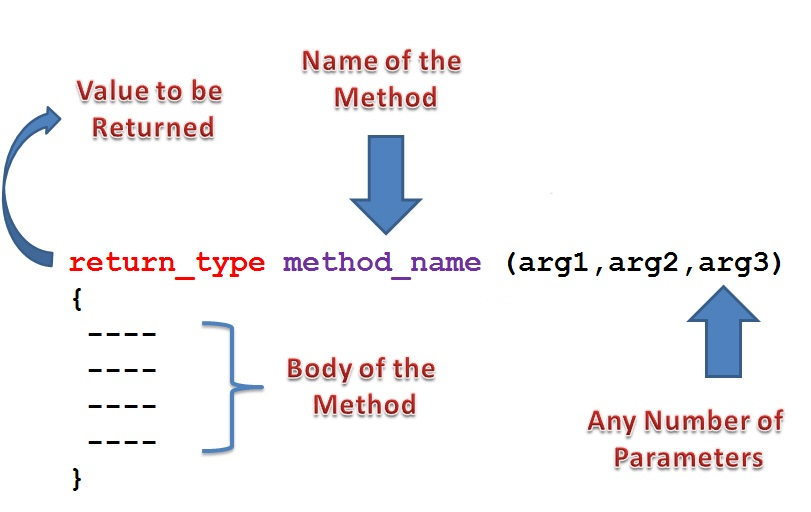

# 클래스: Member Method(멤버 메소드), 변수의 유효 범위(scope)

## 멤버 메소드

- C언어의 함수와 비슷합니다.
- `데이터 처리 기능을 구현`합니다.
- `리턴값이 없는` 메소드는 `void 형`을 지정합니다.
- 메소드가 받는 인수의 데이터 타입은 메소드를 호출하는 쪽과 일치해야 합니다.
- Method Overloading(중복 정의), Overriding(재정의)기술로 확장됩니다.
- 메소드가 리턴하는 값과 리턴되는 값의 데이터 타입은 일치해야 합니다.



<br />

### 1. PayCalc.java 파일의 Pay 클래스에 메소드 선언

#### (1) 리턴형 있는 메소드와 리턴형이 없는 메소드

- 세금계산 메소드, 실수령액 계산 메소드 선언(리턴형 존재)
- 메소드가 리턴 하는 값을 출력만 하므로 멤버변수에 값을 담을 필요가 없어 진다. 그러므로 멤버변수 tax, silsu 는 필요 없어진다.
- 데이터 출력메소드 선언(리턴형 존재안함)

```
/** 세금계산 메소드 */
public int taxCalc() {
    return (int)(bonbong * 0.045 + 0.5);
}

/** 실수령액 계산 메소드 */
public int silsuCalx() {
    return bonbong - taxCalc();
}

/** 데이터 출력메소드 */
public void printPay() {
    System.out.println("--------------------");
    System.out.println("---12월 급여 내역---");
    System.out.println("--------------------");
    System.out.println("성명: " + name);
    System.out.println("본봉: " + bonbong);
    System.out.println("세금: " + taxCalc());
    System.out.println("실수령액: " + silsuCalx());
}
```

<br />

### (2) 매개변수 있는 메소드와 매개변수 없는 메소드

- 캡슐화된 멤버변수 초기화를 위한 `setter 메소드 선언`(`매개변수 존재`)
- 캡슐화된 멤버변수의 값을 가져오기 위한 `getter 메소드 선언` (`매개변수 존재안함`)
- 멤버변수가 캡슐화 되어 다른 클래스에서 접근이 불가 될 때 setter와 getter메소드를 추가하여 사용한다.

```
public void setName(String name){
    this.name = name;
}
public String getName(){
    return name;
}

public void setBonbong(int bonbong){
    this.bonbong = bonbong;
}

public int getBonbong(){
    return bonbong;
}
```

> PayCalc.java

```
class Pay{
    private String name;       //성명, 문자열 저장
    private int    bonbong;    //본봉, 숫자

    public void setName(String name){
        this.name = name;
    }
    public String getName(){
        return name;
    }

    public void setBonbong(int bonbong){
        this.bonbong = bonbong;
    }

    public int getBonbong(){
        return bonbong;
    }

    public int taxCalc(){
       return (int)(bonbong * 0.045 + 0.5);
    }

    public int silsuCalx(){
        return bonbong - taxCalc();
    }

    public void printPay(){
    System.out.println("--------------------");
    System.out.println("---12월 급여 내역---");
    System.out.println("--------------------");
    System.out.println("성명: " + name);
    System.out.println("본봉: " + bonbong);
    System.out.println("세금: " + taxCalc());
    System.out.println("실수령액: " + silsuCalx());
    }
}

public class PayCalc {
    public static void main(String[] args) {
        Pay p1 = new Pay();
        Pay p2 = new Pay();
        Pay p3 = new Pay();

        p1.setBonbong(2000000);
        p1.setName("왕눈이");
        p1.payPrint();

        p2.setBonbong(2500000);
        p2.setName("아로미");
        p2.payPrint();

        p3.setBonbong(1500000);
        p3.setName("투투");
        p3.payPrint();
    }
}
```

> ☞ 성적처리 클래스에 총점 메소드, 평균 메소드, 출력 메소드를 추가하세요. 또한 이름과 성적초기화를 위한 setter 메소드를 추가하세요.

<br />

## 변수의 유효 범위(scope)

### 1. 멤버 변수(Instance 변수)

- 변수가 `메소드 밖에 선언되는 변수`를 말합니다.
- 멤버변수, 인스턴스 변수, 필드라고 합니다.
- 멤버 변수는 모든 메소드가 사용할 수 있습니다.
- 메모리 모델에서 `Heap 메모리를 이용`합니다.
- 변수의 사용이 끝나도 클래스의 객체 자체가 GC에 의해 회수 되기 전에는 할당받은 메모리를 계속 유지하게 됩니다. 따라서 `불필요한 멤버 변수를 최대한 사용하지 않아야 `메모리를 낭비없이 효율적으로 이용할 수 있습니다.
- 변수 선언시 값을 주지 않아도 특정 값으로 초기화 됩니다.

### 2. 지역 변수, Local Variable

- 변수가 `메소드 안에 선언되는 것`을 말합니다.
- `Stack 메모리를 이용`합니다.
- 메소드의 이용이 `끝나면 자동으로 메소드 영역이 없어지면서 변수도 회수`됩니다.
- `초기화를 해야 사용`할 수 있습니다.

> Variable.java

```
public class Variable {
    //멤버 변수, 인스턴스 변수, 필드, Heap
    String movie = "트로이";

    //지역변수가 없음으로 전역변수가 출력
    public void show(){
        System.out.println("show 메소드 영역:" + movie);//트로이
    }

    //지역변수가 우선으로 출력됩니다. Stack
    public void title(){
        String movie = "아마겟돈";
        System.out.println("title 메소드 영역:" + movie);
        System.out.println("title this.movie:" + this.movie);
    }

    public static void main(String[] args) {
        Variable v = new Variable();
        v.show();
        v.title();
    }
}
```

### 3. 블럭안에 선언: '{ }'안에서만 생명력을 가집니다.

- Stack 메모리를 이용합니다.

> Block.java

```
public class Block {
    String Block="재미있는 영화";

    public static void main(String[] args) {
        String b1="트로이";
        System.out.println("Movie:" + b1);//트로이

        {
            String b2="우주 전쟁";
            System.out.println("Movie:" + b2);
            int i=0;

            for(int j=0; j<5; j++){
                 //j는 이 블럭 안에서만 유지됩니다.
            }
            //System.out.println("j:" + j);

            for(i=0; i<5; i++){
                //i는 외부에 선언되어 있어야 합니다.
            }
            System.out.println("i:" + i);

        }
        System.out.println("Movie:" + b1);
        //ERROR
        //System.out.println("Movie:" + b2);
    }
}
```
