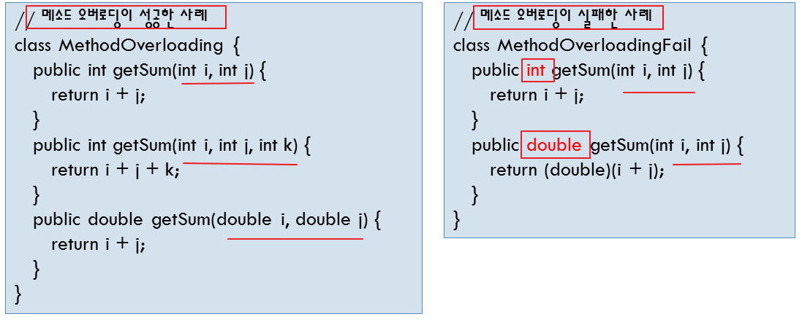
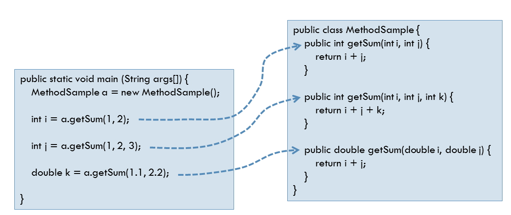
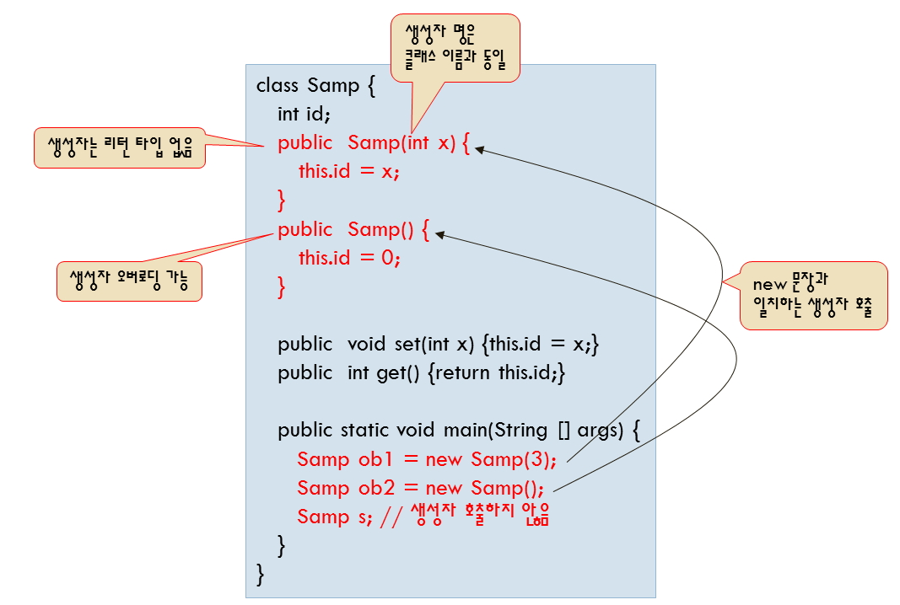
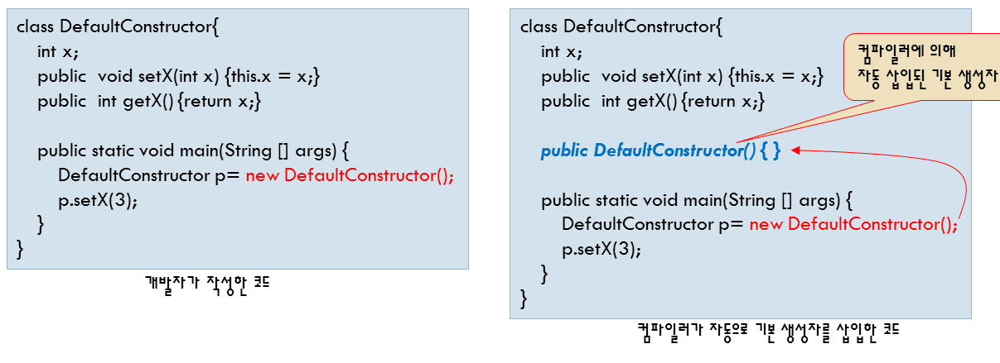
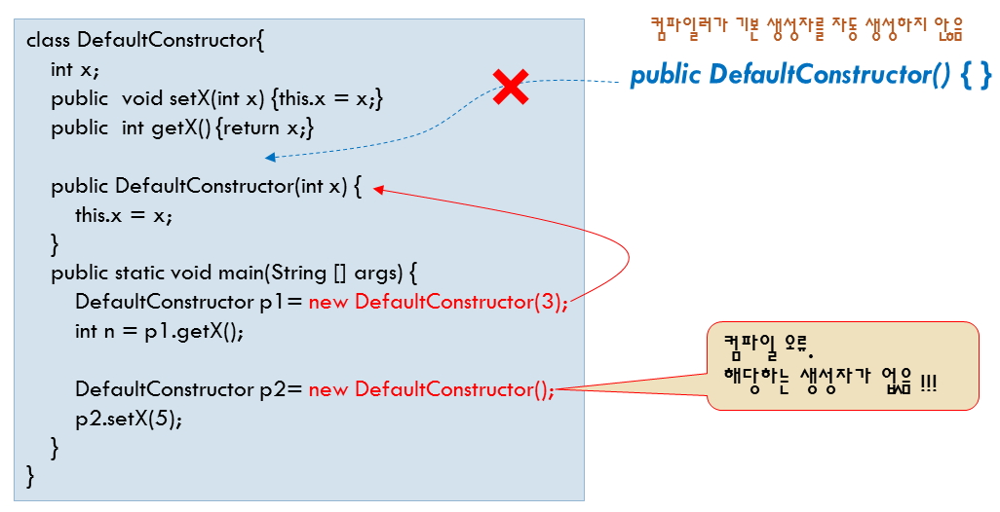

# 클래스: 메소드 오버로딩(Method Overloading), 생성자(Constructor)

## 메소드 오버로딩(Method Overloading)

- 같은 클래스 내에서 `같은 이름의 메소드를 여러개 선언`하는 것을 말합니다.

- JVM은 같은 이름의 메소드가 있으면 메소드가 받는 인수의 갯수와 데이터 타입을 비교하여 다르면 각각 다른 메소드로 인식을 합니다. 단, return 타입은 메소드를 구분하는 조건으로 사용하지 않습니다.

<br />

- method overloading의 대표적인 경우

```
System.out.println(1);
System.out.println(1.5);
System.out.println("우리는 한국인입니다.");
System.out.println("IT 기술을 " + " 다양한 분야로 적용해야 합니다.");
```

- 메소드 오버로딩을 사용하지 않는 경우

```
public void printInt(int x){ }
public void printFloat(float x){ }
public void printString(String x){ }

│
│
↓

메소드 오버로딩을 적용한 경우

public void println(int x){ }
public void println(float x){ }
public void println(String x){ }
```

- PrintStream 클래스의 메소드 오버 로딩 예

```
void print(char c){ } //print('C')

void print(double d){ } //print(10.5)

void print(float f){ } //print(10.5f)

void print(int i){ } //print(10)
```

<br />

- 메소드가 호출되는 경우 메소드의 인수의 데이터 타입과 갯수가 일치하는 메소드가 호출됩니다.

- println()메소드 및 생성자는 대표적인 메소드 오버로딩의 예입니다.

- 한 클래스 내에서 두 개 이상의 이름이 같은 메소드 작성

- 메소드 이름이 동일하여야 한다.

- 메소드의 인자가 개수 서로 다르거나, 메소드의 인자 타입이 서로 달라야 한다.

- 메소드의 이름이 같고 인자의 개수나 타입이 모두 같은데 메소드의 리턴 타입이 다르면 메소드 오버로딩이 성립되지 않으며 컴파일 오류가 발생한다.





<br />

### 1. 메소드 오버로딩 실습

> AvgTest.java

```
public class AvgTest {
    public int getAvg(){
        System.out.println("값을 2개이상 입력해 주세요.");
        return 0;
    }

    public int getAvg(int a, int b){
        return (a + b) / 2;
    }

    public int getAvg(float a, float b){
        return ((int)a+(int)b)/2;
    }

    public int getAvg(int a, int b, int c){
        return (a + b + c) / 3;
    }

    public int getAvg(int a, int b, int c, int d){
        return (a + b + c + d) / 4;
    }

// 리턴 타입은 메소드 구분을 할 수 없습니다.
// public float getAvg(){
// return 0.0f;
// }

    public static void main(String[] args) {
        AvgTest st = new AvgTest();
        System.out.println(st.getAvg());
        System.out.println(st.getAvg(10,20));
        System.out.println(st.getAvg(10.5f,20.5f));
        System.out.println(st.getAvg(10,20,30));
        System.out.println(st.getAvg(10,20,30,40));
    }
}
```

<br />

## 생성자(Constructor)

- return Type이 없습니다.

- 클래스 이름과 같아야 합니다. (대소문자 구별)

- new를 이용하여 객체를 메모리에 할당한 후 할당된 메모리를 특정 값으로 초기화하는 역활을 합니다.

- 생성자가 없을때 기본생성자를 자동으로 만들어줍니다.



<br />

### 1. 기본 생성자



### (1) 기본 생성자가 생략되어 있는 경우

> SchoolMain2.java

```
class School2{

    int kuk = 0;
    int eng = 0;
    int tot = 0;

    public int hap(){
        tot = kuk+eng;

        return tot;
    }

}

public class SchoolMain2 {

    public static void main(String[] args) {
        School2 sc2 = new School2();
        sc2.kuk=90;
        sc2.eng=100;
        System.out.println("hap: " + sc2.hap());
    }
}
```

<br />

#### (2) 기본생성자를 선언한 경우

- 생성자에 초기화하는 변수가 없어도 반드시 생성자를 선언할 것을 권장합니다.
- 상속 관계에 들어가면 이 기본 생성자가 선언되지 않으면 상황에 따라 에러를 발생합니다.

> SchoolMain3.java

```
class School3{
    int kuk = 0;
    int eng = 0;
    int tot = 0;

    public School3(){

    }

    public int hap(){
        tot = kuk+eng;

        return tot;
    }
}

public class SchoolMain3 {
    public static void main(String[] args) {
        School3 sc3 = new School3();
        sc3.kuk=90;
        sc3.eng=100;
        System.out.println("hap: " + sc3.hap());
    }
}
```

<br />

#### (3) 기본생성자를 선언해야 하는 경우

- 인수를 받는 생성자가 존재하게되면 반드시 기본 생성자를 선언해야 합니다.
- 기본 생성자는 하는 일이 없어도 반드시 선언을 적극 권장합니다.



> SchoolMain4.java

```
class School4{
    int kuk = 0;
    int eng = 0;
    int tot = 0;

    //기본 생성자
    public School4(){ }

    //아래처럼 인수를 받는 생성자가 존재하면
    //반드시 기본 생성자를 명시적으로 선언해야 합니다.
    public School4(int kuk, int eng){
        this.kuk = kuk;
        this.eng = eng;
    }

    public int hap(){
        tot = kuk+eng;

        return tot;
    }
}

public class SchoolMain4 {
    public static void main(String[] args) {
        School4 sc4 = new School4();
        sc4.kuk=90;
        sc4.eng=100;
        System.out.println("hap: " + sc4.hap());

        School4 sc = new School4(90, 100);
        System.out.println("hap: " + sc.hap());
    }
}
```
