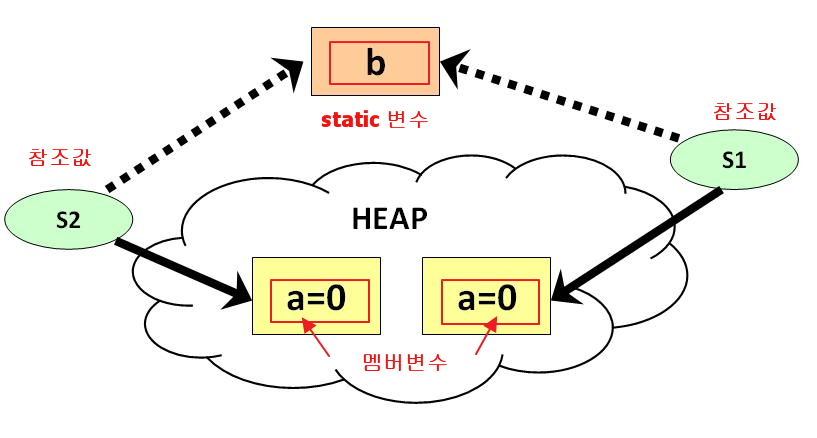

# 클래스: Static 변수, Static method, final

## static 변수(정적 변수, 클래스 변수), static method(클래스 메소드)

- **객체를 만들지 않고 변수나 메소드의 사용이 가능**합니다.
- 보통 **간단한 값의 처리시 주로 이용**합니다.
- 일반적인 클래스는 new를 이용하여 메모리를 할당해서 사용하나,
- static 요소들은 클래스가 JVM에 인식될때 new 없이 자동으로 메모리가 할당됨.

```java
public class StaticTest {
    // 최초 1회만 메모리 할당을 받고 모든 객체들이 공유함
    public static int b = 0;

    //인스턴스 변수
    private int a = 0;
}

public class Test {
    public static void main(String[] args){
        //객체를 생성후 s1,s2으로 가각의 멤버변수 a영역에 접근가능
        StaticTest s1 = new StaticTest();
        StaticTest s2 = new StaticTest();
    }
}
```



<br />

### 1. static 변수는 객체를 만들지 않아도 접근할 수 있습니다.

> Scjp.java

```java
class ScjpPass {
    //멤버 변수, Heap
    int t1=0;
    int t2=0;
    int t3=0;
    int t4=0;

    //클래스 변수, Data area
    static int BONUS=100;

    //생성자, Source area
    public ScjpPass(){
    }

    //생성자, this = sp객체가 가지고 있는 hash code
    //sp객체의 heap메모리를 공유하게됩니다.
    //int t1, int t2, int t3, int t4: Stack

    public ScjpPass(int t1, int t2, int t3, int t4){
        //Heap = Stack
        //전역 변수 = 지역 변수
        //멤버 변수 = 지역 변수

        this.t1 = t1;
        this.t2 = t2;
        this.t3 = t3;
        this.t4 = t4;
    }
}

public class Scjp {
    public static void main(String[] args) {
        System.out.println("ScjpPass.BONUS: " + ScjpPass.BONUS);

        //t1은 static이 아님으로 클래스명으로 접근 할 수 없습니다.
        //System.out.println(ScjpPass.t1);
        //heap memory 할당

        ScjpPass sp = new ScjpPass(85, 90, 80, 70);
        System.out.println("sp.t1: " + sp.t1);
        //static변수는 클래스명으로 접근을 권장합니다.
        //System.out.println("sp.BONUS: " + sp.BONUS);
    }
}
```

<br />

### 2. static 메소드는 객체를 만들지 않고도 호출할 수 있습니다.

- wrapper 클래스에서 많이 사용되며 단순 기능만을 사용할 경우 구현합니다.

> SCWCDmain.java

```java
// 하나의 java 파일안에 클래스가 2개이상 존재하는 경우
// main()메소드가 있는 오직 하나의 클래스만 public을 선업합니다.
// 일반적으로 main()가 있으면 무조건 public을 선언하며
// 파일명은 public 클래스명과 일치해야 합니다.

class SCWCD {
int t1=0;
int t2=0;
int t3=0;
int t4=0;
static int BONUS=100;

    public SCWCD() {
    }

    public SCWCD(int t1, int t2, int t3, int t4){
        this.t1 = t1;
        this.t2 = t2;
        this.t3 = t3;
        this.t4 = t4;
    }

    //클래스 메소드
    public static void prLine(){
        System.out.println("****************");
        System.out.println("   SOLDESK       ");
        System.out.println("         JAVA   ");
        System.out.println("****************");
    }

}

public class SCWCDmain {
    public static void main(String[] args) {
        //클래스.static 메소드명
        SCWCD.prLine();
    }
}
```

<br />

### 3. 객체를 생성하면 멤버변수는 전부 기본값이나 생성자에서 지정한 값으로 초기화됩니다.

- 하지만 static변수는 **프로그램을 실행시 최초 한번만 특정값으로 초기화**되고 (여기서는 0으로 초기화) 더이상 초기화가 되지않습니다.
- 따라서 **한번 만들어진 static변수는 계속적으로 값이 증가 및 감소**됩니다.
  - static 변수는 객체를 여러번 생성해도 한번만 생성이 됩니다.
  - static 변수는 멤버 메소드에 선언할 수 없습니다.

> StaticDemo.java

```java
class Box {
    int cnt = 0;
    static long boxID = 0;

    public Box() {
        boxID = boxID + 1; //static variable
        cnt = cnt + 1; //member variable
        System.out.println("멤버 변수 cnt: " + cnt);
        System.out.println("static 변수 BoxID: "+ boxID );
    }

    //멤버 메소드에서는 static변수를 선언할수 없습니다.
    /*
    public void staticTest() {
        static long count=0;
        count=count+1;
    }
    */

    //static(class) 메소드에 static 변수를 선언할 수 없습니다.
    /*
    public static void staticTest2() {
        static long count=0;
        count=count+1;
    }
    */
}

public class StaticDemo {
    public static void main(String args[]) {
        //객체 생성
        Box mybox1 = new Box();
        Box mybox2 = new Box();
        Box mybox3 = new Box();
    }
}
```

<br />

## 값을 변경할 수 없는 final 변수(상수 선언)

- `값을 변경할 수가 없습니다`.
- **값을 고정할 필요가 있는 코드와 같은 형태의 데이터**에 사용합니다. <br /> `예)1년 12달, 요일, 주7일`

> Finalmain.java

```java
class Final{
    int money = 10000; //인스턴스 변수

    //값을 변경 할 수 없습니다.
    final int day = 7;  //1주, final 인스턴스 변수
    final int week = 4; //한달, final 인스턴스 변수

    //객체를 만들지 않아도 사용할 수 있습니다.
    //final static 변수
    final static int month = 12; //1년

    //생성자가 존재 하지만 아무런 처리를 하지 않습니다.
    public Final(){}
}

public class Finalmain {
    public static void main(String[] args) {
        Final fi = new Final();
        fi.money = 15000;
        //final변수는 값을 변경(대입)할 수 없습니다.
        //fi.day = 10;
        System.out.println("1주일 용돈:" + fi.money * fi.day);
        System.out.println("1년" + Final.month + "달");
        //Final.month = 20000;
    }
}
```
