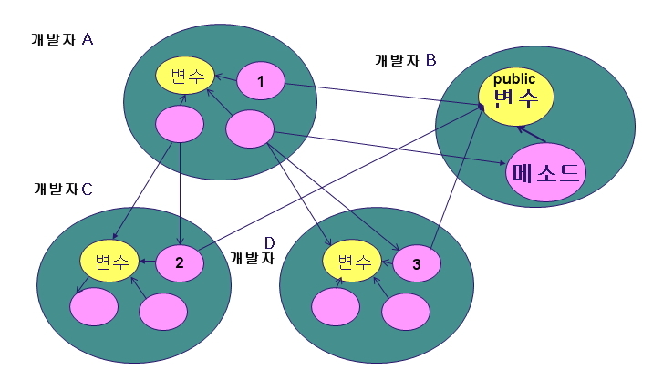
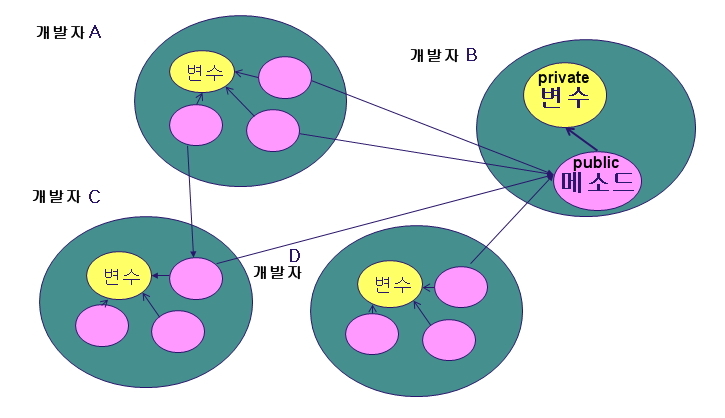
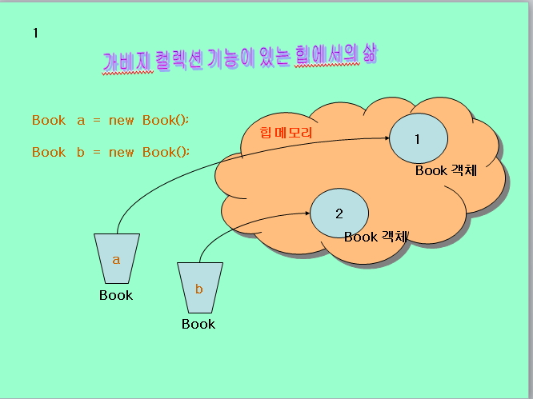
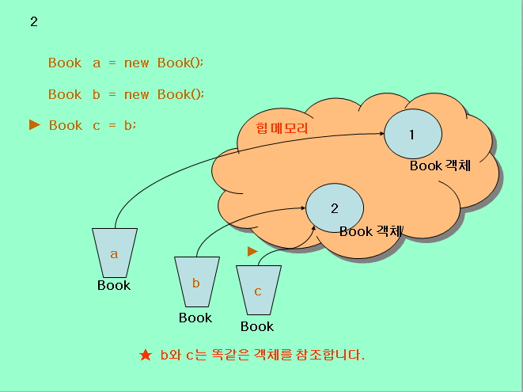
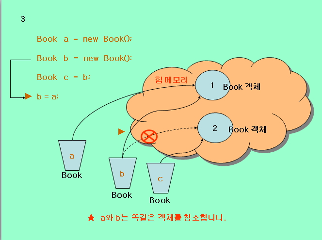
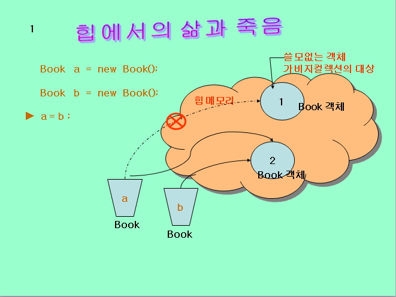
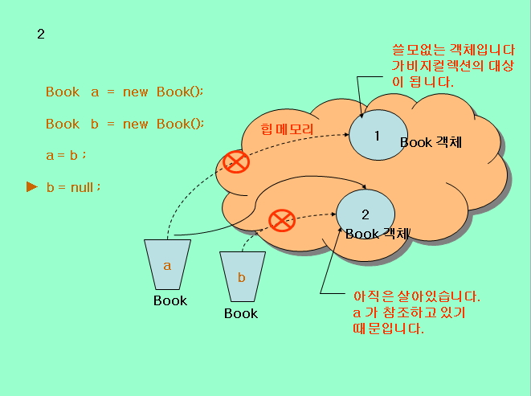

# 클래스: Access Modifier, Garbage Collecting

## 접근 한정자(Access Modifier, 제한자, 수정자)

### 1. 정의: 다른 클래스에서 현재 클래스의 필드(변수)와 메소드(함수)의 접근 가능 여부를 선언하는 기법.

(1) B 개발자의 변수에 A, C, D 개발자가 마음대로 접근하여 자신의 클래스에 로직을 구성 할 수 있음으로 같은 처리 로직이 여러 클래스에 반복해서 발생됨으로 인해서 개발 속도 가 떨어지고 개발이 종료 된후 소스 수정에 심각한 문제가 발생합니다. `기본적으로 변수는 모두 private 선언을 권장합니다.`



(2) B 개발자의 변수가 private으로 선언이 되어 있어서 A, C, D 개발자는 접근이 불가능 합니다. 이 때 로직이 필요한 경우 A, C, D 개발자는 B개발자의 public 메소드에 기능 구현 여부를 확인 후 B 개발자가 구현한 로직을 공유하게 됩니다. **따라서 private 변수의 처리 로직은 전부 하나의 메소드에 구현이되어 모든 개발자가 활용하게되며 `객체지향의 핵심 요소인 캡슐화(Encapsulation)를 지원`하며 자바의 장점을 극대화 시키며 현재 국내에서 많이 사용되는 CBD개발의 핵심 이론으로 쓰입니다.** `(CBD: Component Based Development)`



<br />

### 2. 특징

- 클래스 간에 멤버 변수나 멤버 메소드에 `접근하는 것을 제한`할 수 있습니다.
- `클래스 간에 간섭을 줄이기` 위해 적용합니다.
- `객체지향에서 캡슐화를 구현하는 핵심 기술`입니다.
- 클래스간에 간섭을 막을 수 있음으로 `콤포넌트의 독립성을 강화`할 수 있습니다.

<br />

### 3. 접근 제한자의 상세화


<br />

### 4. 예제

> Data.java

```java
//데이터 클래스
public class Data {
//인스턴스 변수, 멤버 변수

private String name=null;
private String season=null;
private int year = 0;

//set으로 시작하는 메소드는 setter라고 부릅니다.
//set은 소문자로, 연결되는 변수명의 첫자는 대문자를 사용합니다.
//private변수에 값을 대입하는 목적을 가지고 있습니다.
//값을 저장함으로 리턴타입은 void를 이용합니다.

public void setName(String name){
    this.name = name;
}

public void setSeason(String season){
    this.season = season;
}

public void setYear(int year){
    if (year >= 20 && year <= 30){
        this.year = year;
    }else{
        System.out.println("입력될 수 있는나이는 20~30세 사이입니다.");
    }
}

//get으로 시작하는 메소드는 getter라고 부릅니다.
//get은 소문자로, 연결되는 변수명의 첫자는 대문자를 사용합니다.
//private변수에서 값을 가져오는 목적을 가지고 있습니다.
//값을 가져옴으로 값에 따른 다양한 데이터타입을 지정합니다.

    public String getName(){
        return name;
    }

    public String getSeason(){
        return season;
    }

    public int getYear(){
        return year;
    }
}
```

<br />

> DataAccess.java

```java
//데이터 이용 클래스
public class DataAccess {
    public static void main(String[] args) {
        Data d = new Data();
        //d.name="왕눈이";
        //System.out.println(d.name);
        d.setName("왕눈이");
        d.setSeason("늦가을");
        d.setYear(35);

        System.out.println(d.getName());
        System.out.println(d.getSeason());
        System.out.println(d.getYear());
    }
}
```

<br />

### 5. private method 응용

- `private 메소드가 존재`하면 반드시 private 메소드를 호출하는 `public 메소드가 존재`하게되어 있습니다.
- private 메소드는 **클래스 외부에서 호출될 수 없습니다**.
- 거대한 하나의 메소드를 여러개의 메소드로 분리한후 호출을 하나의 메소드로만 지정할 경우 사용하며 이때 `하나의 메소드만 public으로 지정하고 나머지는 private으로 지정`합니다.(★)

> PrivateTestMain.java

```java
class PrivateTest {
    public int kuk = 0;
    public int eng = 0;
    public int sum = 0;

    private void sum(){
        sum = kuk+eng;
        if ( sum > 200){
            System.out.println("점수가 200을 초과했습니다.");
            sum = 0;
        }else{
            System.out.println("합계가 정상적으로 처리?습니다.");
        }
    }

    //Deligate Method
    public void call_sum(){
        sum();
    }
}

public class PrivateTestMain {
    public static void main(String[] args) {
        PrivateTest pt = new PrivateTest();
        pt.kuk = 90;
        pt.eng = 95;

        //pt.sum(); //외부에서 호출할 수 없습니다.
        pt.call_sum();
        System.out.println("pt.sum(): " + pt.sum);
    }
}
```

<br />

## Garbage Collecting

### 1. 특징

- `멤버 변수와 객체에 할당된 메모리를 회수` 합니다.(heap)
- JVM이 자동으로 수행 합니다.
- 멤버 메소드 등 일반 메소드안에서 생성된 객체가 메소드의 지역변수에서 참조 한다면 메소드 종료시 자동으로 메모리 회수됩니다.

```java
public void rMethod() {
// test지역변수가 rMethod() 호출이 끝나면 없어지면서
// 그 변수가 참조하는 Test객체는 메모리 회수가 됩니다.

    Test test = new Test();
}
```

- null 값을 가지고 있는 참조변수가 있다면 `그 참조변수가 참조했던 객체는 회수의 대상`이 됩니다.

```java
Test test = new Test();
test = null; //test의 해쉬코드가 지워진다.
```

- GC가 메모리를 회수하는 일은 `우선 순위가 낮은 스레드로 수행`, 일반적인 경우 `모든 스레드가 종료된 후 수행`

- gc()를 실행되면 `강제로 메모리 회수 작업`을 하게되며, 우선순위를 높여준다. 그러나 gc()호출하는 일은 많은 부하를 동반함으로 JVM이 실행하도록 하는것이 좋습니다.

- 메모리를 회수할때는 자동으로 finalize()메소드가 호출된다.(소멸자) `자동으로 호출되는 메소드`를 `Callback 메소드`라 한다.

<br />

### 2. 메모리 회수 알아보기











> GarbageTest.java

```java
class Garbage {
    int objNo;

    public Garbage(int n) {
        objNo = n;
        System.out.println("Garbage class " + objNo + " 이 만들어 졌습니다.");
    }

    //객체의 메모리가 회수 될때에 자동으로 호출됩니다.
    protected void finalize() throws Throwable {
        System.out.println("Garbage class " + objNo + " 에서 쓰이던 메모리가 수집되었습니다.");
        super.finalize();
    }
}

public class GarbageTest {
    public static void main(String[] args) {

        Garbage[] ga = new Garbage[10];

        //객체 생성
        for (int i=0; i < ga.length; i++) {
            ga[i] = new Garbage(i);
        }

        //객체 메모리 해제
        for (int i=0; i < ga.length; i++) {
            ga[i] = null;//메모리 회수의 대상이 됩니다.
        }

        //강제로 가베지컬렉션 기능 수행
        System.gc();
    }
}
```
