# 클래스: 상속(Inheritance), Method Overriding, 객체 형변환

## 상속(Inheritance)

### 1. 특징

- `상위 클래스의 특성 (필드, 메소드)을 하위 클래스에 물려주는 것` 입니다.

- `superclas`s : 특성을 물려주는 `상위 클래스`

- `subclass` : 특성을 물려 받는 `하위 클래스`

- 슈퍼 클래스에서 하위 클래스로 갈 수록 `구체화`가 됩니다.

- 상속을 통해 `서브 클래스의 간결한 클래스 정의`할 수 있습니다.

- 동일한 `특성을 재정의할 필요가 없어` 클래스 정의가 간결해집니다.

- 상속의 경우 속성을 상속하는 경우 보다는 메소드를 상속하기위해 많이 사용되며, `부모 클래스의 기능을 확장하는데 부모클래스를 수정하지 않고, 부모에 구현된 로직을 사용하면서 안정적으로 클래스의 기능을 확장` 할 수 있는 기법을 제공합니다.

- 상속을 계속적으로 하게 될 경우 가장 아래의 클래스는 부모로부터 많은 메소드를 상속 받음으로 매우 많은 기능을 사용할 수 있게 됩니다.

- `상속은 한번에 하나의 클래스에서만 가능`, C++의 경우는 2개이상의 클래스 를 상속하는것이 가능합니다.

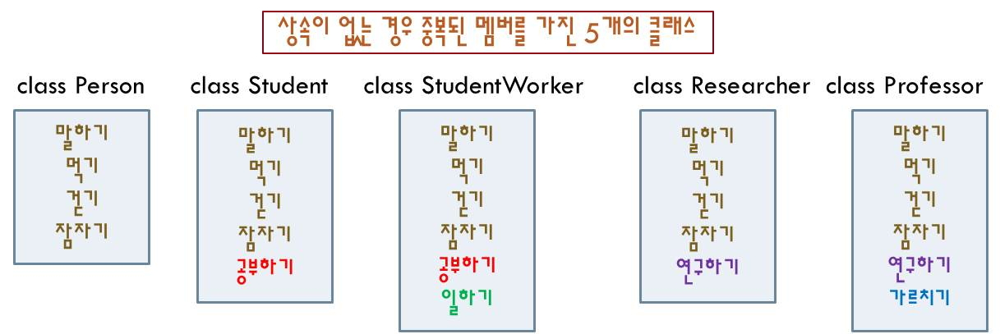
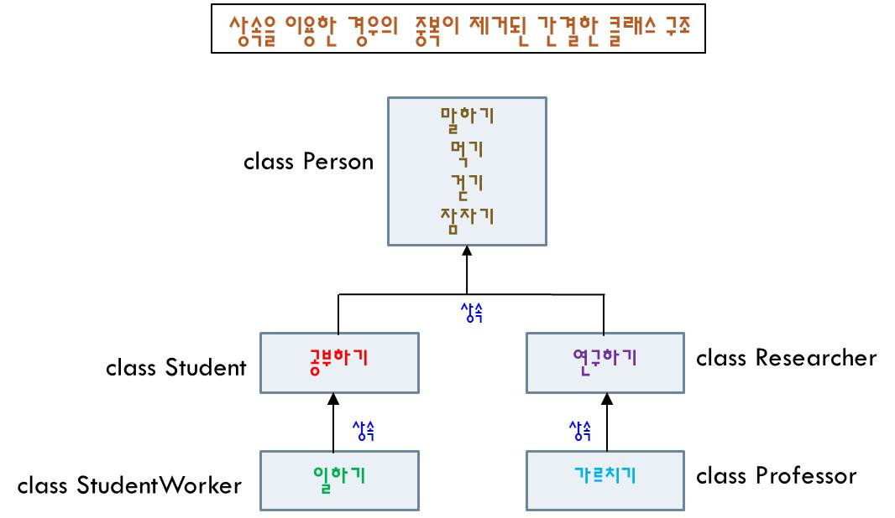

<br />

### 2. 상속 선언

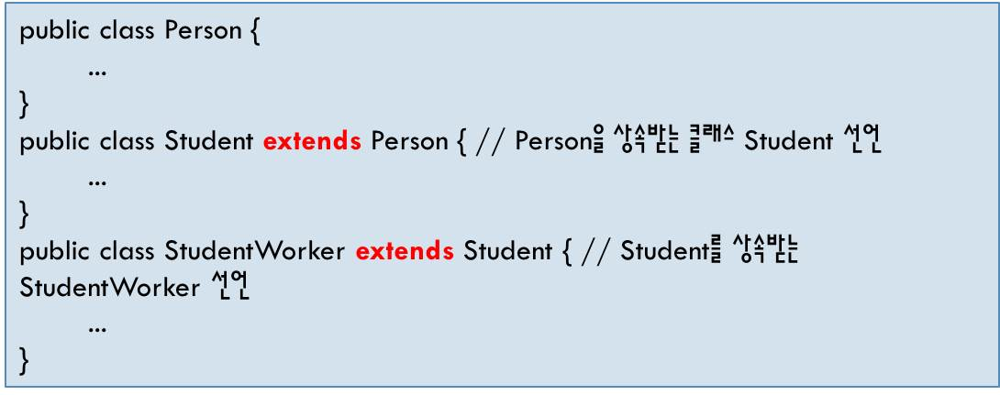

<br />

### 3. 멤버 변수의 상속

> MovieTest.java

```javascript
class Movie {
    String prat="영화";
}

class Korea extends Movie { // part변수 상속
    String m1 = "가문의위기";
}

class Foreign extends Movie {
    String m1 = "박물관이 살아있다.";
}

public class MovieTest {
    public static void main(String[] args) {
        Korea k = new Korea();
        System.out.println("장르:" + k.prat);
        System.out.println("제목:" + k.m1);

        Foreign f = new Foreign();
        System.out.println("장르:" + f.prat);
        System.out.println("제목:" + f.m1);
    }
}
```

<br />

### 4. 메소드의 상속

> CarTest.java

```javascript
class Car{
    public void gear() {
        System.out.println("수동 기어를 사용합니다.");
    }
}

class ChildCar extends Car {
    public void auto_gear() {
        System.out.println("자동 기어를 사용합니다.");
    }
}

class ChildCar2 extends ChildCar {
    public void auto_gear2() {
        System.out.println("수동/자동 기어를 혼합하여 사용합니다.");
    }
}

public class CarTest {
    public static void main(String[] args) {
        ChildCar2 cc2 = new ChildCar2();
        cc2.gear();
        cc2.auto_gear();
        cc2.auto_gear2();
    }
}
```

<br />

### 5. 서브 클래스의 객체와 멤버

```javascript
public class A {
    public int p;
    private int n;
    public void setN(int n) {
        this.n = n;
    }
    public int getN() {
        return n;
    }
}
```

```javascript
public class B extends A {
    private int m;
    public void setM(int m) {
        this.m = m;
    }
    public int getM() {
        return m;
    }
    public String toString() {
        String s = getN() + “ “ + getM();
        return s;
    }
}
```

```javascript
public class Main{
    public static void main(String [] args) {
        A a = new A();
        B b = new B();
    }
}
```

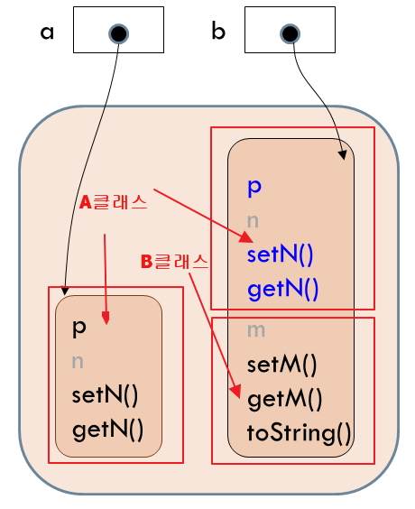

<br />

### 6. 같은 패키지 내 상속관계

```javascript
package a;
public class A2 {
    int i;
    protected int pro;
    private int pri;
    public int pub;
}
```

```javascript
package a;

public class B2 extends A2 {
    void set() {
        i = 1;
        pro = 2;
        pri = 3; // private 멤버 접근 불가, 컴파일 오류 발생
        pub = 4;
    }
    public static void main(String[] args) {
        B2 b = new B2();
        b.set();
    }
}
```

<br />

### 7. 다른 패키지의 상속관계

```javascript
package pa;
    public class A3 {
        int i;
        protected int pro;
        private int pri;
        public int pub;
    }
```

```javascript
package pb;

import pa.A3;

public class B3 extends A3 {
    void set() {
        i = 1; // i는 default 멤버, 컴파일 오류
        pro = 2;
        pri = 3; // private 멤버 접근 불가, 컴파일 오류 발생
        pub = 4;
    }
    public static void main(String[] args) {
        B3 b = new B3();
        b.set();
    }
}
```

<br />

## 상속관계 UML로의 표현

### 1. 객체 설계 툴의 설치 - StarUML 의 설치

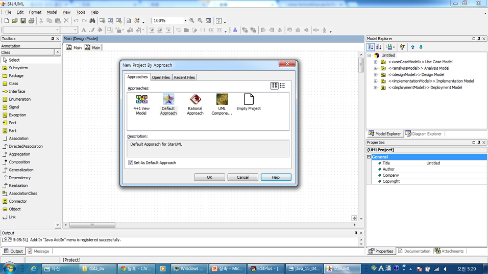

<br />

### 2. 위의 상속 구조를 클래스 설계 툴로 Class Diagram을 만드세요.

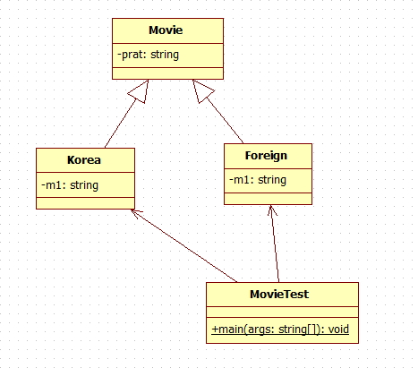

<br />

### 3. main() 메소드의 `static` 설정 방법

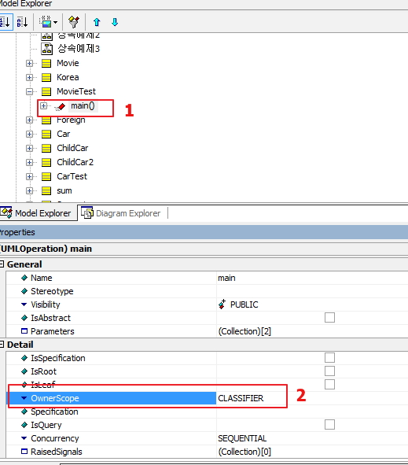

<br />

## Method Overriding

- 슈퍼 클래스와 서브 클래스의 메소드에서 발생합니다.

- `슈퍼 클래스의 메소드를 서브 클래스에서 재정의하는 것` 입니다.

- `슈퍼 클래스의 메소드 이름, 메소드 인자 타입 및 개수, 리턴 타입 등 모든 것 동일하게 정의` 합니다.

- 오버라이딩된 메소드의 `접근 지정자는 슈퍼 클래스의 메소드의 접근지정자 보다 좁아질 수 없습니다`.

- `static, private, 또는 final 메소드는 오버라이딩 될 수 없습니다`.

- `return 타입이 다른 경우 오류` 납니다.

- `부모클래스의 메소드는 무시`됩니다.

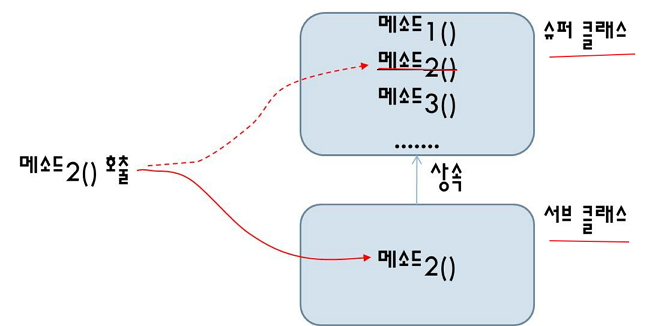

- 부모클래스가 메소드를 상속해주나 자식 클래스는 자신이 구현한 메소드를 우선 하여 이용합니다.

- 부모클래스의 메소드 기능을 유지하면서 상황에 따라 자식클래스의 변형된 기능을 사용하고 싶은 경우 사용하며 다형성 구현의 핵심 원리입니다.

- 메신저는 버젼별로 기능이 틀리나 버전이 틀리다고해서 대화를 할 수 없는 것은 아닌것과 같이 `overriding 기술은 부모클래스의 구기능을 없애는 것이 아니라 유지하면서 자식의 새로운 기능으로 교체하는 목적으로 사용`됩니다.

<br />

### 1. 메소드 원형이 다름으로 오버라이딩이 아닙니다. 단순 상속입니다.

> OverrideExam1.java

```javascript
class OverA {
    void show(String str) {
        System.out.println("상위클래스의 메소드 show(String str) 수행 " + str);
    }
}

class SubOverA extends OverA {
    void show() {
        System.out.println("하위클래스의 메소드 show() 수행");
    }
}

public class OverrideExam1 {
    public static void main(String args[]) {
        SubOverA over = new SubOverA();
        over.show("IT KOREA");
        over.show();
    }
}
```

<br />

### 2. 상위 클래스와 하위 클래스의 메소드 원형이 같음으로 Method Overriding이라고 합니다.

> OverrideExam2.java

```javascript
class OverB {
    void show() {
        System.out.println("부모클래스의 메소드 show()");
    }

    void parent() {
        System.out.println("부모클래스에만 있는 메소드 parent()");
    }
}

class SubOverB extends OverB {
    //Overriding
    void show() {
        System.out.println("자식클래스의 메소드 show()");
    }
}

public class OverrideExam2 {
    public static void main(String args[]) {
        //부모 클래스 객체 생성
        OverB ob = new OverB();
        ob.show(); //부모클래스의 메소드 show()
        ob.parent();

        //자식 클래스 객체 생성
        //상속이 무시되면서 자식 클래스의 메소드가 수행됩니다.
        SubOverB over = new SubOverB();
        over.show();  //자식클래스의 메소드 show()
        over.parent();
    }
}
```

<br />

### 3. 오버라이딩 메소드 호출 예문

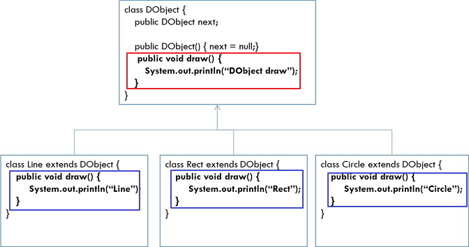

#### (1) 서브 클래스 레퍼런스로 오버라이딩된 메소드 호출

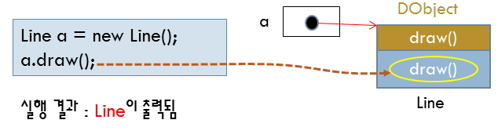

<br />

#### (2) 업캐스팅된 슈퍼클래스 레퍼런스로 오버라이딩된 메소드 호출(동적 바인딩)

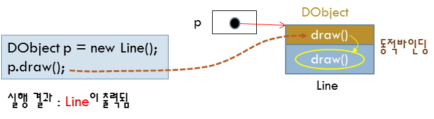

<br />

### 4. 잘못된 부분을 주석달고 수정 하기.

```javascript
class Person {
    String name;
    String phone;
    static int ID;

    public void setName(String s) {
        name = s;
    }
    public String getPhone() {
        return phone;
    }
    public static int getID() {
        return ID;
    }
}

class Professor extends Person {

    protected void setName(String s) {
    }
    public String getPhone() {
        return phone;
    }
    public void getPhone(){
    }
    public int getID() {
    }
}
```

<br />

## 객체 형변환

- `상속 관계에서는 부모자식간에 형변환이 가능`합니다.
- 상속 관계에서는 `좌측에 부모클래스`가 오고 `우측에 자식 클래스`가 올 수 있습니다.
- 실제로 메모리상에 생성되는 객체는 자식 클래스 객체와 부모클래스 객체 모두 생성되고 타입만 부모클래스가 됩니다.

```javascript
Object obj = new String("홍길동");
```

- 오버라이딩시에는 `부모클래스 타입이더라도 자식클래스의 메소드가 호출`됩니다.(`동적바인딩`)

- `모든 클래스는 Object 클래스를 기본적으로 상속` 받습니다.

<br />

### 1. 업캐스팅

- 프로그램에서 이루어지는 `자동 타입 변환` 입니다.
- 서브 클래스의 레퍼런스 값을 슈퍼클래스 타입의 변수에 대입 합니다.
- 자식객체 내에 있는 모든 멤버를 접근할 수 없고 `슈퍼 클래스의 멤버만 접근 가능`합니다.

```javascript
class Person {}

class Student extends Person {
}

Student s = new Student();

Person p = s; // 업캐스팅, 자동타입변환

Person p2 = new Student();
```

<br />

### 2. 업캐스팅 예제 - 오류

```javascript
class Person {
    String name;
    String id;

    public Person(String name) {
        this.name = name;
    }
}
class Student extends Person {
        String grade;
        String department;

        public Student(String name) {
        super(name);
        }
}

public class UpcastingEx {
    public static void main(String[] args) {
    Person p;
    Student s = new Student(“이재문”);
    p = s; // 업캐스팅 발생

    System.out.println(p.name); // 오류 없음

    p.grade = “A”; // 컴파일 오류
    p.department = “Com”; // 컴파일 오류
    }
}
```

<br />

### 3. 다운캐스팅(downcasting)

- 슈퍼 클래스 레퍼런스를 서브 클래스 타입의 변수에 대입
- `업캐스팅된 것을 다시 원래대로 되돌리는 것`
- `명시적으로 타입 지정`

```javascript
class Person {
}
class Student extends Person {
}
Person p = new Student();

Student s = (Student)p; // 다운캐스팅, 강제타입변환
```

<br />

### 4. 다운캐스팅 예제

```javascript
public class DowncastingEx {
    public static void main(String[] args) {
        Person p = new Student(“홍길동”); // 업캐스팅 발생
        Student s;

        s = (Student)p; // 다운캐스팅

        System.out.println(s.name); // 오류 없음
        s.grade = “A”; // 오류 없음
    }
}
```

<br />

### 5. 객체 형변환 예제

> TypeConvertTest.java

```javascript
class TypeConvert{
    String url = "http://www.kma.go.kr";

    public void setUrl(String url){ this.url = url; }
    public String getUrl(){ return this.url; }
}

public class TypeConvertTest {
    public static void main(String[] args) {
        TypeConvert tc = new TypeConvert();
        Object obj = tc; // Object 클래스의 메소드만 호출가능
        // System.out.println(obj.getUrl());
        System.out.println(tc.getUrl());

        System.out.println(obj.hashCode());
        System.out.println(tc.hashCode());

        TypeConvert tc2 = (TypeConvert)obj;
        System.out.println("tc2: " + tc2.getUrl());
        System.out.println("tc2: " + tc2.hashCode());
    }
}
```
