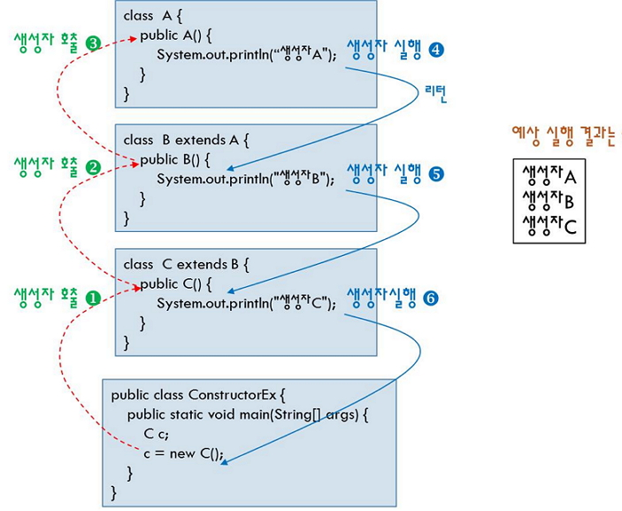

# 클래스: 상속 관계에서의 생성자, this, super, this(), super()

## 상속 관계에서의 생성자

> ☞ 부모클래스는 생성자의 쓰임과 관련 없이 디폴트 생성자를 선언할 것을 절대적 으로 권장 한다. <br /> `public Parent(){ }`

### 1. 부모 클래스의 기본 생성자 호출

- 기본 생성자가 명시되지 않은 경우 **자동으로 기본 생성자가 생성되어 객체가 만들어 진다**.

- 자식 클래스 객체 생성시 **부모클래스의 생성자가 먼저 호출되고 자식 클래스의 생성자가 호출한다**.

> MovieTest.java

```java
class TV{

}

class Movie extends TV{
    String part="한국 영화";
}

class Action extends Movie{
    String name="";
}

public class MovieTest {
    public static void main(String[] args) {
        //기본 생성자는 자동으로 생성되어 사용된다.
        Action act = new Action();
        act.name="마파도";   // 이문식
        System.out.println(act.name);
    }
}
```

> ConstructorEx.java



<br />

### 2. 상속관계에서는 부모클래스의 생성자가 먼저 실행됩니다.

- 자식 클래스 객체 생성시 생성자 첫라인에서는 부모클래스의 기본 생성자가 묵시적으로 호출된다.

> MovieTest2.java

```java
class TV2{
    public TV2(){
        System.out.println("TV2");
    }
}

class Movie2 extends TV2{
    String part="한국 영화";
    public Movie2(){
        System.out.println("Movie2");
    }
}

class Action2 extends Movie2{
    String name="";
    public Action2(){
        System.out.println("Action2");
    }
}

public class MovieTest2 {
    public static void main(String[] args) {
        //기본 생성자는 자동으로 생성되어 사용된다.
        Action2 act = new Action2();
        act.name="마파도";
        System.out.println(act.name);
    }
}
```

> ConstructorEx2.java


<br />

### 3. 부모 클래스의 생성자가 반드시 필요한 경우

- 부모클래스에 파라미터가 있는 생성자가 존재하면 부모클래스의 기본 생성자는 `자동으로 생성되지 않음으로 명시적으로 생성자를 선언`해야 한다.

> MovieTest3.java

- 에러요소가 잠재적으로 존재하는 경우

```java
class Movie3{
    String part="";

    //public Movie3(){ }  //기본 생성자

    public Movie3(String part){
        this.part = part;
        System.out.println("Movie3");
    }
}

class Comedy3 extends Movie3{
    String time="";
    String name="";

    //public Comedy3() { } // 기본 생성자

    public Comedy3(String time, String name){
        this.time = time;
        this.name = name;
        System.out.println("Comedy");
    }
}

public class MovieTest3 {
    public static void main(String[] args) {
        //파라미터가 있는 생성자만 호출한다.
        Comedy3 com = new Comedy3("21:00", "마파도");

        //기본 생성자는 기존에 생성자가 없는 경우만 자동으로 만들어 진다.
        //Comedy3 com2 = new Comedy3();

        System.out.println(com.time);
        System.out.println(com.name);
    }
}
```


> 질문 1> 서브 클래스의 인스턴스가 생성될 때 서브 클래스의 생성자와 슈퍼클래스의 생성자가 모두 실행되는가? 아니면 서브 클래스의 생성자만 실행되는가?

> 질문 2> 서브 클래스의 인스턴스가 생성될 때 서브 클래스의 생성자와 슈퍼클래스의 생성자의 실행 순서는 어떻게 되는가?

<br />

## 메소드 내부 객체 변수, 생성자 호출 메소드

### 1. 메소드 내부 객체 변수

- this : 메소드안에서 `객체`를 나타내는 객체 변수, 메소드안에서 메소드를 호출한 `객체의 주소(Hash Code)`를 가지고 있다. <br />
  `this.멤버변수`

- super : 메소드안에서 `상위 클래스 객체`를 나타내는 객체 변수 <br />
  `, super.멤버변수`

<br />

### 2. 생성자 호출 메소드

- 생성자 안에서 다른 형태의 생성자를 호출 할 수 있다.
- `this()` : `현재 클래스의 생성자`를 호출한다.
- `super()` : `부모 클래스의 생성자`를 호출한다.
- `생성자` : new를 이용하여 메모리 할당이 끝난 후 `메모리를 초기화`하는 역활을 한다. 멤버 변수에 `초기값을 할당`한다.

<br />

## 메소드 내부 객체 변수, 생성자 호출 메소드 실습

### 1. this

- **멤버 변수를 호출한 객체의 주소를 가지고 있다**.
- 멤버 메소드는 메소드를 호출한 객체의 주소를 알아야 메소드의 결과를 리턴하기 때문에 호출한 객체의 주소를 저장하기위해 this 객체 변수를 사용한다.

> ThisTest.java

```java
class This{
    String area="";

    public void prn(){
        System.out.println("이 메소드를 호출한 객체의 HashCode: " + this);
        System.out.println(this.area);
    }
}

public class ThisTest {
    public static void main(String[] args) {
        This obj1 = new This();
        obj1.area = "인천시";
        obj1.prn(); //객체의 Hashcode가 prn()메소드로 호출된다.
        System.out.println("obj1.hashCode(): " + obj1.hashCode());
    }
}
```

<br />

### 2. super

- **super는 부모클래스의 객체의 Hashcode를 가지고 있다**.

> SuperTest.java

```java
class School{
    int year=0;
    public School(){
        this.year = 0;
    }
}

class MiddleSchool extends School{
    int year=0;
    public MiddleSchool(){
        this.year = 3;
    }

    public void prn(){
        System.out.println("year: " + year);
        System.out.println("this.year: " + this.year);
        System.out.println("super.year: " + super.year); //부모클래스
    }
}

public class SuperTest {

    public static void main(String[] args) {
        MiddleSchool middleSchool = new MiddleSchool();
        middleSchool.prn();
    }
}
```

> SubObject.java


<br />

### 3. this()생성자의 실습

- 파라미터가 계속 증가해도 기존의 생성자를 이용 할 수 있다.

> ThisExam.jav

```java
class ThisData{
    int i;
    int j;
    int k;

    //ⓐ
    public ThisData(){
        this.i=0;
        this.j=0;
        this.k=0;
    }

    //ⓑ
    public ThisData(int i){
        this.i=i;
    }

    //ⓒ
    public ThisData(int i, int j){
        this(i);  //ⓑ 호출되어 초기화 된다.
        this.j=j;
    }
}

public class ThisExam {
    public static void main(String[] args) {
        hisData od = new ThisData(100, 90);

        System.out.println("od.i: " + od.i);
        System.out.println("od.j: " + od.j);
        System.out.println("od.k: " + od.k);
    }
}
```

<br />

### 4. super() 생성자 메소드

- 자식 클래스는 자신이 가지고 있는 멤버 변수만 초기화하고 나머지는 부모클래스의 생성자를 호출해서 부모클래스의 멤버로 초기화 한다.

- 부모클래스의 생성자를 호출할 경우는 반드시 자식 클래스의 생성자 안에서 가장먼저 선언해야 한다. 이유는 자식 클래스의 모듈이 실행되기전에 부모클래스의 생성자가 먼저 실행이 되어야 하는 우선순위의 규칙 때문에 그렇다.

> SuperExam.java

```java
class OverC {
    int i, j;

    //생성자
    public OverC(int i, int j) {
        this.i = i; //10
        this.j = j; //20
    }

    void show() {
        System.out.println("상위클래스의 메소드 show() 수행");
    }
}

class SubOverC extends OverC {
    int k;

    //int i: 부모 클래스
    //int j: 부모 클래스
    //int k: 자식 클래스
    public SubOverC(int i, int j, int k ) {
        super(i, j); //상위 클래스의 생성자를 호출
        this.k = k;  //k만 10으로 초기화를 한다.
    }

    void show() {
        System.out.println("하위 클래스의 메소드 show() 수행");
        System.out.println("===super를 이용한 상위 클래스 메소드 호출===");
        super.show();
    }

}

public class SuperExam {
    public static void main(String args[]) {
        SubOverC over1 = new SubOverC(10, 20, 30);

        System.out.println("i, j, k의 값 : " + over1.i + " " + over1.j + " " + over1.k);
        over1.show();
    }
}
```
