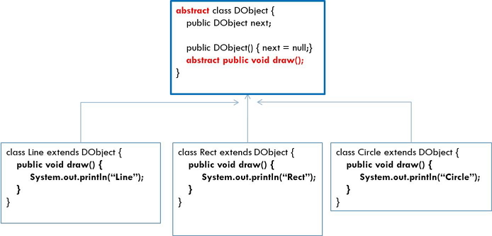

# 클래스: Abstract Class, final Class, final Method, 상수선언

## 추상 클래스(abstract class)

### 1. 추상 메소드

- **기능이 구현되지 않고** stub, `원형만 선언되어 있는 메소드` 입니다.
- `중괄호 "{, }"가 생략`되어 있습니다.

```java
abstract class DObject {
    public DObject next;

    ublic DObject() { next = null;}
    bstract public void draw() ;
}
```

- 추상 메소드는 서브 클래스에서 오버라이딩하여 구현합니다.



- 추상 클래스는 추상 메소드가 0개 이상 선언되어 있습니다.

- 추상 클래스는 객체를 생성할 수 없습니다.


<br />

### 2. 추상 클래스의 실습

> SumMain.java

```java
abstract class Sum {
    //추상메소드 입니다.
    public abstract String toString();

    public String sum(int i, int k){
        int sum = i+k;
        return ""+ sum;
    }
}

class Sum_s1 extends Sum {
    //추상 메소드 Overriding(구현)
    public String toString(){
        return "class Sum_s1 extends Sum";
    }
}

class Sum_s2 extends Sum {
    //추상 메소드 Overriding(구현)
    public String toString(){
        return "class Sum_s2 extends Sum";
    }
}

public class SumMain {

    public static void main(String[] args) {
        Sum_s1 s1 = new Sum_s1();
        System.out.println(s1.sum(10, 20));
        System.out.println(s1.toString());

        Sum_s2 s2 = new Sum_s2();
        System.out.println(s2.sum(100, 200));
        System.out.println(s2.toString());
    }
}
```

<br />

### 3. 실습문제

```java
 // 추상 클래스 Calculator를 상속받는 GoodCalc 클래스를 작성하세요.

abstract class Calculator {
    public abstract int add(int a, int b);
    public abstract int subtract(int a, int b);
    public abstract double average(int[] a);
}
```

<br />

## final

### 1. final 클래스

- final클래스는 상속될 수 없습니다.

```java
public final class String extends Object implements Serializable, Comparable, CharSequence

public class FinalTest extends String{ //ERROR
}
```

<br />

### 2. final 메소드

- 자식 클래스가 Overriding 할 수 없습니다.

```java
public final String prn() {

}
```

<br />

## 상수 선언 : public static final int 변수명 = 값;

- 고정된 같은 값이 반복해서 쓰이는 경우 상수를 이용한다.

- `public`: `누구나 사용`할 수 있음

- `static`: 객체를 만들지 않고도 사용 할 수 있음

- `final`: 변수의 값을 변경할 수 없음

- `int`: 정수를 저장함

- 상수의 예:
  - 1년 365, 1주일 7일등 로직상에서 변하지 않는 고정된 값 또한 상수의 대상이 됩니다.
  - 상수 사용이 많은 클래스: Calendar Class 등

> Constant.java

```java
public class Constant {
    public static final int COUNT=1;

    public void prn(){
        //COUNT = 5;
        for (int i=0; i< COUNT ; i++){
            System.out.print("JAVA ");
        }

        for (int i=0; i< COUNT ; i++){
            System.out.print("JSP ");
        }

        for (int i=0; i< COUNT ; i++){
            System.out.print("EJB ");
        }

        for (int i=0; i< COUNT ; i++){
            System.out.print("CBD Oracle OJT ");
        }
    }

    public static void main(String[] args) {
        Constant constant = new Constant();
        constant.prn();

        for (int i=0; i< Constant.COUNT ; i++){
            System.out.print("Struts ");
        }
    }
```
