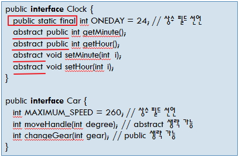
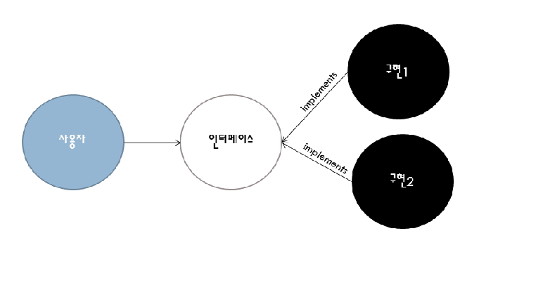

# 클래스: Interface

## Interface

- 상수와 추상 메소드로만 이루어져 있습니다.
  메소드의 내용을 정의하는 "{}" 없습니다.

- 추상 메소드에 abstract를 사용하지 않아도 됩니다.

- 모든 추상 메소드 앞에 public으로 가정합니다.

- 추상메소드를 사용하는 이유는 앞으로 추가되거나 구현되어야하는 기능의 설계 역활을 하며 실제 기능은 구현하지 않고 메소드 원형만 구현하는 것을 말합니다.

- 추상 메소드는 건축물에서 구조를 이루는 철근과도 같고 설계도와 같은 역할을 합니다.

- 외부에 공개할 메소드를 등록하는 목적으로도 사용됩니다.

- 인터페이스를 구현한 클래스는 인터페이스상에 있는 추상 메소드를 전부 구현해야 합니다.

- 인터페이스상에 있는 메소드를 하나라도 구현하지 않으면 인터페이스를 구현하는 클래스는 추상클래스가 됩니다.

- `A a_obj = new A();` 인터페이스는 객체를 만들 수 없습니다. 따라서 반드시 그 인터페이스를 구현한 클래스의 객체를 생성해서 사용합니다.

```java
A memo;            // A인터페이스형 참조 변수 memo 선언
memo = new C1();   // C1은 A라는 인터페이스를 전부 구현한 클래스입니다.
```

<br />

- 인터페이스 사례



<br />

- 인터페이스선언과 구현클래스정의로 다양한 구현를 할 수 있다.



<br />

### 1. Interface의 구현

```java
interface USBMouseInterface {
    void mouseMove();
    void mouseClick();
}

public class MouseDriver implements USBMouseInterface { // 인터페이스 구현. 클래스 작성
    void mouseMove() { .... }
    void mouseClick() { ... }
    // 추가적으로 다른 메소드를 작성할 수 있다.
    int getStatus() { ... }
    int getButton() { ... }
}
```

> Inter.java

```java
public interface Inter {
    public abstract int add(int i, int j);

    public int sub(int i, int j);
}
```

> InterImpl.java

```java
public class InterImpl implements Inter{
    public int add(int i, int j){
        return i+j;
    }

    public int sub(int i, int j){
        return i-j;
    }

    public static void main(String[] args) {
        InterImpl interImpl = new InterImpl();
        System.out.println(interImpl.add(10, 5));
        System.out.println(interImpl.sub(10, 5));

        //인터페이스는 기능이 구현되어 있지않음으로
        //객체를 생성할 수 없습니다.
        //----------------------------------------
        //Inter inter = new Inter();

        //인터페이스는 구현 클래스를 할당 받을 수 있습니다.
        //인터페이스 = 구현 클래스
        //----------------------------------------
        Inter inter2 = new InterImpl();
        System.out.println(inter2.add(100, 50));
        System.out.println(inter2.sub(100, 50));
    }
}
```

<br />

### 2. 인터페이스의 참조

- 각 클래스의 멤버 변수에 접근하는 경우는 그 클래스 타입으로 형변환을 해 주어야 합니다.
- 인터페이스 타입 객체 `= new` 인터페이스 구현 클래스

> IR2.java

```java
interface B {
    void display(String s);
}

class D1 implements B {
    String str = "";
    public void display(String s) {
        str=s;
        System.out.println("☆☆☆☆☆☆☆☆☆ " + s);
    }
}

class D2 implements B {
    String str = "";
    public void display(String s) {
        str=s;
        System.out.println("★★★★★★★★★ " + s);
    }
}

public class IR2 {
    public static void main(String args[]) {
        //인터페이스 객체변수는 할당되는 객체에 따라 기능을 변경할 수 있습니다.
        B b = new D1();
        // 클래스 D1의 객체를 생성하여 memo에 할당
        b.display("석모도 - 보문사 - 벤뎅이 회무침");

        b = new D2();
        b.display("대부도 - 방아머리 - 바지락 칼국수");

        //인터페이스 타입은 구현 클래스의 변수에
        //접근할 수 없습니다.
        //-------------------------------------
        //System.out.println(b.str);

        //구현 객체의 멤버변수에 접근하려면
        //인터페이스의 구현 클래스 타입으로 형변환을 합니다.
        //-------------------------------------
        D2 d2 = (D2)b;
        System.out.println(d2.str);
    }
}
```

<br />

## 인터페이스의 다중 구현

- 자바는 다중 상속을 할 수 없습니다. 한번에 하나의 클래스만 상속할 수 있습니다.

- 상속을 연속해서 받는 경우 다중 상속과 비슷한 기능은 구현할 수 있습니다.

```java
interface USBMouseInterface {
    void mouseMove();
    void mouseClick();
}

interface RollMouseInterface {
    void roll();
}

public class MouseDriver implements RollMouseInterface , USBMouseInterface {
    void mouseMove() { .... }
    void mouseClick() { ... }
    void roll() { ... }

    // 추가적으로 다른 메소드를 작성할 수 있다.
    int getStatus() { ... }
    int getButton() { ... }
}
```

> ColorMain.java

```java
interface Green {
    //추상 메소드
    public String greenColor();
}

class GreenImpl implements Green{
    public String greenColor(){
        return "초록색입니다.★";
    }
}

interface Red {
    //추상 메소드
    public String redColor();
}

class RedImpl implements Red{
    public String redColor(){
        return "빨간색입니다.★";
    }
}

class ColorImpl implements Green, Red{
    public String greenColor(){
        return "초록색입니다.";
    }

    public String redColor(){
        return "빨간색입니다.";
    }
}

public class ColorMain{
    public static void main(String[] args) {
        Green g = new GreenImpl();
        System.out.println(g.greenColor());

        Red r = new RedImpl();
        System.out.println(r.redColor());

        ColorImpl c = new ColorImpl();
        System.out.println(c.greenColor());
        System.out.println(c.redColor());
    }
}
```

<br />

## 외부에 공개할 메소드를 등록하는 인터페이스

> Myinfo.java , Myinfointer.java, Myinfouse.java

```java
interface Myinfointer {
    public String getName();
    public String getPhone();
}

class Myinfo implements Myinfointer {
    private String name ;
    private String phone;
    private String address;
    private int age;

    Myinfo(){}
    Myinfo(String name,String phone, String address, int age){
        this.name= name;
        this.phone = phone;
        this.address = address;
        this.age = age;
    }

    public String getName(){
        return name;
    }

    public String getPhone(){
        return phone;
    }

    public String getAddress(){
        return address;
    }

    public int getAge(){
        return age;
    }
}

public class Myinfouse {
    /**
    * @param args
    */
    public static void main(String[] args) {
        Myinfointer info = new Myinfo("아로미","010-1111-2222","인천시  남동구",   35);
        System.out.println("이름:"+info.getName());
        System.out.println("전화:"+info.getPhone());
        //System.out.println("주소:"+info.getAddress());
        //System.out.println("나이:"+info.getAge());
    }
  }
```
