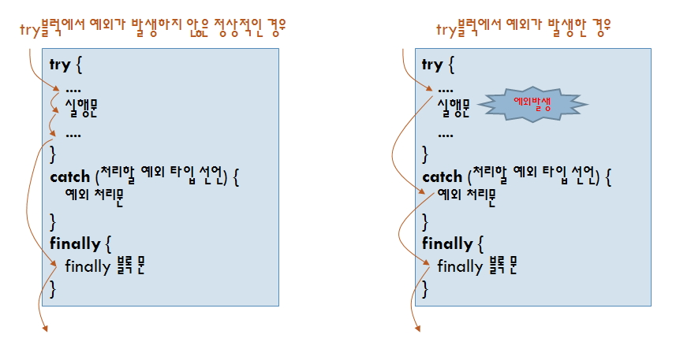
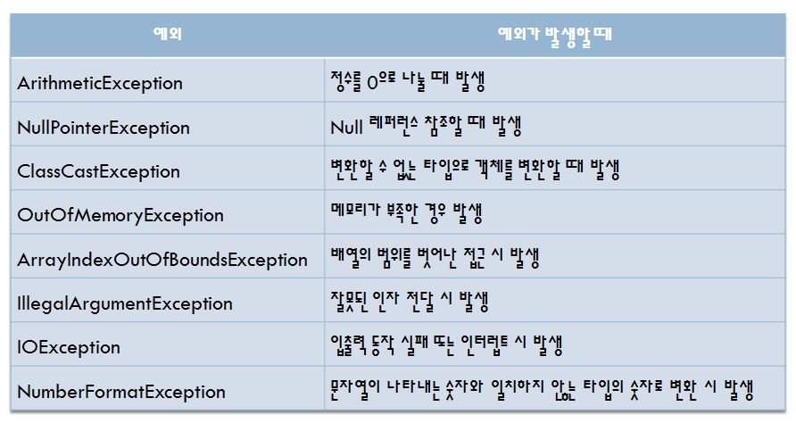

# 예외처리 (Exception)

## 예외처리(Exception)

- `예외`는 프로그램 개발시에 발생하는 `에러와 다릅니다`.

- **안정적으로 컴파일된 후 운영중에 발생하는 에러는 대부분 "예외"인 경우가 많습니다**. 예외는 `코드상에서 발생하는 에러하고는 다르며` `컴파일시에는 에러가 발생하지 않습니다`. 마치 디스켓을 읽어오는 프로그램이 있다면 **디스켓이 없는 상태에서 읽기 기능을 작동하여 발생하는 에러와 같은 것**입니다.

- `예외 처리`를 하면 예외가 발생되서 프로그램이 끝나는 것이 아니라 `나머지 루틴이 정상적으로 실행`이 됩니다.





<br />

```java
try{
    에러가 발생할 소지가 있는 코드를 개발자가 선별하여 지정해야 하며 "IO, DBMS, NETWORK"관련 코드가 대부분입니다.

} catch(Exception e) {
    예외처리 및 예외처리 원인 출력
    System.out.println(e.toString());

} finally {
    무조건 실행되는 코드 블럭, 데이터베이스 연결 종료 등
}
```

<br />

### 1. 에러 발생/ 예외 처리

> Ex1.java

- ERROR 발생

```java
public class Ex1 {
    public static void main(String[] args) {
        int a = 10;
        int b = 2;

        try {
            System.out.println("a =" + a + "b = " + b);
            System.out.println(" a/b = " + (a / b));
            System.out.println("나눗셈이 수행되었습니다.");
        } catch (Exception e) {
            e.printStackTrace();
        } finally {
            System.out.println("무조건 실행");
        }
            System.out.println("프로그램이 정상적으로 종료됩니다.");
    }
}
```

<br />

> Ex2.java

- 예외를 처리한 경우

```java
class Ex2 {
    public static void main(String args[]) {
        String str = "홍길동";

        try {
            char c = str.charAt(2);
            System.out.println("추출된 문자:" + c);
        } catch (Exception e) {
            e.printStackTrace();
        } finally {
            System.out.println("무조건 실행");
        }
            System.out.println("나머지 루틴을 정상적으로 실행합니다.");
    }
}
```

<br />

### 2. 예외의 선언은 처음에는 좁은 범위를 잡고 다음으로 내려갈수록 넓은 범위의 예외를 아래처럼 명시합니다.

- 예외의 파악이 불분명한경우 Exception 클래스로 받습니다.

```
java.lang.Object
    |
    +--java.lang.Throwable
        |
        +--java.lang.Exception  <--- 가장 넓은 범위
            |
            +--java.lang.RuntimeException
                |
                +--java.lang.IllegalArgumentException
                    |
                    +--java.lang.NumberFormatException <--- 가장 좁은 범위, 여기부터 catch문에 명시
```

> ExceptionError1.java

```java
public class ExceptionError1 {
    public static void main(String args[]) {
        try {
            System.out.println("매개변수로 받은 두 개의 값");
            String str = null;
            char c = str.charAt(0);
            int a = Integer.parseInt(args[0]);
            int b = Integer.parseInt(args[1]);

            System.out.println(" a = " + a + " b = " + b);
            System.out.println(" a를 b로 나눈 몫 = " + (a / b));
            System.out.println("나눗셈이 원할히 수행되었습니다.");

        } catch (ArithmeticException e) {
            System.out.println("ArithmeticException 처리 루틴 : ");
            e.printStackTrace();

        } catch (ArrayIndexOutOfBoundsException e) {
            System.out.println("ArrayIndexOutOfBoundsException 처리 루틴: ");
            e.printStackTrace();

        } catch (NumberFormatException e) {
            System.out.println("NumberFormatException 처리 루틴: ");
            e.printStackTrace();

        } catch (Exception e) {
            System.out.println("알수없는 문제가 발생");
            e.printStackTrace();

        } finally {
            System.out.println("예외 처리를 끝내고 finally 블럭 실행");
        }
            System.out.println("나머지 모듈 정상 작동!!!");
    }
}
```

<br />

### 예제 Exception

#### (EX01)

```java
import java.util.Scanner;

public class ExceptionExample2 {
    public static void main(String[] args) {
        Scanner rd = new Scanner(System.in);
        int divisor = 0;
        int dividend = 0;

        System.out.print("나뉨수를 입력하시오:");
        dividend = rd.nextInt();
        System.out.print("나눗수를 입력하시오:");
        divisor = rd.nextInt();
        try {
            System.out.println(dividend + "를 " + divisor + "로 나누면 몫은 " + dividend / divisor + "입니다.");
        } catch (ArithmeticException e) {
            System.out.println("0으로 나눌 수 없습니다.");
        }
    }
}
```

#### (EX02)

```java
public class ArrayException {
    public static void main(String[] args) {
        int[] intArray = new int[5];
        intArray[0] = 0;
        try {
            for (int i = 0; i < 5; i++) {
                intArray[i + 1] = i + 1 + intArray[i];
                System.out.println("intArray[" + i + "]" + "=" + intArray[i]);
            }
        } catch (ArrayIndexOutOfBoundsException e) {
            System.out.println("배열의 인덱스가 범위를 벗어났습니다.");
        }
    }
}
```

#### (EX03)

```java
public class NumException {
    public static void main(String[] args) {
        String[] snum = { "23", "12", "998",    "3.141592" };
        try {
            for (int i = 0; i < snum.length; i+   +) {
                int j = Integer.parseInt(snum[i]); // "3.141592"에서 예외 발생
            }
        } catch (NumberFormatException e) {
            System.out.println("실수는 정수로 변환할 수 없습니다.");
        }
    }
}
```

#### (EX04)

```java
interface MobilePhone {
    boolean sendCall();
    boolean receiveCall();
    boolean sendSMS();
    boolean receiveSMS();
}

interface MP3 {
    void play();
    void stop();
}

class PDA {
    public int calculate(int x, int y) {
        return x + y;
    }
}

public class SmartPhone extends PDA implements MobilePhone, MP3 {
    public static void main(String[] args) {
        SmartPhone p = new SmartPhone();
        p.sendCall();
        p.play();
        p.calculate(3, 5);
        p.scheduler();
        p.applicationManager();
    }

    @Override
    public void play() {
        // TODO Auto-generated method stub
        System.out.println("음악재생");
    }

    @Override
    public void stop() {
        // TODO Auto-generated method stub
        System.out.println("재생중지");
    }

    @Override
    public boolean sendCall() {
        // TODO Auto-generated method stub
        System.out.println("전화걸기");
        return false;
    }

    @Override
    public boolean receiveCall() {
        // TODO Auto-generated method stub
        System.out.println("전화받기");
        return false;
    }

    @Override
    public boolean sendSMS() {
        // TODO Auto-generated method stub
        System.out.println("SNS 보내기");
        return false;
    }

    @Override
    public boolean receiveSMS() {
        // TODO Auto-generated method stub
        System.out.println("SNS 받기");
        return false;
    }

    public void scheduler() {
        System.out.println("일정관리");
    }

    public void applicationManager() {
        System.out.println("어플리케이션 설치/삭제");
    }
}
```

#### (EX05)

```java
interface ISungjuk {
    void setJumsu(int kuk, int eng);
    void print();
}

class Sungjuk implements ISungjuk {
    int kuk;
    int eng;

    @Override
    public void setJumsu(int kuk, int eng) {
        this.kuk = kuk;
        this.eng = eng;
    }

    @Override
    public void print() {
        System.out.println("성적 증명서");
        System.out.println("국어: " + kuk);
        System.out.println("영어: " + eng);
    }
}

public class SungjukTest {
    public static void main(String[] args) {
        // ISungjuk i = new ISungjuk();

        ISungjuk is = new Sungjuk();
        is.setJumsu(90, 100);
        is.print();
    }
}
```

#### (EX06)

```java
import java.text.DecimalFormat;

//인터페이스 -> 상수 : double PI, 추상메소드 :넓이(), 둘레(), print();
//main() -> 인터페이스 타입으로 업캐스팅해서 인터페이스의 넓이, 둘레, print 함수 사용
//생성자를 사용하여 필드 초기화
interface Ishape {
    double PI = 3.1415;
    double area();
    double round();
    void print();
}

class Circle implements Ishape {
    private int r;
    public Circle() {
    }
    public Circle(int r) {
        this.r = r;
    }

    /* 원의 넓이 */
    public double area() {
        return r * r * Math.PI;
    }

    /* 원의 둘레 */
    public double round() {
        return 2 * r * Math.PI;
    }

    /* 원의 넓이와 둘레 출력 */
    public void print() {
        DecimalFormat df = new DecimalFormat("####.##");
        System.out.println("*****원의 넓이와 둘레*****");
        System.out.println("반지름: " + r);
        System.out.println("원의 넓이: " + df.format(area()));
        System.out.println("원의 둘레: " + df.format(round()));
        System.out.println("**********************");
    }
}

class Triangle implements Ishape {
    private double t1, t2, t3;
    public Triangle() {
    }

    public Triangle(double t1, double t2, double t3) {
        this.t1 = t1;
        this.t2 = t2;
        this.t3 = t3;
    }

    /* 삼각형의 둘레 */
    public double round() {
        return t1 + t2 + t3;
    }

    /* 삼각형의 넓이 */
    public double area() {
        double s = t1 + t2 + t3;
        return Math.sqrt(s * (s - t1) * (s - t2) * (s - t3));
    }

    /* 삼각형의 넓이와 둘레 출력 */
    public void print() {
        DecimalFormat df = new DecimalFormat("####.##");
        System.out.println("*****삼각형의 넓이와 둘레*****");
        System.out.println("각 변의 길이: " + t1 + ", " + t2 + ", " + t3);
        System.out.println("삼각형의 둘레: " + df.format(round()));
        System.out.println("삼각형의 넓이: " + df.format(area()));
        System.out.println("************************");
    }
}

class Square implements Ishape {
    private double a, b;

    public Square(double a, double b) {
        this.a = a;
        this.b = b;
    }

    /* 사각형의 둘레 */
    public double round() {
        return 2 * (a + b);
    }

    /* 사각형의 넓이 */
    public double area() {
        return a * b;
    }

    /* 사각형의 넓이와 둘레 출력 */
    public void print() {
        DecimalFormat df = new DecimalFormat("####.##");
        System.out.println("*****사각형의 넓이와 둘레*****");
        System.out.println("가로: " + a + ", 세로: " + b);
        System.out.println("사각형의 둘레: " + df.format(round()));
        System.out.println("사각형의 넓이: " + df.format(area()));
        System.out.println("*************************");
    }
}

public class Shape {
    public static void main(String[] args) {
        Ishape c = new Circle(10);
        c.print();

        Triangle t = new Triangle(3, 4, 5);
        t.print();

        Square s = new Square(1, 3);
        s.print();
    }
}
```

### 3. 예외의 파악이 불분명한경우 Exception 클래스로 받습니다.

- return: finally는 무조건 실행됩니다.
- System.exit(0): finally실행 안됩니다.

```java
catch(Exception e) {
    System.out.println("==================================");
    System.out.println(e.toString());
    //return; //finally는 무조건 실행됩니다.
    //System.exit(0); //finally실행 안됩니다.
}
finally {
    System.out.println("==================================");
    System.out.println("예외 처리를 끝내고 finally 블럭을 수행합니다");
}
```

<br />

### 4. 반드시 예외처리를 지정해야 하는 경우

- DOC문서에서 아래와 같이 throws절이 있는 메소드는 반드시 코드를 `try ~ catch`문 안에서 사용해야 합니다.
- 필수적으로 예외처리를 해야 합니다.
- getString 메소드는 SQLException이 발생할 수 있습니다.

```java
public String getString(int columnIndex) throwSQLException {
    .......
    .......
    ......
}

try {
    String name = rs.getString(1);
} catch(SQLException e) {
    System.out.println(name);
} finally {
    try {
        rs.close();
    } catch(Exception e){}
}
```

- 메소드에 throws절을 명시하면 try~catch문을 사용하지 않아도 됩니다.

```java
public void prn(ResultSer r) throws SQLException{
    - 처리로직 구현
}
```

<br />

### 5. 개발자가 사용자 예외를 만들어 처리할 수 있습니다.

- 이 경우는 예외를 출력하는 출력 파일을 따로 지정하는 경우에 많이 사용합니다.

> ExceptionError3.java

```java
class UserException{
    public UserException(){ }
    public UserException(Exception e){
        //super(message);
        System.out.println("-------------------------------------------------") ;
        System.out.println("파일에 에러 내역을 기록합니다...... ");
        System.out.println("☞ 에러원인: " + e.toString());
        System.out.println("-------------------------------------------------");
    }
}

public class ExceptionError3{
    public static void main(String args[]){
        try {
            System.out.println("매개변수로 받은 두 개의 값");
            int a = Integer.parseInt(args[0]); // 문자열 값을 정수로 변환
            int b = Integer.parseInt(args[1]);
            System.out.println(" a = " + a + " b = " + b );
            System.out.println(" a를 b로 나눈 몫 = " + (a/b) );
            System.out.println("나눗셈이 원할히 수행되었습니다.");
        } catch(Exception e) {
            e.printStackTrace();
            new UserException(e); //개발자가 만든 예외처리 클래스 사용
        }
        finally {
            System.out.println("==================================");
            System.out.println("예외 처리를 끝내고 finally 블럭을 수행합니다");
        }
            System.out.println("나머지 루틴을 정상처리합니다.");
    }
}
```
