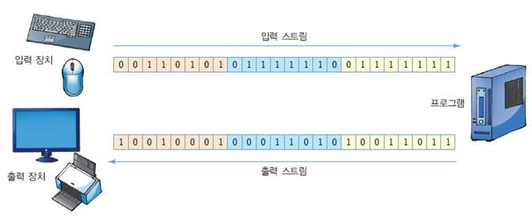
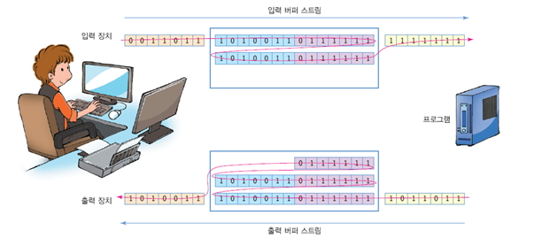
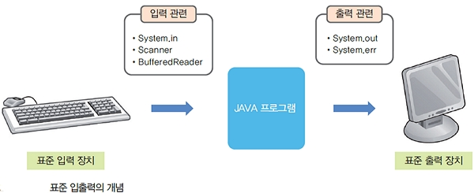
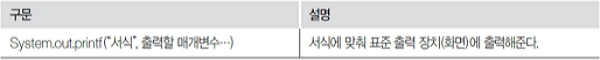
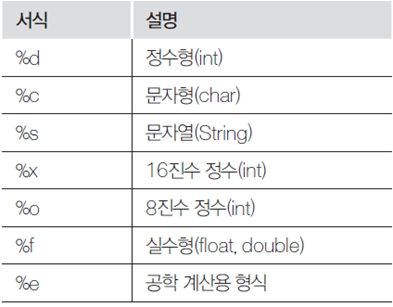
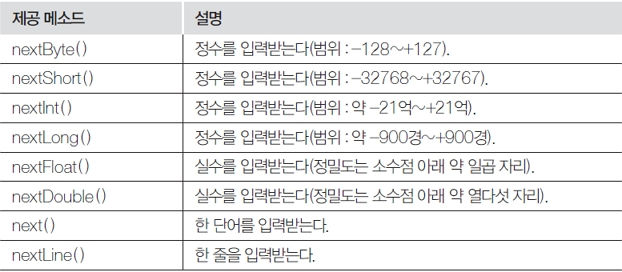
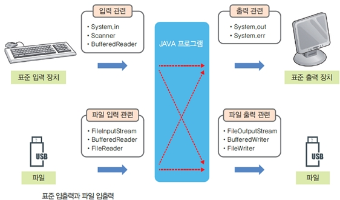
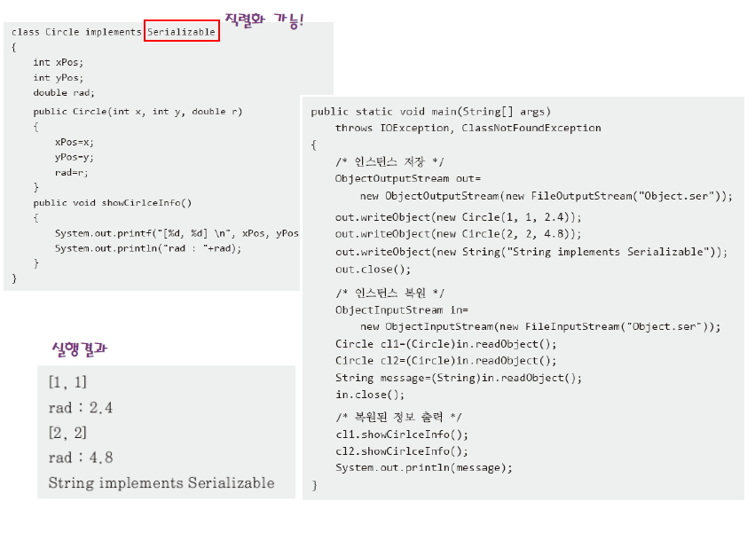
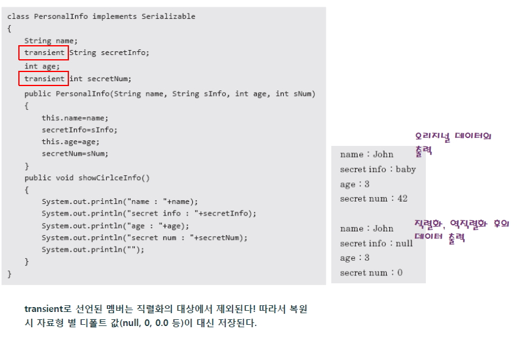

# IO Stream - 표준 입출력, 파일 입출력

## IO Stream

- Stream은 연속적인 데이터 흐름을 나타냅니다.
- 프로그램이 가지고 있는 또는 가지고 있지 않은 데이터를 외부(다른 프로그램)로 보내거나 가져오는 동작을 말합니다.
- Program에서 처리된 데이터 ------출력 스트림-----> 모니터, 디스크 장치,네트워크(Destination)
- 키보드, 디스크 장치, 네트워크 ------입력 스트림-----> Program(Destination)
- 스트림은 단방향 구조입니다. 따라서 오로지 출발지와 목적지를 지정하면 한곳으로만 데이터가 전송됩니다.
- 스트림은 전송하려는 데이터가 많을 경우 지연시간이 발생합니다.



```
     바이트 단위 처리                                                2바이트 문자단위
    (한글 처리 불가능)                                               (한글 처리 가능)
     -------------------------------------------------------------------------------
     InputStream                 기본 입력 스트림 클래스             Reader
     OutputStream                기본 출력 스트림 클래스             Writer

     FileInputStream             파일 입력 스트림 클래스             FileReader
     FileOutputStream            파일 출력 스트림 클래스             FileWriter

     BufferedInputStream         버퍼 입력 기능 클래스               BufferedReader
     BufferedOutputStream        버퍼 출력 기능 클래스               BufferedWriter

     DataInputStream             데이터 타입을 지정하여 입력할수 있는 클래스
     DataOutputStream            데이터 타입을 지정해서 출력할수 있는 클래스

     ObjectInputStream ois;      Class 객체를 읽어 올 수 있습니다.
     ObjectOutputStream oos;     Class 객체를 출력 할 수 있습니다.
```



<br />

### 1. 표준 입출력

- 키보드로 입력하는 것을 표준입력(standard input)이라 하고, 화면으로 출력하는 것을 표준출력(standard output)이다.



#### (1) 표준 출력 : System.out.printf()




```java
public class Ex10_05 {
    public static void main(String[] args) {
    int a = 1234;
    float b = 100.12345f;
    char ch = 'K';
    String s = "javastudy";

        System.out.printf("정수의 10진수 ==> %d\n", a);
        System.out.printf("정수의 16진수 ==> %X\n", a);
        System.out.printf("정수의  8진수 ==> %o\n", a);
        System.out.printf("실수 ==> %10.3f\n", b);
        System.out.printf("실수(공학용) ==> %e\n", b);
        System.out.printf("문자 ==> %c\n", ch);
        System.out.printf("문자열 ==> %s\n", s);
    }
}
```

<br />

#### (2) 표준 입력 : Scanner

- 입력을 위해 자주 사용하는 클래스이다.
  
  

```java
import java.util.Scanner;

public class Ex10_06 {
    public static void main(String[] args) {
    Scanner s = new Scanner(System.in);
    byte a;
    short b;
    int c;
    long d;
    float e;
    double f;
    String str1, str2;

        System.out.print("byte  : ");       a = s.nextByte();
        System.out.print("short : ");       b = s.nextShort();
        System.out.print("int   : ");       c = s.nextInt();
        System.out.print("long  : ");       d = s.nextLong();
        System.out.print("float : ");       e = s.nextFloat();
        System.out.print("double: ");       f = s.nextDouble();
        System.out.print("str1  : ");       str1 = s.next();
        System.out.print("str2  : ");       str2 = s.nextLine();

        s.close();
    }
}
```

```
// 결과
byte : 127
short : 32767
int : 2147183647
long : 9223371111111111111
float : 0.1234567
double: 0.123456789012345
str1 : JAVA
str2 :
```

<br />


- next()의 작동원리
- 단어 3개를 공백으로 분리해서 입력한후 Enter를 누르면 버퍼의 단어가 차례대로 str1, str2, str3에 공백으로 분리되어 들어간다.

```java
import java.util.Scanner;

public class Ex10_07 {
public static void main(String[] args) {
Scanner s = new Scanner(System.in);
String str1, str2, str3;

        System.out.print("단어 3개 입력");
        str1 = s.next();
        str2 = s.next();
        str3 = s.next();

        System.out.print("입력된 문자열 ==> ");
        System.out.print(str1 + "," + str2 + "," + str3);

        s.close();
    }
}
```

<br />

- 하나의 문자 입력 : System.in.read()
- 키보드 문자 1개 입력받는다. 1바이트 문자만 입력받는다.
- 한글은 입력이 안되면, 한글 입력받으려면 Scanner로 입력받는다.

```java
import java.io.IOException;

public class Ex10_08 {
    public static void main(String[] args) {
        String userName = "java";
        String input = "";
        int key;

        try {
            System.out.print("이름 ==> ");
            while ((key = System.in.read()) != 13) { // 이름 쓰고 enter
                System.out.print(key+" ");
                input += Character.toString((char)key);
            }
            if (userName.equals(input)) {
                System.out.println(input + "님 어서오세요 ~😎");
            }else {
                System.out.println(input + "님 등록이 안되었습니다!😱");
            }
        } catch (IOException e) {
            e.printStackTrace();
        }
    }
}
```

<br />

### 2. 파일 입출력

- 파일 입출력 메소드는 입력과 출력을 파일로 처리하는 메소드이다.
- 파일을 읽어서 내용을 입력하거나 파일에 내용을 출력한다.



<br />

- FileInputStream 클래스는 파일의 내용을 1바이트씩 읽어온다.
- 1바이트씩 읽어오는 메소드는 read()이다.

> data1.txt

```
File Read Sample 입니다.
```

- data1.txt 파일의 문자를 1바이트씩 읽어온다.
- 한글 2바이트를 1바이트로 잘라서 읽고 출력하여 깨져보인다.

```java
import java.io.FileInputStream;
import java.io.FileNotFoundException;
import java.io.IOException;

public class Ex10_09 {
    public static void main(String[] args) throws IOException {
        FileInputStream fis =
            new FileInputStream("c:/aistudy/java/data1.txt");
        int ch;
        while ((ch = fis.read()) != -1)
            System.out.print((char) ch);

        fis.close();
    }
}
```

```
File Read Sample ì??ë??ë?¤.
```

- 한글이 깨지 않도록 수정한 내용이다.

```java
import java.io.FileInputStream;
import java.io.FileNotFoundException;
import java.io.IOException;

public class Ex10_10 {
    public static void main(String[] args) throws IOException {
        FileInputStream fis = new FileInputStream("c:/aistudy/java/data1.txt");
        int ch;
        byte[] bt = new byte[1024];

        int i = 0;
        while ((ch = fis.read()) != -1) {
            bt[i] = (byte) ch;
            i++;
        }

        System.out.print(new String(bt));
        fis.close();
    }
}
```

```
File Read Sample 입니다.
```

<br />

- File 객체 및 Stream객체 사용
- 파일, 디렉토리에 대한 정보를 제공하는 클래스
- 키보드에서 파일명 입력받기

> FileDirDemo1.java

```java
import java.io.BufferedReader;
import java.io.File;
import java.io.InputStreamReader;

public class FileDirDemo1 {
    public static void main(String args[]) {
/*
System.in: 키보드 standard InputStream
new InputStreamReader(System.in): 입력을 받아 문자 인코딩을 실행
new BufferedReader();: 입력받은 문자를 버퍼에 저장하는 역활과
저장소 역활을 함

                          System.in
                           ↑
              InputStreamReader(System.in)
               ↑
new BufferedReader(new InputStreamReader(System.in))

Call By Reference 사용
*/
        BufferedReader in = new BufferedReader(new InputStreamReader(System.in));
        System.out.print("디렉토리 명을 입력해 주세요: ");
        String directory = "";

        try {
            directory = in.readLine();

            // System.out.println(directory);
        } catch (Exception e) {
            e.printStackTrace();
        }

        File f1 = new File(directory);

        if (f1.isDirectory()) {
            System.err.println("검색 디렉토리 " + directory);
            System.out.println("=============================");
            String s[] = f1.list();

            for (int i = 0; i < s.length; i++) {
                File f = new File(directory + "/" + s[i]);

            if (f.isDirectory()) { // 디렉토리이면
                System.out.println(s[i] + " : 디렉토리");
            } else { // 파일이면
                System.out.println(s[i] + " : 파일");
            }
          }
        } else {
            System.out.println("지정한 " + directory + " 는 디렉토리가 아님");
        }
    }
}
```


<br />

- 파일에 문장 기록하고 읽어 오기
- readLine()메소드는 반드시 Exception 처리해야합니다.

> FileWriterDemo.java

```java
import java.io.*;

public class FileWriterDemo {
    public static void main(String args[]) {
        String source = "JAVA\n" + "JSP\n" + "EJB\n" + "OJT\n" + "가나다\n";
        String fname = "";

        System.out.println("저장할 파일명을 입력하세요");
        BufferedReader in = new BufferedReader(new InputStreamReader(System.in));

        try {
            fname = in.readLine();
        } catch (IOException e) {
            e.printStackTrace();
        }

        try {
            FileWriter fw = new FileWriter(fname);
            fw.write(source);
            fw.close();
            System.out.println("파일을 저장했습니다.");

            FileReader fr = new FileReader(fname);
            int i;
            System.out.println("파일을 일어옵니다.");
            while ((i = fr.read()) != -1) {
                 System.out.print("(" + i + ")");
                System.out.print((char) i);
            }

            fr.close();

        } catch (Exception e) {
            e.printStackTrace();
        }
    }
}
```

```
// 실행 결과
저장할 파일명을 입력하세요: Test.txt
파일을 저장했습니다.
파일을 읽어 옵니다.
(74)J (65)A (86)V (65)A (10)
(74)J (83)S (80)P (10)
(69)E (74)J (66)B (10)
(79)O (74)J (84)T (10)
(44032)가 (45208)나 (45796)다 (10)
```

<br />

- 파일 복사
- 입.출력 stream객체를 이용해서 파일을 복사합니다.

> CopyFile.java

```java
import java.io.File;
import java.io.FileReader;
import java.io.FileWriter;

public class CopyFile {
    public static void main(String[] args) {
        if (args.length != 2) {
            System.out.println("---------------- 에러 발생----------------");
            System.out.println("usage: java CopyFile <원본파일명> <대상파일명>");

            System.exit(1); // 프로그램 종료
        }

        // 파일 객체 생성
        File inputFile = new File(args[0]);
        File outputFile = new File(args[1]);

        try {
            FileReader in = new FileReader(inputFile);
            FileWriter out = new FileWriter(outputFile);

            int c;

            while ((c = in.read()) != -1) {
              out.write(c);
            }

            System.out.println("파일 복사가 완료되었습니다.");
            in.close();
            out.close();

        } catch (Exception e) {
            e.printStackTrace();
        }
    }
}
```

<br />

- 데이터 주고받기
- DataInputStream과 DataOutputStream 이용
- writeXXX 메소드와 readXXX메소드 이용

> WritingDatas.js

```java
import java.io.DataInputStream;
import java.io.DataOutputStream;
import java.io.File;
import java.io.FileInputStream;
import java.io.FileNotFoundException;
import java.io.FileOutputStream;
import java.io.IOException;

public class WritingDatas {
    public void writingData(String fname, boolean append) throws IOException {
        FileOutputStream fos = null;
        DataOutputStream dos = null;

        try {
            fos = new FileOutputStream(new File(fname), append);
            dos = new DataOutputStream(fos);
            dos.writeBoolean(append);
            dos.write(123);
            dos.writeChar(75);
            dos.writeDouble(34.56);
            dos.writeFloat(345.23f);
            dos.write(123);
            dos.writeLong(3451);
            dos.writeUTF("홍길동");
            dos.flush();

        } catch (FileNotFoundException e) {
            e.printStackTrace();
        } catch (IOException e) {
            e.printStackTrace();
        }
    }

    public void readingData(String fname) {
        try {
            FileInputStream fis = new FileInputStream(new File(fname));
            DataInputStream dis = new DataInputStream(fis);

            System.out.println("append가능?: " + dis.readBoolean());
            System.out.println("read byte : " + dis.readByte());
            System.out.println("read char : " + dis.readChar());
            System.out.println("read double : " + dis.readDouble());
            System.out.println("read float : " + dis.readFloat());
            System.out.println("read int: " + dis.readInt());
            System.out.println("read long: " + dis.readLong());
            System.out.println("read utf: " + dis.readUTF());
            dis.close();

        } catch (FileNotFoundException e) {
            e.printStackTrace();
        } catch (IOException e) {
            e.printStackTrace();
        }
    }

    public static void main(String[] args) {
        WritingDatas wd = new WritingDatas();

        try {
            wd.writingData("writed.txt", false);
            wd.readingData("writed.txt");
        } catch (IOException e) {
            e.printStackTrace();
        }
    }
}
```

<br />

> ObjectInputStream & ObjectOutputStream


- 인스턴스가 파일에 저장될 때 저장을 위해 거치는 과정을 가리켜 직렬화(serialization)이라하고, 그 반대의 과정을 가리켜 역직렬화(deserialization)이라 한다.

- 직렬화의 대상이 되는 인스턴스의 클래스는java.io.Seiralizable인터페이스를 구현해야한다.
- 이 인터페이스는 직렬화의 대상임을 표시 하는 인터페이스이며 메소드가 존재하지 않다.



> CircleTest.java

```java
import java.io.FileInputStream;
import java.io.FileNotFoundException;
import java.io.FileOutputStream;
import java.io.IOException;
import java.io.ObjectInputStream;
import java.io.ObjectOutputStream;
import java.io.Serializable;

class Circle implements Serializable {
    int xPos;
    int yPos;
    double rad;

    Circle(int x, int y, double r) {
        xPos = x;
        yPos = y;
        rad = r;
    }

    public void showCircleInfo() {
        System.out.printf("[%d, %d]", xPos, yPos);
        System.out.println("rad: " + rad);
    }
}

public class CircleTest {
    public static void main(String[] args) throws ClassNotFoundException {
        try {
            ObjectOutputStream out = new ObjectOutputStream(new FileOutputStream("Object.ser"));

            out.writeObject(new Circle(1, 1, 2.4));
            out.writeObject(new Circle(2, 2, 4.8));
            out.writeObject(new String("String implements Serializable"));
            out.close();

            ObjectInputStream in = new ObjectInputStream(new FileInputStream("Object.ser"));

            Circle c1 = (Circle) in.readObject();
            Circle c2 = (Circle) in.readObject();
            String str = (String) in.readObject();
            in.close();

            c1.showCircleInfo();
            c2.showCircleInfo();
            System.out.println(str);

        } catch (FileNotFoundException e) {
            // TODO Auto-generated catch block
            e.printStackTrace();
        } catch (IOException e) {
            // TODO Auto-generated catch block
            e.printStackTrace();
        } catch (Exception e) {
            e.printStackTrace();
        }
    }
}
```

> transient - 직렬화의 대상에서 제외됨.



> PersonalTest.java

```java
import java.io.FileInputStream;
import java.io.FileNotFoundException;
import java.io.FileOutputStream;
import java.io.IOException;
import java.io.ObjectInputStream;
import java.io.ObjectOutputStream;
import java.io.Serializable;

class Personal implements Serializable {
    String name;
    transient String secretInfo;
    int age;
    transient int secretNum;

    Personal(String name, String sinfo, int age, int snum) {
        this.name = name;
        secretInfo = sinfo;
        this.age = age;
        secretNum = snum;
    }

    public void showPersonal() {
        System.out.println("name:" + name);
        System.out.println("secretInfo:" + secretInfo);
        System.out.println("age:" + age);
        System.out.println("secretNum:" + secretNum);
    }
}

public class PersonalTest {
    public static void main(String[] args) throws IOException, ClassNotFoundException {
        Personal p = new Personal("John", "baby", 3, 42);
        p.showPersonal();
        System.err.println(p.hashCode());

        try {
            ObjectOutputStream out = new ObjectOutputStream(new FileOutputStream("Object2.ser"));
            out.writeObject(p);
            out.close();

            ObjectInputStream in = new ObjectInputStream(new FileInputStream("Object2.ser"));
            Personal p2 = (Personal) in.readObject();

            System.out.println(">>>> 복원된 Personal");
            p2.showPersonal();
            in.close();

            System.err.println(p2.hashCode());

        } catch (FileNotFoundException e) {
            e.printStackTrace();
        } catch (IOException e) {
            e.printStackTrace();
        } catch (Exception e) {
            e.printStackTrace();
        }
    }
}
```
