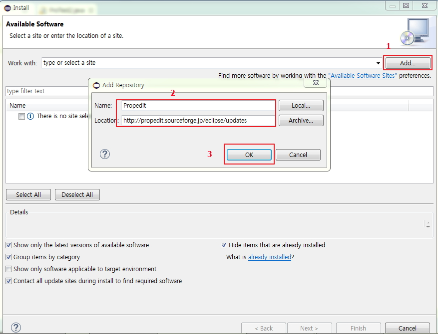
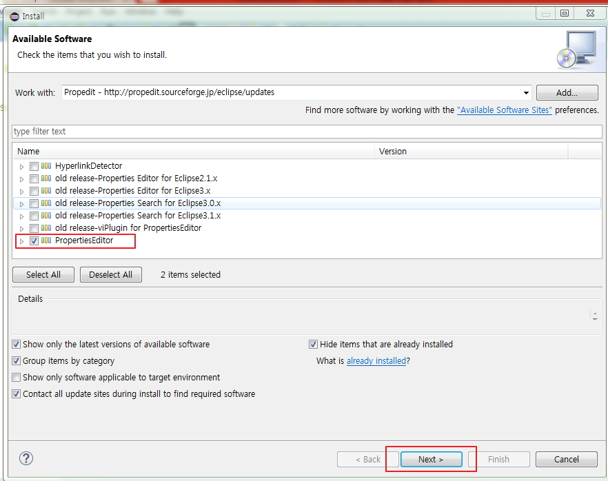
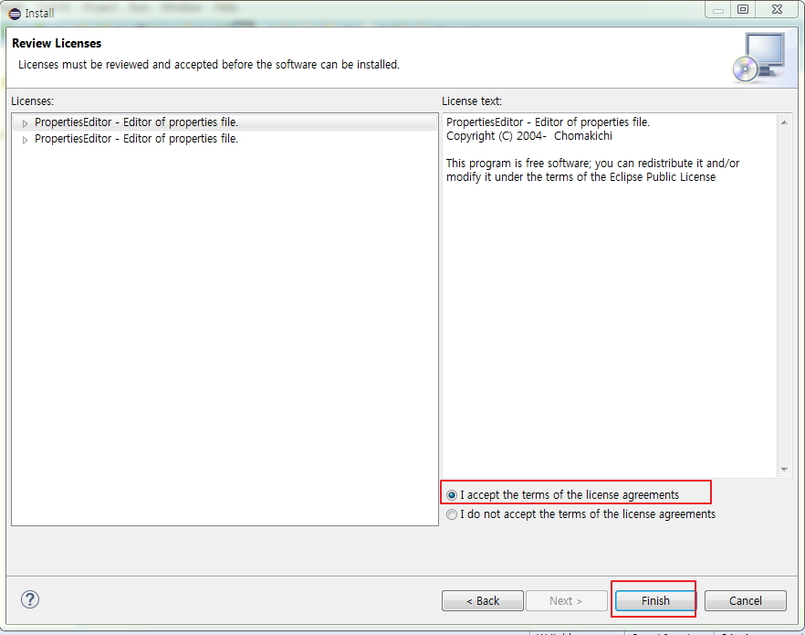
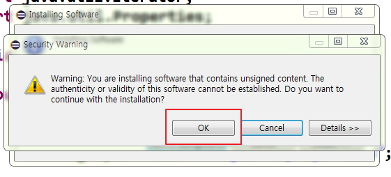
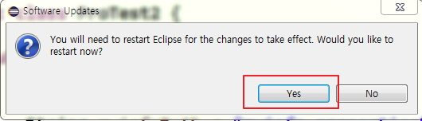
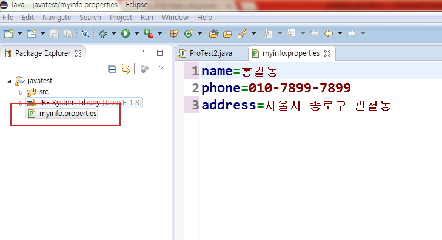

# Collections Framework

## Collections Framework

- 배열의 단점을 개선한 클래스로 객체만 저장할 수 있다.
- 배열의 단점인 메모리 낭비를 피할수 있는 구조이다.
- 동적인 크기 변경이 가능합니다.
- 자료를 효율적으로 정리하는것을 자료구조(Data structure)라 한다.
- 자료구조 방법에는 Set계열, List계열, Map계열이 있다.
- java는 java.util 패키지의 자바 컬렉션(JCF)에서 자료구조 방법을 제공한다.

<br />

### 1. Set

- 순서가 없고 중복안됨
- HashSet, TreeSet

> SetTest.java

```java
package day09;

import java.util.HashSet;
import java.util.Iterator;

public class SetTest {

  public static void main(String[] args) {
   HashSet set = new HashSet();
   set.add("lee");
   set.clear();
   set.add("cho");
   set.add("kim");
   set.add("chung");
   set.add("min");
   set.add("chung");

   System.out.println(set);
   System.out.println("set 사이즈: "+set.size());
   System.out.println(set.contains("chung"));

   set.remove("kim");
   System.out.println(set);
   System.out.println("set 사이즈: "+set.size());

   System.out.println("Iterator객체이용해서 set값을 출력");
   print(set.iterator());

   System.out.println("배열을 이용해서 set출력");
   print(set.toArray());


  }

  private static void print(Object[] array) {
    for(int i=0; i<array.length; i++) {
      System.out.println(array[i]);
    }

  }

  private static void print(Iterator iterator) {
    while(iterator.hasNext()) {
      String str = (String)iterator.next();
      System.out.println(str);
    }

  }
}
```

<br />

### 2. List

- 순서가 있고 중복이 가능하다.
- ArrayList, LinkedList, Vector

```
java.lang.Object
  |
  +-- java.util.AbstractCollection
        |
        +-- java.util.AbstractList
              |
              +-- java.util.ArrayList

- 모든 구현 인터페이스 :
  Cloneable , Collection , List , RandomAccess , Serializable
```

> ListTest1.java

```java
package day09;

import java.util.ArrayList;
import java.util.Iterator;
import java.util.List;

public class ListTest {

  public static void main(String[] args) {
    ArrayList list = new ArrayList();
    list.add("lee");
    list.clear();
    list.add("cho");
    list.add("kim");
    list.add("chung");
    list.add("min");
    list.add("chung");

    System.out.println(list);
    System.out.println("ArrayList 사이즈:"+list.size());
    System.out.println(list.contains("chung"));

    list.remove("kim");
    System.out.println(list);
    list.remove(3);
    System.out.println(list);

    System.out.println("ArrayList 사이즈:"+list.size());
    System.out.println("min 위치값: "+list.indexOf("min"));

    System.out.println("for문으로 출력");
    print(list);//업캐스팅
    List sublist = list.subList(0, 2);
    System.out.println("-------------------");
    print(sublist);//캐스팅 없다.

    System.out.println("Iterator를 이용해서 출력");
    print(list.iterator());

    System.out.println("배열을 이용해서 출력");
    print(list.toArray());


  }

  private static void print(Object[] array) {
    for(int i=0; i<array.length; i++) {
      System.out.println(array[i]);
    }

  }

  private static void print(Iterator iterator) {
     while(iterator.hasNext()) {
       System.out.println(iterator.next());
     }

  }

  private static void print(List list) {
   for(int i=0; i<list.size(); i++) {
     System.out.println(list.get(i));
   }

  }

}
```

> ArrayListTest.java

```java
package day09;

import java.util.ArrayList;

class Jumsu{
  String name;
  int kuk;
  int eng;
  int tot;
  int avg;

  public Jumsu() {}
  public Jumsu(String name, int kuk, int eng) {
    this.name = name;
    this.kuk = kuk;
    this.eng = eng;
    tot = kuk + eng;
    avg = tot/2;
  }
}


public class ArrayListTest {

  public static void main(String[] args) {
    Jumsu s1 = new Jumsu("왕눈이",100,80);
    Jumsu s2 = new Jumsu("아로미",80,90);
    Jumsu s3 = new Jumsu("투투", 90, 80);

    ArrayList v = new ArrayList();
    v.add(s1);//업캐스팅
    v.add(s2);//업캐스팅
    v.add(s3);//업캐스팅

    for(int i=0; i<v.size(); i++) {
      Jumsu s =(Jumsu) v.get(i);//다운캐스팅
      System.out.print(s.name +"\t");
      System.out.print(s.kuk + "\t");
      System.out.print(s.eng + "\t");
      System.out.print(s.tot + "\t");
      System.out.println(s.avg);
    }

  }

}
```

<br />

- Vector의 정의 및 요소 검색, 크기 조절

```
java.lang.Object
  |
  +--java.util.AbstractCollection
        |
        +--java.util.AbstractList
              |
              +--java.util.Vector

모든 구현 인터페이스:
Cloneable , Collection , List , RandomAccess , Serializable

직계의 기존의 서브 클래스:
Stack
```

> SearchDelete.java

```java
package day09;

import java.util.Vector;

public class SearchDelete {

  public static void main(String[] args) {
    String name[] = {"기획자","설계자","개발자"};

    Vector v = new Vector();

    for(int i=0; i<name.length; i++) {
      v.add(name[i]);
    }

    System.out.println(v);

    if(v.contains("개발자1")) {
      int i = v.indexOf("개발자");
      System.out.println("해당 객체의 인덱스 "+(i+1)+"번째에 있습니다.");
    }else {
      System.out.println("해당 객체가 없습니다.");
    }

    v.remove(0);
    System.out.println("===== 지우고 난 후에는 =====");
    for(int i=0; i<v.size(); i++) {
      String s = (String)v.get(i);
      System.out.println("Vector "+i+" 번째 요소는 "+s);
    }

    System.out.println("-----초기상태(capacity)과 사이즈(size)-----");
    System.out.println("요소의 수:"+v.size());
    System.out.println("벡터의 크기:"+v.capacity());
    System.out.println("v.trimToSize()호출----------------------");
    v.trimToSize();
    System.out.println("요소의 수:"+v.size());
    System.out.println("벡터의 크기:"+v.capacity());

    System.out.println("디자이너 요소 추가후 ------------------------");
    v.add("디자이너");
    System.out.println("요소의 수:"+v.size());
    System.out.println("벡터의 크기:"+v.capacity());

    System.out.println("코더 요소 추가후 ------------------------");
    v.add("코더");
    System.out.println("요소의 수:"+v.size());
    System.out.println("벡터의 크기:"+v.capacity());


    System.out.println("PM 요소 추가후 ------------------------");
    v.add("PM");
    System.out.println("요소의 수:"+v.size());
    System.out.println("벡터의 크기:"+v.capacity());
  }

}
```

> VectorTest2.java

```java
import java.util.Vector;
class Sungjuk{
    //멤버 변수
    String name="";
    int kuk = 0;
    int eng = 0;
    int tot = 0;
    int avg = 0;
    public Sungjuk(){}
    public Sungjuk(String name,int kuk,int eng){
        this.name = name;
        this.kuk = kuk;
        this.eng = eng;
        this.tot = kuk+eng;
        this.avg = (kuk+eng) / 2;
    }
}
public class VectorTest2 {
    public static void main(String args[]){
        int i=0;

        //sungjuk 객체 생성
        Sungjuk s = null;
        Sungjuk s1 = new Sungjuk("기획자",100, 80);
        Sungjuk s2 = new Sungjuk("설계자",80, 90);
        Sungjuk s3 = new Sungjuk("개발자",90, 80);

        //Vector에 요소 저장
        Vector v = new Vector();
        v.addElement(s1);
        v.addElement(s2);
        v.addElement(s3);
        //vector에 저장된 sungjuk객체 추출하여 출력
        for(i=0; i<v.size(); i++){
            s = (Sungjuk)v.get(i);
            System.out.print(s.name + "\t");
            System.out.print(s.kuk + "\t");
            System.out.print(s.eng + "\t");
            System.out.print(s.tot + "\t");
            System.out.print(s.avg + "\t\n");
        }
    }
}
```

<br />

### 3. Map

- Key, value 한쌍
- HashMap, Hashtable
- put 메서드로 입력합니다.
- 중복된 키 값을 허용하지 않습니다. 만약 사용하게되면 기존의 값이 삭제된다.
- 검색 결과가 없으면 null을 리턴한다.

> MapTest .java

```java
package day09;

import java.util.HashMap;
import java.util.Iterator;
import java.util.Map;
import java.util.Set;

public class MapTest {

  public static void main(String[] args) {
    HashMap map = new HashMap();
    map.put("0", "lee");
    map.clear();

    map.put("1", "cho");
    map.put("2", "kim");
    map.put("3", "chung");
    map.put("4", "min");
    map.put("3", "jung");
    System.out.println(map);
    System.out.println(map.size());
    System.out.println("key 3 :"+map.containsKey("3"));
    System.out.println("value kim : "+map.containsValue("kim"));
    System.out.println("key 2 delete : "+map.remove("2"));
    System.out.println(map);
    System.out.println(map.size());

    print(map);

  }

  private static void print(Map map) {//업캐스팅
    //key값들을 Set자료구조로 만듬
    Set set = map.keySet();

    //Set자료구조에 들어있던 key들이 Iterator자료구조로 변환
    Iterator iter = set.iterator();

    while(iter.hasNext()) {//key값에 차례대로 접근
      String key = (String)iter.next();
      System.out.println(key + "=" + map.get(key));
    }

  }

}
```

```
java.lang.Object
  |
  +--java.util.Dictionary
        |
        +--java.util.Hashtable

모든 구현 인터페이스:
Cloneable , Map , Serializable

직계의 기존의 서브 클래스:
Properties , UIDefaults
```

> TestHashTable.java

```java
package day09;

import java.util.Enumeration;
import java.util.Hashtable;
import java.util.Iterator;
import java.util.Map;

public class TestHashTable {

  public static void main(String[] args) {
    Hashtable ht = new Hashtable();

    ht.put("AREA01", "대한민국");
    ht.put("AREA02", "러시아");
    ht.put("AREA03", "중국");
    ht.put("AREA04", "일본");

    String area = (String)ht.get("AREA05");

    if(area !=null) {
      System.out.println(area);
    }else {
      System.out.println("검색지역이 없습니다.");
    }

    print(ht);

  }

  private static void print(Hashtable ht) {
    Iterator iter = ht.keySet().iterator();
    while(iter.hasNext()) {
      String key = (String)iter.next();
      System.out.println(key + " = " + ht.get(key));

    }

    System.out.println("-------------------------------------");

    Enumeration e = ht.keys();
    while(e.hasMoreElements()) {
      String key = (String)e.nextElement();
      System.out.println(key + " = "+ht.get(key));
    }

  }

}
```

```
java.lang.Object
  |
  +--java.util.Dictionary
        |
        +--java.util.Hashtable
              |
              +--java.util.Properties
```

> ProTest.java

```java
//import java.util.Properties;
public class ProTest {
    public static void main(String[] args) {
        //Properties p = new Properties();
        java.util.Properties p = new java.util.Properties();
        p.put("step1", "JAVA + SCJP");
        p.put("step2", "JSP + Oracle + SCWCD");
        p.put("step3", "EJB + SCBCD");
        p.put("step4", "OJT + MVC2, Framework + 개발");
        System.out.println("STEP1:" + p.getProperty("step1"));
        System.out.println("STEP2:" + p.getProperty("step2"));
        System.out.println("STEP3:" + p.getProperty("step3"));
        System.out.println("STEP4:" + p.getProperty("step4"));
    }

}
```

<br />

- properties파일의 값을 Properties 객체로 로딩할 수 있다.
- myinfo.properties의 이름, 전화번호, 주소 값을 ProTest2 클래스에서 읽어와서 출력하기.
- properties파일에 한글 인식할 수 있도록 Eclipse에 플러그인 설치 하기.

Eclipse ->Help -> Install New Software... -> add버튼 -><br />
Name : Propedit<br />
Location : http://propedit.sourceforge.jp/eclipse/updates

<br />



- PropertiesEditor 선택후 Next



- Licenses 동의후 Finish



- 설치 중간에 다음 오류창 뜨면 OK를 선택 후 계속 진행



- 설치가 다된후 Eclipse restart 한다.



- properties 파일에 한글이 이제 보인다.



<br />

> javatest/myinfo.properties

```
name=홍길동
phone=010-7899-7899
address=서울시 종로구 관철동
```

> ProTest2.java

```java
import java.io.FileInputStream;
import java.util.Iterator;
import java.util.Properties;

public class ProTest2 {

    public static void main(String[] args) {
        String myinfoPath = "myinfo.properties";

        FileInputStream fis = null;

        Properties pro = new Properties();
        try {
            fis = new FileInputStream(myinfoPath);

            pro.load(fis);

        } catch (Exception e) {
            e.printStackTrace();
        }

        Iterator iter = pro.keySet().iterator();

    //while(iter.hasNext()){
        //String key = (String)iter.next();
        //String value = (String)pro.getProperty(key);
        //System.out.println(key+"="+value);
    //}

        System.out.println("이름:"+pro.getProperty("name"));
        System.out.println("전화번호:"+pro.getProperty("phone"));
        System.out.println("주소:"+pro.getProperty("address"));
    }
}
```
