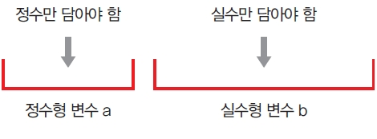
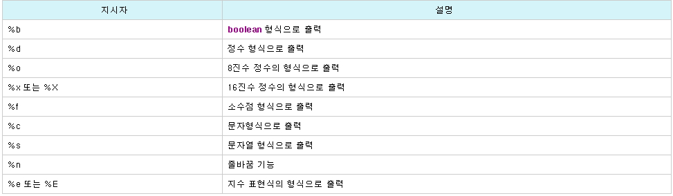
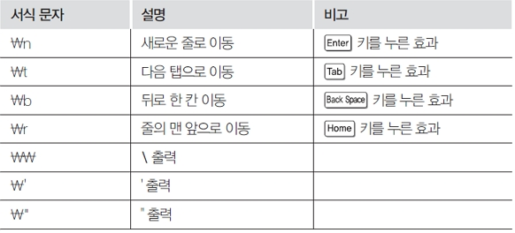
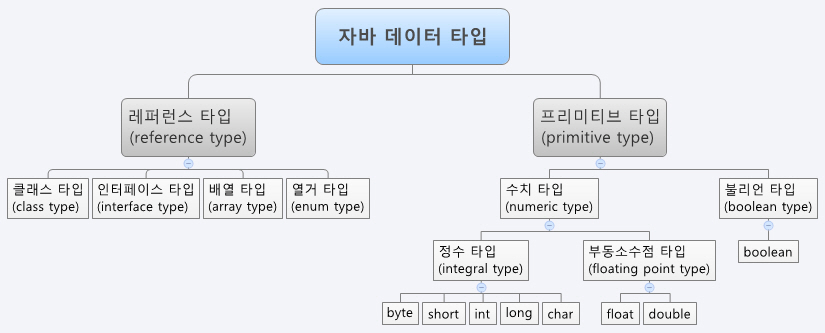
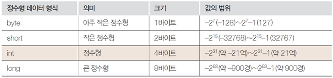
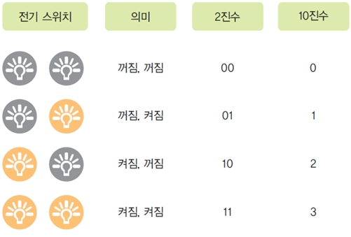
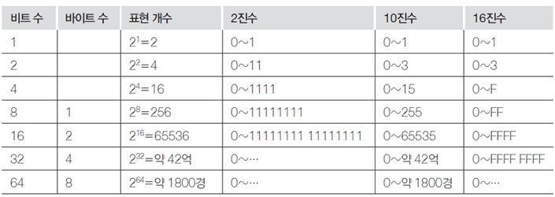

# 식별자, System.out의 기본, Data Type(기본형, 참조형), 형변환

## 식별자(Identifier)

- 클래스 이름, 메소드 이름, 변수 이름 등을 말합니다.
- `이름 자체로 어느정도 내용이 식별이 되어야` 합니다.
- `대소문자` 구별, Test와 test는 `별개의 식별자`

### (1) 식별자 규칙

| 문자, 숫자 종류       | 사용여부                            |
| --------------------- | ----------------------------------- |
| 일반문자(알파벳)      | 모든 곳에서 사용가능(대소문자 구분) |
| $, \_                 | 모든 곳에서 사용 가능               |
| 특수 문자($, \_ 제외) | 모든 곳에서 사용 불가               |
| 숫자                  | 두 번째부터 가능(숫자로 시작 불가)  |

### (2) 잘못된 식별자 예

- int 3Chapter; -> 숫자로 사용하였기 때문
- class if { } -> if는 자바의 예약어임
- char false; -> false는 사용 불가
- void null() { } -> null 사용 불가
- class %calc { } -> '%'는 특수문자

<br />

### 1. 클래스 /인터페이스 이름(class name), 파스칼 방식

- 첫자는 대문자가 아니어도 에러는 발생이 안되나 `일반적으로 첫자는 대문자`를 이용합니다.
- 또한 `마디마다 대문자`를 이용합니다.

`Hello, HelloWorld, CompanyName, Company_name (예외)`

<br />

### 2. 메소드명(method name)/멤버변수, 필드, 카멜 방식

- `첫자는 일반적으로 소문자`로 시작합니다.
- 메소드의 `마디는 대문자`를 이용합니다.

`println(), printName(), print_name() (예외)`

<br />

### 3. 상수: 모두 대문자

`패키지` : `모두 소문자`
화면GUI : btnAddress(버튼), txtAddress(텍스트필드), lbName(레이블)
=> 헝가리안

<br />

### 4. 변수

- `Data를 보관하는 저장장소 (그릇)`
- `메모리의 한공간 `

```
int a;
double b;
```



- int d = 200; '=' 연산자를 중심으로 오른쪽의 데이터가 왼쪽으로 할당됩니다.
- 변수는 `데이터 타입과 함께 선언`하며, `초기화 한후 사용`합니다.
- 변수의 타입 다음에 변수 이름을 적어 변수를 선언합니다.

- 변수 선언의 예

```
int radius = 10;
char c1 = ‘a', c2 = 'b', c3 = 'c';
double weight = 75.56;
```

<br />

> Variable.java

```
class Variable {
    public static void main(String[] args) {
        System.out.println("데이터 타입 실습");
            boolean sw = true;
            System.out.println("sw: " + sw); // +: 문자열 연결

            char grade = '수';       // 데이터 타입   변수명  =     값;
            System.out.println("grade: " + grade);

            String name = "소프트웨어";
            System.out.println("name: " + name);

            int year = 2014;
            System.out.println("year: " + year);

            double ija = 0.04; // 4 %
            System.out.println("ija: " + ija);
    }
}
```

<br />

## System.out의 기본

- System.out은 지정된 서식으로 화면에 보여주는 역할을 한다.
- `화면에 내용을 출력`해주는 System.out 대표 메소드 3개
  - `System.out.println()` : 괄호 안의 내용을 출력한 후 `한 행을 띈다`.
  - `System.out.print()` : 괄호 안의 내용을 출력한 후 `한 행을 띄지 않는다`.
  - `System.out.prinf()` : `서식을 지정해서 출력`할 수 있다.

<br />

### 1. System.out.printf() 메소드의 기본적인 사용법

- `("")안의 내용을 출력한다는 의미` <br />
  System.out.printf("안녕하세요") ----> 안녕하세요 <br />
- `숫자를 나타내는 서식` `%d`를 사용하는 경우 <br />
  System.out.printf("100") ----> 100 (문자) <br />
  System.out.printf("%d",100) ----> 100 (숫자)

```
public class Ex03_01 {
  public static void main(String[] args) {
    System.out.printf("100+100");
    System.out.printf("\n");
    System.out.printf("%d", 100 + 100);
    System.out.printf("\n");
  }
}
```

- **서식 갯수와 출력 숫자의 개수가 같아**야 한다. (다르면 오류 발생)

```
public class Ex03_02 {
  public static void main(String[] args) {
    System.out.printf("%d", 100, 200);
    System.out.printf("\n")
    System.out.printf("%d %d", 100);
    System.out.printf("\n");
  }
}
```

<br />

### 2. 정수외에 자주 사용되는 서식



```
public class Ex03_03 {
  public static void main(String[] args) {
    System.out.printf("%d / %d = %f", 100, 200, 0.5);
    System.out.printf("\n");
  }
}

public class Ex03_04 {
  public static void main(String[] args) {
    System.out.printf("%d / %d = %f \n", 100, 200, 0.5);
    System.out.printf("%c %c \n", 'a', 'K');
    System.out.printf("%s %s \n", "IT CookBook", "JAVA");
  }
}
```

<br />

### 3. 자릿수 맞춘 출력

- 숫자 출력 시 숫자의 서식을 지정해서 출력한다.
- %5d -> 숫자를 오른쪽으로 붙여서 출력 (5자리 확보)
- %05d -> 숫자를 오른쪽에 붙여서 출력 빈칸은 0으로 채움
- %f -> 소수점 아래 여섯 자리까지 무조건 출력
- %7.1f -> 소수점 아래 첫째 자리만 출력, 소수점 둘째 자리서 반올림 (7자리 확보, . 포함)
- %7.3f -> 소수점 아래 셋째 자리까지 출력, 오른쪽 빈칸은 0으로 채움 (7자리 확보)
- %s -> 자리수만큼 출력
- %10s -> 오른쪽 정렬(10자리 확보)

```
public class Ex03_05 {
  public static void main(String[] args) {
    System.out.printf("%d\n", 123);
    System.out.printf("%5d\n", 123);
    System.out.printf("%05d\n", 123);

    System.out.printf("%f\n", 123.45);
    System.out.printf("%7.1f\n", 123.45);
    System.out.printf("%7.3f\n", 123.45);

    System.out.printf("%s\n", "Hi~Java");
    System.out.printf("%10s\n", "Hi~Java");
  }
}
```

<br />

### 4. 다양한 기능의 서식 문자



```
public class Ex03_06 {
  public static void main(String[] args) {
    System.out.printf("\n줄바꿈\n연습 \n");
    System.out.printf("\t탭키\t연습 \n");
    System.out.printf("이것을\r덮어씁니다 \n");
    System.out.printf("글자가 \"강조\"되는 효과 \n");
    System.out.printf("\\\\\\ 역슬래시 세개 출력 \n");
  }
}
```

<br />

## 데이터 형(data type)

- 자바의 타입은 `기본 데이터 타입`과 `참조형(레퍼런스형) 타입`으로 나눌 수 있습니다.
- 자바의 `8가지 기본 데이터 타입의 크기가 정해져 있습니다`.
- 데이터 타입의 `크기는 CPU나 운영체제에 따라 변하지 않습니다`.
- CPU와 메모리의 한계 때문에 메모리의 저장소를 `데이터 타입별로 구분하여 메모리를 절약`할 수 있습니다.



<br />

### 1. 자바의 8가지 기본형 타입

#### (1) 논리형(logical)

- boolean: 1 Byte(8 Bit)
- 초기값 : false (클래스의 멤버변수의 초기값)
- 갖을 수 있는 값의 범위: true, false
- 참/거짓을 저장

```
  boolean bo=true;
```

> Main.java

```
public class Main {
  public static void main(String[] args) {
    boolean b1 = true;
    boolean b2 = false;
    boolean b3 = (10 > 2) ? true : false; //삼항 연산자

    System.out.println("Value of boolean variable b1 is :" + b1);
    System.out.println("Value of boolean variable b2 is :" + b2);
    System.out.println("Value of boolean variable b3 is :" + b3);
  }
}

public class Ex03_14 {
  public static void main(String[] args) {
    boolean boo1, boo2;

    boo1 = true;
    System.out.printf("%s \n", boo1);

    boo2 = (10 == 20);
    System.out.printf("%s \n", boo2);
  }
}
```

<br />

#### (2) 문자형(character)

- 문자 한 자를 나타냅니다.
- 단일 인용부호(‘’)로 문자 하나 표현
  `'a', 'W', '가', '\*', '3', '7'`
- char: 2 Byte(16 Bit)
- 초기값 : \u0000 (\u다음4자는 16진수)
- 범위: \u0000 ~ \uFFFF(Unicode 0~65535)

```
char grade = 'A';
```

- 특수 기호는 `\`로 시작
  \b - 백스페이스
  \t - 탭
  \n - 라인피드
  \\ - 백슬래쉬

■ 아스키코드와 유니코드

- `아스키코드`는 **컴퓨터에서 표현하는 문자(키보드에 있는 영문, 기호, 숫자등)를 0~127에 대응시킨 코드**라 할 수 있다.



- **영문과 숫자뿐 아니라 한글, 중국어, 아랍어 등 많은 종류의 문자를 표현**하기 위한 것이 `유니코드`이다.
- Java의 문자형 char은 유니코드를 표현하기 위해 2바이트를 할당한다.

> Main2.java

```
public class Main2 {

    public static void main(String[] args) {
    char ch1 = 'a';
    char ch2 = 65;
    System.out.println("Value of char variable ch1 is :"  +  ch1);
    System.out.println("Value of char variable ch2 is :"  +  ch2);
  }
}

public class Ex03_12 {
  public static void main(String[] args) {
    char a, b, c, d, e;

    a = 'A';
    System.out.printf(" %c \t", a);
    System.out.printf(" %d \n", (int) a);

    b = 'a';
    c = (char) (b + 1);
    System.out.printf(" %c \t", b);
    System.out.printf(" %c \n", c);

    d = 90;
    System.out.printf(" %c \n", d);

    d = '가';
    e = (char) (d + 1);
    System.out.printf(" %d \t", (int) d);
    System.out.printf(" %c \n", e);
  }
}
```

<br />

#### (3) 숫자형(정수,실수)

- 정수 숫자형(음의 정수, 양의 정수)



1 bit ---> 1 byte ---> 1 KB ---> 1 MB ---> 1 GB ---> 1 Tera
8 bit 1024Byte 1024KB 1024MB 1024G

- 저장 용량의 단위

  - 1 Bit: 0, 1
  - 1 Byte: 8 bit -> 한글 1자: 2 Byte, 영숫자: 1 Byte
  - 1 KByte: 1024 Byte -> 한글 512자
  - 1 MByte: 1024 KByte -> MP3 음악 1곡 6 MByte
  - 1 GByte: 1024 MByte -> MP4 영화 1편 1.5 GByte
  - 1 TByte: 1024 GByte
  - 1 EByte: 1024 Ebyte

- 비트

  - 컴퓨터에서 표현하는 가장 작은 단위로, 0, 1만 존재 하여 하나의 비트로 두 가지를 표현
  - 전기 스위치와 비슷한 개념, 전기 스위치에 OFF와 ON만 있듯이 비트에도 0(OFF)과 1(ON)만 존재한다.



- 바이트

  - JAVA에서 가장 많이 사용되는 단위이다.
  - 바이트는 8개의 비트가 합쳐진 것이다.
  - 비트와 바이트의 크기에 따른 숫자의 범위는 다음과 같다.


> MainClass.java

```
    public class MainClass{
      public static void main(String[] argv){
        int a = (20 - 3) * (3 - 9) / 3;
        int b = 20 - 3 * 3 - 9 / 3;

        System.out.println(a);
        System.out.println(b);
     }
}
```

<br />

#### (4) 실수 숫자형(real number)

- `float`: 4 Byte

  - 초기값: 0.0
  - -3.4e-38 ~ +3.4e+38

- `double`: 8 Byte
  - 기본 실수형
  - 초기값: 0.0
  - 값의 범위: -1.79e-308 ~ 1.79e+308

> CircleArea.java

```
public class CircleArea {
  public static void main(String[] args) {
    final double PI = 3.14; // 원주율을 상수로 선언
    double radius = 10; // 원의 반지름
    double circleArea = 0; // 원의 면적
    circleArea = radius*radius*PI; // 원의 면적 계산

    // 원의 면적을 화면에 출력한다.
    System.out.print("원의 면적 = ");
    System.out.println(circleArea);
  }
}
```

<br />

## 참조 타입(레퍼런스 타입)

- 클래스, 배열, 인터페이스
- `변수에 참조값(해쉬코드)을 가집`니다.

```
String str = "왕눈이";
│
└----> 참조값(해쉬코드)

StringBuffer sb = new StringBuffer();

Object b = new Object();
│
└----> 참조값(해쉬코드)

int[] ia = {100, 200, 300, 400, 500};
```

- 평면위의 점을 표시하는 클래스
  > Point.java

```
public class Point {
  int x, y; //멤버변수
  Point(int x, int y) { //생성자
    this.x = x;
    this.y = y;
  }
}
```

- 하나의 객체를 두 개의 변수에 대입하는 프로그램
  > PointTest.java

```
public class PointTest {
  public static void main(String[] args) {
    Point obj1 = new Point(10, 20);
    Point obj2 = obj1;
    System.out.printf("obj1 = (%d, %d) %n", obj1.x, obj1.y);
    System.out.printf("obj2 = (%d, %d) %n", obj2.x, obj2.y);

    obj2.x = 30;
    System.out.printf("obj1 = (%d, %d) %n", obj1.x, obj1.y);
    System.out.printf("obj2 = (%d, %d) %n", obj2.x, obj2.y);

    System.out.println("obj1:"+obj1.hashCode());
    System.out.println("obj2:"+obj2.hashCode());
  }
}
```

<결과>
obj1 = (10, 20)
obj2 = (10, 20)
obj1 = (30, 20)
obj2 = (30, 20)
obj1:434091818
obj2:434091818

<br />

## 형변환(data type casting)

- Casting시에는 데이터 짤림이 발생하는지 확인해야 합니다.
- `데이터 짤림이 발생하면 캐스팅은 피해야` 합니다.
- 실수를 정수로 바꾸는것이 형변환 입니다.

```
   |              double        (자동 변환)
   |                                 ▲
   |               float             |
   |                                 |
   |               long              |
   |                                 |
   |                int              |
   |                                 |
   |            short, char          |
   ▼                                 |
(casting)           byte             |
```

> Cast_Test.java

```
package day02;

public class Cast_Test {

  public static void main(String[] args) {
    int i = 1234;
    int k;
    float f = 10.5f;
    double d = 100.55;

    //System.out.println("Trace k: " + k);
    //k = f;

    k = (int)f;
    System.out.println(k);

    f = i;
    System.out.println(f);

    f = (float)d;
    System.out.println(f);
  }
}
```

> TypeConversion.java

```
public class TypeConversion {
  public static void main(String[] args) {
    byte b = 127;
    int i = 100;
    System.out.println(b+i);
    System.out.println(10/4);
    System.out.println(10.0/4);
    System.out.println((char)65);
    System.out.println((byte)(b+i));
    System.out.println((int)2.9 + 1.8);
    System.out.println((int)(2.9 + 1.8));
    System.out.println((int)2.9 + (int)1.8);
  }
}
```
