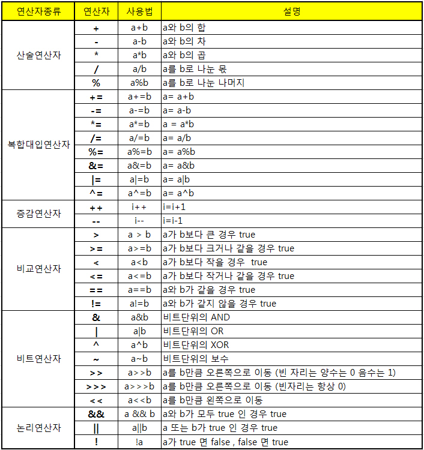

# operator

## 연산자(operator)



### 1. `산술(수치) 연산자` : `+, -, \*, /(나누기), %(나머지)`

- 정수/정수 = 정수
- float n = 0.0f; f를 제거하면 double 8바이트가 됩니다.

> Arithmetic.java

```java
public class Arithmetic {
    public static void main(String args[]) {
        int i = 20;
        int j = 12;

        int a = i + j;
        int b = i - j;
        int c = i * j;
        int d = i / j;
        int e = i % j;
        float n = 0.0f;

        System.out.println("i : " + i + "j : " + j);
        System.out.println("덧셈 결과 : " + a);
        System.out.println("뺄셈 결과 : " + b);
        System.out.println("곱셈 결과 : " + c);
        System.out.println("나눗셈 결과 : " + d);
        System.out.println("나머지 결과 : " + e);

        n = i/j;
        System.out.println("정수/정수의 결과:" + n);
    }
}
```

<br />

### 2. `대입 연산자` : `=`

- `좌변`은 상수값이 아니라 `기억장소`가 와야합니다.

ⓐ a = i + j; <br />
ⓑ b = 10 + 20; <br />
ⓒ 100 = i + 10; //ERROR

```java
[실행 화면]
성적 처리

---

성명: 왕눈이
국어: 92
영어: 88
수학: 80
총점: 260
평균: 86
```

> Sungjuk.java

```java
class Sungjuk {
    public static void main(String[] args) {
        String name = "왕눈이";
        int kuk = 92;
        int eng = 88;
        int mat = 80;
        int tot = kuk + eng + mat; // 총점
        int avg = tot / 3; // 평균

        System.out.println("   성적 처리   ");
        System.out.println("---------------");
        System.out.println("성명: " + name);
        System.out.println("국어: " + kuk);
        System.out.println("영어: " + eng);
        System.out.println("수학: " + mat);
        System.out.println("총점: " + tot);
        System.out.println("평균: " + avg);
    }
}
```

<br />

### 3. `연산후대입 연산자` : `+=, -=, \*=, /=, %=`

- 처리속도 향상

> Operator.java

```java
public class Operator {
    public static void main(String[] args) {
        int i = 10;
        int j = 20;

        i += j;  // i = i + j; i = 10 + 20
        System.out.println("i += j: " + i); //30

        i -= j; // i = i - j; i = 30 - 20
        System.out.println("i -= j: " + i); //10
    }
}
```

<br />

### 4. `증가/감소 연산자` : `++, --`

- 알아보기 쉽게 코딩하는 것이 필요합니다.


> IncDec.java

```java
public class IncDec {

    public static void main(String[] args) {
        long i = 0;
        long hap = 0;

        //hap = ++i; // i 변수의 값을 1증가시켜 hap에 할당, 전치 증가 연산자
        //hap = i;
        //hap = i++; // hap에 i변수의 값을 주고 i 변수의 값을 1증가, 후치 증가 연산자
        //i++; // ++i  //i = i+1;
        //hap = i;
        //hap = ++hap + ++i; //권장 아님
        System.out.println("hap: " + hap + "     i: " + i);
    }
}
```

<br />

### 5. `관계(비교) 연산자` : `<, <=, >=, >, ==, !=, instanceof`

> Compare.java

```java
public class Compare {
    public static void main(String args[]) {
        int i = 5;
        int j = 10;
        int k = 15;

        System.out.println("5 == 10 : " + (i == j)); // false
        System.out.println("5 != 15 : " + (i != k)); // true
        System.out.println("10 < 15 : " + (j < k));
        System.out.println("k>i     : " + (k > i));
        System.out.println("i<=k    : " + (i <= k));
        System.out.println("i>=j    : " + (i >= j));

        //연산 순서: () ---> 산술 연산자 --> 관계 연산자
        System.out.println("10 + 5 < 20 + 10 : " + (10 + 5 < 20 + 10));
    }
}
```

<br />

### 6. `비트연산자(&,|,^,~)`와 `시프트 연산자(>>,<<,>>>)`

- 십진수를 2진수로 변환할때 가중치를 이용하면 편리합니다
- -는 2의 보수를 이용합니다. 2의 보수는 1의 보수를 구한후 1을 더합니다.

```java
                128 64 32 16 8 4 2 1 ---> 가중치

예)  65 (10진수)-> 0  1  0  0 0 0 0 1  => 1000001(2진수)

    -65 (10진수)-> 1  0  1  1 1 1 1 0  => 1의 보수
                +                   1  => 1의 보수에 +1하면 2의 보수
                 ---------------------
                   1  0  1  1 1 1 1 1  => -65의 2진수 표기
```

- `>` : 지정된 수가 양수이면 0, 음수이면 1로 채워집니다. 2로 나눈 결과와 같습니다.
- `<<` : 무조건 0으로 채워집니다. 2로 곱합 결과와 같습니다.
- `>` : 무조건 0으로 채워서 양수 처리합니다.

> Bitwise.java

```java
public class Bitwise {
    public static void main(String args[]) {
        int a = 2;
        int b = 5;

        int c = a | b; //2진수 bit or

        //   ....8421  ----->가중치
        // 00000010
        //+00000101
        //---------
        // 00000111--> 7

        int d = a & b; //and
        // 00000010
        //+00000101
        //---------
        // 00000000--> 0


        int e = a ^ b; //Exclusive or
        // 00000010
        //+00000101
        //---------
        // 00000111--> 7


        int i; int j;
        i = a << 2;    //좌 shift 연산, 2를 2번 곱합
        //   ....8421
        // 00000010
        // 00001000 --> 8


        j = b >> 2;    //우 shift 연산. 2로 2번 나눔
        //   ....8421
        // 00000101
        // 00000001 --> 1


        System.out.println("        a = " + a);
        System.out.println("        b = " + b);
        System.out.println("      a|b = " + c);
        System.out.println("      a&b = " + d);
        System.out.println("      a^b = " + e);
        System.out.println("     a<<2 = " + i);
        System.out.println("     b>>2 = " + j);
    }
}
```

<br />

### 7. `논리연산자(조건 연산자, Short Circuit)`

- `조건문과 함께 많이 사용`됨
- `&&`: `양쪽의 조건이 전부 맞아`야 참입니다.
- `||`: `어느 한쪽만 참이면 참`입니다.

<br />

### 8. `삼항 연산자`

> Ternary.java

```java
class Ternary {
    public static void main(String args[]) {
        int x = 10;
        int y;

        //System.out.println("결과는 " + y);

        //System.out.println("초기화되지 않은 y의 값: " + y);
        //y = 조건문 ? 참값 : 거짓값
        y = x < 9 ? 3 : 5;
       System.out.println("결과는 " + y);
    }
}
```
