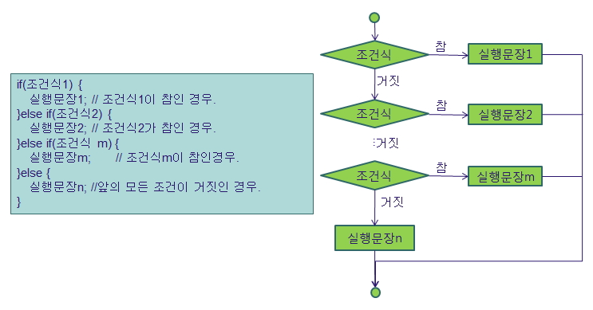

# 제어문 - 분기문(if, switch문)

## 제어문 - 분기문 if

- 조건에 따라 분기를 할 수 있습니다.

```
if (조건식) {
    참일 경우 실행;
    참일 경우 실행;
} else {
    거짓일 경우 실행
}
```

- 제어문에 따른 `실행 문장이 한 문장이면 중괄호를 생략`해도 됩니다. (권장아님)
- 참거짓 상황에서 실행할 문장이 `2문장 이상이면 중괄호 블럭을 반드시 추가`해야합니다.
- 처리할 문장이 한 문장이더라도 쉬운 식별을 위해 "{}"을 추가 합니다.
- 중괄호 블럭안은 경계를 쉽게 알아볼수 있도록 반드시 들여쓰기를 합니다.




<br />

### 1. 실습 예제

> IfExam.java

```
public class IfExam {

    public static void main(String[] args) {
        int su = 10;

        System.out.println("정수: " + su);
        if (su % 2 == 0){
            System.out.println("2의 배수");
        }

        if (su % 3 == 0){
            System.out.println("3의 배수");
        }

        if (su % 4 == 0){
            System.out.println("4의 배수");
        }
    }
}
```

> IfExam2.java

```
public class IfExam2 {

    public static void main(String[] args) {
        int su = -7;

        System.out.println("정수: " + su);
        if (su < 0){
            System.out.println("음수");
        }else {
            System.out.println("양수");
        }
    }
}
```

> IfTest1.java

```
/*
컴파일 및 실행:
javac IfTest1.java
java IfTest1
*/

class IfTest1 {
    public static void main(String[] args) {
        int i = 120;

        // 참일 경우만 처리, 거짓은 무시
        if (i % 2 == 0) {
            int count = 1;
            System.out.println(i + "은(는) 짝수");
        }

        // System.out.println("count: " + count);

        // else를 통한 참, 거짓 구분 처리
        if (i % 2 == 0) {
            System.out.println("짝수 " + i); // 참
        } else {
            System.out.println("홀수 " + i); // 거짓
        }

        // 조건에 걸릴때까지 계속적인 검사, 다중 IF
        if (i % 3 == 0) {
            System.out.println("3의 배수");
        } else if (i % 4 == 0) {
            System.out.println("4의 배수");
        } else if (i % 7 == 0) {
            System.out.println("7의 배수");
        } else {
            System.out.println("3, 4, 7의 배수가    아닙니다.");
        }

        if ( 1 == 1) System.out.println("동일");  /   / X

        if ( 2 == 2)
        System.out.println("동일");               /   / X

        if ( 3 == 3){
            System.out.println("동일");
        }
    }
}
```

> Pay.java

```
public class Pay {

    public static void main(String[] args) {
        int year = 5;         //근무(경력) 년수
        int child = 0;        //자녀수
        int pay = 1500000;    //초봉 기본급

        if (year == 0){
            System.out.println("신입사원입니다.");
        }else if (year == 1) {
            pay = pay + 200000;
            System.out.println("경력 1년 입니다.");
        }else if(year == 2) {
            pay = pay + 400000;
        }else if(year == 3) {
            pay = pay + 600000;
        }else if(year == 4) {
            pay = pay + 800000;
        }else{
            pay = pay + 1500000;
        }

        //자녀수당을 계산합니다.
        if ( year >=1){
            if (child > 1){
                pay = pay + (child * 200000);
            }
        }

        System.out.println("기본급: " + pay);
        System.out.println("연  봉: " + (pay * 13));
        System.out.println("월급여: " + ((pay * 13)/12));
    }
}
```

<br />

## 제어문 - 분기문 Switch 문

- 수식의 결과가 일정한 수치 형태로 나열되어 있는 값과 비교하는 경우 사용합니다.
- case문에 올수 있는 데이터 타입은 byte, char, short, int, long처럼 정수 형태만 올 수 있습니다.


> SwitchTest.java

```
public class SwitchTest{
    public static void main(String args[]){
        int k = 1;

        switch(k){
            case 1:
                System.out.println("1 입니다.");
                break;
            case 2:
                System.out.println("2 입니다.");
                break;
            case 3:
                System.out.println("3 입니다.");
                break;
            case 4:
                System.out.println("4 입니다.");
                break;
            default:
                System.out.println("1부터 4까지 입력해야 합니다.");
                break;
        }
    }
}
```

> SwitchTest2.java

```
public class SwitchTest2{
    public static void main(String args[]){
        char c = 'C';
        String str = "C";

        switch(c){  //정수 계열만 가능
            case 'A':  //65
                System.out.println("입력된 코드는 A 입니다.");
                break;
            case 'B':  //66
                System.out.println("입력된 코드는 B 입니다.");
                break;
            case 'C':
                System.out.println("입력된 코드는 C 입니다.");
                break;
            case 'D':
                System.out.println("입력된 코드는 D 입니다.");
                break;
            default:
                System.out.println("코드는 A부터 D까지 입력해야 합니다.");
                break;
        }
    }
}
```

<br />

★ ASCII CODE

```
Dec Hx Oct Char                        Dec Hx Oct Char  Dec Hx Oct Char  Dec Hx Oct Char
---------------                        ---------------  ---------------  ---------------
  0  0 000 NUL (null)                   32 20 040 SPACE  64 40 100 @      96 60 140 `
  1  1 001 SOH (start of heading)       33 21 041 !      65 41 101 A      97 61 141 a
  2  2 002 STX (start of text)          34 22 042 "      66 42 102 B      98 62 142 b
  3  3 003 ETX (end of text)            35 23 043 #      67 43 103 C      99 63 143 c
  4  4 004 EOT (end of transmission)    36 24 044 $      68 44 104 D     100 64 144 d
  5  5 005 ENQ (enquiry)                37 25 045 %      69 45 105 E     101 65 145 e
  6  6 006 ACK (acknowledge)            38 26 046 &      70 46 106 F     102 66 146 f
  7  7 007 BEL (bell)                   39 27 047 '      71 47 107 G     103 67 147 g
  8  8 010 BS  (backspace)              40 28 050 (      72 48 110 H     104 68 150 h
  9  9 011 TAB (horizontal tab)         41 29 051 )      73 49 111 I     105 69 151 i
 10  A 012 LF  (NL line feed, new line) 42 2A 052 *      74 4A 112 J     106 6A 152 j
 11  B 013 VT  (vertical tab)           43 2B 053 +      75 4B 113 K     107 6B 153 k
 12  C 014 FF  (NP form feed, new page) 44 2C 054 ,      76 4C 114 L     108 6C 154 l
 13  D 015 CR  (carriage return)        45 2D 055 -      77 4D 115 M     109 6D 155 m
 14  E 016 SO  (shift out)              46 2E 056 .      78 4E 116 N     110 6E 156 n
 15  F 017 SI  (shift in)               47 2F 057 /      79 4F 117 O     111 6F 157 o
 16 10 020 DLE (data link escape)       48 30 060 0      80 50 120 P     112 70 160 p
 17 11 021 DC1 (device control 1)       49 31 061 1      81 51 121 Q     113 71 161 q
 18 12 022 DC2 (device control 2)       50 32 062 2      82 52 122 R     114 72 162 r
 19 13 023 DC3 (device control 3)       51 33 063 3      83 53 123 S     115 73 163 s
 20 14 024 DC4 (device control 4)       52 34 064 4      84 54 124 T     116 74 164 t
 21 15 025 NAK (negative acknowledge)   53 35 065 5      85 55 125 U     117 75 165 u
 22 16 026 SYN (synchronous idle)       54 36 066 6      86 56 126 V     118 76 166 v
 23 17 027 ETB (end of trans. block)    55 37 067 7      87 57 127 W     119 77 167 w
 24 18 030 CAN (cancel)                 56 38 070 8      88 58 130 X     120 78 170 x
 25 19 031 EM  (end of medium)          57 39 071 9      89 59 131 Y     121 79 171 y
 26 1A 032 SUB (substitute)             58 3A 072 :      90 5A 132 Z     122 7A 172 z
 27 1B 033 ESC (escape)                 59 3B 073 ;      91 5B 133 [     123 7B 173 {
 28 1C 034 FS  (file separator)         60 3C 074 <      92 5C 134 \     124 7C 174 |
 29 1D 035 GS  (group separator)        61 3D 075 =      93 5D 135 ]     125 7D 175 }
 30 1E 036 RS  (record separator)       62 3E 076 >      94 5E 136 ^     126 7E 176 ~
 31 1F 037 US  (unit separator)         63 3F 077 ?      95 5F 137 _     127 7F 177 DEL
```

> 제어문변환 실습예제 1

```
EX01.java : Pay.java -> Switch문으로 변환

EX02.java : SwitchTest.java -> if문으로 변환

EX03.java : SwitchTest2.java -> if문으로 변환
```

> Switch를 이용한 실습예제 2

```
점수              출력 내용
================================
100
99~90           등급은 A입니다.
89~80                  B
79~70                  C
69~60                  D
59 이하         노력하세요.
```

<br />

## 논리 연산자를 이용한 제어 조건의 이용

- Short Circuit <br />
- `||` : 좌측의 연산식의 결과가 참이면 우측의 연산을 검사하지 않고 참 처리합니다.

```
int a = 10;
int b = 5;

a > b || c < d
```

- `&&` : 좌측의 연산식의 결과가 거짓이면 우측의 연산을 검사하지 않고 거짓 처리합니다.

```
int a = 5;
int b = 10;
a > b && c < d
```

<br />

### 1. 입력받은 값이 3의 배수이거나 5의 배수인 수를 판단하는 IF문의 사용

```
public class IfApp1{
    public static void main(String args[]){
        int k=101;

        //논리 연산자 or의 사용
        if((k % 3 == 0) || (k % 5 == 0)){
            System.out.println("k의 값은:" + k + ": 3의 배수이거나 5의 배수입니다.");
        }
        else{
            System.out.println("K의 값은 3의 배수이거나 5의 배수가 아닙니다.");
        }
    }
}
```

<br />

### 2. 입력받은 값이 3의 배수이면서 5의 배수인 수를 판단하는 IF문의 사용

```
public class IfApp2{
    public static void main(String args[]){
        int k=90;

        //논리 and 연산자
        if(k % 3 == 0 && k % 5 == 0){
            System.out.println("k의 값은:" + k + ": 3의 배수이면서 5의 배수입니다.");
        }
        else{
            System.out.println("K의 값은 3의 배수이면서 5의 배수가 아닙니다.");
        }
    }
}
```
