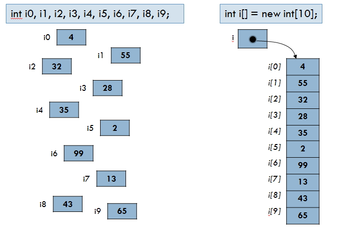
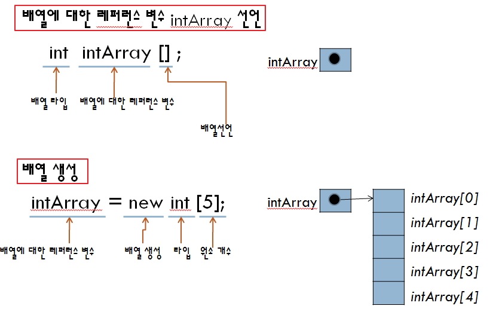
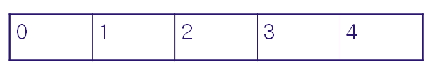
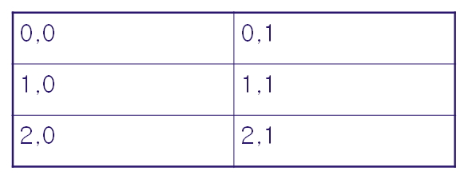
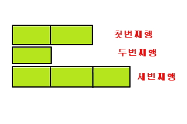
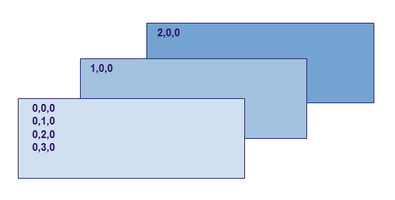
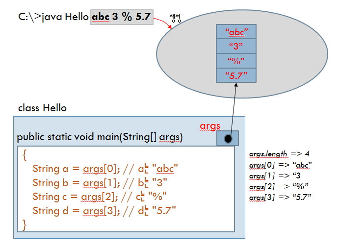

# 배열의 개념, 1차원 배열, 가변 배열, 다차원 배열, 콘솔 상에서의 입력

## 배열 사용하기



- 배열

  - 인덱스와 인덱스에 대응하는 데이터들로 이루어진 자료 구조
  - 배열에는 같은 종류의 데이터들이 순차적으로 저장하는 공간
  - 인덱스는 0부터 시작
  - 인덱스는 배열의 시작 위치에서부터 데이터가 저장되어 있는 상대주소
  - 배열을 이용하면 한 번에 많은 메모리 공간 선언 가능
  - 배열은 같은 데이터 타입들이 순차적으로 저장되어 있어 반복문을 이용하여 처리하기에 가장 적합한 자료 구조

- 배열의 장점:

  - 통일된 **하나의 변수명으로 다량의 데이터를 처리**할수 있습니다.
  - 각각의 데이터에 공통된 연산작업을 적용할 수 있습니다.
  - 변수 사용을 줄임으로 코드를 간결하게 할 수 있습니다.

- 배열의 단점:

  - 배열의 요소를 선언하고 전부 이용하지 않으면 심각한 메모리 낭비가 발생합니다.
  - 자바는 이 문제를 개선한 여러형태의 Collection Class들이 존재합니다.
  - 배열의 사이즈는 필요에 따라 증가시키거나 감소할수가 없습니다.

- 배열의 사용 예:

  - 사이즈가 변경되지 않는 데이터 배열인 경우
  - 1월 ~12월, 월요일~일요일, 각종 지정된 공휴일
  - 각 학교의 학년(1~6, 1~3, 1~4)

- index를 통한 배열 요소의 구분 <br />
  `배열명[인덱스] = 값`

- 배열의 요소가 일정한 경우만 사용하고 요소의 갯수를 알수 없는 경우는 Collection Class를 사용해야 합니다.



<br />

### 1. 배열의 선언

- int[] weight = new int[7]; (접근 범위: weight[0]~weight[6])
- int weight[] = new int[7]; 4 \* 7 = 28 바이트 할당
- int weight[]={100, 200}; 자동으로 배열 요소가 결정이 되고 값이 할당됩니다.

<br />

### 2. 배열요소에 값 저장

- weight[0] = 3
- weight[1] = 6

<br />

### 3. 1차원 배열 이용



> DevEnvironment.java

```java
public class DevEnvironment {
    public static void main(String[] args) {
        // 배열만 선언
        String[] lang = new String[4]; // 0 ~ 3

        // 값 할당
        lang[0] = "JAVA";
        lang[1] = "JSP";
        lang[2] = "Sping/MyBATIS";
        lang[3] = "Project";

        System.out.println(lang[0]);
        System.out.println(lang[1]);
        System.out.println(lang[2]);
        System.out.println(lang[3]);
    }
}
```

> DevEnvironment2.java

```java
public class DevEnvironment2 {
    public static void main(String[] args) {
        String[] lang = new String[3];
        String[] script = new String[3];
        String[] dbms = {"Oracle","ms-sql","my-sql"};

        lang[0] = "JAVA"; lang[1] = "C#"; lang[2] = "C";
        script[0]="JSP";script[1]="ASP.NET";script[2]="PHP";

        for(int i=0; i<=2; i++){
            System.out.println(lang[i] + "-"+script[i]+"-"+dbms[i]);
        }
   }
}
```

> ArrayAccess.java

```java
import java.util.Scanner;
public class ArrayAccess {
    public static void main (String[] args) {
        Scanner in = new Scanner(System.in);
        int intArray[] = new int[5];
        int max = 0;

        for (int i = 0; i < 5; i++) {
            intArray[i] = in.nextInt();
            if (intArray[i] > max)
                max = intArray[i];
        }
        System.out.print("입력된 수에서 가장 큰 수는 " +    max +  "입니다.");
    }
}
```

<br />

## 다차원 배열의 이해 및 활용

- 2차원 배열은 일반적으로 for문을 2개이상 동반합니다.

<br />

### 1. 2차원(행, 열)



> Two_Array.java

```java
class Two_Array {
    public static void main (String args[]) {
        int[][] m = {{10,20},  //1행
                     {30,40},  //2행
                     {50,60}}; //3행

        /*
            int[][] m2 = new int[3][2];

            0,0(10)   0,1(20)
            1,0(30)   1,1(40)
            2,0(50)   2,1(60)

            m2[0][0] = 10;
            m2[0][1] = 20;
            m2[1][0] = 30;
            m2[1][1] = 40;
            m2[2][0] = 50;
            m2[2][1] = 60;
         */

        for(int i=0; i<3; i++) {     //행
            for(int j=0; j<2;j++) {   //열
                System.out.println("m[" + i + "]n[" + j + "]="  + m[i][j]);
            }
        }
    }
}
```

- length 속성은 for문의 반복횟수를 결정하는데 사용됩니다.

> MultiArrayTest.java

```java
class MultiArrayTest{
    public static void main(String args[]){
        //1차원 배열
        int[ ] arr1 = new int[3];

        //2차원 배열
        int[ ][ ] arr2;
        arr2 = new int[2][3];

        //1차원 배열은 컬럼의수를 리턴합니다.
        System.out.println("arr1배열의 열의 수 : " + arr1.length + "\n");

        //2차원 배열은 행의수를 리턴합니다.
        System.out.println("arr2배열의 행의 수 : " + arr2.length + "\n");

        //각행의 열의수를 리턴합니다.
        System.out.println("arr2배열의 1행의 열의 수 : " + arr2[0].length + "\n");
        System.out.println("arr2배열의 2행의 열의 수 : " + arr2[1].length + "\n");
    }
}
```

> ArrayWhile.java

```java
public class ArrayWhile {

    public static void main(String[] args) {
        String[] movies = {"그래비티", "맘마 미아", "레미제라블",   "월터의 상상은 현실이 된다.", "노아", "엣지 오브  투모로우", "트랜센던스", "X-MAN"};

        int cnt = -1;

        System.out.println("배열의 값의 갯수: " + movies.length)    ; // 8
        while(true){
            cnt = cnt + 1;
            System.out.println(movies[cnt]); // 0 ~ 7

            if (cnt == movies.length - 1){ // 7
                break;
            }
        }
    }
}
```

> ArrayWhile2.java

```java
public class ArrayWhile2 {

    public static void main(String[] args) {
        String[] movies = {"그래비티", "맘마 미아", "레미제라블",   "월터의 상상은 현실이 된다.", "노아"};
        int[] years = {2014, 2008, 2012, 2013, 2014};

        int cnt = -1;

        System.out.println("배열의 값의 갯수: " + movies.length)    ; // 8
        while(cnt < movies.length - 1){
            cnt = cnt + 1;
            System.out.println(movies[cnt] + " - " + years[cnt]);     // 0 ~ 7
        }
    }
}
```

<br />

## 가변 배열

- `톱니바퀴 배열` 이라고도 함
- 여러 행들의 열의 갯수가 다르게 선언하는 배열
- 데이터타입[][] 배열명 = new 데이터타입[행][];
- `int[][] jarray = new int[3][];`
- jarray[0], jarray[1], jarray[2] : 배열의 이름은 있지만, 요소를 참조할 수 있는 배열은 아직 생성되지 않음

```java
jarray[0] = new int[2];
jarray[1] = new int[1];
jarray[2] = new int[3];
```



※ 3차원 배열은 [면][행][열]로 이루어져 있으며 프로그래밍분야에서 사용되지 않습니다.



<br />

## 명령 프롬프트(콘솔)상에서의 입력처리



> DosInput.java

```java
public class DosInput {

    public static void main(String[] args) {
        String s1 = args[0]; //1번째 문자열 입력
        String s2 = args[1]; //2번째 문자열 입력

        System.out.println("args.length:" + args.length);
        System.out.println("s1:" + s1);
        System.out.println("s2:" + s2);
    }
}
```

실행:
C:
CD\
CD C:\java_sunday\eclipse\workspace\february\classes
java DosInput 봄 여름

<br />

### 1. 숫자를 입력받는 경우

> DosInput2.java

```java
public class DosInput2 {

    public static void main(String[] args) {
        int i1 = Integer.parseInt(args[0]); //1번째 수
        int i2 = Integer.parseInt(args[1]); //2번째 수

        System.out.println("args.length:" + args.length);
        System.out.println("i1:" + i1);
        System.out.println("i2:" + i2);
        System.out.println("i1+i2:" + (i1+i2));
    }
}
```

> Calc.java

```java
public class Calc {
public static void main(String[] args) {
int sum = 0;
for(int i=0; i < args.length;i++){
    int n = Integer.parseInt(args[i]);
    sum += n; // 숫자를 합한다.
}
System.out.println("sum = " + sum);
}
}
```

> MainParameter.java

```java
public class MainParameter {
public static void main (String[] args) {
double sum = 0.0;

for (int i=0; i<args.length;i++)
     sum += Double.parseDouble(args[i]);
System.out.println("합계 :" + sum);
System.out.println("평균 :" + sum/args.length);
}
}
```

<br />

### 2. 문자와 숫자의 입력

> DosInput3.java

```java
import java.text.DecimalFormat;

public class DosInput3 {

    public static void main(String[] args) {
        DecimalFormat comma = new DecimalFormat("###,##0");
        String cs1;
        String cs2;

        String s1 = args[0];        //성명

        int i1 = Integer.parseInt(args[1]); //급여
        cs1 = comma.format(i1);

        int i2 = Integer.parseInt(args[2]); //세금
        cs2 = comma.format(i2);

        System.out.println("args.length:" + args.length);
        System.out.println("성명(name):" + s1);
        System.out.println("급여(pay):" + cs1);
        System.out.println("세금(tax):" + cs2);
        System.out.println("실수령액(income):" + comma.format(i1-i2));
    }
}
```
