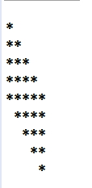

# 제어문, 배열 study예제 및 실습 문제

## 제어문 예제

> Test01.java

```java
public class Test01 {
    public static void main(String[] args) {
        for (int i = 1; i <= 5; i++) { /위에부분
            for (int j = 1; j <i; j++) {
                System.out.print("*");
            }
            System.out.print("\n");
        }
        for (int i = 1; i <= 6; i++) { // 아부분
            if(i>1){
                for (int j = 0; j < i-1; j++) {
                    System.out.print(");
                }
            }
            for (int j = 1; j <=(6-i); j++) {
                System.out.print("*");
            }
            System.out.print("\n");
        }
    }
}
```

- 결과 <br />
  

> Test02.java

```java
public class Test05 {
    public static void main(String[] args) {
        // 로또 만들기
        int a[] = new int[10];
        System.out.print("로또 번호 : ");
        for (int i = 1; i <= 6; i++) {
            a[i] = (int)(Math.random()*45+1); // 배열에 난수 저장
            System.out.print(a[i]+"  ");
        }
    }
}
```

- 결과 <br />
  로또 번호 : 16 28 14 38 2 42

<br />

## 자바 실습문제

1. 배열의 저장된 5개의 점수를 생성해서 반복문으로 배열 일관처리로 총점을 구한후 평균을 구해서 출력하세요.

<br />

2. 배열의 저장된 5개의 실수를 생성후 최대값과 최소값을 구한후 출력하세요.

<br />

3. 배열에 저장된 5개의 음수, 양수를 절대값을 구해서 출력하세요.

<br />

4. 프로그램 실행시 main 인자값으로 본인이 정보(이름, 전화번호, 주소,주민번호)를 입력받아 이름, 전화번호, 주소, 나이를 출력하세요.

```java
//주민번호에서 나의 태어난 연도 뽑기
String jumin= args[3]; //921008-2078815
int iage = Integer.parseInt(jumin.substring(0,2));
iage += 1900; //1992

//현재년도 알아내기
Calendar calendar = Calendar.getInstance();
int currYear= calendar.get(Calendar.YEAR);
```

<br />

5. 프로그램 실행시 main 인자값으로 숫자 2개를 입력받아서 최대값과 최소값을 구해서 출력하세요.

<br />

6. 프로그램 실행시 main 인자값으로 정수를 입력받아서 양수인지, 음수인지, 0인지를 판단후 출력하세요.

<br />

7. 다음의 코드조각들을 바르게 조합하여 아래 결과값이 출력되도록 만들어 보세요.

```java
c:>java Test

    0      4
    0      3
    1      4
    1      3
    3      4
    3      3
```

> 코드 조각들

```java
x++;
if(x==1){
System.out.println(x + "" + y);
class Test{
for(int y=4; y>2; y--){
for(int x=0; x<4; x++){
publc static void main(String[] agrs){
```

<br />

8. 자바의 기본형타입(8가지)과 크기를 byte단위로 명시하세요.

```java
예)정수
int(4byte)
```

<br />

9. 문장내에서 continue 문을 쓸수 없는 문장은?

1)  for 문 <br />
2)  2. while 문 <br />
3)  do while 문 <br />
4)  4. switch문 <br />

<br />

10. 실행되는 순서를 작성하세요.

```java
for(int i=0;i<100;i++){
[1] [2] [3]

        [4] -실행내용

}

예) [2] -> [3] -> [4] -> [1]-> [2] ->[3]
```

<br />

11. Scanner객체를 이용하여 나의정보(이름, 주소, 생일)를 입력받아서 정보(이름,주소,나이)를 출력하는 class를 작성하세요.

<br />

---

### EX01

```java
package day.test;
public class EX01 {
    public static void main(String[] args) {
        int sum = 0;
        int[] score = {100, 90, 80, 50, 85};
        for(int i=0; i<score.length; i++) {
            sum += score[i];
        }
        int average = sum / score.length;
        System.out.println("총점 :"+sum);
        System.out.println("평균 :"+average);
    }
}
```

<br />

### EX02

```java
package day.test;
public class EX02 {
    public static void main(String[] args) {
        double[] num = { 65, 88, 33, 100, 95 };
        double max = num[0];
        double min = num[0];

        for (int i = 1; i < num.length; i++) {
            if (num[i] > max) {
                max = num[i];
            }
            else if (num[i] < min) {
                min = num[i];
            }
        }
        System.out.println("최대값 :" + max);
        System.out.println("최소값 :" + min);
    }
  }
```

<br />

### EX03

```java
package day.test;
public class EX03 {
    public static void main(String[] args) {
        double[] arr = {-65.4, -12, 5.9, -37.2, 55.5, 0};

        for(int i = 0; i < arr.length; i++) {
            arr[i] = Math.abs(arr[i]);
            System.out.println(arr[i] + " ");
        }
    }
}
```

<br />

### EX04

```java
package day.test;
import java.util.Calendar;
public class EX04 {
    public static void main(String[] args) {
        String name = args[0];
        String phone = args[1];
        String addr = args[2];
        String idn = args[3];
        int age = Integer.parseInt(idn.substring(0, 2));

        Calendar calendar = Calendar.getInstance();
        int currYear= calendar.get(Calendar.YEAR);
        System.out.println(calendar);
        age = currYear-(age+1900);

        System.out.println("이름: " + name);
        System.out.println("전화번호: " + phone);
        System.out.println("주소: " + addr);
        System.out.println("나이: " + age);
    }
}
```

<br />

### EX05

```java
package day.test;
public class EX05 {
    public static void main(String[] args) {
        // TODO Auto-generated method stub
        String a = args[0];
        String b = args[1];
        int min = 0;
        int max = 0;

        if (Integer.parseInt(a) < Integer.parseInt(b)) {
            min = Integer.parseInt(a);
            max = Integer.parseInt(b);
            System.out.println("작은수 = " + min);
            System.out.println("큰 수 = " + max);
        }
        if (Integer.parseInt(a) < Integer.parseInt(b)) {
            min = Integer.parseInt(b);
            max = Integer.parseInt(a);
            System.out.println("작은수 = " + min);
            System.out.println("큰 수 = " + max);
        }
        if (Integer.parseInt(a) == Integer.parseInt(b)) {
            System.out.println("두수는 같습니다.");
        }
    }
}
```

<br />

### EX06

```java
package day.test;
public class EX06 {
    public static void main(String[] args) {
        int a = Integer.parseInt(args[0]);

        if (a > 0) {
            System.out.println("양수 입니다.");
        } else if (a < 0) {
            System.out.println("음수 입니다.");
        } else {
            System.out.println("0 입니다.");
        }
    }
}
```

<br />

### EX07

```java
package day.test;
public class EX07 {
    public static void main(String[] args) {
        for (int x = 0; x < 4; x++) {
            if (x == 2)
                x++;
            for (int y = 4; y > 2; y--) {
                System.out.println(x + " " + y);
          }
        }
    }
}
```

<br />

### EX08

```java
package day.test;
    public static void main(String[] args) {
//      boolean = 1바이트
//      byte = 1바이트
//      char = 2바이트
//      short = 2바이트
//      int = 4바이트
//      float = 4바이트
//      long = 8바이트
//      double = 8바이트
    }
}
```

<br />

### EX09

```java
package day.test;
public class EX09 {
    public static void main(String[] args) {
        // 4)switch문
    }
}
```

<br />

### EX10

```java
package day.test;
public class EX10 {
    public static void main(String[] args) {
        for(int i=0;i<100;i++){
        //[1]    [2]    [3]

        //[4] -실행내용
}

    // [1] -> [2] -> [4] -> [3]-> [2] ->[4]-> [3]
    }
}
```

<br />

### EX11

```java
package day.test;
import java.util.Calendar;
import java.util.Scanner;
public class EX11 {
    public static void main(String[] args) {
        Scanner scanner = new Scanner(System.in);

        Calendar calendar = Calendar.getInstance();
        int currYear = calendar.get(Calendar.YEAR);

        String name = scanner.next();
        String address = scanner.next();
        String age = scanner.next();
        int myAge = Integer.parseInt(age.substring(0, 2));
        myAge += 1900;
        int curAge = currYear - myAge;

        System.out.println("입력하시오");
        System.out.println("이름 :" + name);
        System.out.println("주소 : " + address);
        System.out.println("나이 : " + curAge);\
    }
}
```
