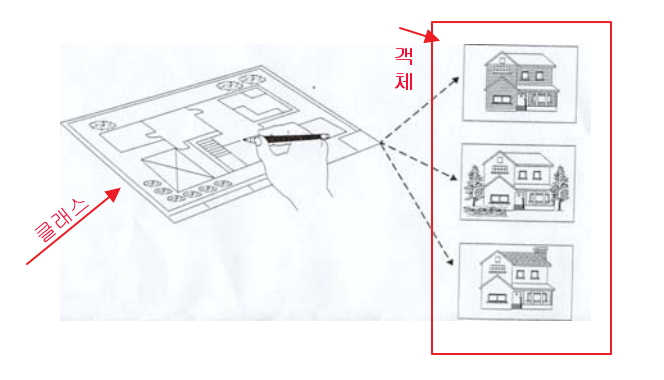
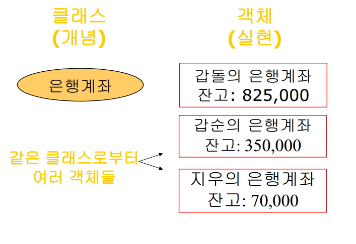
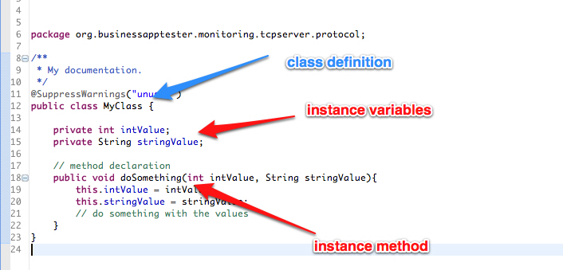
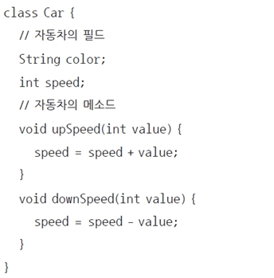
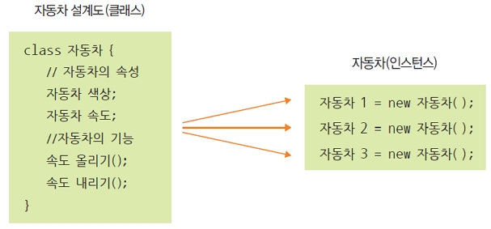
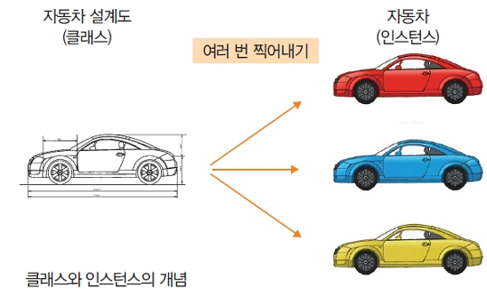

# 클래스와 객체 , 클래스 구조, 클래스 선언, 객체 생성, 멤버 변수

## 클래스(CLASS)와 객체

### 1.클래스와 객체 비교

- 클래스

  - 객체의 `공통된 특징을 기술`한 것
  - `객체의 특성과 행위를 정의`

- 객체
  - 물리적 공간을 갖는 구체적인 것, `실체`
  - 클래스의 인스턴스(실체)
  - `클래스를 구체화한 객체를 인스턴스(instance)라고 부름`
  - 객체와 인스턴스는 같은 뜻으로 사용






<br />

### 2. 클래스의 형태

- `필드`(변수, 인스턴스 변수, 멤버 변수) : **처리할 데이터**를 나타냄.
- `메소드`(`함수`, 인스턴스 메소드, 멤버 메소드) : **데이터(필드, 인스턴스 변수)를 처리하는 기능을 구현**.



<br />

### 3. 클래스의 메모리 할당(객체 생성, 인스턴스 생성)

- 하나의 클래스는 메모리 할당시 다양한 값을 가지게 되며 객체라고 부릅니다.
- `하나의 객체는 독립적으로 사용`됩니다.



- 사용, 객체의 생성(참조 변수)
- `new` : `메모리 할당`
- 객체명(자동차1,자동차2,자동차3)은 할당된 메모리를 접근하는 용도로 사용.
- 설계도 하나로 3개의 객체(인스턴스)생성





<br />

## 클래스 선언, 객체 생성, 멤버 변수

### 1. 클래스의 선언

- `클래스명`은 `첫자는 대문자`로 시작하고 `파일명`은 `클래스명과 대소문자도 일치` 해야 합니다.

  - public class `DosInput3` { ---> `DosInput3.java` 로 저장

- `하나의 클래스`는 `하나의 파일`로 생성됩니다.

  - Test.java --> Test.class

- java 파일 하나 안에는 여러개의 클래스를 넣어둘수 있는데, 이런경우 컴파일을 하면 자바 소스 파일은 하나이나 컴파일의 결과로 만들어지는 클래스는 2개 이상이 됩니다.

- 하나의 파일안에 클래스가 2개이상 있게되면 반드시 public 키워드로 진입(메인, 시작)클래스를 명시해야합니다. 이 클래스안에는 main()메소드가 있습니다.

- 클래스가 2개이상 있는 경우의 파일명은 public이 명시된 클래스명으로 저장합니다.

- 하나의 파일안에 public 클래스는 하나만 있을 수 있습니다.

<br />

> PayCalc.java, 유지보수가 어려운 경우의 예

```java
/**
* 데이터 클래스
*/
class Pay {
    //멤버 변수, 인스턴스 변수, 필드
    String name; //성명, 문자열 저장
    int bonbong; //본봉, 숫자
    int tax; //세금, 숫자
    int silsu; //실수령액 본봉 - 세금, 숫자
}
```

```java
/**
* 데이터 이용 클래스, 시작 클래스
*/
public class PayCalc {

    /**
     * 시작 메소드
     * @param args
     */
    public static void main(String[] args) {
        //┌ Class  ┌ 메모리 할당(heap memory)
        //│        │
        //│        │
        //↓        ↓
        Pay p1 = new Pay();
        Pay p2 = new Pay();
        Pay p3 = new Pay();
        //    ↑
        //    └ 객체, 객체 변수

        p1.bonbong = 2000000; //200만원
        p1.name = "왕눈이";
        p1.tax = (int)(p1.bonbong * 0.045 + 0.5);
        p1.silsu = p1.bonbong - p1.tax;

        p2.bonbong = 2500000; //250만원
        p2.name = "아로미";
        p2.tax = (int)(p2.bonbong * 0.045 + 0.5);
        p2.silsu = p2.bonbong - p2.tax;

        p3.bonbong = 1500000; //150만원
        p3.name = "투투";
        p3.tax = (int)(p3.bonbong * 0.005 + 0.5);
        p3.silsu = p3.bonbong - p3.tax;

        System.out.println("--------------------");
        System.out.println("---12월 급여 내역---");
        System.out.println("--------------------");
        System.out.println("성명: " + p1.name);
        System.out.println("본봉: " + p1.bonbong);
        System.out.println("세금: " + p1.tax);
        System.out.println("실수령액: " + p1.silsu);

        System.out.println("--------------------");
        System.out.println("---12월 급여 내역---");
        System.out.println("--------------------");
        System.out.println("성명: " + p2.name);
        System.out.println("본봉: " + p2.bonbong);
        System.out.println("세금: " + p2.tax);
        System.out.println("실수령액: " + p2.silsu);

        System.out.println("--------------------");
        System.out.println("---12월 급여 내역---");
        System.out.println("--------------------");
        System.out.println("성명: " + p3.name);
        System.out.println("본봉: " + p3.bonbong);
        System.out.println("세금: " + p3.tax);
        System.out.println("실수령액: " + p3.silsu);
    }
  }
```

<br />

### 2. 데이터 클래스의 분리

> Pay2.java

```java
//부속 클래스(콤포넌트 CLASS)는 main 메소드가 없습니다.
public class Pay2 {
    //멤버 변수, 인스턴스 변수, 필드
    String name;
    int bonbong;
    int tax;
    int silsu;
}
```

> PayCalc2.java

```java
public class PayCalc2 {
    public static void main(String[] args) {
      //┌ Class
      //↓
        Pay2 p1 = new Pay2();
        Pay2 p2 = new Pay2();
        //    ↑
        //    └ 객체, 객체 변수

        p1.bonbong = 2000000;
        p1.name = "왕눈이";
        p1.tax = (int)(p1.bonbong * 0.05 + 0.5);
        p1.silsu = p1.bonbong - p1.tax;

        p2.bonbong = 2500000;
        p2.name = "아로미";
        p2.tax = (int)(p2.bonbong * 0.05 + 0.5);
        p2.silsu = p2.bonbong - p2.tax;

        System.out.println("성명: " + p1.name);
        System.out.println("본봉: " + p1.bonbong);
        System.out.println("세금: " + p1.tax);
        System.out.println("실수령액: " + p1.silsu);

        System.out.println("성명: " + p2.name);
        System.out.println("본봉: " + p2.bonbong);
        System.out.println("세금: " + p2.tax);
        System.out.println("실수령액: " + p2.silsu);
    }
}
```

<br />

> ☞ 성적처리 클래스를 작성하세요.

```java
package day03;
class Score {
  String name;
  int kuk;
  int eng;
  int math;

  public int total() {
    return kuk + eng + math;
  }

  public double avg() {
    return total() / 3;
  }

  public void printScore() {
    System.out.println("------- 성 적 ------");
    System.out.println("-------------------");
    System.out.println("성명 : "+ name);
    System.out.println("국어점수: " + kuk);
    System.out.println("영어점수: " + eng);
    System.out.println("수학점수: " + math);
    System.out.println("총점 : "+total());
    System.out.println("평균 : "+avg());
    System.out.println();
  }
}

public class ScoreCalc {
  public static void main(String[] args) {
    Score s1 = new Score();
    Score s2 = new Score();
    Score s3 = new Score();

    s1.name = "왕눈이";
    s1.kuk= 90;
    s1.eng = 50;
    s1.math = 45;
    s1.printScore();

    s2.name = "아로미";
    s2.kuk= 63;
    s2.eng = 74;
    s2.math = 85;
    s2.printScore();

    s3.name = "투투";
    s3.kuk= 10;
    s3.eng = 98;
    s3.math = 55;
    s3.printScore();
  }
}
```
