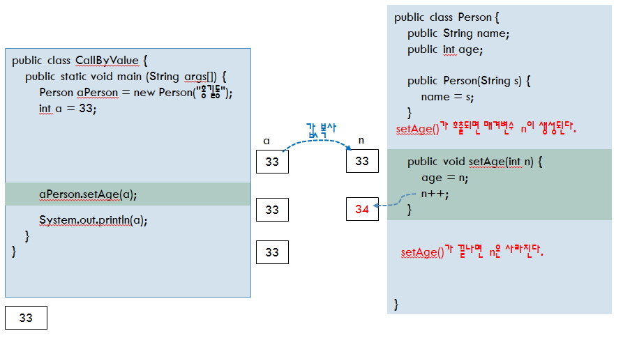

# 클래스: Call By Value/Reference, String 객체의 특징

## Call By Value/Reference

### 1. Call By Value: `값에 의한 호출`

- 보통 숫자 계열 값을 메소드 호출시 메소드로 전송하는 경우가 해당이 됩니다.

- **메소드로 한 문자, 상수 문자열, 숫자를 전달**하면 **전부 값에 의한 호출**이라고 하고 Call By Value 라고 합니다.



<br />

> CodeUse.java

```
class Code {
    public String getArea(int index) { // Call By Value

        // 1차원 배열
        String[] areas = {"서울", "천안", "대전", "대구", "광주", "강릉"};
        //                  0       1       2      3       4       5

        return areas[index-1]; // String return
    }
}

public class CodeUse {
    public static void main(String[] args) {
        Code co = new Code();
        String area = co.getArea(6);

        System.out.println(area);
    }
}
```

<br />

### 2. Call By Reference: 참조값에 의한 호출(Hash Code)

- 메소드로 참조type을 전송할 수 있습니다.
- 메소드로 클래스의 객체를 전달하면 메모리가 전달되는 것이 아니라 객체를 가르키고있는 Hash Code가 전달됨으로 Call By Reference 라고 합니다.
- Call By Reference의 경우 참조값(Hash Code)을 전달한 객체는 자신의 참조값이 전달됨으로 값의 변화가 발생할 수 있고 heap memory를 공유하게 됩니다.

<br />

> SchoolUse2.java

```
class SchoolVO {
    String name = "";
    int kuk = 0;
    int eng = 0;
    int tot = 0;
    int avg = 0;
}

class SchoolProc2 {
    public void print(SchoolVO vo){
        System.out.println("vo.name: " + vo.name);
        System.out.println("vo.kuk : " + vo.kuk);
        System.out.println("vo.eng : " + vo.eng);
        System.out.println("vo.tot : " + vo.tot);
        System.out.println("vo.avg : " + vo.avg);
    }
}

public class SchoolUse2 {
    public static void main(String[] args) {
        SchoolVO vo = new SchoolVO();
        vo.name = "가길동";
        vo.kuk = 85;
        vo.eng = 80;
        vo.tot = 165;
        vo.avg = 82;

        SchoolProc2 sp = new SchoolProc2();
        sp.print(vo); // Call By Reference
    }
}
```

<br />

### 3. Call By Value/Reference 예제

```
class Pay{
    int ppp;
    public void payRefer(Pay a){
        a.ppp = a.ppp + 2000;
    }
    public void payValue(int j){
        j = j + 2000;
    }
}

public class PayTest {
    public static void main(String[] args) {
        Pay p = new Pay();
        p.ppp = 10;

        int i = 10;

        p.payRefer(p); //call by reference로 전달
        p.payValue(i); //call by value로 전달

        System.out.println(p.ppp); //객체가 변경되서 2010
        System.out.println(i);//10
    }
}
```

<br />

## String객체의 특징

1.  한번생성된 객체는 불변이다.

```
"안녕" ->(X) "안녕하세요"
```

2.  클래스를 객체화할때 new를 사용하지만 String은 사용하지 않아도 된다. (

```
String name = "홍길동";
```

3.  메모리상에서 같은 문자열은 공유합니다.

```
String name = "홍길동";
String str = "홍길동";
name hashcode와 str hashcode는 같습니다.
```

4.  문자열을 변경할때 ("안녕" -> "안녕하세요") 메모리상에 "안녕"이라는 객체와 "안녕하세요"라는 객체가 둘다 존재합니다 변경되는 객체가 있을 때 마다 새로운 객체가 만들어집니다.

5.  String 객체의 데이터 전달 유형

<br />

> StringTest.java

```
public class StringTest {
    public void changeString(String src){
        src = "JSP";
    }

    public static void main(String[] args) {
        //System.out.println("ABCD".toLowerCase());
        //System.out.println("ABCD".hashCode());

        String step = "JAVA";
        StringTest st = new StringTest();
        System.out.println(step);
        st.changeString(step); //JSP로 변경하기 위해 할당
        System.out.println(step);
    }
}

public class Ex09_09 {
    public static void main(String[] args) {
    String str1 = "Java Programming";
    String str2 = "Java Programming";
    String str3 = new String("Java Programming");
    String str4 = new String("Java Programming");
    Object obj = new Object();
    Object obj2 = new Object();

    System.out.println("원 문자열1 ==> [" + str1.hashCode() + "]");
    System.out.println("원 문자열2 ==> [" + str2.hashCode() + "]");
    System.out.println("원 문자열3 ==> [" + str3.hashCode() + "]\n");
    System.out.println("원 문자열4 ==> [" + str4.hashCode() + "]\n");

    System.out.println("문자열1==문자열2 결과 :\t " + (str1 == str2));
    System.out.println("문자열1.equals(문자열2) 결과 : " + str1.equals(str2));
    System.out.println("문자열1==문자열3 결과 :\t " + (str1 == str3));
    System.out.println("문자열1.equals(문자열3) 결과 : " + str1.equals(str3));
    System.out.println("문자열4==문자열3 결과 :\t " + (str4 == str3));
    System.out.println("obj==obj2 결과 :\t " + (obj == obj2));
    }
}
```
