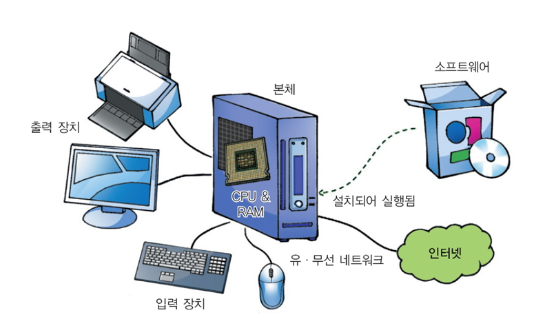
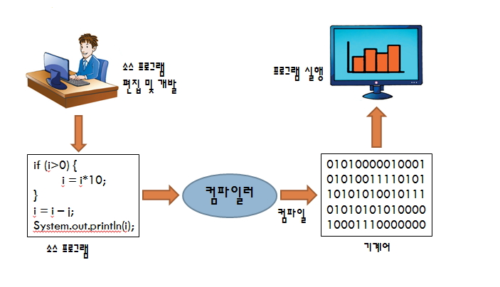
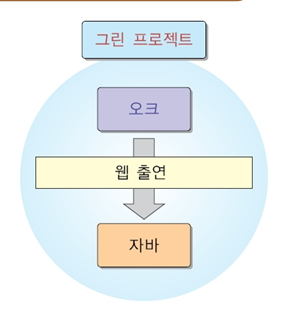
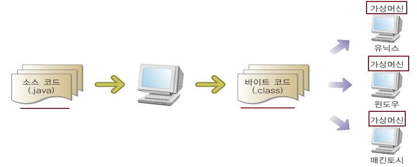
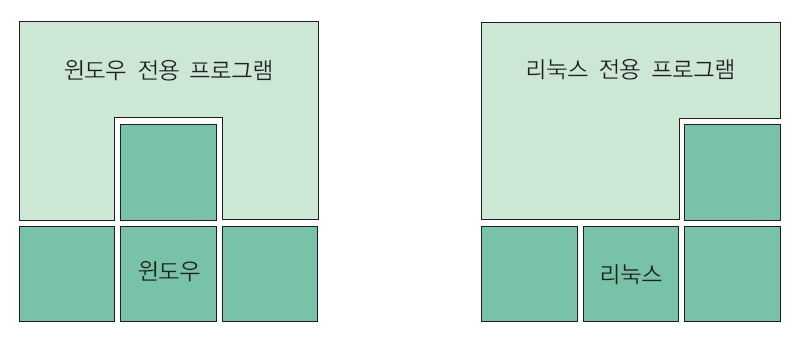
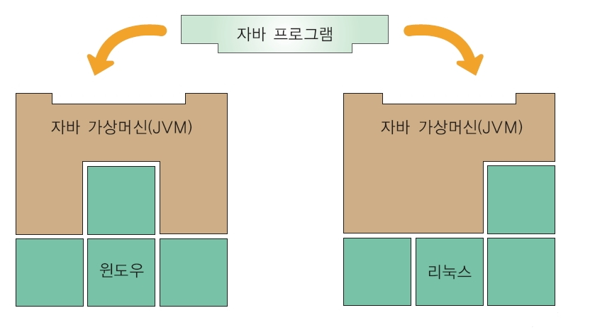

# 프로그래밍 시작, 자바의 이해

## 프로그래밍 시작

### 1. 컴퓨터의 H/W와 S/W

 

### 2. 프로그래밍 언어

#### 1. 기계어(machine language)

- 0, 1의 이진수로 구성된 언어
- 컴퓨터의 **CPU는 기계어만 이해 및 처리가능**

#### 2. 어셈블리어

- 기계어의 명령을 ADD, SUB, MOVE 등과 같은 표현하기 쉬운 상징적인 단어인 니모닉 기호(mnemonic symbol)로 일대일 대응시킨 언어

#### 3. 고급언어

- **사람이 이해하기 쉽고 복잡한 작업, 자료 구조,알고리즘을 표현하기 위해 고안된 언어**
- Pascal, Basic, C/C++, Java, C#
- 절차 지향 언어와 **객체 지향 언어**로 나눌 수 있음

### 3. 프로그램 편집, 컴파일 및 실행

- 소스 : 프로그래밍 언어로 작성된 텍스트 파일

- `컴파일` : **소스 파일을 컴퓨터가 이해할 수 있는 기계어로 만드는 과정**

- 소스 파일 확장자와 컴파일된 파일의 확장자
  - 자바 : .java -> .class
  - C : .c ->.obj->.exe
  - C++ : .cpp ->.obj -> .exe

 

## 자바의 이해

### 1. 자바의 역사

- C 언어가 그 기원인, C++로 부터 발전한 언어입니다. (C는 BCPL,B언어가 기원)

- 썬 마이크로 시스템즈는 개발자 `James Gosling` 1991년 **Green Project**를 시작으로 오크라는 이름에서 Java라는 이름으로 변경하면서 **자바언어를 만들고 1995년 5월 공식적으로 발표**했습니다.

- 2009년에 썬 마이크로시스템스를 오라클에서 인수했습니다.

 

### 2. 자바의 특징

- `Write Once Run Anywhere (이식성이 좋다)`

  - **한번만 작성하여 모든 플랫폼에 실행가능** 합니다. `(플랫폼-CPU + OS)`
  - OS, H/W에 상관없이 JVM이 있는 곳이면 어디서나 자바 프로그램에 동일한 실행환경을 제공하며 동일한 실행 결과 보여준다.
  - 작성할 JAVA `프로그램의 코드는 확장명을 *.JAVA로 저장`한다.
    작성 코드는 java.exe로 컴파일하면 바이트 코드가 생성된다.
  - 바이트 코드는 확장명이 \*.class 인데 사람은 이파일의 내용을 읽을 수 없다.

- `바이트 코드(byte code)`

  - 운영체제에 설치되어 있는` JVM(Java Virtual Machine)에 동작`한다.
  - `클래스 파일(.class)에 저장`된다.
  - 자바 가상 기계(JVM)가 인터프리터 방식으로 바이트 코드 해석하여 해당 플랫폼에서 실행시킵니다.

- `JVM(Java Virtual Machine)`

  - 각기 다른 플랫폼에서 동일한 자바 실행환경을 제공합니다.
  - OS별로 작동하는 자바 가상 머신 존재합니다.
  - 소프트웨어로 설치되고 작동된다.

- 자바의 실행

  - 자바 가상 기계(JVM)가 클래스 파일을 실행시킵니다.

- 자바의 컴파일 과정과 자바가상머신

 

### 3. 자바와 다른언어의 운영체제별 실행조건 비교

### (1) 특정 플랫폼에 종속된 `다른 언어의 운영체제별 실행조건(C/C++)`

### (2) `자바의 운영체제별 실행 조건`

 

### 4. 오라클은 개발 환경에 따라 3개의 배포판 제공

- Java SE

  - 자바 표준 배포판, 기본 자바 문법
  - 데스크탑과 서버 응용 개발 플랫폼
  - 임베디드 및 실시간 환경 지원

- Java ME

  - 자바 마이크로 배포판
  - 휴대 전화나 PDA, 셋톱박스 등 제한된 리소스를 갖는 하드웨어에서 응용 개발을 위한 플랫폼
  - 메모리제약이 있는 소형위한 플랫폼
  - Java SE의 서브셋 + 임베디드 및 가전 제품을 위한 API 정의

- Java EE
  - 자바 기업용 배포판
  - 자바를 이용한 다중 사용자, 기업용 응용 개발을 위한 플랫폼
  - 대기업 솔루션,큰 규모의 분산 네트워크 기반의 애플리케이션이나 웹 기반 애플리케이션 개발을 위한 플랫폼

 

### 5. JDK와 JRE

- JDK

  - `Java Development Kit`의 약자
  - **자바 응용 개발 환경으로, 개발에 필요한 도구 포함**
  - **컴파일러, JRE (Java Runtime Environment), 클래스 라이브러리(java API), 샘플 등**

- JRE

  - **자바 실행 환경으로 JVM역할을 하는 소프트웨어**
  - 자바 실행 환경만 필요한 경우 JRE만 따로 다운 가능

- JDK와 JRE의 개발 및 배포

  - 오라클의 Technology Network의 자바 사이트에서 다운로드

- JDK의 bin 디렉토터리에 포함된 주요 개발 도구
  - javac  
    자바 소스를 바이트 코드로 변환하는 컴파일러
  - java  
    jre의 bin 디렉토리에도 있는 자바 응용프로그램 실행기
  - jar  
    자바 아카이브 파일 (JAR)의 생성 및 관리하는 유틸리티
  - jdb  
    자바 디버거
  - appletviewer
    웹 브라우저 없이 애플릿을 실행 및 디버깅하는 유틸리티

 

### 6. 자바 클래스 라이브러리

- Java 프로그램은 클래스(class)라는 부분들로 구성됩니다. 클래스는 작업을 수행하고 결과값을 반환하는 메소드(method)를 포함하고 있습니다.
- 클래스와 매소드를 직접 만들기도 하지만 Java class library라는 다양한 기존의 클래스들의 모음을 활용합니다.
- Java class library는 Java API(Java Application Programming Interface)라고도 합니다.

 

### 7. 자바의 활용

#### (1) CS(Client/Server)

- Visual Basic, Power Builder, Delphi, JAVA
- 인터넷 브러우저를 통해 접근하는 것이 아닙니다.
- Client Program <-----> Database
- Client Program <-----> EJB, COM+(컴포넌트 기술) <-----> Database
- 특정 그룹을 위한 관리 프로그램이 대상이 됩니다.
  - 비디오/도서 대여점등 사용자수가 적고 한정되어 있는 경우
  - MS 메신저의 경우도 다운받아 설치해야 함으로 해당이 됩니다.
- 업그레이드, 유지보수가 매우 어려운 단점이 있습니다. 프로그램 수정시 각각의 컴퓨터에 모두 재설치가 되어야 합니다.

 

#### (2) WEB(JSP, PHP, ASP, HTML, JavaScript, CSS)

- 웹 브러우저를 통해서 접근합니다.
- 자바는 JSP 서버 스크립트의 기반 기술로 자바 문법이 그대로 JSP에 사용됩니다.

 

> [참고] C/C++와의 비교

- 변수선언, 제어문등 기본적인 구문이 C언어와 같습니다.
- 객체지향 개념은 C++과 매우 흡사하거나, C++의 기능중에서 일부 다중상속같은 개념은 제거되고 단일상속만 가능등으로 정리되었습니다.
- 메모리 할당후 메모리 해제 로직을 개발자가 구현해야하나 자바는 VM상에서 자동으로 지원됩니다.
  - stack은 자동으로 복구되나 heap는 메모리 회수를 해주어야 합니다.
- 자바는 구조체를 사용하지 않습니다.(C, C++, C#에 존재하며 자바 클래스의 어머니입니다.)
- 공용체 없습니다. (공용체는 C의 운영체제관련 프로그램에서 사용)
- 자바는 포인터가 없음으로 악의적인 메모리 접근으로 인한 해킹을 피할 수 있습니다.
  - 자바는 모든 기능을 클래스를 이용하며 이 클래스의 객체는 메모리 주소가 아닌 객체의 참조값을 가지고 있습니다.
- 자바는 자동으로 메모리 회수(Garbage Collection)기능이 있습니다.
- 기본적인 변수선언, 제어문은 C언어와 동일한 문법을 사용합니다.
