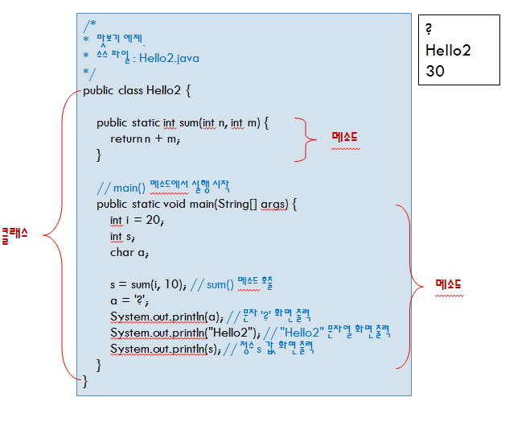
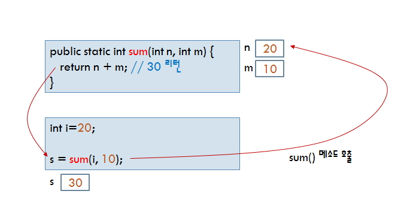

# 자바 프로그램의 구조(Structure of Java program)



- 한줄주석 : //
- 여러줄 주석 : / \* \*/
- 문서(API) 주석 : /\*\* \*/

<br />

- 문서 주석은 클래스, 메서드, 변수등 모든곳에 만들 수 있으며 문서 주석용 태그는 다음과 같습니다.

| 문서 태그(Tag) | 설명                     |
| -------------- | ------------------------ |
| @author        | 문서 작성자              |
| @version       | 문서의 버전              |
| @see           | 추가 또는 관련 내용 참고 |
| @since         | 언제 부터 사용하였는가   |
| @parm          | 아규먼트                 |
| @return        | 리턴내용                 |

<br />

- 클래스 만들기

  - Hello2 라는 이름의 클래스 선언
  - public으로 선언하면 다른 클래스에서도 접근 가능
  - 클래스 본문은 ‘{’으로 시작하여 ‘}’으로 끝남
  - `클래스명과 파일명이 같아야 함 (Hello2.java)`

- main() 메소드

  - `public static void으로 선언되어야 함`
  - 자바 프로그램은 main() 메소드부터 실행 시작
  - String[] args로 실행 인자를 전달 받음

- 멤버 메소드
  - 메소드 sum() 정의
  - `클래스에 속한 함수, 클래스 내에서만 선언`
  - 인자들의 타입과 변수 명을 ‘,’로 분리하여 나열
  - 메소드 코드는 ‘{’과 ‘}’ 사이에 작성

<br />

```
public static int sum(int n, int m) {
return n + m;
}
```

<br />

- 변수 선언
  - 개발자가 변수 이름을 붙이고 같이 선언
  - `메소드 내에서 선언된 변수는 지역 변수`
  - `지역 변수는 메소드 실행이 끝나면 저장 공간 반환`

```
int i = 20;
int s;
char a;
```

public static int sum`(int n, int m) { : 메소드내에서 선언된 지역변수`

<br />

- 메소드 호출



<br />

- 화면 출력

  - 표준 출력 스트림에 메시지 출력
  - 표준 출력 스트림 System.out의 println 메소드 호출
  - println은 주어진 인자를 출력 후 다음 행으로 커서 이동

- 문장

  - ; 로 한 문장의 끝을 인식
  - 한 문장을 여러 줄에 작성해도 무방
  - 주석문 끝에는 ‘;’를 붙이지 않음

- 블록
  - 블록은 {으로 시작하여 }으로 끝남
  - 클래스 선언과 메소드 선언 등은 블록으로 구성
