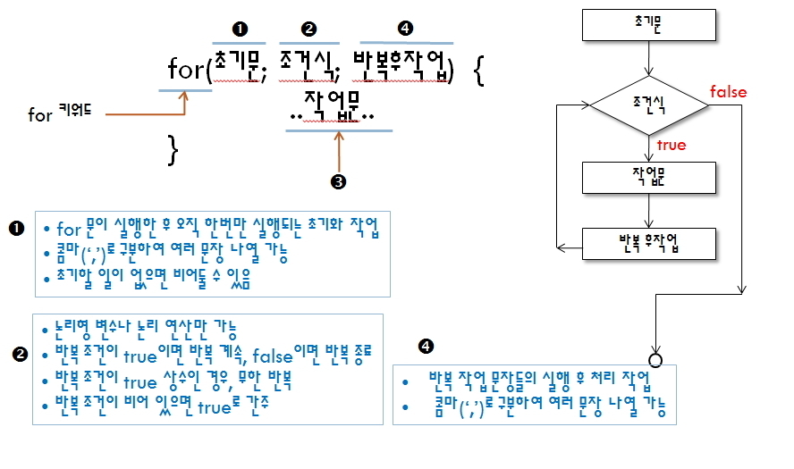

# 제어문 - 반복문(While, do-While, for 문), continue, break 문, 구구단

## 제어문 - 반복문 While, do-While, for 문

### 1. While 문

- `참일동안 실행`합니다.
- **조건을 만족하지 않으면 한번도 실행을 안 합니다**.
- 순환 횟수를 정확히 지정할 수 없을 경우 사용합니다.


- 반복 조건이 `true이면 반복`, `false이면 반복 종료`
- 반복 조건이 없으면 컴파일 오류
- 처음부터 반복 조건을 통과한 후 작업문 수행


<br />

> While.java

```
public class While{
    public static void main(String args[]){

        int j = -5;

        //j가 0보다 작을 동안 실행합니다.
        while(j <= 0){
            System.out.println("번호 : " + j);//-5, -4
            j++;
            if(j==-3) break;
        }

        System.out.println("--------- END ---------");
        System.out.println("While 종료후 j의 값:" + j);
    }
}
```

> Unlimit.java

```
public class Unlimit {

    public static void main(String[] args) {
        int i=0;

        while(true){
            i = i + 1;
            //2,3,4의 배수가 발견되면 while문을 벗어납니다.
            if((i % 2 == 0) && (i % 3 == 0) && ( i % 4 == 0)){
                break;
            }
        }
        System.out.println("2,3,4의 배수는 " + i + " 입니다.");
    }
}
```

<br />

### 2. do-While 문

- `조건에 관계 없이 무조건 1회는 실행`합니다.


<br />

> DoWhile.java

```
public class DoWhile{
    public static void main(String args[]){

        int j=1;

        do{
            System.out.println("번호 : " + j); //1
            j++;  //2
            if(j == 5) break;
        //j가 0보다 작을 동안 실행
        }while(j < 0);

        System.out.println("--------- END ---------");
        System.out.println("do-while문 종료후의 j의 값:" + j);
    }
}
```

> DoWileSample.java

```
public class DoWhileSample {
    public static void main (String[] args) {
        char a = 'a';

        do {
            System.out.print(a);
            a = (char) (a + 1);
        } while (a <= 'z');
    }
}
```

<br />

### 3. for 문

- `반복 횟수가 지정`되어 있는 경우
- for문은 `내부에 초기화 코드를 가지고` 있다.
- `조건식이 참이면 계속 실행`한다.



<br />

> ForSample.java

```
public class ForSample {
    public static void main (String[] args) {
        int i, j;
        for (j=0,i=1; i <= 10; i++) {
            j += i;
            System.out.print(i);
            if(i==10) {
                System.out.print("=");
                System.out.print(j);
            }
            else
                System.out.print("+");
        }
    }
}
```

> Array.java

```
public class Array {
    public static void main(String[] args){
        int[] pay = {1800, 2200, 2600, 3000, 3400, 3800};

        // System.out.println(pay[0]); //pay 배열 index 0의 값
        // System.out.println(pay[1]);
        // System.out.println(pay[2]);
        // System.out.println(pay[3]);
        // System.out.println(pay[4]);
        // System.out.println(pay[5]);

        int i=0;

        //i는 5보다 작거나 같을 경우 실행
        for (i=0; i<=5; ++i){ //0,1,2,3,4,5,6
            System.out.println(i + "년차 연봉: " + pay[i]);
        }
        System.out.println(i);
    }
}
```

> EvenSum.java(1부터 100까지 짝수의 합 구하기 (답 : 2550))

```
public class EvenSum {
    public static void main(String[] args) {
        int sum = 0;

        for(int i=1;i<=100;i++){
            if(i % 2 == 0){
                sum += i;
            }
        }
        System.out.println("1~100까지 짝수의 합:"+sum);
    }
}

▷ 홀수의 합을 구해 보세요. (2500 이 정답)
```

<br />

## break, continue

### 1. for문의 break

- `반복문을 완전히 빠져 나갈 때 사용`
- break문은 `하나의 반복문만 벗어남`
- 중첩 반복의 경우 안쪽 반복문이 break 문을 포함하고 있으면 안쪽 반복문만 벗어남

> Break.java

```
public class Break {
    public static void main(String[] args) {
        for (int i=0; i<=2; i++) { //3
            for (int j=2; j>=0; j--) { //3
                System.out.print("i=" + i + " j=" + j);
                System.out.print(" ");
                System.out.println("X-MAS");
                if (j == 1){
                    System.out.println("j==1 break");
                    break;
                }
            }// END 안쪽 for문

            if (i == 1) {
                System.out.println("i==1 break");
                break;
            }
        }// END 바깥쪽 for문
    }
}
```

### 2. for문의 Label있는 break (Label은 사용되기 전에 먼저 선언 되어야 함)

- 잘 사용되지 않음

> ForTest2.java

```
public class ForTest2 {
public static void main(String[] args) {

        outer: for (int i=0; i<=2; i++) {
             for (int j=2; j>=0; j--) {
                if (i==j) break outer;
                System.out.println("i==" + i + "j==" + j);
            }
        }
    }
}
```

<br />

### 3. continue

- **루틴을 벗어나지않고 `특정 조건에서만 로직을 수행`하지 않는 경우에 사용**합니다.
- 반복문을 빠져 나가지 않으면서 특정 값에 대해 `반복문 내의 실행문을 건너 뛸 때 사용`.

<br />

> Continue.java

```
public class Continue {
    public static void main(String[] args) {

        for (int i=0; i<=2; i++) {
                             //  ┌ continue시 이동되는 곳
                             //  ↓
            for (int j=0; j<=2; j++) {
                if (i==j){
                    continue;
                }
                System.out.println("i==" + i + " j==" + j);
            }
        }
    }
}
```

<br />

## 구구단 출력 (문자열 + 숫자 = 문자열, 연산의 우선순의 주의)

> GuguDan.java

```
public class GuguDan{
    public static void main(String args[]){
        //1, 4, 7
        for (int i = 1; i <= 9; i += 3) {
            System.out.println("   " + i + "단\t\t   " + (i+1) + "단\t\t   " + (i+2) + "단");

            System.out.println("------------------------------------------");
            //1,2,3,4,5,6,7,8,9
            for (int j = 1; j <= 9; j++) {
                System.out.print(i + " * " + j + " = " + i*j + "\t");

                System.out.print((i+1) + " * " + j + " = " + (i+1)*j + "\t");

                System.out.print((i+2) + " * " + j + " = " + (i+2)*j);

                //줄 바꾸기 목적으로 사용됩니다.
                System.out.println("");
            }
            System.out.println("");
        }
    }
}
```

<br />

| 1단        | 2단         | 3단         |
| ---------- | ----------- | ----------- |
| 1 \* 1 = 1 | 2 \* 1 = 2  | 3 \* 1 = 3  |
| 1 \* 2 = 2 | 2 \* 2 = 4  | 3 \* 2 = 6  |
| 1 \* 3 = 3 | 2 \* 3 = 6  | 3 \* 3 = 9  |
| 1 \* 4 = 4 | 2 \* 4 = 8  | 3 \* 4 = 12 |
| 1 \* 5 = 5 | 2 \* 5 = 10 | 3 \* 5 = 15 |
| 1 \* 6 = 6 | 2 \* 6 = 12 | 3 \* 6 = 18 |
| 1 \* 7 = 7 | 2 \* 7 = 14 | 3 \* 7 = 21 |
| 1 \* 8 = 8 | 2 \* 8 = 16 | 3 \* 8 = 24 |
| 1 \* 9 = 9 | 2 \* 9 = 18 | 3 \* 9 = 27 |

| 4단         | 5단         | 6단         |
| ----------- | ----------- | ----------- |
| 4 \* 1 = 4  | 5 \* 1 = 5  | 6 \* 1 = 6  |
| 4 \* 2 = 8  | 5 \* 2 = 10 | 6 \* 2 = 12 |
| 4 \* 3 = 12 | 5 \* 3 = 15 | 6 \* 3 = 18 |
| 4 \* 4 = 16 | 5 \* 4 = 20 | 6 \* 4 = 24 |
| 4 \* 5 = 20 | 5 \* 5 = 25 | 6 \* 5 = 30 |
| 4 \* 6 = 24 | 5 \* 6 = 30 | 6 \* 6 = 36 |
| 4 \* 7 = 28 | 5 \* 7 = 35 | 6 \* 7 = 42 |
| 4 \* 8 = 32 | 5 \* 8 = 40 | 6 \* 8 = 48 |
| 4 \* 9 = 36 | 5 \* 9 = 45 | 6 \* 9 = 54 |

| 7단         | 8단         | 9단         |
| ----------- | ----------- | ----------- |
| 7 \* 1 = 7  | 8 \* 1 = 8  | 9 \* 1 = 9  |
| 7 \* 2 = 14 | 8 \* 2 = 16 | 9 \* 2 = 18 |
| 7 \* 3 = 21 | 8 \* 3 = 24 | 9 \* 3 = 27 |
| 7 \* 4 = 28 | 8 \* 4 = 32 | 9 \* 4 = 36 |
| 7 \* 5 = 35 | 8 \* 5 = 40 | 9 \* 5 = 45 |
| 7 \* 6 = 42 | 8 \* 6 = 48 | 9 \* 6 = 54 |
| 7 \* 7 = 49 | 8 \* 7 = 56 | 9 \* 7 = 63 |
| 7 \* 8 = 56 | 8 \* 8 = 64 | 9 \* 8 = 72 |
| 7 \* 9 = 63 | 8 \* 9 = 72 | 9 \* 9 = 81 |

<br />

> 구구단을 역순으로 출력하세요.

```
package day02;

public class GuguDan {
    public static void main(String[] args) {
        for (int i = 9; i >= 1; i -= 3) {
            System.out.println("   " + i + "단\t\t   " +    (i-1) + "단\t\t   " + (i-2) + "단");

            System.out.println  ("------------------------------------------")    ;

            for (int j = 9; j >= 1; j--) {
                System.out.print(i + " * " + j + " = " +    i*j + "\t");

                System.out.print((i-1) + " * " + j + " =    " + (i-1)*j + "\t");

                System.out.print((i-2) + " * " + j + " =    " + (i-2)*j);

                System.out.println("");
            }
            System.out.println("");
        }
    }
}
```
