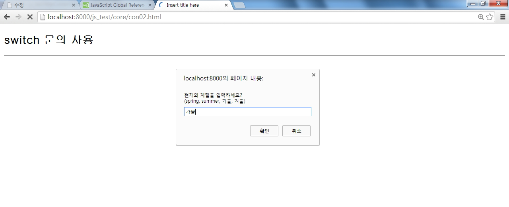
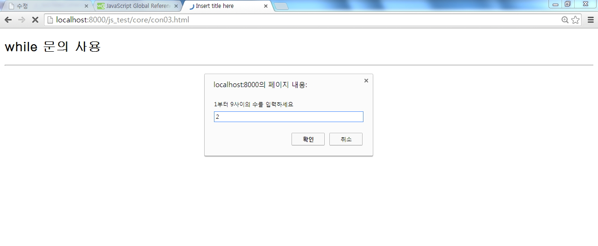
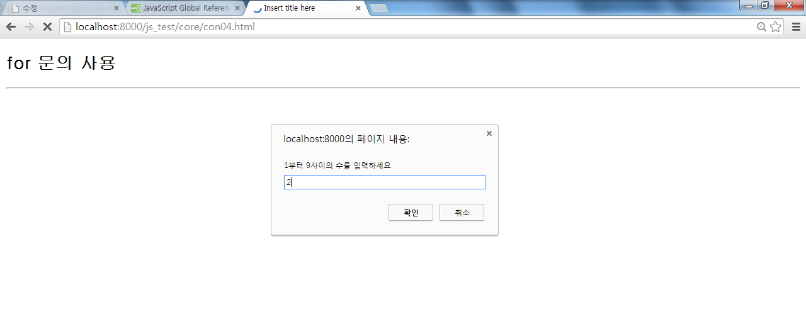
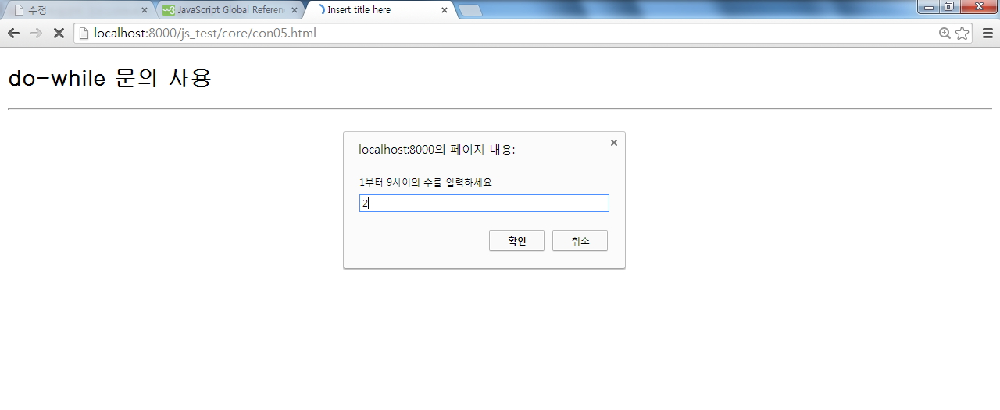
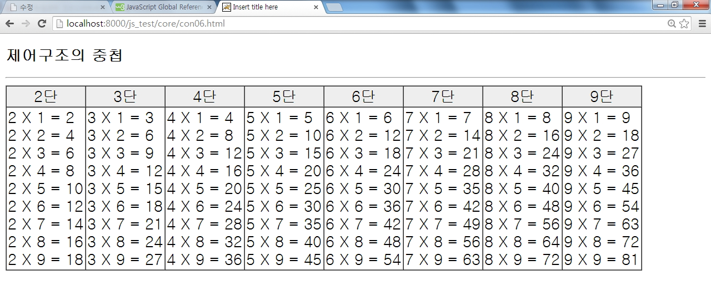
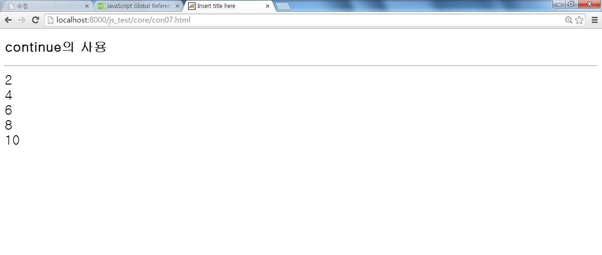
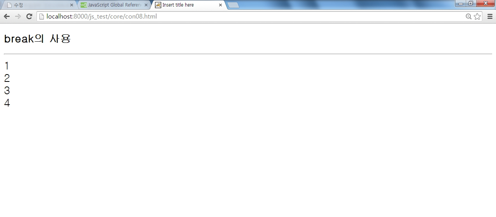
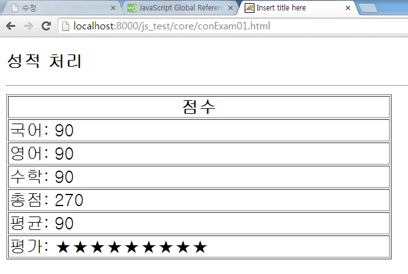

# JS- 제어문, break, javascript 파일의 include 사용

## 제어문

### 1. if, Ternary operator : ?, switch, loop, break, continue

#### (1) 제어문 확인

> operator_2.js

```javascript
//조건절  if, else if, else

const name = 'js';
if (name === 'js') {
  console.log('Welcome, js!');
} else if (name === 'coder') {
  console.log('coder~');
} else {
  console.log('unknown');
}

//Ternary operator:? 셋으로 이루어진 연산
//condition ? value1 : value2;
console.log(name === 'js' ? 'yes' : 'no');

//switch statement
//use for multiple if checks
//use for enum-like value check
//use for multiple type checks in TS

const browser = 'IE';
switch (browser) {
  case 'IE':
    console.log('이제 없어진다.');
    break;
  case 'Chrome':
  case 'Firefox':
    console.log('많이 사용');
    break;
  default:
    console.log('모두 브라우저');
    break;
}

//loops , while the condition is truthy,
//body code is executed
let i = 3;
while (i > 0) {
  console.log(`while:${i}`);
  i--;
}

//do while loop, body code is executed first,
//then check the condition.
do {
  console.log(`do while: ${i}`);
  i--;
} while (i > 0);

//for loop, for(begin; codition; step)
for (i = 3; i > 0; i--) {
  console.log(`for: ${i}`);
}

//nested loops
for (let i = 0; i < 10; i++) {
  for (let j = 0; j < 10; j++) {
    console.log(`i: ${i}, j: ${j}`);
  }
}

//break, continue
for (let i = 0; i < 11; i++) {
  if (i % 2 !== 0) {
    continue; //continue 대신  i값 출력해도 된다.
  }
  console.log(`i: ${i} `);
}

for (let i = 0; i < 11; i++) {
  if (i > 8) {
    break;
  }
  console.log(`i: ${i}`);
}

//false : 0, -0, ' ', null, undefined
//true : -1, 'hello', 'false'

let obj = {
  name: 'hong',
};

if (obj) {
  console.log(obj.name);
}

obj && console.log(obj.name);
```

<br />

#### (2) if 분기문

> js2.html

```javascript
<!DOCTYPE html>
<html lang="en">
<head>
    <meta charset="UTF-8">
    <meta http-equiv="X-UA-Compatible" content="IE=edge">
    <meta name="viewport" content="width=device-width, initial-scale=1.0">
    <title>Document</title>
    <style>
        *{
            font-family: gulim;
            font-size: 22px;
        }
        span {
            color : #ff0000;
            font-size :28px;
        }
    </style>
</head>
<body>
    <h2>if-else 제어구조</h2>
    <hr>
    <script>
        let temp1 = 5, temp2 =2;
        let max, min;

        if(temp1 >= temp2){
            max = temp1;
            min = temp2
        }else{
            max = temp2;
            min = temp1;
        }

        pl("");
        pl(`큰값: ${max}`);
        pl(`작은값: ${min}`);

        function pl(str){
            document.write("<span>");
            document.write(str);
            document.write("</span><br>");
        }
    </script>
</body>
</html>
```

<br />

#### (3) switch 분기문



> js3.html

```javascript
<!DOCTYPE html>
<html>
<head>
<meta charset="UTF-8">
<title>Insert title here</title>
<style type="text/css">
*{
  font-family: gulim;
  font-size: 22px;
}
</style>
</head>
<body>

<H2>switch 문의 사용</H2>
<HR>

<script type="text/javascript">

// 사용자로 부터 값을 입력 받는데 사용
temp=prompt("현재의 계절을 입력하세요?\n(spring, summer, 가을, 겨울)", "가을");

switch(temp){
  case "spring" :
    document.write("봄이군요. 날씨가 따뜻하네요");
    break;
  case "summer" :
    document.write("여름이군요. 날씨가 무척 덥네요");
    break;
  case "가을" :
    document.write("가을이군요. 날씨가 시원하네요");
    break;
  case "겨울" :
    document.write("겨울이군요. 날씨가 매우 춥네요");
    break;
  default :
    document.write("알수없는 단어입니다.");
}
</script>

</body>
</html>
```

<br />

#### (4) while 반복문



> js4.html

```javascript
<!DOCTYPE html>
<html lang="en">
<head>
    <meta charset="UTF-8">
    <meta http-equiv="X-UA-Compatible" content="IE=edge">
    <meta name="viewport" content="width=device-width, initial-scale=1.0">
    <title>Document</title>
    <style>
        * {
            font-family: 'Franklin Gothic Medium', 'Arial Narrow', Arial, sans-serif;
            font-size: 22px;
        }
    </style>
</head>
<body>
    <h2>while 문의 사용</h2>
    <hr>
    <script>
        let innum, i;

        innum = prompt('1부터 9사이의 수를 입력하세요',2);
        pl(`입력한 숫자 ${innum} 에 대한 구구단 <br>`);
        i = 1;
        while(i <= 9){
            pl(`${innum} X ${i} = ${innum *i}`);
            i++;
        }

        function pl(str){
            document.write(`${str} <br>`);
        }
    </script>
</body>
</html>
```

<br />

#### (5) for 반복문



> js5.html

```javascript
<!DOCTYPE html>
<html lang="en">
<head>
    <meta charset="UTF-8">
    <meta http-equiv="X-UA-Compatible" content="IE=edge">
    <meta name="viewport" content="width=device-width, initial-scale=1.0">
    <title>Document</title>
    <style>
        *{
            font-family: 'Lucida Sans', 'Lucida Sans Regular', 'Lucida Grande', 'Lucida Sans Unicode', Geneva, Verdana, sans-serif;
            font-size: 22px;
        }
    </style>
</head>
<body>
    <h2>for 문의 사용</h2>
    <hr>
    <script>
        let innum, i;
        innum = prompt('1부터 9사이의 수를 입력하세요',2);
        pl(`입력된 숫자 ${innum} 에 대한 구구단<br> <br>`);

        for(let i=1; i <= 9; i++){
            pl(`${innum} X ${i} = ${innum * i}`);
        }

        function pl(str){
            document.write(`${str} <br>`);
        }
    </script>
</body>
</html>
```

<br />

#### (6) do-while 반복문



> js6.html

```javascript
<!DOCTYPE html>
<html lang="en">
<head>
    <meta charset="UTF-8">
    <meta http-equiv="X-UA-Compatible" content="IE=edge">
    <meta name="viewport" content="width=device-width, initial-scale=1.0">
    <title>Document</title>
    <style>
        *{
            font-family: 'Courier New', Courier, monospace;
            font-size: 22px;
        }
    </style>
</head>
<body>
    <h2>do-while 문의 사용</h2>
    <hr>
    <script>
        let innum, i = 1;
        innum = prompt('1부터 9사이의 수를 입력하세요',2);
        pl(`입력한 숫자 ${innum}에 대한 구구단 <br><br>`);
        do{
            pl(`${innum} X ${i} = ${innum * i}`);
            i++;
        }while(i<=9);

        function pl(str){
            document.write(`${str} <br>`);
        }
    </script>
</body>
</html>
```

<br />

#### (7) 제어문의 중첩



> js7html

```javascript
<!DOCTYPE html>
<html lang="en">
<head>
    <meta charset="UTF-8">
    <meta http-equiv="X-UA-Compatible" content="IE=edge">
    <meta name="viewport" content="width=device-width, initial-scale=1.0">
    <title>Document</title>
    <style>
        * {
            font-family: 'Courier New', Courier, monospace;
            font-size: 22px;
        }

        table, th, td {
            border: 1px solid black;
            border-collapse: collapse;
        }
        th {
            background-color: #989595;
        }
    </style>
</head>
<body>
    <h2>제어 구조의 중첩</h2>
    <hr>
     <script>
         let i, j, result;
        p('<table>');
        p('<tr>');
         for(i=2 ; i <= 9 ; i++){
             p(`<th> ${i}단 </th>`);
         }
        p("</tr>"); //<th>가지는 행 닫기
        p("<tr>"); //새로운 행 시작

        for(i=2; i<=9; i++){
            p('<td>');
            for(j=1; j<=9; j++){
                result = i * j;
                pl(`${i} X ${j} = ${result}`);
            }
            p('</td>')
        }
        p('</tr>');
        p('</table>');


        function p(str){
            document.write(str);
        }
        function pl(str){
            document.write(`${str} <br>`);
        }
     </script>
</body>
</html>
```

<br />

#### (8) continue



> js8.html

```javascript
<!DOCTYPE html>
<html lang="en">
<head>
    <meta charset="UTF-8">
    <meta http-equiv="X-UA-Compatible" content="IE=edge">
    <meta name="viewport" content="width=device-width, initial-scale=1.0">
    <title>Document</title>
    <style>
        * {
            font-family: 'Courier New', Courier, monospace;
            font-size: 22px;
        }

    </style>
</head>
<body>
    <h2>continue 사용</h2>
    <hr>
    <script>
        let i = 0;
        while(i < 10){
            i++;
            if(i % 2 == 1) continue;
            pl(i)
        }

        function pl(str){
            document.write(`${str} <br>`);
        }
    </script>
</body>
</html>
```

<br />

#### (9). break, javascript 파일의 include 사용



> utility.js

```javascript
function p(str) {
  document.write(str);
}

function pl(str) {
  document.write(str + '<br>');
}
```

> style.css

```javascript
* {
    font-family: 'Courier New', Courier, monospace;
    font-size: 22px;
}
```

> > > js9.html

```javascript
<!DOCTYPE html>
<html lang="en">
<head>
    <meta charset="UTF-8">
    <meta http-equiv="X-UA-Compatible" content="IE=edge">
    <meta name="viewport" content="width=device-width, initial-scale=1.0">
    <title>Document</title>
    <link rel="stylesheet" href="style.css">
    <script src="utility.js"></script>
</head>
<body>
    <h2>break의 사용</h2>
    <hr>
    <script>
    let i = 0;

    while(i<10){
        i++;
        if(i==5)break;
        pl(i);
    }
    </script>
</body>
</html>
```

<br />

> [과제 1]
> 국어, 영어, 수학 점수를 입력받아 점수, 총점과 평균을 출력하는 예제를 작성하세요. '★'표는 10점당 1개로 지정, 점수 입력은 prompt()함수 이용 결과는 테이블의 행으로 출력되도록 하세요.



<br />

> style.css

```javascript
*{
    font-family: 'Courier New', Courier, monospace;
    font-size: 22px;
}
table {
    width: 50%;
}
table, th, td {
    border : 1px solid black;
    border-collapse: collapse;
}
th {
    background-color: gray;
}
```

> exam01.html

```javascript
<!DOCTYPE html>
<html lang="en">
<head>
    <meta charset="UTF-8">
    <meta http-equiv="X-UA-Compatible" content="IE=edge">
    <meta name="viewport" content="width=device-width, initial-scale=1.0">
    <title>Document</title>
    <link rel="stylesheet" href="style.css">
    <script src="utility.js"></script>
</head>
<body>
    <h2>성적 처리</h2>
    <hr>
    <script>
        let kuk = prompt('국어점수를 입력하세요',0);
        let eng = prompt('영어점수를 입력하세요',0);
        let mat = prompt('수학점수를 입력하세요',0);

        let tot = parseInt(kuk) + parseInt(eng) + parseInt(mat);
        let avg = tot / 3 ;

        let star = '';
        for(let i=0; i < avg/10; i++){
            star = star + '★';
        }

        p("<table>");
        p("<tr><th> 점수 </th></tr>");
        p(`<tr><td> 국어: ${kuk} </td></tr>`);
        p(`<tr><td> 영어: ${eng} </td></tr>`);
        p(`<tr><td> 수학: ${mat} </td></tr>`);
        p(`<tr><td> 총점: ${tot} </td></tr>`);
        p(`<tr><td> 평균: ${avg} </td></tr>`);
        p(`<tr><td> 평가: ${star} </td></tr>`);
        p("</table>");

    </script>
</body>
</html>
```
